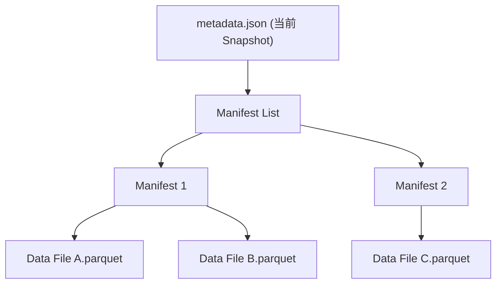

# 湖表 (Lake Table)

!!! tip "一句话理解"
    建在对象存储上、由"元数据文件 + 数据文件"构成的表；读写方通过**协议**协作而不是通过**共享进程**协作。

## 它是什么

一张湖表通常由三类文件构成：

1. **数据文件** —— Parquet / ORC 等列式格式，存放行数据本身
2. **清单文件（manifest）** —— 每个数据文件的元信息（路径、行数、字段统计、分区值、删除向量）
3. **快照（snapshot / metadata）** —— 表在某一时刻的完整元数据视图，引用若干 manifest

读写方（计算引擎）**直接访问对象存储**，通过这些元数据文件理解表，不需要一个中心进程。

## 为什么和传统 DB 存储引擎不是一回事

| 维度 | 数据库存储引擎（InnoDB、dstore 等） | 湖表（Iceberg、Paimon 等） |
| --- | --- | --- |
| 物理单位 | Page（KB 级） | File（百 MB 级 Parquet/ORC） |
| 并发控制 | 进程内锁 + MVCC | 对象存储的原子 rename / CAS + 快照切换 |
| 修改粒度 | 原地更新行、页 | 写新文件 + Manifest 差量引用 |
| 服务进程 | 必须有一个 "DB 进程" 居中 | 无状态，读写方各自直连对象存储 |
| 读写耦合 | 通过共享内存 / WAL / 锁 | 通过元数据协议 |
| 典型单表规模 | GB – TB | TB – PB |

核心差异不是快慢——是**"一张表"的所有权模型**：DB 把表藏在进程之后，湖仓把表摊在对象存储里，让任何理解协议的引擎都能读写。

详见对比页 [DB 存储引擎 vs 湖表](../compare/db-engine-vs-lake-table.md)。

## ACID 怎么做到的

没有共享进程、没有跨对象事务，湖表靠两件事凑出 ACID：

1. **Snapshot 隔离** —— 每次写入生成新快照，读者读一个固定快照
2. **原子指针切换** —— 提交 = 让"当前快照指针"原子切到新值
   - HDFS 年代：原子 `rename`
   - S3 今天：Conditional PUT (`If-None-Match`) 或外部 Catalog 做 CAS
   - 再保守的做法：把"当前指针"放在一个有 CAS 语义的外部 Catalog（Hive Metastore、Nessie、REST Catalog）

## 在典型 OSS 里的形态

- **Apache Iceberg** —— `metadata.json` → manifest-list → manifest → data files 四层；支持 copy-on-write 与 merge-on-read
- **Apache Paimon** —— 以 LSM 为骨架，支持流式 upsert 与 changelog 生成；天然适合 CDC 入湖
- **Apache Hudi** —— CoW（写时合并）与 MoR（读时合并）两种表类型
- **Delta Lake** —— 事务日志（`_delta_log/`）驱动的版本化

## 相关概念

- [Snapshot](snapshot.md) —— 快照是表的时间切片
- [对象存储](../foundations/object-storage.md) —— 湖表的物理载体
- [Parquet](../foundations/parquet.md) —— 数据文件的主流格式

## 延伸阅读

- Iceberg spec v2: <https://iceberg.apache.org/spec/>
- *Lakehouse: A New Generation of Open Platforms That Unify Data Warehousing and Advanced Analytics* (CIDR 2021)
- *Building the Data Lakehouse* —— Bill Inmon (O'Reilly, 2023)
