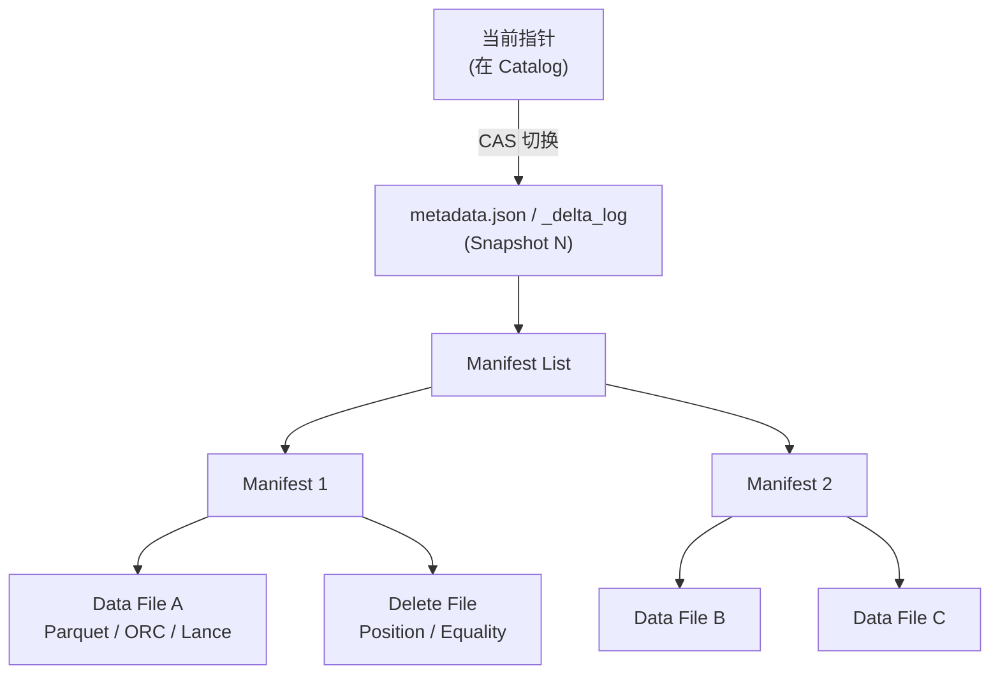

# 湖表 (Lake Table)

!!! tip "一句话理解"
    建在**对象存储**上、由"**元数据文件 + 数据文件**"构成、**读写方通过协议而不是进程协作**的表。它不是一种数据库——它是一种**分布式多作者可共享的"表格式规范"**。

!!! abstract "TL;DR"
    - 湖表 = **元数据 + 数据** 两层文件 + 一个**原子指针切换** + 一本**协议 spec**
    - 它让 Spark / Flink / Trino / DuckDB / StarRocks / 商业引擎**共读共写一份数据**而不踩踏
    - 没有"服务进程"——所有引擎直连对象存储，协议是**唯一的仲裁者**
    - 提交原子性靠 **CAS**（Catalog 的 Compare-And-Swap）或**对象存储 Conditional PUT**
    - Schema / Partition 演化**不改历史数据**（列用 ID 不用名字）
    - 写 MB/s 级别常见，读 GB/s 级别常见；**不是 OLTP**

## 1. 业务痛点 · 没有湖表的世界

**Hive 时代（2010-2020）—— "目录即表"**

```
s3://bucket/sales/
  dt=2024-01-01/
    part-00001.parquet
    part-00002.parquet
  dt=2024-01-02/
    ...
```

这种设计一开始够用，规模上去就崩：

| 问题 | 后果 | 量化代价 |
|---|---|---|
| **LIST 扫分区** | 查 1 张表先 `LIST` 所有分区 | 10 万分区 = 30s 甚至分钟级 |
| **Schema 演化破数据** | 改列名 = 所有历史文件不兼容 | 几 TB 历史要重写 |
| **并发写冲突** | 两个 Spark 作业同时写同分区 | 数据覆盖、丢失 |
| **原子性靠 rename** | S3 rename 不是原子，HDFS 勉强 | 读到半提交 = 脏读 |
| **无 Snapshot** | 回滚 = 靠备份 / 没办法 | 故障恢复小时级 |
| **统计信息在哪儿** | 存在 Hive Metastore 一张表 | 百万分区让 HMS 崩 |

**典型事故**：
- Netflix 2015 前：一张 10 万分区的事实表，`SELECT COUNT(*)` 的 LIST 阶段就 90s
- LinkedIn 2018：并发 ETL 同时 overwrite 同分区，数据损坏两小时才发现
- 某云厂商客户 2021：HMS schema evolution 乌龙 → 下游 Spark 读表全部失败

**湖表出现前的替代品**：
1. **关系型数据库**：数据进 OLTP 不现实（PB 级存不下、列存才是分析引擎）
2. **专有数仓**（Snowflake / Redshift）：强但**锁定**、数据出来要 COPY
3. **Hive**：上述一堆坑

湖表的价值命题：**把"表是什么"协议化**，让任何理解 spec 的引擎都能**安全并发**读写同一份对象存储上的数据。

## 2. 原理深度 · 三层抽象

一张湖表 = **三类文件 + 一个指针**：



### 层 1 · 数据文件（Data File）

- **物理粒度是文件**（100MB – 1GB），不是 page
- 列式格式（Parquet / ORC / Lance），**不可原地修改**
- 写 = 追加新文件；删 = 写 Delete File 标记

### 层 2 · 清单（Manifest）

- 一个 Manifest 记录**多个数据文件**的位置 + 统计（min/max/null_count/...）
- **Manifest List** 是 Manifest 的二级目录
- 查询优化靠 Manifest 的**列统计做 file pruning**

### 层 3 · Snapshot / Metadata

- 描述"这一刻表是什么": schema / partition spec / sort order / 所有 manifest 引用
- 每次写都产生新 Snapshot（**不可变**）
- **Time Travel** 就是读旧 Snapshot 指针

### 提交语义 · 如何原子

"提交" = 让**当前指针**从 Snapshot N 原子切到 Snapshot N+1。

三种实现：

| 方式 | 典型系统 | 语义强度 |
|---|---|---|
| **HDFS rename** | 早期 Hive / Iceberg | 原子但依赖 HDFS |
| **S3 Conditional PUT**（`If-None-Match`）| 部分 Iceberg catalog 实现（Hadoop / S3 filesystem catalog） | S3 原子；**注意：Iceberg spec 不标准化提交协议**，Conditional PUT 是 catalog 实现选择而不是 spec 定义 |
| **外部 Catalog CAS** | Iceberg REST / HMS / Glue / Nessie（主流生产路径） | Catalog 保证 CAS；推荐 |

**关键：**没有任何"湖仓进程"在中间。**原子性全压在指针切换的那一瞬间**。写入方准备好新 Snapshot 所有文件后，尝试 CAS 指针——成功则提交，失败则重试（或放弃）。

### Schema Evolution · 列用 ID 不用名字

```
schema_v1: id(1)  name(2)  amount(3)
schema_v2: id(1)  name(2)  amount_cents(3)    -- 重命名
schema_v3: id(1)  name(2)  amount_cents(3)  tax(4)  -- 加列
```

列的身份由 **column_id** 标识，文件里只存 id → data 的映射。重命名列 = 只改 metadata 里的名字，**不动任何数据文件**。

这让"10 年前的 Parquet 文件 + 今天的 schema"能无缝一起查。

## 3. 工程细节

### 文件大小策略

| 规模 | 推荐 data file size | 理由 |
|---|---|---|
| 小表（< 100GB） | 128 MB | 并发扫够用 |
| 中表（100GB – 10TB） | 256 – 512 MB | 平衡 manifest 数量 |
| 大表（> 10TB） | 512 MB – 1 GB | Manifest 不至于爆炸 |
| 实时表（CDC / upsert） | 64 – 128 MB | 小文件是代价、需高频 compaction |

**小文件灾难**：每个分区每小时写入几百个 5MB 的文件，查询时光**打开文件句柄**就几秒。→ 配定时 `rewrite_data_files` / `compact`。

### Manifest 管理

- 每个 Snapshot 引用几十到几千个 Manifest 合适
- Manifest 过多（>10k）→ 读 metadata 就慢 → `rewrite_manifests`
- Iceberg 有 `merge-snapshot-producer` / `target-file-size-bytes`

### 分区策略

- **Iceberg Hidden Partitioning**：表不暴露分区列，SQL 直接写 `WHERE ts > '...'` 自动走分区
- **Paimon / Delta**：传统显式分区
- **反模式**：按高基数列分区（user_id）→ 百万分区 → 灾难

### Delete 文件（MoR）

**Copy-on-Write (CoW)**：改一行 = 重写整个文件。更新少时友好，更新频繁时灾难。

**Merge-on-Read (MoR)**：改一行 = 写 Delete File（标记 "文件 X 的第 Y 行删了"）。写快，读时合并。

| 类型 | Delete file 内容 |
|---|---|
| **Position Delete** | `(file_path, row_position)` 精确删除 |
| **Equality Delete** | `where key = V` 按条件删除 |

选择：批场景 CoW / 流场景 MoR。

## 4. 性能数字 · 量级基线

| 指标 | 规模 | 典型值 |
|---|---|---|
| 单表规模 | TB – PB | 常见几百 TB |
| 单分区规模 | 1 – 100 GB | 百 MB 起步 |
| 提交延迟 | 单次 CAS | 50 – 500ms |
| 查询 planning（Iceberg） | 百万数据文件 | 数百 ms |
| 查询 planning（Hive LIST） | 10k 分区 | 30s+ |
| 写入吞吐（CoW 批）| 集群并发 | 100s MB/s - 几 GB/s |
| 写入吞吐（Paimon 流 upsert） | 单作业 | 10k - 100k rows/s |
| Time Travel 打开旧 Snapshot | | < 1s |

**重要：**湖表**不是 OLTP**。TPS 级点写入、单行读是反模式——**一次写合并一批**才是它的工作方式。

## 5. 代码示例

### 创建 Iceberg 表（Spark SQL）

```sql
CREATE TABLE sales (
  sale_id   BIGINT,
  user_id   BIGINT,
  amount    DECIMAL(18, 2),
  ts        TIMESTAMP
) USING iceberg
PARTITIONED BY (days(ts))    -- hidden partitioning
TBLPROPERTIES (
  'write.target-file-size-bytes' = '268435456',  -- 256MB
  'write.delete.mode' = 'merge-on-read',
  'format-version' = '2'
);
```

### 时间旅行查询

```sql
-- 按 snapshot id
SELECT * FROM sales VERSION AS OF 12345;

-- 按时间
SELECT * FROM sales TIMESTAMP AS OF '2024-01-01 00:00:00';
```

### 小文件合并

```sql
CALL system.rewrite_data_files(
  table => 'db.sales',
  options => map('target-file-size-bytes', '268435456')
);
```

### Paimon 主键表（流友好）

```sql
CREATE TABLE orders (
  order_id BIGINT,
  status STRING,
  amount DECIMAL(18,2),
  update_ts TIMESTAMP,
  PRIMARY KEY (order_id) NOT ENFORCED
) USING paimon
TBLPROPERTIES (
  'changelog-producer' = 'input',
  'merge-engine' = 'deduplicate'
);
```

## 6. 陷阱与反模式

- **高频小文件**：流入湖不配 compaction → manifest 膨胀、查询炸裂
- **高基数列分区**：`PARTITIONED BY (user_id)` → 百万分区 → HMS / metadata 崩
- **把湖表当行存**：单行 point lookup p99 会 > 1s，需要 OLTP / KV 而非湖表
- **多引擎 CAS 不统一**：混用 HMS + Glue + 手写 metadata → 脏提交
- **Expire Snapshot 不跑**：metadata 文件膨胀到 MB 级、打开慢
- **Schema 改类型不走协议**：手动替 Parquet 文件 = 炸
- **副本 ≠ 真相源**：StarRocks 同步副本挂了不去找真相源（湖表），等于放弃数据

## 7. 横向对比

- [Iceberg vs Paimon vs Hudi vs Delta](../compare/iceberg-vs-paimon-vs-hudi-vs-delta.md) —— 四大湖表格式选型
- [DB 存储引擎 vs 湖表](../compare/db-engine-vs-lake-table.md) —— 底层差异与何时选谁

**一句话差异（相对倾向，非绝对）**：
- **Iceberg** = 引擎中立度高 · REST Catalog 协议生态完整
- **Paimon** = 流式 + 高频 upsert 场景原生（和 Flink 深度协同）
- **Hudi** = Spark 生态历史久 · CoW/MoR + 索引选项丰富（Uber 规模化验证）
- **Delta** = Databricks 生态最深 · Uniform 向 Iceberg 兼容中

## 8. 延伸阅读

**奠基论文**

- **[*Lakehouse · A New Generation of Open Platforms*](https://www.cidrdb.org/cidr2021/papers/cidr2021_paper17.pdf)** (Armbrust et al., CIDR 2021) —— Lakehouse 概念原论文（Databricks）
- **[*Delta Lake · High-Performance ACID Table Storage over Cloud Object Stores*](https://www.vldb.org/pvldb/vol13/p3411-armbrust.pdf)** (VLDB 2020) —— Delta 的 ACID 设计
- **[*Apache Hudi · The Data Lakehouse Platform*](https://hudi.apache.org/blog/2021/07/21/streaming-data-lake-platform)** —— Uber 起源设计

**官方规范**

- **[Apache Iceberg Spec](https://iceberg.apache.org/spec/)** · **[Paimon Spec](https://paimon.apache.org/docs/master/concepts/spec/overview/)** · **[Delta Protocol](https://github.com/delta-io/delta/blob/master/PROTOCOL.md)** · **[Hudi Spec](https://hudi.apache.org/tech-specs/)**

**工程实践**

- [Netflix · Iceberg Journey](https://netflixtechblog.com/tagged/iceberg)
- [Uber · Hudi Origins](https://www.uber.com/blog/hoodie/) —— Hudi 诞生背景
- [Databricks · Delta vs Iceberg · Uniform](https://www.databricks.com/blog/2023/06/28/delta-lake-30-universal-format-uniform.html)
- 《Building the Data Lakehouse》(Bill Inmon, Ranjeet Kukkillaya, O'Reilly 2023)

## 相关

- [Snapshot](snapshot.md) · [Manifest](manifest.md) · [Iceberg](iceberg.md) · [Paimon](paimon.md)
- [对象存储](../foundations/object-storage.md) · [Parquet](../foundations/parquet.md)
- [一致性模型](../foundations/consistency-models.md)
- [业务场景全景](../scenarios/business-scenarios.md)
