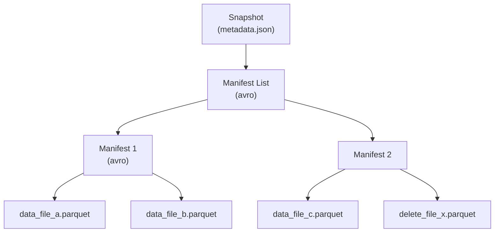

# Manifest（清单文件）

!!! tip "一句话理解"
    湖表元数据的**二层索引**：Manifest 记录一批数据文件的元信息（路径、行数、列统计），Manifest List 记录一批 Manifest。查询引擎不再靠 `LIST` 对象存储扫目录，而是读这两层文件定位数据。

## 为什么需要 Manifest

在 Hive 时代，"哪些文件属于这个分区"靠扫目录回答。当对象存储上一张表有几十万文件时，这个 `LIST` 就是性能杀手：

- S3 `LIST` 每次返回 1000 个 key，翻页贵
- HDFS NameNode 承受数百万 inode 压力
- 新增 / 删除文件没有事务语义

Manifest 把这件事反过来：**写端维护一组索引文件，读端直接读索引，不再依赖目录枚举**。

## Iceberg 的两层结构

- **Manifest List** —— 记录这个 Snapshot 涉及的所有 Manifest；每个条目带分区值范围、行计数、是否全是新增
- **Manifest** —— 记录一批数据文件的列级统计（min / max / null count / lower bound / upper bound），也记录 delete file

查询 `WHERE ts > '2026-01-01'`：

1. 读 Manifest List，按分区范围剪枝掉不相关的 Manifest
2. 读剩下的 Manifest，按列统计再剪枝掉不相关的数据文件
3. 只打开幸存的数据文件

通常一次查询只需打开目标数据的个位数 Manifest，远比扫目录轻。

## Manifest 的几个隐藏价值

- **增量读取** —— snapshot A → B 新增哪些 Manifest，决定了"给我新增行"的答案
- **Compaction 跟踪** —— 哪些 Manifest 包含"待合并的小文件"，可以扫 Manifest 级别统计快速定位
- **Schema Evolution 的审计边界** —— 每个 Manifest 记录写入时的 schema 版本

## 和 Delta / Hudi / Paimon 的同与不同

| 系统 | 等价物 | 存储格式 |
| --- | --- | --- |
| Iceberg | Manifest + Manifest List | Avro |
| Delta Lake | `_delta_log/*.json` + checkpoint Parquet | JSON + Parquet |
| Hudi | Timeline 中的 commit / clean / compaction instant | JSON + Avro |
| Paimon | Manifest + Manifest List（与 Iceberg 同构） | Avro |

本质都是"不再扫目录，而是读索引文件"。

## 相关概念

- [湖表](lake-table.md) —— Manifest 的归属
- [Snapshot](snapshot.md) —— 一个 Snapshot 的根指向 Manifest List
- [Apache Iceberg](iceberg.md)

## 延伸阅读

- Iceberg spec v2 - Manifests: <https://iceberg.apache.org/spec/#manifests>
- Delta Protocol: <https://github.com/delta-io/delta/blob/master/PROTOCOL.md>
