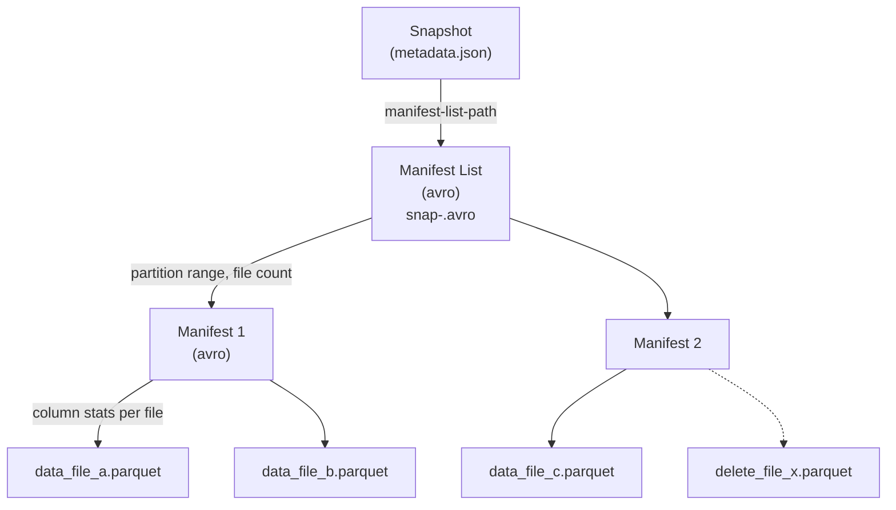

# Manifest · 湖表元数据索引核心

!!! tip "一句话理解"
    湖表元数据的**二层索引文件**。Manifest 记录一批数据文件的路径 + 列级统计，Manifest List 索引一批 Manifest。查询引擎不再靠 `LIST` 扫目录——**读两层元数据文件定位数据**。这是 Lakehouse "10× 性能优势"的关键一环。

!!! abstract "TL;DR"
    - **两层索引**：Manifest List（avro）→ Manifest（avro）→ Data / Delete File
    - **列级统计**（min/max/null_count）在 Manifest 里 → 支持 **file-level pruning**
    - **写入只追加 manifest**，不改历史 → 原子提交友好
    - **查询 planning 从 Hive 的分钟级降到湖表的秒级**
    - 各家实现差异：Iceberg/Paimon（avro）· Delta（JSON）· Hudi（Timeline）

## 1. 为什么需要 Manifest · Hive 时代的痛

Hive 时代"哪些文件属于这个分区"靠扫目录回答。几十万文件时：

| 瓶颈 | 代价 |
|---|---|
| **S3 LIST 开销** | 每次最多返回 1000 keys，百万文件要翻千页 |
| **HDFS NameNode** | 数百万 inode 压力，单点崩 |
| **目录结构即元数据** | 改目录 = 改表，无事务语义 |
| **列统计无处存** | 扫到数据才知道要不要跳过 |

典型事故：
- Netflix Hive 某大表 LIST 100+ 万分区要 30-90s
- 多个 Spark 作业并发写同分区 → 文件丢失

Manifest 的革命：**写端维护索引 → 读端不扫目录 → 写事务 = 替换 Manifest 根指针**。

## 2. Iceberg 两层结构深挖



### Manifest List 内容（avro schema 简化）

```
manifest_path: string
manifest_length: long
partition_spec_id: int
content: int                    # 0=data 1=deletes
sequence_number: long
snapshot_id: long
added_files_count: int
existing_files_count: int
deleted_files_count: int
partitions: list<struct>        # 分区值范围 (min/max per partition column)
```

**关键字段**：`partitions` 让读者**不打开 manifest 即可按分区剪枝**。

### Manifest 内容（avro schema 简化）

```
status: int                    # 0=existing 1=added 2=deleted
data_file: {
  file_path: string
  file_format: string           # PARQUET
  partition: struct
  record_count: long
  file_size_in_bytes: long
  column_sizes: map<int, long>
  value_counts: map<int, long>
  null_value_counts: map<int, long>
  nan_value_counts: map<int, long>
  lower_bounds: map<int, binary>   # per column
  upper_bounds: map<int, binary>
  key_metadata: binary
  split_offsets: list<long>
}
```

**核心**：`lower_bounds` / `upper_bounds` 让读者**不打开 data file 即可按谓词剪枝**。

## 3. 查询剪枝流程

假设 `SELECT * FROM sales WHERE ts >= '2024-12-01' AND region = 'NA'`：

```
Step 1: 读 metadata.json → 拿到 Manifest List 路径
Step 2: 读 Manifest List (几 KB) → 按 partitions 字段剪枝，只保留相关 Manifest
Step 3: 读幸存 Manifest (每个几 KB-几 MB) → 按 lower/upper_bounds 剪枝
Step 4: 只打开幸存的 Data File 扫描
```

**量化**：
- 10 万 data file 的表
- Hive LIST：**30-60 秒**
- Iceberg Manifest 读+剪枝：**100-500 ms**
- 性能提升 **60-600×**

## 4. 和其他格式对比

| 系统 | 元数据载体 | 格式 | 查询剪枝支持 |
|---|---|---|---|
| **Iceberg** | Manifest + Manifest List | Avro | 分区 + 列 min/max + Bloom（v3+） |
| **Paimon** | Manifest + Manifest List | Avro（同 Iceberg） | 同上 + bucket |
| **Delta** | `_delta_log/*.json` + checkpoint Parquet | JSON + Parquet | add action 有 stats |
| **Hudi** | Timeline instant + commit metadata | Avro + JSON | Bloom / Record Index 索引 |

**深层差异**：

- **Iceberg / Paimon**：Manifest-per-batch，多次写入产生多 Manifest，periodic 合并
- **Delta**：每次 commit 产生一个 JSON 事务日志，**checkpoint 成 Parquet**（周期压缩）
- **Hudi**：Timeline 是**事件流**而非索引，依赖 commit metadata + 索引层

本质都是"不扫目录、读索引文件"——但**索引的组织方式** + **合并策略**不同。

## 5. Manifest 的隐藏价值

### 增量读 / CDC 基础

Iceberg `table.changes(start_snap, end_snap)`：
- 对比两个 Snapshot 的 Manifest List
- 找**新增的 Manifest**（以及新增/删除的 data files）
- 返回差量数据

### 小文件治理信号

可以 `SELECT * FROM db.tbl.files` 查看 Iceberg 的 metadata 表：
- 每个 data file 大小
- 识别 < target 大小的文件
- 触发 `rewrite_data_files`

### Schema Evolution 审计

每个 Manifest 记录**写入时的 schema 版本 ID** → Schema 演化后老 Manifest 仍可读、新 Manifest 用新 schema。

### Partition Spec 演化

Iceberg 支持**不同 Manifest 用不同分区规范**（partition evolution 的基础）。老数据按旧分区、新数据按新分区，读者分别按 partition_spec_id 处理。

## 6. 工程细节

### Manifest 数量管理

一个 Snapshot 有几十到几千 Manifest 合适：
- 太少（< 10）：每 Manifest 过大，I/O 单点
- 太多（> 10k）：Manifest List 变大，读 metadata 慢

**治理命令**（Iceberg）：
```sql
-- 合并小 Manifest
CALL system.rewrite_manifests('db.tbl');

-- 查看 Manifest 信息
SELECT * FROM db.tbl.manifests;
```

### Manifest 大小

- 典型 1-50 MB
- 一个 Manifest 引用 10-1000 个 data file

### 读取缓存

Trino / Spark 都会缓存 Manifest：
- 减少重复 I/O
- 小查询共享 Manifest 缓存

## 7. 代码示例

### Iceberg 查 Manifest 表

```sql
-- 查看所有 Manifest
SELECT path, length, partition_summaries, added_data_files_count
FROM iceberg.db.tbl.manifests;

-- 查看某文件所在的 Manifest
SELECT * FROM iceberg.db.tbl.files
WHERE file_path LIKE '%data_file_a.parquet%';

-- 查看 Manifest 与 Snapshot 的关联
SELECT committed_at, snapshot_id, manifest_list
FROM iceberg.db.tbl.snapshots;
```

### 用 Java API 直接读 Manifest

```java
Table table = catalog.loadTable(TableIdentifier.of("db", "tbl"));
for (ManifestFile manifest : table.currentSnapshot().allManifests(table.io())) {
  for (ManifestEntry<DataFile> entry : ManifestFiles.read(manifest, table.io())) {
    DataFile df = entry.file();
    System.out.println(df.path() + " rows=" + df.recordCount() +
                       " size=" + df.fileSizeInBytes());
  }
}
```

## 8. 陷阱与反模式

- **Manifest 不定期 rewrite**：百万小 Manifest → 查询慢
- **流写无后台 compaction**：Manifest 爆炸 + Data File 爆炸
- **Expire Snapshot 不跑**：老 Manifest 不释放，对象存储成本爆
- **手工改 Manifest**：元数据和数据不一致 → 查询崩
- **统计信息开销当问题**：忽视 lower/upper_bounds 反而让查询慢
- **Delete File 不管**：MoR 模式下 Delete File 堆积 → 查询合并慢

## 9. 相关 · 延伸阅读

- [湖表](lake-table.md) · [Snapshot](snapshot.md) · [Iceberg](iceberg.md)

### 权威阅读

- **[Iceberg spec - Manifests](https://iceberg.apache.org/spec/#manifests)**
- **[Delta Protocol](https://github.com/delta-io/delta/blob/master/PROTOCOL.md)**
- **[Hudi Timeline docs](https://hudi.apache.org/docs/timeline)**
- **[Paimon Manifest docs](https://paimon.apache.org/docs/master/concepts/basic-concepts/)**
