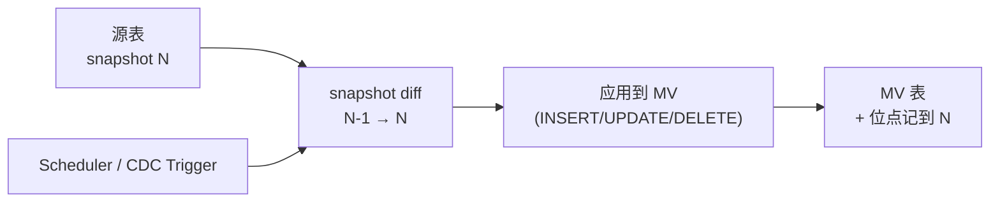

# Materialized View · 湖上物化视图

!!! warning "重要说明 · 本页混合了"未来方向"和"当下实现""
    **到 2026-Q2，"湖上 MV" 尚未形成跨格式统一的协议标准**。本页讨论的是两类内容的混合：

    1. **当下已有的引擎层实现** · Trino Iceberg connector 的 MV 管理、Databricks Managed MV
    2. **表格式层的 MV 等价物** · Paimon aggregation table、Hudi Incremental Query 手写
    3. **未来可能的协议层标准化** · Iceberg MV spec 社区讨论中

    **读者提示**：
    - 本页 SQL 示例都**绑定特定引擎**（Trino 的不等于 Spark 的；Paimon 的不是 Iceberg 的）
    - 跨引擎共享 MV 目前**做不到开箱即用**；要靠 Iceberg View Spec + 手动协调刷新
    - 若追求"一次定义跨所有引擎用" → 生产选型要谨慎，等 spec 成熟

!!! tip "一句话理解"
    把一条查询**物化成一张表**——定期（或触发）增量刷新。传统 DB 里 MV 已成熟 30 年；**湖上 MV 仍在形成中**（2024-2026），但已是 **"BI 聚合加速器" + "AI Feature Store 基础设施"** 的关键拼图。

!!! abstract "TL;DR"
    - **湖上 MV 本质 = 一张真实湖表 + 源表位点记录 + 刷新策略**（各家实现不同）
    - **增量刷新原理**：读源表两个 snapshot 的差集 → 应用到 MV → 推进位点
    - **四家状态**：Iceberg（View Spec + storage table，无 MV spec）· Paimon（aggregation 表等价）· Delta（Databricks 托管）· Hudi（Incremental Query 手写）
    - **引擎层驱动 vs 协议层**：Trino / Spark 的 Iceberg connector 给出了 MV 管理能力，但**这是 connector 功能不是 Iceberg spec 标准化**
    - **边界**：MV 不是流计算；它是"离散刷新的物化"，和 Flink 持续查询互补

## 为什么值得专门一页

三条动机被市场长期忽略：

1. **BI 加速**：大宽表聚合 MV 是 OLAP 的古老配方，搬到湖上能**让 Trino / StarRocks 秒级返回大数据量报表**而不走 OLAP 副本
2. **AI Feature Store 的协议化**：多数 Feature Store（Feast / Tecton）底层都要落到"物化+增量+版本化"的表上；如果湖表原生支持 MV，Feature Store 的核心功能（去重 / 版本 / RBAC / 血缘）可以部分下沉到平台层
3. **CDC 流与批的融合**：MV 订阅源表 snapshot，天然地用"批的形态"消费"流的变化"——比自己写 Flink 作业维护一张聚合表**成本低一个量级**

## 和 RDBMS MV 的根本差异

| 维度 | RDBMS MV（Oracle / PG / SQL Server）| 湖上 MV |
|---|---|---|
| 存储 | 内嵌在 DB 实例 | 独立湖表（Parquet / Lance 文件）|
| 刷新触发 | 通常 `REFRESH MATERIALIZED VIEW`（同步）| Snapshot diff（异步，分钟级）|
| 增量机制 | log-based（日志回放）| **Snapshot 差集**（无需日志）|
| 跨引擎读 | 通常限于同一 DB | **协议化后任何引擎可读**（Iceberg View Spec 同理）|
| 和源表事务 | 通常同事务 | **最终一致**（允许一定 staleness）|
| 规模 | GB-TB | **TB-PB**（湖表的规模优势）|

**最关键差异**：湖上 MV **不要求强实时**。它接受"MV 比源表晚 1-5 分钟"换得**跨引擎 + 大规模**。

## 增量刷新的核心算法



核心挑战：**MV 定义支持哪些 SQL？** 不是所有查询都能增量刷新。按复杂度分级：

| 复杂度 | 例子 | 增量刷新可行性 |
|---|---|---|
| **投影 / 过滤** | `SELECT a, b FROM t WHERE c > 10` | ✅ 简单 |
| **聚合（SUM / COUNT）** | `SELECT k, SUM(v) FROM t GROUP BY k` | ✅ 可（要处理 delete 时减去）|
| **聚合（MIN / MAX）** | `SELECT k, MIN(v) FROM t GROUP BY k` | ⚠️ MIN 被删要回查 |
| **JOIN**（两表）| `SELECT a.*, b.* FROM a JOIN b ON ...` | ⚠️ 需要 delta-join 算法 |
| **窗口函数** | `ROW_NUMBER() OVER (...)` | ❌ 通常全刷 |
| **递归 / 子查询** | `WITH RECURSIVE ...` | ❌ 全刷 |

**主流湖上 MV 实现目前都支持前 3 级**；JOIN / 窗口需要降级到全量刷新（periodic full refresh）或者只对新分区增量。

## 四家状态 · 2026 横向对比

### Iceberg · Connector 层 MV（Trino / Spark）· 协议层尚无 MV spec

**辨清三件事**：

1. **Iceberg View Spec v1**（2023 ratified）—— **只定义 view**（跨引擎共享 SQL 定义），**不是 MV**
2. **Iceberg MV spec** —— 社区有讨论但**尚未形成正式 spec**（截至 2026-Q2）
3. **Trino Iceberg connector 的 MV 能力** —— **connector 层提供了 MV 管理**：view definition + Iceberg storage table + freshness 判定。这是引擎层功能，不是 spec 标准化

**Trino 的做法**（版本号：Trino MV 能力在 **397（2022-09）** 之后逐步完善，近期如 **479（2025-12）** 加了 `GRACE PERIOD` 扩展）：

```sql
-- Trino Iceberg connector · MV 创建
CREATE MATERIALIZED VIEW iceberg.default.sales_by_region_daily
  WITH (format = 'PARQUET')
  AS SELECT region, date_trunc('day', ts) AS dt, SUM(amount) AS total
  FROM iceberg.default.sales
  GROUP BY region, date_trunc('day', ts);

-- 手动刷新（Trino 没有内置自动刷新调度，要靠外部 cron / Airflow）
-- 注：Iceberg spec 本身不定义"刷新调度"语义，是不是自动由引擎决定
REFRESH MATERIALIZED VIEW iceberg.default.sales_by_region_daily;

-- 新版本可加 GRACE PERIOD · 超过 stale 窗口就 fallback 到源表
CREATE MATERIALIZED VIEW ... GRACE PERIOD INTERVAL '1' HOUR ...;
```

**关键认知**：**不要把 connector 能力当 Iceberg spec 能力**。换到 Spark 或 Flink 读 Trino 建的 MV，表数据能读（就是一张 Iceberg 表），但 **freshness 判定和刷新语义不自动共享**。

**Spark / Flink 的 Iceberg MV 能力**：目前主要通过**手写作业 + Iceberg View Spec** 模拟，还没有像 Trino connector 那种一等管理。

### Paimon · Aggregation Table + Partial-Update（原生）

Paimon 没有叫 "MV" 的东西，但 **Aggregation Table** + **Partial-Update** merge engine 本质就是"一等公民的增量 MV"：

- 定义 MV 为一张 Paimon 主键表，`merge-engine = 'aggregation'`
- 源表 CDC 进来直接按 PK 合并（SUM / MAX / 等聚合函数表）
- **原生 snapshot + changelog**：下游还能继续流读这张 MV 产生的 changelog

```sql
CREATE TABLE user_stats (
  user_id BIGINT,
  order_count BIGINT,
  total_amount DECIMAL(18, 2),
  PRIMARY KEY (user_id) NOT ENFORCED
) WITH (
  'merge-engine' = 'aggregation',
  'fields.order_count.aggregate-function' = 'sum',
  'fields.total_amount.aggregate-function' = 'sum'
);
```

**Paimon 的优势**：**流式 CDC 天然增量刷 MV**——比 Iceberg MV 的 "定期 diff" 模式实时性更好。**这是 Paimon 在 "实时数仓 + Feature Store" 场景的杀手锏**。

### Delta · Databricks Materialized Views（商业 · 非 spec）

- **商业能力**：较新的 Databricks Runtime（配 Unity Catalog）提供 Managed MV · 自动刷新 + Photon 查询优化器感知
- **开源 Delta 协议**：Materialized View **未进开源 Delta Protocol**——截至 2026-Q2，它是 Databricks Runtime 层能力
- **Delta Live Tables (DLT)** 是 Databricks 的声明式 pipeline 产品，能自动生成 MV 风格的增量表，但同样是商业能力
- **开源栈的替代**：Delta 开源版没有原生 MV；要做类似功能走 Spark Structured Streaming + MERGE 手写

这是 Delta 最明显的**开源 vs 商业版差异点**之一——同样提示 "不要把商业 Runtime 能力当 Delta protocol 能力"。

### Hudi · 无独立 MV · Incremental Query 自建

Hudi 没有原生 MV 对象，但 **Incremental Query** 让你**自己写增量作业**：

```python
# 每 10 分钟一跑
last_instant = load_last_processed_instant()
incremental_df = spark.read.format("hudi") \
    .option("hoodie.datasource.query.type", "incremental") \
    .option("hoodie.datasource.read.begin.instanttime", last_instant) \
    .load(source_path)

# 在 incremental_df 上做聚合
agg_df = incremental_df.groupBy("region").agg(...)

# MERGE 到 MV 表
mv_table.merge(agg_df, ...).execute()
save_last_processed_instant(current_instant)
```

**缺点**：每个 MV 都要自己写作业 + 管理位点。**优势**：灵活，任何复杂度的 MV 都能手写。

## MV 和流计算的边界

**常见困惑**：这事情 Flink 不也能做吗？

| 维度 | Flink 持续查询 | 湖上 MV |
|---|---|---|
| 延迟 | 秒级 | 分钟级 |
| 资源 | 常驻集群 | 定期作业（或事件触发）|
| 状态管理 | Flink 状态后端 | 存在 MV 表里（自描述）|
| 调试 | 状态不透明 | 就是一张湖表，可以 SELECT |
| 重启恢复 | 依赖 checkpoint | 从位点重算 |
| 成本 | 24/7 集群 | 按刷新频率付钱 |
| 跨引擎消费 | 需要把结果再落地 | 本身就是湖表 |

**规则**：**秒级要求 → Flink**；**分钟级能接受 → 湖上 MV**（成本更低、运维更简单）。

## 对 AI · Feature Store 场景的启发

AI 场景里的"特征表"本质上就是 MV：

```sql
-- 这不就是 Feature Store 吗？
CREATE MATERIALIZED VIEW user_features
REFRESH EVERY 5 MINUTES AS
SELECT
  user_id,
  COUNT(*) AS orders_7d,
  AVG(amount) AS avg_amount_7d,
  MAX(ts) AS last_active
FROM orders
WHERE ts >= current_timestamp - INTERVAL '7' DAY
GROUP BY user_id;
```

- Feast / Tecton 传统写法：特征定义 + 物化 pipeline + 版本化 + 在线同步，都要自建
- Paimon Aggregation + CDC：10 行 SQL 解决**物化 + 增量**
- Trino Iceberg MV：10 行 SQL 解决**定义 + 刷新**

**Feature Store 商业产品的价值被部分压缩**——**离线物化 / 版本化** 这 2 个能力湖上 MV 开始覆盖；剩下的**在线点查（毫秒级）、特征管理（RBAC、血缘、监控）**仍然需要专用系统（Feast / Tecton / Tecton-on-Delta 等）。

### Embedding MV · AI 场景的新范式

更激进的思路：**embedding 表也做成 MV**。

```
源表（docs）CDC → MV 刷新触发 →
  批量调 embedding model →
  写回 MV 表（embedding 列）→
  Milvus 从 MV 增量同步
```

这把"embedding 生成"变成了**标准的增量物化过程**——而不是一个需要专人维护的"特征 pipeline"。**这是湖上 MV 对多模 AI 最重要的启发**。

## 陷阱

- **MV 定义 SQL 超出支持范围**：窗口 / 递归 / 复杂 JOIN 常常只能全刷 → 成本失控
- **Stale 容忍度不设**：默认当实时 → 下游用到半小时前的数据错报
- **MV 数量爆炸**：每张表建 10 个 MV → 运维灾难 → 定期清理不用的 MV
- **JOIN 大表 MV 全刷**：没经过增量 JOIN 算法评估，变成定时重算整个大表
- **MV 和源表 schema 演化脱节**：源加列后 MV 不跟进 → 后续查询失败

## 相关

- [Snapshot](snapshot.md) —— MV 增量刷新的底层
- [Streaming Upsert / CDC](streaming-upsert-cdc.md) —— 流式刷新的原料
- [Iceberg](iceberg.md) —— 机制 8 · MV proposal
- [Paimon](paimon.md) —— Aggregation 表原生 MV
- [多模湖仓](multi-modal-lake.md) —— Embedding MV 的启发

## 延伸阅读

- **Iceberg MV proposal**（community slack / GitHub discussion）
- **Trino MV docs**: <https://trino.io/docs/current/sql/create-materialized-view.html>
- **Paimon Aggregation Table**: <https://paimon.apache.org/docs/master/primary-key-table/merge-engine/>
- **Databricks Materialized Views** 商业文档
- **Feast 与 Tecton** 和湖上 MV 的对比讨论
