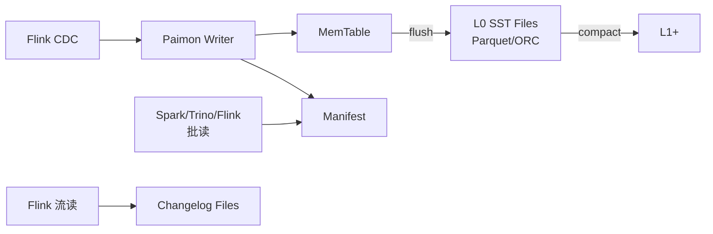

# Apache Paimon

!!! tip "一句话定位"
    **流式原生的湖表**：以 LSM 作骨架，天然支持高频 upsert 与 changelog 生成。如果你的场景是"数据库 CDC 持续入湖 + 湖上做准实时分析"，Paimon 是最短路径。

## 它解决什么

Iceberg / Delta 在批场景非常强，但流式高频 upsert 下会踩到：

- 小文件爆炸
- Merge-on-Read 合并成本高
- Changelog（"本次变更了哪些行"）不直接可用

Paimon 把 LSM 的"写友好 + 分层合并"思路搬到湖表上，换来：

- 高吞吐 upsert（秒级）
- 原生 changelog 输出，可被 Flink 下游以流消费
- 流批一体：同一张表既能被 Flink 流消费，又能被 Spark / Trino 批读

## 架构一览

## 关键能力

| 能力 | 机制 |
| --- | --- |
| Primary Key 表 | 指定主键，按 key 合并最新版本；支持 upsert / delete |
| Append-only 表 | 纯追加明细，性能最好 |
| Changelog Producer | `input` / `full-compaction` / `lookup` 三种策略决定 Changelog 何时产生 |
| Streaming Read | 下游 Flink 作业可订阅新 commit |
| Tag & Branch | 类似 Iceberg 的 tag；支持分支（更"轻"版本的 Git-like） |
| Merge Engine | `deduplicate` / `partial-update` / `aggregation` / `first-row` 等 |

## 和 Iceberg / Hudi / Delta 对比

- 对比 **Iceberg** —— Paimon 流优先、upsert 吞吐高；Iceberg 批优先、生态更广
- 对比 **Hudi** —— 定位最接近的竞争者；Paimon 以 Flink 社区为中心演进，Hudi 更偏 Spark
- 对比 **Delta** —— Delta 绑 Databricks 更紧，Paimon 开源治理完全独立

横向对比见 [Iceberg vs Paimon vs Hudi vs Delta](../compare/iceberg-vs-paimon-vs-hudi-vs-delta.md)。

## 在我们场景里的用法

- **CDC 入湖的首选**：Flink CDC → Paimon Primary Key 表，分钟级新鲜度
- **流批统一的事实表**：上游流消费 changelog，下游批引擎读同一张表
- 和 Iceberg 并存：Paimon 做"新鲜热表"，Iceberg 做"冷批历史表"

## 陷阱与坑

- **主键表的合并成本**随 L0 文件数上升，必须配合 dedicated compaction job
- **Changelog Producer 选择影响明显**：`lookup` 最精准但最贵，`input` 最轻但假设上游已去重
- **Flink / Spark 版本兼容性**：升级时对照 release note 的兼容性矩阵

## 延伸阅读

- Paimon docs: <https://paimon.apache.org/>
- *Apache Paimon: Streaming Lakehouse is Here*（社区博客）
