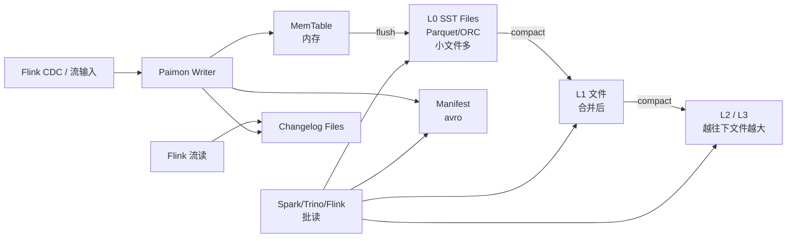

# Apache Paimon

!!! tip "一句话定位"
    **流式原生的湖表**。把 **LSM-Tree 搬到对象存储**上，天然支持**高频 upsert + 原生 Changelog + 流批一体**。如果你的场景是"CDC 持续入湖 + 湖上准实时分析"，Paimon 是最短路径。

!!! abstract "TL;DR"
    - **LSM on Object Store** —— Level 0 写入快、后台 compaction 合并
    - **原生 Changelog Producer**：下游 Flink 作业直接订阅表变化，真正的流批一体
    - **Primary Key 表**：upsert / partial-update / aggregation / first-row 多种 merge engine
    - **分钟级数据新鲜度**：Flink CDC → Paimon → Trino 查，端到端 < 5min
    - **与 Iceberg 互补**：Paimon 做"新鲜热表"、Iceberg 做"冷批历史表"
    - **社区重心在 Flink**；Spark / Trino / StarRocks 读写支持也很成熟

## 1. 它解决什么 · Iceberg / Delta 在流场景的痛

Iceberg / Delta 在**批场景**非常强。但流式 CDC 持续入湖时会遇到：

| 问题 | 后果 |
|---|---|
| **小文件爆炸** | 每次 Flink checkpoint 写一批小文件 → 查询崩 |
| **Merge-on-Read 合并成本** | Delete File 堆积 → 查询慢 |
| **Changelog 不直接可用** | 下游要"本次变更了哪些行" → 需要自己 diff |
| **Upsert 效率低** | CoW 改一行重写整个文件 → 百万行/分钟改不动 |
| **流批两套 pipeline** | 同一张表批和流维护两份 → 成本高 |

Paimon 的核心思想：**借鉴 LSM（RocksDB 系）的写友好 + 分层合并，铺到对象存储上**。

换来：

- ✅ **秒级高吞吐 upsert**（主键表）
- ✅ **原生 Changelog**（表知道自己怎么变的）
- ✅ **流批统一**：同一张表，Flink 流消费 + Trino 批查
- ✅ **分钟级新鲜度**（取决于 commit 频率）

**典型业务命中**：
- 互联网电商 CDC 入湖：MySQL → Flink CDC → Paimon → Trino BI（分钟级报表）
- 实时风控：支付明细持续入湖，Flink 下游多作业消费同一张表
- 实时大屏：Paimon changelog → StarRocks 增量 MV → Dashboard

## 2. 架构深挖



### LSM on Object Storage 的挑战

在**本地盘**上 LSM 很常见（RocksDB、Cassandra）。在**对象存储**上 LSM 的困难：

| 挑战 | Paimon 的解法 |
|---|---|
| 对象存储 **无法原地修改** | 每次 flush 写新文件（Level 0） |
| 小文件 metadata 开销大 | 后台 compaction 定期合并成大文件 |
| 对象存储 **LIST 慢** | 用 Manifest 索引（类似 Iceberg） |
| **写放大** 严重（LSM 天生） | 多种合并策略：universal / leveled |
| **没有本地 cache** | 读热数据需要对象存储前置 cache |

### 文件布局

```
warehouse/
  db/
    table/
      bucket-0/
        data-0.parquet    # L0
        data-1.parquet    # L0
        data-2.parquet    # L1
        ...
      bucket-1/
        ...
      manifest/
        manifest-0.avro
        manifest-1.avro
      snapshot/
        snapshot-1
        snapshot-2
      schema/
        schema-0
      changelog/
        changelog-0.parquet
```

### Bucket 分布

Paimon 把数据**按主键 hash 分桶**。Bucket 决定写并行度 + 合并粒度。

- **固定 Bucket 数**（默认）：简单，扩容时要 rescale
- **Dynamic Bucket**（新）：热点自动扩
- **Unaware Bucket**（append-only）：纯追加表不分桶

### Snapshot / Commit

和 Iceberg 类似，每次提交 = 一个新 snapshot。但 Paimon 的 snapshot **更细粒度**、频率可以更高（分钟级甚至秒级）。

## 3. 关键机制

### 机制 1 · Merge Engine（选谁决定表的含义）

| Merge Engine | 语义 | 场景 |
|---|---|---|
| **deduplicate** | 按主键保留最新版 | CDC 持续入湖 |
| **partial-update** | 多源部分字段拼成一行 | 用户画像拼宽表 |
| **aggregation** | 按字段做聚合（sum / max ...） | 增量物化视图 |
| **first-row** | 首次写入生效 | 一次性事实表 |

示例：**部分列更新**——订单表状态列由订单服务写、退款列由退款服务写，用 partial-update 拼一张宽表：

```sql
CREATE TABLE orders (
  order_id BIGINT,
  status   STRING,
  refund_amount DECIMAL(18,2),
  PRIMARY KEY (order_id) NOT ENFORCED
) USING paimon
TBLPROPERTIES (
  'merge-engine' = 'partial-update',
  'changelog-producer' = 'lookup'
);

-- 作业 A 只写 status
-- 作业 B 只写 refund_amount
-- 自动拼成同一行
```

### 机制 2 · Changelog Producer（流读核心）

下游想知道"这次提交变更了哪些行、具体值是什么"，Paimon 提供 4 种策略：

| Producer | 机制 | 成本 | 准确度 |
|---|---|---|---|
| **none** | 不产 Changelog | 最低 | 下游只能全量读 |
| **input** | 直接用输入流做 Changelog | 低 | 假设输入已是 dedup Changelog |
| **lookup** | 每次 Compact 查老值 → 新老对比 | 高 | **最精准** |
| **full-compaction** | Compaction 时整理出 Changelog | 中 | 有延迟但全 |

实务：**CDC 场景用 `input`**（上游 CDC 已有新老值），**画像 partial-update 用 `lookup`**（上游只有新值，需要查老值对比）。

### 机制 3 · Compaction 策略

- **Universal-style**（默认）：类似 RocksDB Universal，合并代价均衡。Paimon 不提供 RocksDB 风格的 "leveled" 切换；版本演进里还加了 `full-compaction` / 专用 rewrite 等辅助策略
- **触发**：L0 文件数阈值（`num-sorted-run.compaction-trigger`）、时间、手动（`CALL compact`）；或走 **full-compaction** 触发全量合并（配合 `full-compaction` changelog producer）

**专用 Compaction Job**（生产推荐）：

```sql
-- Flink 专用 compaction 作业（不和写作业抢资源）
CALL paimon_compact_database('db');
```

### 机制 4 · 流读订阅

```sql
-- Flink 流读 Paimon（scan.mode = latest）
SELECT * FROM orders /*+ OPTIONS('scan.mode' = 'latest') */;

-- 下游作业消费 Changelog（行级变更）
SELECT * FROM orders /*+ OPTIONS(
  'scan.mode' = 'latest',
  'changelog-producer' = 'lookup'
) */;
```

### 机制 5 · Lookup-Wait · Changelog 一致性保障

`changelog.producer.lookup-wait = true`（默认）的含义：**写入提交会等 Compaction 完成后才对外可见**。

- 为什么要等：`lookup` changelog 需要 Compaction 时对比新老值才能产出。没跑完就 commit，下游流读会看到**新数据但没有对应 changelog**
- 代价：端到端延迟多 10-60 秒
- 关 `false` 的场景：不依赖 changelog 的纯批查场景，或可以接受 changelog 延迟到下次 commit

### 机制 6 · Deletion Vector Mode（0.9+）

Paimon 0.9 引入 **Deletion Vector 读模式**（和 Iceberg v3 / Delta 3+ 收敛）：

```sql
ALTER TABLE orders SET ('deletion-vectors.enabled' = 'true');
```

- 读时**直接用 DV 过滤**，不再走"合并 base + log"的 MoR 路径
- **读性能接近 CoW**，写成本接近 MoR —— MoR 模式的重要演进
- 需要配合 Compaction 定期把 log 合并成 DV

### 机制 7 · Consumer-ID · 流读断点

多个下游作业独立消费同一张 Paimon 表，各自维护"消费到哪了"的位点。详见 [Streaming Upsert / CDC · Paimon Consumer-ID](streaming-upsert-cdc.md)。关键机制：

- 每个 `consumer-id` 关联一个 **最小 snapshot id**
- 该位点之前的 snapshot 不会被 `expire_snapshots` 清理
- `consumer.expiration-time` 防"僵尸 consumer 无限占用 snapshot"

### 机制 8 · Secondary Index

Paimon 1.0+ 支持**非主键列索引**：

```sql
CREATE TABLE orders (
  order_id BIGINT,
  user_id  BIGINT,
  status   STRING,
  PRIMARY KEY (order_id) NOT ENFORCED
) WITH (
  'file-index.bloom-filter.columns' = 'user_id,status'
);
```

- Bloom Filter 存在 Parquet 文件的 footer 里（per file）
- 按 `user_id = ?` 查询时先读 footer 剪文件
- 补齐了主键湖表"只有 PK 能点查"的短板

## 4. 工程细节

### 关键配置

| 参数 | 默认 | 建议 | 说明 |
|---|---|---|---|
| `bucket` | -1 (动态) | 固定 16-64 | 固定 bucket 更可控 |
| `bucket-key` | 主键 | 按业务选 | 热点打散 |
| `changelog-producer` | none | 按场景选 | 最重要的选型 |
| `merge-engine` | deduplicate | 按场景 | |
| `snapshot.time-retained` | 1h | 1-7 天 | 流读需要历史 snapshot |
| `snapshot.num-retained.min` | 10 | 100+ | 配合流消费者 |
| `num-sorted-run.compaction-trigger` | 5 | 5-10 | L0 合并阈值 |
| `changelog.producer.lookup-wait` | true | true | Lookup 模式等 compaction |

### 表类型选择

| 表 | 主键 | 追加 | 场景 |
|---|---|---|---|
| **Primary Key Table** | ✅ | ❌ | CDC / upsert / 画像 |
| **Append-only Table** | ❌ | ✅ | 日志 / 事件 / 明细 |
| **Changelog Table** | ✅ | — | 消费上游流 |

### 和 Iceberg 共存

**推荐模式**：Paimon 承载"新鲜热数据"（近 7-30 天），Iceberg 承载"历史冷数据"。

```
业务 OLTP → Flink CDC → Paimon (近 30 天，主键表)
                             ↓ (夜间批)
                         Iceberg (全量历史，追加)
```

这样 Paimon 永远不会太大，Iceberg 承担批分析。

## 5. 性能数字

| 场景 | 规模 | 基线 |
|---|---|---|
| CDC 主键表写吞吐 | 单 Flink 作业 | 10k - 100k rows/s |
| 流读延迟 | commit 到可见 | 30s - 2min |
| 批查延迟 | 亿级主键表 | 秒级（分桶 + 合并后）|
| Compaction 吞吐 | 后台作业 | 100+ MB/s |
| 单表规模 | | TB - 几十 TB（超大建议分表） |
| Snapshot 频率 | | 1-5 分钟 / commit |

**阿里内部案例**（引自 [Paimon 官方博客 · 2023-2024](https://paimon.apache.org/blog/) 与 Flink Forward Asia 公开演讲）：
- 某电商 CDC 入湖：MySQL 千万级日变更，Paimon 端到端 3 分钟可查
- 某短视频：用户画像 partial-update 聚合 10+ 个源，lookup mode 延迟 5 分钟

> 具体数据规模和硬件未公开 —— 自家场景请以 Paimon 1.0 GA release notes 和公开 benchmark 为基线。

## 6. 代码示例

### CDC 入湖（Flink SQL）

```sql
-- 源：MySQL CDC
CREATE TABLE mysql_source (
  order_id BIGINT,
  user_id  BIGINT,
  status   STRING,
  amount   DECIMAL(18,2),
  ts       TIMESTAMP,
  PRIMARY KEY (order_id) NOT ENFORCED
) WITH (
  'connector' = 'mysql-cdc',
  ...
);

-- 目标：Paimon 主键表
CREATE TABLE paimon_orders (
  order_id BIGINT,
  user_id  BIGINT,
  status   STRING,
  amount   DECIMAL(18,2),
  ts       TIMESTAMP,
  PRIMARY KEY (order_id) NOT ENFORCED
) WITH (
  'bucket' = '16',
  'changelog-producer' = 'input',
  'merge-engine' = 'deduplicate'
);

-- 同步
INSERT INTO paimon_orders SELECT * FROM mysql_source;
```

### Partial Update 多源拼表

```sql
CREATE TABLE user_profile (
  user_id  BIGINT,
  name     STRING,        -- 由用户服务维护
  last_order_ts TIMESTAMP, -- 由订单服务维护
  vip_level INT,            -- 由会员服务维护
  PRIMARY KEY (user_id) NOT ENFORCED
) WITH (
  'merge-engine' = 'partial-update',
  'changelog-producer' = 'lookup'
);
```

### Trino 批查（和 Iceberg 一样简单）

```sql
SELECT status, COUNT(*), SUM(amount)
FROM paimon.db.orders
WHERE ts >= DATE '2024-12-01'
GROUP BY status;
```

## 7. 陷阱与反模式

- **Primary Key 表不跑 dedicated compaction** → L0 堆积 → 读放大炸 → 必须配独立 compaction job
- **Changelog Producer 选错**：`input` 假设上游已 dedup，违背就错 → 不确定就用 `lookup`
- **Bucket 数估不准**：过小热点爆、过大小文件多 → 典型 16-64 从这里起
- **流读没设保留期**：`snapshot.time-retained` 太短 → 流作业追不上 → 重放失败
- **混用引擎版本**：Paimon / Flink / Spark 版本矩阵要对照 release note
- **直接把 Paimon 当 HTAP OLTP**：点查几 ms 做不到，要上 KV 层
- **把 Changelog 当普通 Kafka**：语义不同（Paimon 是 commit-based，不是 offset-based）

## 8. 横向对比 · 延伸阅读

- [Iceberg vs Paimon vs Hudi vs Delta](../compare/iceberg-vs-paimon-vs-hudi-vs-delta.md) —— 流场景 Paimon 领先
- [Real-time Lakehouse 场景](../scenarios/real-time-lakehouse.md) —— Paimon 是主角
- [流式入湖场景](../scenarios/streaming-ingestion.md)

### 权威阅读

**一手规范与博客**

- **[Apache Paimon 官方文档](https://paimon.apache.org/)** · **[Spec · File Layout](https://paimon.apache.org/docs/master/concepts/spec/overview/)**
- **[Paimon 官方博客](https://paimon.apache.org/blog/)** —— 1.0 GA、CDC、压缩策略
- **[Paimon 设计思路（Jingsong Lee 原作者）](https://paimon.apache.org/blog/2024/01/30/apache-paimon-the-streaming-lakehouse/)** —— 为什么要重新做一个 Flink-native 的表格式

**演讲与工程实践**

- [Flink Forward Asia 2023 · Paimon Track](https://asia.flink-forward.org/) —— 阿里 / 字节 生产实践
- [《Streaming Lakehouse · Ververica Tech Talk》](https://www.ververica.com/blog) —— Ververica（Flink 商业公司）视角
- 阿里云 RealtimeCompute Paimon 文档 —— 生产级调优指南
- [Paimon GitHub Discussions](https://github.com/apache/paimon/discussions) —— 社区活跃问答

**对比理解**

- [Iceberg vs Paimon vs Hudi vs Delta](../compare/iceberg-vs-paimon-vs-hudi-vs-delta.md) —— 本手册深度对比

## 相关

- [湖表](lake-table.md) · [Iceberg](iceberg.md)（互补）· [Streaming Upsert / CDC](streaming-upsert-cdc.md)
- [Flink](../query-engines/flink.md) · [Real-time Lakehouse](../scenarios/real-time-lakehouse.md)
