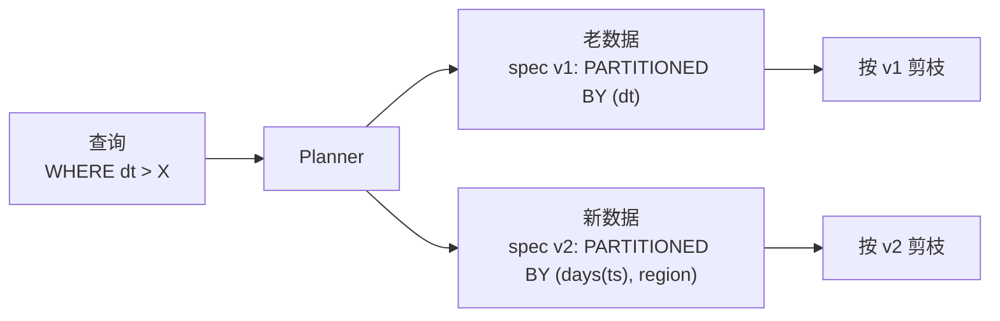

# Partition Evolution（分区演化）

!!! tip "一句话理解"
    **改分区策略却不用重写历史数据**。Iceberg 的独特能力——老数据按老分区 spec 组织，新数据按新 spec，引擎按 spec 版本分别处理。这让"分区键错了"不再是灾难。

## 为什么重要

传统 Hive 表分区是**物理目录**。一旦分区键选错（粒度太细导致小文件，或选了低基数列），修复只能：

- 创建新表（正确分区）
- 重写全部历史数据
- 切换应用

几十 TB 级别这件事几乎做不了。Partition Evolution 把这件事降维成一条 DDL。

## Iceberg 怎么做到

Iceberg 表的每个 **Snapshot 都带一个 Partition Spec 版本号**。新 commit 用最新 spec；老 commit 保持老 spec。读取时：



引擎在同一查询里按两种 spec 分别做分区剪枝，然后结果合并。

### Spec 版本 + Manifest 的关联

每个 **Manifest** 文件的 `partition_spec_id` 字段指向它写入时用的 spec 版本。查询 planner 读 Manifest List 时：

1. 按 Manifest 的 `partition_spec_id` 反查对应 spec
2. 用该 spec 解释 `partitions` 字段（分区值范围）
3. 剪枝——匹配不上的 Manifest 整个跳过

这让"一张表同时存在多个 spec 版本"成为正常状态。详见 [Manifest](manifest.md) 的 "Partition Spec 演化" 段。

## 常见演化操作

```sql
-- 建表
CREATE TABLE events (id BIGINT, ts TIMESTAMP, region STRING)
USING iceberg
PARTITIONED BY (days(ts));

-- 加一维分区
ALTER TABLE events ADD PARTITION FIELD region;

-- 改粒度（from days → hours）
ALTER TABLE events REPLACE PARTITION FIELD days(ts) WITH hours(ts);

-- 删一维
ALTER TABLE events DROP PARTITION FIELD region;
```

**DDL 秒级返回**，没有物理重写。

## Hidden Partitioning

Iceberg 的另一个亮点：**查询不暴露分区列**。你写：

```sql
SELECT * FROM events WHERE ts > '2026-04-01';
```

不需要写 `WHERE dt = '2026-04-01'`（Hive 那种需要手工分区过滤）。Iceberg 从 `ts` 自动派生出分区值。

这让 Partition Evolution 变得自然 —— 业务 SQL 不需要随分区 spec 改变而改。

## 真实演化路线（一个典型事实表）

一张订单表的**5 年演化**（按现实情况推演）：

1. **Year 1**：`PARTITIONED BY (region)` —— 业务少，按区域分够了
2. **Year 2**：数据增长 → `ADD PARTITION FIELD days(ts)` —— 时间维度切入
3. **Year 3**：跨区不均衡 → `REPLACE region WITH bucket(16, region)` —— Hash 打散
4. **Year 4**：历史冷数据占大头 → `REPLACE days(ts) WITH months(ts)` —— 老数据粒度变粗
5. **Year 5**：多租户上来 → `ADD PARTITION FIELD tenant_id`

五次演化，**零历史重写**。业务 SQL 一路不变。

## 坑

- **演化多次后 Manifest 会有多版本 spec 共存** —— compaction 可以选择是否重写成最新 spec（`rewrite_data_files(strategy='sort')` + 目标 spec）
- **unpartitioned 表合法**：Iceberg 允许 partition spec 为空（`fields=[]`），并非必须有分区字段。`void` transform 用于 v1 兼容场景——让某个字段"看起来还在分区里但实际无效"
- **和 Hive 兼容性**：老 Hive 工具看到 Iceberg 多版本 spec 可能无法解析
- **Snapshot 过期** 会同步让老版本 spec 下的数据消失 —— 和 [Time Travel](time-travel.md) 语义一致

## Delta / Paimon / Hudi 对比

- **Delta** —— **Liquid Clustering** 是替代方案：不显式分区，自适应聚集
- **Paimon** —— 支持 bucket 演化；分区演化能力不如 Iceberg
- **Hudi** —— 分区演化能力有限，常见做法是新分区键前缀新数据、老的不变

Iceberg 在"分区演化"这点上是当下最成熟的。

## 相关

- [Schema Evolution](schema-evolution.md) —— 列维度的演化
- [Manifest](manifest.md) —— 多 spec 共存靠它
- [Apache Iceberg](iceberg.md)

## 延伸阅读

- Iceberg spec v2 - Partitioning: <https://iceberg.apache.org/spec/#partitioning>
- *Partition Evolution in Apache Iceberg*（社区博客）
