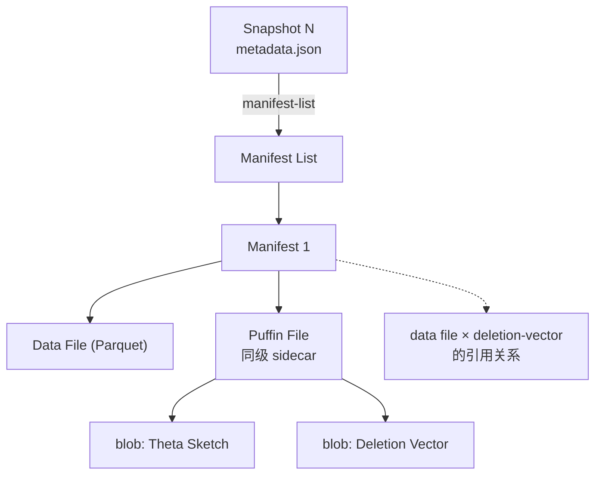

# Puffin（Iceberg 辅助索引文件）

!!! tip "一句话理解"
    Iceberg 规格里**放"辅助索引 / 统计 / Sketch"的**侧车文件格式。被 Manifest 引用，和数据文件平级。**官方 blob 目前只有两种**：Theta Sketch（NDV 去重）+ Deletion Vector（v3 行级删除）。其余如向量索引 / Bloom 属社区 proposal。

!!! abstract "TL;DR"
    - **二进制容器**：一个文件装 N 个独立 blob + footer
    - **被 Manifest 引用**：Puffin 文件和 data file 平级，属于某个 snapshot
    - **官方 blob**（Puffin spec 定义）：`apache-datasketches-theta-v1` + `deletion-vector-v1`
    - **社区 proposal**：HNSW / IVF-PQ 向量索引、Bloom Filter、位图索引
    - **Footer 用 LZ4 frame 压缩**；每个 blob 可独立压缩
    - **和 Lance 的区别**：Lance 把索引内嵌在文件格式里；Puffin 是侧车路径（各有利弊）

## 1. 它解决什么

Iceberg 数据文件是 Parquet / ORC / Lance，它们自带的统计（min/max/null count）不够用。实际场景需要：

- **列 Sketch / 直方图** —— 估算 NDV、分位点，优化器用
- **Bloom Filter** —— 点查谓词下推
- **向量索引** —— 为向量列建 HNSW / IVF-PQ，让湖表直接支持 ANN
- **位图索引 / Bitmap Index** —— 高选择度点查
- **Deletion Vector** —— 行级删除位图（v3 引入）

这些都不适合塞进 Parquet 文件里（格式受限、一次性写死）。Puffin 是给它们专门造的**通用容器**。

## 2. 文件物理结构

Puffin 是一个**容器格式**。整体布局：

```
┌─────────────────────────────┐
│ Magic: 4 bytes (0x50 F1 C2 00 "P F I N") │
├─────────────────────────────┤
│ Blob 1 bytes                │  ← 可独立压缩（LZ4 / Zstd / None）
├─────────────────────────────┤
│ Blob 2 bytes                │
├─────────────────────────────┤
│ Blob N bytes                │
├─────────────────────────────┤
│ Footer Magic: 4 bytes       │
├─────────────────────────────┤
│ Footer Payload (JSON)       │  ← 压缩（LZ4 frame 默认）
│   blobs: [                  │
│     {type, fields, offset,  │
│      length, properties}    │
│   ]                         │
├─────────────────────────────┤
│ Footer Payload Size: 4B LE  │
├─────────────────────────────┤
│ Footer Payload Compression  │
├─────────────────────────────┤
│ Flags: 4 bytes              │
├─────────────────────────────┤
│ Magic: 4 bytes (end)        │
└─────────────────────────────┘
```

读流程：

1. 从文件**末尾**读 footer（stat file + read last ~1KB）
2. 解析 footer payload（JSON，含每个 blob 的 offset / length / type）
3. 按需 range-read 单个 blob（每个 blob 可独立压缩）

### Blob 字段（JSON schema 简化）

```json
{
  "type": "apache-datasketches-theta-v1",
  "fields": [1, 2],                    // 对应的 Iceberg field_id
  "snapshot-id": 123456789,            // 属于哪个 snapshot
  "sequence-number": 42,
  "offset": 8,
  "length": 1024,
  "compression-codec": "lz4",
  "properties": {"ndv": "987654"}      // 自定义元数据
}
```

**关键**：每个 blob 独立压缩——同一个 Puffin 文件里可以装若干 Theta Sketch（LZ4 压缩）+ 一个 Deletion Vector（未压缩 Roaring bitmap）。

## 3. 官方 blob 类型

### `apache-datasketches-theta-v1`

- **内容**：Apache DataSketches 的 Theta sketch 二进制
- **用途**：NDV 精确估计 / 集合运算
- **消费者**：Trino、Spark 查询优化器
- **状态**：已稳定、广泛使用

### `deletion-vector-v1`（Iceberg v3 引入）

- **内容**：per-data-file 的 **Roaring bitmap**（标记被删除的 row position）
- **用途**：取代 v2 的 position-delete file，读时直接位图过滤
- **消费者**：所有支持 v3 的 reader
- **状态**：v3 spec 2025-06 ratified · Iceberg 1.8 开始实现 · 1.10（2025-09）"ready for prime time"；Spark 4.0 读写完整支持

**Iceberg v3 的 DV 和 Delta DV 的差异**：Iceberg DV 存在 Puffin 里（blob type `deletion-vector-v1`）；Delta DV 存在 `_delta_log/` 的 sidecar 文件里。结构相似（都是 Roaring bitmap），载体不同。完整的 DV 语义 / 读路径见 [Delete Files](delete-files.md)。

## 4. 社区 proposal（未接纳 spec）

以下是在 Iceberg 社区讨论中但**尚未进入 Puffin spec** 的 blob 类型：

- **向量索引（HNSW / IVF-PQ）** —— 为向量列建图 / 倒排
- **Bloom Filter** —— per-file 或 per-column-chunk 的 Bloom 位图
- **位图索引 / Bitmap Index** —— 高选择度列点查

**现状**：Polaris / Tabular / Netflix 等在各自 fork 里有实现，但**跨引擎互读**还没标准化。湖上向量检索的完整落地仍需等 blob type 标准化（或走 [Lance](../foundations/lance-format.md) 那条路径）。

## 5. 和 Iceberg 主架构的集成



- Puffin 文件被 **Manifest 引用**（和 data file 一样）
- 每个 blob 绑定到特定 `snapshot-id` + `field_id` 列表
- Expire snapshot 时 Puffin 文件也跟随回收
- Puffin 的 `sequence-number` 用于保证 Deletion Vector 和 data file 的顺序正确性

## 6. 和 Lance 的对比（两条路）

| 维度 | Iceberg + Puffin | Lance Format |
|---|---|---|
| 索引和数据关系 | 侧车（独立文件） | 内嵌（同一 `.lance` 目录） |
| 向量索引支持 | 社区 proposal（未标准化） | 原生 HNSW / IVF-PQ |
| 跨引擎生态 | 广（Spark / Flink / Trino / DuckDB 等） | 窄（LanceDB 生态） |
| 事务模型 | Iceberg snapshot | Fragment 级原子替换 |
| 适合场景 | 批分析 + 偶尔向量 | 向量检索 + ML 训练 |

两者不互斥——Iceberg + Lance-as-data-file 的组合也在演进。

## 7. 当下状态（2026-04）

- **官方 blob 稳定使用**：Theta Sketch（NDV）、Deletion Vector（v3）
- **社区推进中**：向量索引 blob type、Bloom Filter 标准化、位图索引
- **生态**：Netflix / Tabular / Polaris / Starburst 等在不同方向推进，暂无跨厂商共识
- **读侧消费**：Trino 从 Theta Sketch 拿 NDV 做 count-distinct 优化；Spark 也支持；DuckDB 正在接

## 8. 陷阱

- **把 Puffin 当万能索引** → 现实只有两个官方 blob，别提前假设能放任何东西
- **不清理过期 Puffin** → 对象存储成本膨胀（同 data file 处理）
- **跨 reader 版本** → v2 reader 不理解 `deletion-vector-v1` blob → 读 v3 表会出错
- **向量索引写进"自定义" Puffin blob** → 只能在自己 fork 里读，跨工具不兼容

## 9. 相关概念

- [Manifest](manifest.md) —— Puffin 被 Manifest 引用
- [Delete Files](delete-files.md) —— v3 DV 是 Puffin 的重要载体
- [Apache Iceberg](iceberg.md) · [Lance Format](../foundations/lance-format.md)

## 10. 延伸阅读

- **[Iceberg Puffin spec](https://iceberg.apache.org/puffin-spec/)**
- **[Iceberg Vector Search proposal](https://github.com/apache/iceberg/issues)** —— 社区讨论
- **[Puffin vs Lance 对比](../compare/puffin-vs-lance.md)** —— 向量下沉到湖的两条路
- [Apache DataSketches](https://datasketches.apache.org/)
