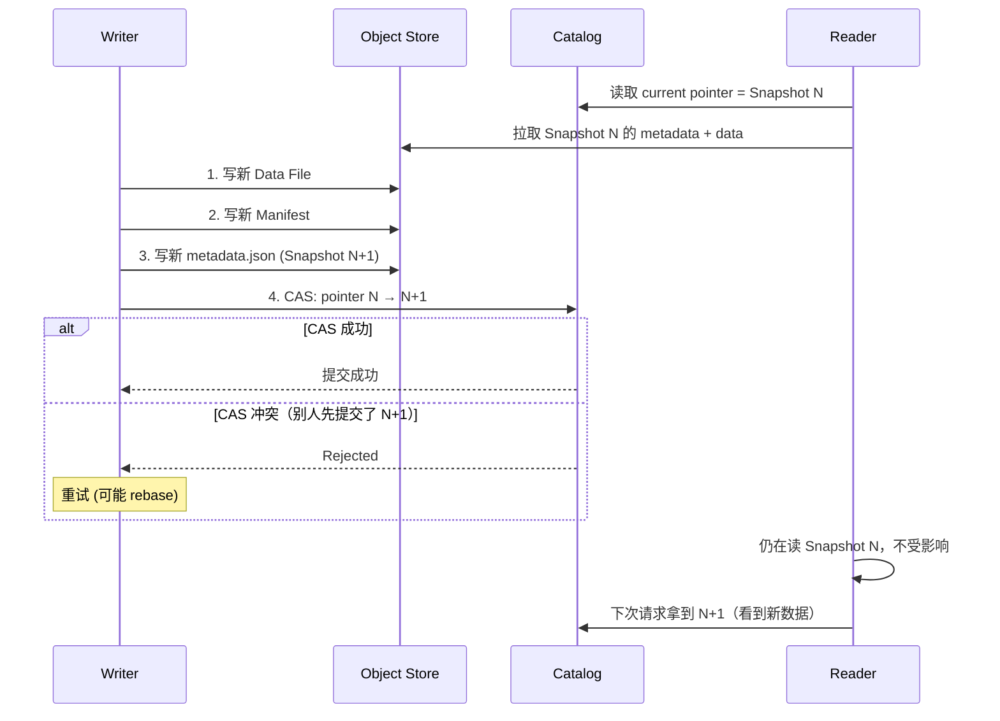

# Snapshot · MVCC on Object Store

!!! tip "一句话理解"
    一个 Snapshot = **表在某一时刻的完整元数据视图**。湖仓的所有"ACID、时间旅行、回滚、增量读"能力，**都是 Snapshot 机制派生出来的**。本质上是**把数据库的 [MVCC](../foundations/mvcc.md) 搬到对象存储上**——隔离级别是 **Snapshot Isolation + CAS 重试**（不是并发 Serializable）。

!!! note "SSOT · 主定义页"
    Snapshot · MVCC on Object Store · Time Travel 机制 等以本页为主定义。Iceberg / Paimon / Delta / Time Travel 等页引用时链回这里。

!!! abstract "TL;DR"
    - Snapshot = 不可变元数据文件 + 指向一堆不可变数据文件
    - 读 = 锁定一个 Snapshot 读完；写 = 产生新 Snapshot
    - 提交的**原子性全压在"指针切换"**（CAS 或 Conditional PUT）
    - **Time Travel** = 读旧 Snapshot；**回滚** = 指针指回旧 Snapshot
    - **增量读** = 算两个 Snapshot 的差集（CDC 基础）
    - **必须过期**（`expire_snapshots`），否则元数据与数据文件无限增长

## 1. 业务痛点 · 没有 Snapshot 的世界

**Hive 时代的真实事故**：

- **"昨天的报表今天数字变了"**：作业并发写同分区，中间某个 executor 失败重试 → 数据被覆盖但没原子性 → 报表数字漂移 → 财务找 IT 吵架
- **"哪个版本是对的"**：改 schema 后 Parquet 和 HMS 不一致，读了一半文件 → 错位、NaN、崩
- **"回滚需要多久"**：从冷备恢复 100TB 表 → 小时级 → 业务半天不可用
- **"审计给我 2024-01-01 的账"**：没有 Time Travel → 只能从归档磁带拉

**没有 Snapshot 的时代，数据湖=定时炸弹**。

数据库的 MVCC 解决了"读不阻塞写、写不阻塞读"——但 MVCC 建在**进程内共享内存**上。湖仓的挑战：**把 MVCC 搬到对象存储**，没有共享内存、没有锁、没有进程。

答案：**Snapshot = 每次提交产生不可变元数据文件 + 原子切一次指针**。

## 2. 原理深度 · MVCC on Object Store

### 数据库 MVCC vs 湖仓 Snapshot

| 维度 | 数据库 MVCC（如 PostgreSQL） | 湖仓 Snapshot |
|---|---|---|
| 粒度 | 行级版本（tuple xmin/xmax） | 文件级版本（Data File） |
| 可见性判定 | 基于事务 ID 可见性检查 | 基于 Snapshot ID 锁定 |
| 清理 | `VACUUM` 清理死元组 | `expire_snapshots` 清理文件 |
| 协调 | 进程内共享内存 + 锁 | 对象存储 + Catalog CAS |
| 开销 | 每行几字节 | 每提交几个元数据文件 |
| 写入频率 | TPS 万级 | commit/分钟级最佳 |

### 提交流程（原子性的秘密）



**核心洞察**：
- 写入的所有新文件是**幂等**的（S3 PUT 用 UUID 路径）
- 真正需要**原子**的只有**最后一步**：指针从 N 切到 N+1
- 对象存储上**唯一需要强一致的位置**就是这一个指针

### Snapshot 数据结构（Iceberg 示例）

```json
{
  "snapshot-id": 1234567890,
  "parent-snapshot-id": 1234567889,
  "sequence-number": 42,
  "timestamp-ms": 1735689600000,
  "manifest-list": "s3://bucket/.../snap-1234.avro",
  "summary": {
    "operation": "append",
    "added-data-files": "100",
    "added-records": "1000000",
    "added-files-size": "26843545600",
    "total-data-files": "15000",
    "total-records": "5000000000"
  },
  "schema-id": 3
}
```

关键字段：
- `parent-snapshot-id` → **形成 DAG**，支持分支 / 回滚 / 审计
- `sequence-number` → **v2 spec 引入的全局单调序号**，解决 MoR 并发正确性——**equality delete 只应用于 sequence-number ≤ 自己的 data file**。防止"老 delete 误删新 insert"。详见 [Delete Files · sequence number 段](delete-files.md)
- `summary` → 快速回答"这次 commit 改了多少" 而无需扫 manifest。`summary.operation` 合法枚举：`append` · `replace` · `overwrite` · `delete`（spec v2 定义）

### Snapshot Ancestry（DAG 而非链表）

常规写：线性追加 `N-1 → N → N+1`。

但有了 **Branch/Tag**（Iceberg v2+）：

```
main:     S1 → S2 → S3 → S4 ---→ S10 (tag: release-2024)
                    ↓
feature:             → S5 → S6 → S7 (branch: experiment)
```

每个 Snapshot 的 `parent-id` 让**祖先树**完整。回滚 = 让 current 指向 S3，废弃 S4-S10（它们的文件稍后 expire 清理）。

## 3. 关键机制

### 机制 1 · Time Travel

```sql
-- 按 snapshot id
SELECT * FROM orders VERSION AS OF 1234567890;

-- 按时间
SELECT * FROM orders TIMESTAMP AS OF '2024-12-01 10:00:00';

-- 列出所有 snapshot
SELECT * FROM orders.snapshots;
```

**前提**：该 snapshot 未被 expire；数据文件未被 vacuum。

### 机制 2 · 回滚（Rollback）

```sql
CALL system.rollback_to_snapshot('db.orders', 1234567890);
```

**危险**：回滚不会物理删除新写入的数据——它们成为"孤儿"，等 `remove_orphan_files` 清理。

### 机制 3 · 增量读（CDC 基础）

```sql
-- Iceberg 增量读
SELECT * FROM orders.changes(
  start_snapshot_id => 1234567890,
  end_snapshot_id => 1234567900
);
```

这是**湖上 CDC 的根基**。下游只读两次 snapshot 的差集，而非全量扫。

### 机制 4 · Snapshot Isolation · 严谨讨论

**湖表的隔离语义不是笼统的"可串行化"**，而是要分读/写细看：

| 并发形态 | 隔离级别 | 机制 |
|---|---|---|
| **多读** | Serializable（每个 reader 固定到一个 snapshot id）| 读 immutable snapshot |
| **单写 + 多读** | Serializable（写入对读者不可见）| snapshot 切换原子 |
| **多写（不同表）** | 无表间隔离保证 | 见"Multi-table Atomic Commit"限制 |
| **多写（同表）** | **SI + first-committer-wins + CAS 重试** | 非并发 Serializable |

**为什么 "多写同表" 不是 Serializable**：按 Berenson 1995（SIGMOD） 的定义，**Snapshot Isolation 防 Lost Update（first-committer-wins）** 但允许 **Write Skew**——这个语义湖表原封不动继承。

**举例**（Write Skew · 经典医生值班场景）：

业务不变量：**任何时刻必须至少有 1 名医生值班**。初始：Alice、Bob 都在值班。

```
     snapshot N            Txn A（读 N）             Txn B（读 N）
  ┌──────────────┐
  │ Alice: 在岗  │ ──→  看到 Alice+Bob        看到 Alice+Bob
  │ Bob:   在岗  │      判断 Bob 在 → 允许下班  判断 Alice 在 → 允许下班
  └──────────────┘      写: Alice=离岗         写: Bob=离岗
                             ↓ CAS 成功 (N+1)       ↓ CAS 成功 (N+2)
                                                      ↓
                                              结果: 两人都离岗
                                              不变量"至少 1 人在岗"被破坏
```

两笔写都**只改各自不同的行**，没触发 first-committer-wins；但**它们各自基于的"另一人仍在岗"的前提**在提交时已失效——SI 不检查读集合的一致性，所以 Write Skew 得逞。

**湖表没办法直接防 Write Skew**——需要应用层加"冲突检测"或走**Nessie / Unity Catalog 的跨表事务**。

详见 [foundations/mvcc](../foundations/mvcc.md) 和 [foundations/consistency-models](../foundations/consistency-models.md)。

### 机制 5 · 过期（Expire）

```sql
-- 清理超过 7 天的 snapshot，保留最新 100 个
CALL system.expire_snapshots(
  table => 'db.orders',
  older_than => TIMESTAMP '2024-12-01',
  retain_last => 100
);

-- 清理不再被引用的数据文件（孤儿）
CALL system.remove_orphan_files(
  table => 'db.orders',
  older_than => TIMESTAMP '2024-12-01'
);
```

**关键**：Expire **一定要定时跑**，否则：
- metadata.json 膨胀（每提交多一条历史记录）→ 打开慢
- 数据文件不清理 → 对象存储成本失控

## 4. 工程细节

### 保留策略

| 场景 | 推荐保留 |
|---|---|
| 纯批 ETL | 7-30 天 |
| 流入湖（高频 commit） | 1-7 天 + 最多保留 1000 个 |
| 合规审计 | 永久保留特定 tag（不是所有 snapshot） |
| Time Travel 调试 | 7 天够 |

### 失败恢复

**写失败 Snapshot 没提交成功** → 文件变孤儿 → `remove_orphan_files`

**读失败** → Snapshot 不变 → 重试

**Catalog 崩了（CAS 层）** → 新写无法提交，但读未受影响 → Catalog 恢复后写入恢复

## 5. 性能数字

| 指标 | 基线 |
|---|---|
| 提交延迟（单 CAS） | 50-500ms |
| Snapshot 切换感知（读者侧） | 下次请求 metadata 时 |
| Time Travel 打开旧 Snapshot | < 1s（只加载 metadata） |
| metadata.json 大小（10k snapshots） | 几 MB |
| expire + cleanup 耗时 | 与表大小相关，小时级完成 |
| 典型 Snapshot 数（健康表） | 100-1000 个 |

## 6. 代码示例

### 查看 Snapshot 历史

```sql
-- Iceberg
SELECT snapshot_id, parent_id, committed_at, operation, summary
FROM db.orders.snapshots
ORDER BY committed_at DESC
LIMIT 10;
```

### Branch / Tag（Iceberg）

```sql
-- 打生产版本 tag
ALTER TABLE orders CREATE TAG `release-2024-12-01`;

-- 开发分支
ALTER TABLE orders CREATE BRANCH `feature-discount` RETAIN 7 DAYS;

-- 写入分支
INSERT INTO orders.branch_feature-discount VALUES (...);

-- 快进合并
CALL system.fast_forward('db.orders', 'main', 'feature-discount');
```

### 定时 expire（典型 Airflow DAG）

```python
# 每天凌晨
@dag(schedule="@daily")
def iceberg_maintenance():
    rewrite = SparkSubmit(task_id="rewrite_data_files", ...)
    expire = SparkSubmit(task_id="expire_snapshots", ...)
    orphan = SparkSubmit(task_id="remove_orphan_files", ...)
    rewrite >> expire >> orphan
```

## 7. 陷阱与反模式

- **从不跑 expire** → metadata.json / manifest 无限增长 → 打开每张表都慢
- **保留期太短**（< 1h）→ 长查询 / 流消费者跟不上 → 中途读失败
- **单 Snapshot 极多 file**（> 1M）→ planning 慢 → 要 compact manifests + data
- **高频 commit**（每秒几次）→ Snapshot 爆炸 → 合并批次提交
- **rollback 后不跑 orphan cleanup** → 对象存储成本浪费
- **多引擎乱 commit**（Spark + Flink + 手动 Python 并发 append） → CAS 冲突率高 → 集中写入
- **把 Snapshot 当审计日志**：Snapshot summary 不是 WAL，别指望能回答"具体哪一行改了什么"，那是 [Changelog](../scenarios/streaming-ingestion.md) 的事

## 8. 横向对比 · 延伸阅读

- [湖表](lake-table.md) —— Snapshot 的承载实体
- [Time Travel](time-travel.md) —— Snapshot 的应用
- [MVCC](../foundations/mvcc.md) —— 数据库版本的思想源头
- [Branch & Tag](branching-tagging.md) —— Snapshot DAG 的 Git-like 使用

### 权威阅读

- [Iceberg spec - Snapshots](https://iceberg.apache.org/spec/#snapshots)
- [Delta Lake Protocol](https://github.com/delta-io/delta/blob/master/PROTOCOL.md)
- *Apache Iceberg: The Definitive Guide* (O'Reilly, 2024) — 第 3 章详细讲 Snapshot
- *Designing Data-Intensive Applications* (Kleppmann) — 第 7 章 MVCC 原理
