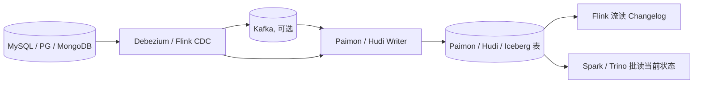

# Streaming Upsert / CDC

!!! tip "一句话理解"
    把上游（OLTP / 业务系统）的**每一行变更（insert / update / delete）**持续、按序地落到湖表上——并且能**原样流式输出**给下游。是"湖仓支持准实时"的关键路径。

## 它要解决的三个问题

1. **写入侧**：高频 upsert（主键更新）不能每次全量重写，否则吞吐崩
2. **读取侧**：查询时能看到"最新状态"（即：每个 key 最新一条 insert/update 生效，已 delete 的不可见）
3. **下游流侧**：把"这批 commit 新增/改动了哪些行"以 Changelog 形式喂给 Flink / 其他消费者

## 组件链路

**Debezium / Flink CDC** 负责从 binlog / WAL 提取变更，**写入器**落盘成湖表。

## 两种表类型落法

### Merge-on-Read（MoR）

- 写时**只追加 delta 文件（Avro / Parquet delete file）**，不合并
- 读时合并 base + delta，拿到最新值
- **写快 / 读慢**；适合写多读少或有 compaction 资源

代表：Hudi MoR 表、Iceberg 的 row-level delete 文件、Paimon 的 L0

### Copy-on-Write（CoW）

- 写时把受影响的 key 所在文件**整文件重写**
- 读时直接读 base 文件
- **写慢 / 读快**；适合读多写少

代表：Hudi CoW 表、Iceberg 的 CoW 模式

## Changelog 输出

上游产生变更，下游想以流的形式消费——需要湖表能输出 **Changelog**（至少包含 `+I / -U / +U / -D` 四种事件）。主要有三种产生策略：

| 策略 | 说明 | 成本 | 精度 |
| --- | --- | --- | --- |
| `input` | 直接把上游 CDC 流当 changelog | 最低 | 假设上游已去重 |
| `lookup` | 写时查历史对比生成 changelog | 高 | 最精准 |
| `full-compaction` | Compaction 时产出 | 中 | 延迟到 compaction |

Paimon 把三种策略作为一等选项；Iceberg 目前偏向 `input` 路线；Hudi 走 Incremental Query + CDC 字段混合。

## 主键设计的影响

- **主键选得好** —— upsert 自然幂等，落地简单
- **主键错了** —— 要么重复（漏去重），要么"更新"实际在写新行
- **复合主键 + hash 分桶**（如 Paimon `bucket(N, pk)`）是大规模 upsert 稳定的常见配方

## 典型陷阱

- **小文件雪崩**：高频流写必须配周期 compaction
- **DDL 同步**：上游表结构变化，CDC 链路要能传到下游（Debezium schema registry + 湖表 [Schema Evolution](schema-evolution.md)）
- **乱序 / 回滚**：Kafka 消费 offset 回退或重放时要保证幂等
- **全增量混合**：初始化时要先快照再消费增量，需要 watermark 桥接（Flink CDC 2.0+ 原生支持）

## 相关

- [Apache Paimon](paimon.md) —— 流式 upsert 原生
- [Apache Hudi](hudi.md) —— CoW / MoR 先驱
- [Delete Files](delete-files.md) —— row-level delete 细节
- 场景：[流式入湖](../scenarios/streaming-ingestion.md)

## 延伸阅读

- *Debezium: Stream changes from your database* 文档
- *Real-time Data Lake with Paimon* —— 社区博客系列
- Flink CDC: <https://github.com/apache/flink-cdc>
