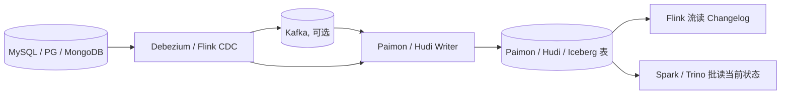

# Streaming Upsert / CDC · 流式入湖机制

!!! tip "一句话理解"
    把上游（OLTP / 业务系统）的**每一行变更（insert / update / delete）**持续、按序地落到湖表上——并且能**原样流式输出**给下游。**湖仓支持准实时的核心机制**。

!!! abstract "TL;DR"
    - **三个问题**：高频 upsert 写入 · 读最新状态 · Changelog 输出给下游
    - **两种落法**：**MoR**（写快读慢） · **CoW**（写慢读快）
    - **Changelog Producer 四策略**：input / lookup / full-compaction / none
    - **Paimon 是当前最成熟的流式 upsert 湖表**；Iceberg 也在跟进
    - **Flink CDC 3.0+** 是主流入口（MySQL / Postgres / MongoDB / Oracle 全覆盖）
    - **主键设计 + Bucket 策略**决定规模上限

## 它要解决的三个问题

1. **写入侧**：高频 upsert（主键更新）不能每次全量重写，否则吞吐崩
2. **读取侧**：查询时能看到"最新状态"（即：每个 key 最新一条 insert/update 生效，已 delete 的不可见）
3. **下游流侧**：把"这批 commit 新增/改动了哪些行"以 Changelog 形式喂给 Flink / 其他消费者

## 组件链路



**Debezium / Flink CDC** 负责从 binlog / WAL 提取变更，**写入器**落盘成湖表。

## 两种表类型落法

### Merge-on-Read（MoR）

- 写时**只追加 delta 文件（Avro / Parquet delete file）**，不合并
- 读时合并 base + delta，拿到最新值
- **写快 / 读慢**；适合写多读少或有 compaction 资源

代表：Hudi MoR 表、Iceberg 的 row-level delete 文件、Paimon 的 L0

### Copy-on-Write（CoW）

- 写时把受影响的 key 所在文件**整文件重写**
- 读时直接读 base 文件
- **写慢 / 读快**；适合读多写少

代表：Hudi CoW 表、Iceberg 的 CoW 模式

## Changelog 输出

上游产生变更，下游想以流的形式消费——需要湖表能输出 **Changelog**（至少包含 `+I / -U / +U / -D` 四种事件）。主要有三种产生策略：

| 策略 | 说明 | 成本 | 精度 |
| --- | --- | --- | --- |
| `none` | 不产 Changelog，下游只能全量或快照读 | 最低 | 无 changelog |
| `input` | 直接把上游 CDC 流当 changelog | 低 | 假设上游已去重 |
| `lookup` | 写时查历史对比生成 changelog | 高 | 最精准 |
| `full-compaction` | Compaction 时产出 | 中 | 延迟到 compaction |

Paimon 把四种策略作为一等选项；Iceberg 目前偏向 `input` 路线；Hudi 走 Incremental Query + CDC 字段混合。

## 主键设计的影响

- **主键选得好** —— upsert 自然幂等，落地简单
- **主键错了** —— 要么重复（漏去重），要么"更新"实际在写新行
- **复合主键 + hash 分桶**（如 Paimon `bucket(N, pk)`）是大规模 upsert 稳定的常见配方

## 全量 + 增量切换 · Flink CDC 2.0+ 的 Watermark 桥接

初始化场景：一张 MySQL 表有 100GB 历史，上线新 pipeline 需要先快照、再消费 binlog。不能"同时读两路"，否则快照和增量流会冲突。

**解法（Flink CDC 2.0+ 内置）**：

```
Phase 1 · 快照       │ Phase 2 · 增量
  全表 Chunk 并行读   │
  每 chunk 完成       │   binlog 消费
  记录 binlog offset  │
                     │   等 watermark ≥ chunk offset → 切换
```

- **watermark 标记"快照的时间边界"**——快照阶段读完每个 chunk 时记下当前 binlog offset
- **切换到增量阶段**时，binlog 回到最早的 chunk offset，但 watermark 过滤掉"在快照里已经读到的"部分
- 这让全量和增量**无缝衔接**，不漏不重

关键参数：`scan.incremental.snapshot.enabled = true`（默认开）；`scan.startup.mode = initial` 表示先快照再增量。

## Paimon Consumer-ID · 流读断点续读

多个下游作业流读同一张 Paimon 表时，每个作业需要知道"我消费到哪了"——类似 Kafka 的 consumer group：

```sql
-- 作业 A
SELECT * FROM orders /*+ OPTIONS(
  'scan.mode' = 'latest-full',
  'consumer-id' = 'app-a-fraud-detection',
  'consumer.expiration-time' = '7 d'
) */;

-- 作业 B（独立消费进度）
SELECT * FROM orders /*+ OPTIONS(
  'consumer-id' = 'app-b-dwd-sync'
) */;
```

**Paimon 做的事**：
- 给每个 `consumer-id` 维护一个**最小消费位点**（snapshot id）
- 该位点之前的 snapshot **不会被 `expire_snapshots` 清理**
- 作业重启后从自己的 consumer 位点继续

注意 `consumer.expiration-time`——如果一个 consumer 挂了太久没读，它的位点会过期以释放 snapshot 保留。流消费者的健康度监控关键指标。

## 三家流读协议差异矩阵

下游"持续消费湖表变更"的协议不一样——同一份业务需求在 Iceberg / Paimon / Hudi 里表达差异很大：

| 维度 | Iceberg Incremental Read | Paimon Streaming Read | Hudi Incremental Query |
|---|---|---|---|
| **基础语义** | 读两个 snapshot 的差集 | 流式订阅 changelog | 读两个 instant 之间变更 |
| **位点表示** | snapshot id（client 管）| **consumer-id**（server 记）| instant timestamp（client 管）|
| **Changelog 原生** | v2 有限（`table.changes()`）· v3 Row Lineage 增强 | **一等公民**（4 种 producer）| 有（`cdc` action 启用）|
| **断点续读 server-side** | ❌（client 自管 snapshot id）| ✅ Paimon consumer 保留 snapshot | ❌（client 自管 instant）|
| **流 API** | Flink Iceberg Source · 基于 snapshot 切片、非原生 changelog | **Flink Paimon Source（changelog 一等公民）** | Flink Hudi Source |
| **延迟** | commit 频率决定（分钟）| 可到 30s-2min | commit 频率决定（分钟）|
| **读到"中间状态"** | 读 snapshot 是完整 | 可能读到 compaction 前半成品（需 `lookup-wait`）| 同 Paimon |
| **主用场景** | 批为主 + 轻度增量 | 流原生、主键 upsert | Spark 栈、主键 upsert |

**选型启发**：

- 想**下游作业自己不管位点**，让平台帮管 → **Paimon consumer-id** 唯一做到
- 想**多引擎共享** changelog（Spark / Trino / Flink 都能消费） → **Iceberg**（协议更统一）
- **Hudi Incremental Query** 是历史路径，灵活但需要自己写作业

## 性能数字 · 规模基线

| 指标 | 典型值 |
|---|---|
| Flink CDC 单作业吞吐 | 10k - 100k rows/s |
| 端到端延迟（CDC → 可查）| 1 - 5 分钟（Paimon snapshot 频率决定）|
| Paimon Primary Key 表最大规模 | 单表 TB - 几十 TB |
| Bucket 典型数 | 16 - 256 |
| Compaction 频率 | L0 超 5-10 文件触发 |
| 延迟与成本权衡 | 秒级延迟 = 高频 commit = compaction 压力大 |

## 现实检视 · 2026 视角

### 这个领域的成熟度

- **Paimon** 是当前流式 upsert 最原生的选择——Flink 社区持续投入
- **Iceberg v3**（2025-06 ratified）已补齐大半流式能力（Row Lineage · DV · Variant 都 GA），**但 Paimon 在 Flink 流场景的端到端体验仍领先**——Iceberg 偏向"批 + 轻量流"、Paimon 才是"流原生"
- **Hudi** 老而稳，在 Uber 等生产环境规模最大，但新项目不太选
- **Delta** 虽然有 Change Data Feed，但**不是为 CDC 高频 upsert 优化**

### 工业实务的坑

- **大部分团队用 `input` changelog producer**——因为上游 CDC 已经是 changelog 格式。但如果上游去重不够干净，会传播错误
- **`lookup` 策略成本高**：每次 compaction 都要查老值对比；千万级主键规模才会考虑
- **复合主键 + 多字段更新** 场景在 Paimon 里还有边缘 case 需要 test
- **Schema evolution** 跨工具（Debezium → Flink CDC → Paimon）传播仍然不是零配置

### 选型简化建议

- **新项目 + 流为主**：**Paimon + Flink CDC 3.0+**
- **多引擎批 + 偶尔 upsert**：Iceberg v2 + MoR delete file
- **Spark 栈 + upsert 历史投入**：Hudi（不换）
- **Databricks 栈**：Delta + Change Data Feed

## 典型陷阱

- **小文件雪崩**：高频流写必须配周期 compaction
- **DDL 同步**：上游表结构变化，CDC 链路要能传到下游（Debezium schema registry + 湖表 [Schema Evolution](schema-evolution.md)）
- **乱序 / 回滚**：Kafka 消费 offset 回退或重放时要保证幂等
- **全增量混合**：初始化时要先快照再消费增量，需要 watermark 桥接（Flink CDC 2.0+ 原生支持）

## 相关

- [Apache Paimon](paimon.md) —— 流式 upsert 原生
- [Apache Hudi](hudi.md) —— CoW / MoR 先驱
- [Delete Files](delete-files.md) —— row-level delete 细节
- 场景：[流式入湖](../scenarios/streaming-ingestion.md)

## 延伸阅读

- *Debezium: Stream changes from your database* 文档
- *Real-time Data Lake with Paimon* —— 社区博客系列
- Flink CDC: <https://github.com/apache/flink-cdc>
