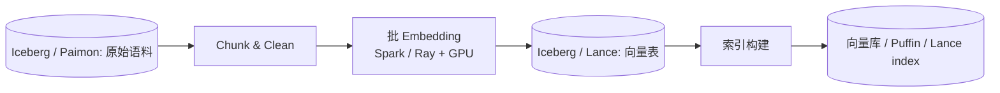
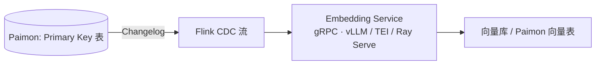

# Embedding 流水线

!!! tip "一句话定位"
    持续把湖上新增 / 变更的语料转成向量、写回湖表 + 向量库 / 索引的**工程链路**。**批与流并行、模型可升级、故障可恢复**是三件最难的事。

!!! warning "和 retrieval/embedding 的分工"
    - **本页**：**工程流水线**（批 / 流 / CDC / 失败恢复 / 模型升级迁移 / 产线表 schema）
    - **[retrieval/embedding](../retrieval/embedding.md)**：**embedding 模型选型**（BGE / jina / e5 / Voyage / Cohere 横比 / MTEB / Matryoshka / 维度选择）
    - 一句话：**"怎么持续产生向量"在本页 · "用哪个模型"看 retrieval 章**

!!! abstract "TL;DR"
    - **两种形态**：批式（Spark + GPU · 小时 / 日触发）· 流式（Flink CDC · 秒 / 分钟）
    - **四个必答问题**：增量 vs 全量 · 模型版本管理 · 失败恢复 · GPU 资源调度
    - **2026 模型矩阵**：BGE-M3 / jina-v3 / e5-mistral / Voyage-3 / Cohere-v4 / Nomic —— 详见 [retrieval/embedding](../retrieval/embedding.md)
    - **CDC 增量**：基于 Iceberg snapshot diff 或 Paimon changelog
    - **生产表 schema** 必带 `embedding_model_version` · `source_snapshot_id` · `embedded_at`
    - **模型升级三步走**：加列 · 双读对比 · 切换保留

## 1. 流水线两种形态

### 1.1 批式（最常见）



- 周期（小时 / 日）触发
- Spark + Ray on Spark / GPU Executor 批量 embedding
- 产出写回湖（带 `embedding_model_version`）

### 1.2 流式（CDC 场景）



- 逐条或小批（秒-分钟粒度）embedding
- 用现成 Embedding Service（避免在 Flink 内部加载大模型）
- **延迟要求**：近实时 RAG / 搜索场景必须流式

## 2. 四个必答工程问题

### 2.1 增量 vs 全量

每次 run 的输入是什么？

- **全量重跑**：简单但贵
- **Snapshot diff**（推荐 · Iceberg）：用 `snapshot-id` 对比 · 只跑新增 / 变更的行

```sql
-- Iceberg snapshot diff · 增量拿新增
SELECT * FROM docs FOR SYSTEM_VERSION AS OF 1234567890
EXCEPT
SELECT * FROM docs FOR SYSTEM_VERSION AS OF 1234000000;
```

- **Paimon changelog**：天然的 CDC 流 · Flink 消费
- **基于 watermark**：按 `updated_ts` 范围拉（需要源表有可信 timestamp）

### 2.2 模型版本管理 · 最容易翻车

换模型 = 必须重新 embedding 所有历史。**永远不要覆盖旧向量列**。三步走：

1. **加一列**：`embedding_v2` · 保留 `embedding_v1`
2. **批作业回填**历史行（可能数天 · 大表数周）
3. **双索引期 · 双读对比**：新旧模型查询结果差异（top-K 重合率 · Recall diff）
4. **切流量到新列**：旧列保留 N 天后删除

!!! danger "反模式"
    - 覆盖旧列 → 回滚不了
    - 没记 `embedding_model_version` → 不知道这行是哪个模型产生的
    - 不双读对比 → 换模型后业务指标掉了才发现

### 2.3 失败恢复

百万级 embedding 跑一半挂了怎么办？

- **Checkpoint 每批 offset**：Spark 用 `(partition, batch_id)` · Flink 用 source offset
- **写入幂等**：按 `(asset_id, embedding_model_version)` upsert · 重跑不重复
- **至少一次 + 去重** > **恰好一次**：大多数场景可接受
- **死信队列**：模型调用失败的行进 DLQ · 人工重试 / 降级

### 2.4 GPU 资源调度

Embedding 是 GPU-bound。两条路：

| 方式 | 优点 | 缺点 | 适合 |
|---|---|---|---|
| **Executor 内嵌 GPU**（Spark RAPIDS / Ray）| 调度简单 · 数据本地 | 资源绑死 · GPU 利用率可能低 | 百万级以下 |
| **远程 Embedding Service**（Ray Serve / TorchServe / Triton / HF TEI）| GPU 池化 · 利用率高 · 可批聚合 | 网络开销 · 调用链复杂 | 亿级以上 |

**2024+ 新选项**：
- **HuggingFace TEI**（Text Embeddings Inference）· 专门 embedding serving · 性能优秀
- **vLLM Embeddings** · 2024+ 支持 embedding 模型
- **Infinity** · OSS 高吞吐 embedding server

## 3. 2026 模型选型（简 · 详见 [retrieval/embedding](../retrieval/embedding.md)）

| 模型 | 维度 | 上下文 | 特点 |
|---|---|---|---|
| **BGE-M3**（2024）| 1024 | 8192 | 中文强 · 多粒度 · dense + sparse 兼容 |
| **jina-embeddings-v3**（2024）| 1024（可 Matryoshka 降维）| 8192 | 多语言 · 任务 adapter |
| **e5-mistral-7b-instruct** | 4096 | 32K | LLM-based · 指令微调 |
| **Voyage-3 / voyage-3-large**（2024-2025）| 1024 | 32K | 商业 API · MTEB 顶级 |
| **Cohere embed-v4**（2025）| 1024-4096 | 128K | 商业 API · 长 context |
| **Nomic embed v2** | 768 | 8192 | 开源 · Matryoshka |
| **OpenAI text-embed-3-large** | 3072（可降）| 8192 | 商业 API · 广泛 |

**选型一句话**：
- 中文 + 开源 → **BGE-M3**
- 多语言 + 开源 → **jina-v3** / **e5-mistral**
- 商业 API · 质量优先 → **Voyage-3 large** / **Cohere v4**
- 成本优先 · 中等质量 → **OpenAI text-embed-3-small**

**注意**：模型切换**必须走本页 §2.2 三步流程** · 直接替换会导致业务指标不稳。

## 4. CDC 增量 Embedding · 实操代码

### 4.1 Iceberg Snapshot Diff（批 · 推荐）

```python
from pyspark.sql import SparkSession
spark = SparkSession.builder.getOrCreate()

# 读取两个 snapshot 的 diff（新增的行）
prev_snapshot = 1234000000
curr_snapshot = 1234567890

new_rows = spark.sql(f"""
  SELECT * FROM catalog.db.docs FOR SYSTEM_VERSION AS OF {curr_snapshot}
  EXCEPT
  SELECT * FROM catalog.db.docs FOR SYSTEM_VERSION AS OF {prev_snapshot}
""")

# Ray Data 分布式 embedding
import ray
ds = ray.data.from_spark(new_rows)
ds = ds.map_batches(
    EmbeddingActor,  # 含 model.encode() 的 actor
    batch_size=64,
    num_gpus=0.5,
    concurrency=8,
)

# upsert 回向量表
ds.write_iceberg(
    "catalog.db.doc_embeddings",
    mode="merge",  # 按 (asset_id, embedding_model_version) upsert
)
```

### 4.2 Paimon Changelog（流 · 近实时）

```sql
-- Flink SQL · 读 Paimon changelog · 调用外部 embedding service · 写向量表
CREATE TABLE doc_src (
  id STRING,
  content STRING,
  PRIMARY KEY (id) NOT ENFORCED
) WITH ('connector' = 'paimon', ...);

CREATE TABLE doc_embeddings (
  id STRING,
  content STRING,
  embedding ARRAY<FLOAT>,
  embedding_model_version STRING,
  embedded_at TIMESTAMP,
  PRIMARY KEY (id, embedding_model_version) NOT ENFORCED
) WITH ('connector' = 'paimon', ...);

INSERT INTO doc_embeddings
SELECT
  id,
  content,
  embed_service_udf(content) AS embedding,
  'bge-m3-2026-04' AS embedding_model_version,
  CURRENT_TIMESTAMP AS embedded_at
FROM doc_src;
```

`embed_service_udf` 是自定义 UDF · 内部走 gRPC 到 Embedding Service。

### 4.3 Ray Data + Lance（训练数据场景 · 批）

```python
import ray
import lance

ds = ray.data.read_lance("s3://lake/docs.lance")
ds = ds.map_batches(
    EmbeddingActor,
    batch_size=128,
    num_gpus=1,
    concurrency=16,
)
ds.write_lance("s3://lake/doc_embeddings.lance")  # 写回 Lance 表 · 带索引
```

Lance 的 per-row random access 让后续 ANN 查询 / shuffle 都友好（详见 [Lance Format](../foundations/lance-format.md)）。

## 5. 生产级表 schema

```sql
CREATE TABLE doc_embeddings (
  asset_id           BIGINT,
  chunk_id           INT,
  content            STRING,
  embedding_bge      VECTOR<FLOAT, 1024>,
  embedding_voyage   VECTOR<FLOAT, 1024>,
  embedding_version_bge     STRING,   -- 'bge-m3-2026-04'
  embedding_version_voyage  STRING,   -- 'voyage-3-2025-12'
  source_snapshot_id BIGINT,           -- 来自原始 Iceberg 快照
  embedded_at        TIMESTAMP,
  lang               STRING,
  tenant_id          STRING,
  chunk_offset       INT,               -- 原文中的位置（可回查原始）
  chunk_len          INT
) USING iceberg
PARTITIONED BY (tenant_id, bucket(32, asset_id));
```

字段设计到位 · 后面的回填、迁移、监控都从这张表读出答案：
- `source_snapshot_id` → 回查**哪个 snapshot 生成的** · 回滚依据
- `embedding_version_*` → 多模型共存 · 切换无 downtime
- `tenant_id` → 多租户隔离 + 分区
- `chunk_offset / chunk_len` → 精确定位原文（RAG citation 需要）

## 6. 在线 Embedding Serving · 特殊性

上面讲**写入**· 还有**读取**（RAG / 搜索 query 来时 embed query）：

### 6.1 Batching Window

Query embedding 需要低延迟（< 50ms）· 但批聚合能提吞吐 · 冲突。
- **动态 batching**：window 10-30ms · 凑够 batch 或超时
- HF TEI / vLLM / Ray Serve 都内置

### 6.2 和 ANN 索引同步

- Embedding 写入和 ANN 索引构建**不是同一个事务**
- **延迟一致性**：新写入的 embedding 要 N 分钟才可检索
- **LanceDB · Milvus**：支持流式索引追加 · 延迟 < 1 分钟
- **FAISS + 定期 rebuild**：索引延迟可能几小时

### 6.3 "三向耦合" · Embedding × Index × 模型

- 换 embedding 模型 → **所有索引重建**
- 模型维度改变 → 下游所有表结构改
- 版本治理稍有差错就级联事故

**最佳实践**：
- 向量表 schema 支持**多 embedding 列并存**（见 §5）· 灰度切换不停服
- 索引库按 `(model_version, tenant_id)` 分索引 · 独立管理

## 7. 监控指标

| 指标 | 意义 | 告警阈值 `[示意性]` |
|---|---|---|
| **新鲜度** | `max(source_snapshot_id)` vs 原始表 `current-snapshot-id` 差距 | 差距 > 1 小时 |
| **吞吐** | docs / min | 低于基线 50% 告警 |
| **失败率** | 模型调用失败 / 超时 | > 1% |
| **成本** | GPU·h / 1M docs | 跳升 > 20% |
| **分布健康度** | L2 norm · 均值 · 方差 | 异常漂移告警 |
| **索引延迟** | 写入到可检索时间 | 根据 SLO |
| **去重率** | 新 embedding 中的重复比例 | 过高可能源表有问题 |

## 8. 陷阱 · 反模式

- **覆盖旧 embedding 列**：回滚不了 · 模型升级事故
- **不记 `embedding_model_version`**：多模型共存混乱
- **没记 `source_snapshot_id`**：回溯 origin 困难
- **Flink 内部加载大模型**：OOM · cold start 慢 · 用外部 Embedding Service
- **批作业不幂等**：重跑重复写
- **Embedding 写入但索引没更新**：检索查不到新数据
- **数字吞吐套用他人基线**：硬件 / batch / sequence 差异大 · 自测
- **Chunking 策略藏在代码里**：调整 chunk 必须重 embed 所有历史 · chunking 应是**一等参数**记录
- **Tenant 隔离缺**：多租户向量表混跑 · 权限越界 / 查询互扰
- **在线 query embedding 不 batching**：吞吐低 · 成本高
- **模型切换不双读对比**：业务掉点才发现

## 9. 和其他组件的关系

- **上游**：[Lakehouse Table](../lakehouse/lake-table.md)（原始语料 · Iceberg / Paimon）
- **模型选型**：[retrieval/embedding](../retrieval/embedding.md) —— 用哪个模型
- **模型版本治理**：[Model Registry](model-registry.md) §embedding model artifact
- **下游消费**：[RAG](../ai-workloads/rag.md) · [多模检索流水线](../scenarios/multimodal-search-pipeline.md)
- **姊妹**：[Feature Store](feature-store.md)（思想相近：持续物化 · 训推一致）

## 10. 相关

- [Embedding 模型选型](../retrieval/embedding.md) · [多模 Embedding](../retrieval/multimodal-embedding.md)
- [Lance Format](../foundations/lance-format.md)
- [Feature Store](feature-store.md)
- [Model Registry](model-registry.md)
- 场景：[多模检索流水线](../scenarios/multimodal-search-pipeline.md) · [RAG on Lake](../scenarios/rag-on-lake.md)

## 11. 延伸阅读

- Ray Data docs: <https://docs.ray.io/en/latest/data/>
- HuggingFace TEI: <https://github.com/huggingface/text-embeddings-inference>
- vLLM Embeddings: vLLM docs（2024+）
- Infinity: <https://github.com/michaelfeil/infinity>
- Paimon CDC changelog: <https://paimon.apache.org/>
- *Embedding Pipelines at Scale* —— LanceDB / Databricks 系列博客
