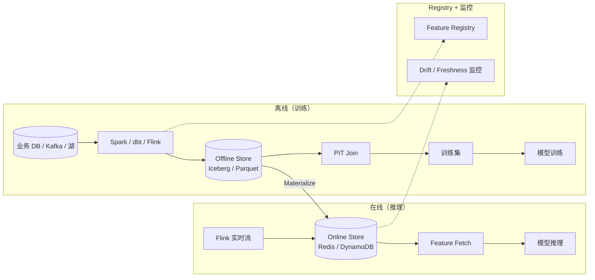

# Feature Store · 特征存储

!!! tip "一句话定位"
    **ML 特征的一等公民**。解决三大痛点：**训推一致、Point-in-Time 正确、特征复用**。它不是 Redis 的别名——是一个**定义 + 离线存储 + 在线存储 + 注册目录 + 监控**一体化平台。**推荐 / 风控 / 个性化场景的 MLOps 必备**。

!!! note "SSOT · 主定义页"
    本页是 **PIT Join · Train-Serve Skew** 等概念的手册内主定义页。其他场景 / 概念页在引用时会链回这里。

!!! abstract "TL;DR"
    - **核心能力**：统一定义 + PIT Join + 双存储（离线 Parquet/Iceberg · 在线 Redis/KV）
    - **解决的三大痛**：训推 skew / PIT 泄露 / 特征复用
    - **组件选型**：**Feast**（开源首选）· **Tecton**（商业 SaaS）· **Hopsworks**（MLOps 一体）· **Databricks FS** / **Vertex** / **SageMaker**（各云厂商）· **自建**（小团队）
    - **"自建 Feast 级"几乎都低估**：PIT Join 是事故温床
    - **典型 SLO**：离线批 PIT Join 分钟-小时级；在线 KV < 10ms
    - **对标对比**详见 [Feature Store 横比](../compare/feature-store-comparison.md)

## 1. 业务痛点 · 没有 Feature Store 的典型事故

### 痛点 1 · Train-Serve Skew（训推漂移）

- **场景**：离线训练用 Spark SQL 计算 `user_last_7d_gmv`
- **在线推理**时，工程师用 Java 重写一遍这段逻辑
- 两套代码**必然**漂移（timezone、null 处理、范围边界）
- **典型事故**：离线 AUC 0.92 → 线上 AUC 0.74 → 业务问 "为什么模型不行"

没人发现是特征不一致，模型被误认为"没调好"。

### 痛点 2 · Point-in-Time 泄露

**经典错误**：训练 2024-06 订单时，拼了 2024-06 当前的 user_total_gmv。但这个值**包含了 6 月之后的订单**——**未来信息泄露**到训练。

```
订单日期 = 2024-06-15
user_total_gmv @ 2024-06-15 = $5000   ← 正确的特征值
user_total_gmv @ 2024-12-01 = $15000  ← 错误！泄露了未来
```

**症状**：离线 AUC 0.95，线上崩盘。

### 痛点 3 · 特征复用困难

- 推荐组算了一套 `user_embedding`
- 风控组不知道 → 自己再算一套
- 广告组再算一套
- 都算了却没人对账，三套数值不一致
- **浪费 × 混乱 × 无法审计**

### Feature Store 的三个核心能力

| 能力 | 解决的痛 |
|---|---|
| **统一定义**（一处定义、离线在线同算）| Train-Serve skew |
| **Point-in-Time Join** | PIT 泄露 |
| **Feature Registry**（目录 + 血缘）| 复用困难 |

## 2. 原理深度 · 核心概念

### 关键抽象

| 概念 | 含义 |
|---|---|
| **Entity** | 特征关联的实体（user, item, order）|
| **Feature** | 一个原子属性（avg_7d_gmv, is_vip） |
| **Feature View** | 一组相关 Feature 的集合 |
| **Feature Service** | 为一个模型聚合多个 Feature View |
| **Online Store** | 低延迟 KV（Redis / DynamoDB） |
| **Offline Store** | 历史全量（Iceberg / Parquet / BigQuery） |
| **Registry** | 元数据目录、血缘、版本 |
| **Materialization** | 把离线特征物化到在线 |

### 架构一览



### Point-in-Time Join 的机制

目标：对每个训练样本 `(user_id, event_ts)`，取 `event_ts` 那一刻的特征值。

```sql
-- PIT Join（最关键的技术，最容易写错）
SELECT
  e.user_id,
  e.event_ts,
  e.label,
  f.avg_7d_gmv
FROM events e
ASOF LEFT JOIN feature_view f
  ON f.user_id = e.user_id
  AND f.feature_ts <= e.event_ts    -- 不能取未来
  AND f.feature_ts > e.event_ts - INTERVAL '7 days'   -- TTL
```

**细节难点**：
- **时间粒度**：特征更新 1 分钟一次 vs 1 天一次
- **缺失值**：某 user 在 ts 之前没有 feature_ts → 怎么处理
- **效率**：100 亿事件 × 100 个特征的 PIT Join 是性能噩梦
- **幂等性**：同一 sample 多次计算结果必须一致

## 3. 关键机制

### 机制 1 · Materialization（离线→在线同步）

```
Offline Store (Iceberg)
      ↓ (定时批 / 增量)
Materialization Job
      ↓
Online Store (Redis)
      ↓
Online Serving
```

两种模式：
- **Batch Materialization**（定时）：每天 / 每小时 dump 到 Redis
- **Streaming Materialization**（实时）：Flink 持续写 Redis

### 机制 2 · Online Serving SLA

推理侧：

```python
features = fs.get_online_features(
    features=["user_fv:avg_7d_gmv", "user_fv:vip_level"],
    entity_rows=[{"user_id": 12345}]
).to_dict()
```

延迟预算：
- **单 entity 单次获取**：< 10ms（Redis / Aerospike）
- **批量 N 个 entity 获取**：< 50ms（100 个）
- **并发**：几万 QPS 起步

### 机制 3 · 流式特征（On-Demand Features）

一些特征计算需要**请求时实时参与**：

```python
# 用户 session 内的 clicked_items（来自 Kafka 近 10min）
session_clicks = fs.get_on_demand_features(
    request={"user_id": 123, "timestamp": now},
    feature_view="session_clicks_10min"
)
```

Flink 维护 state、FS 暴露 online lookup。

### 机制 4 · Feature Registry

不只是个目录——包含：
- 定义（SQL / Python）
- Owner（谁负责）
- SLA（更新频率）
- 血缘（从哪些源头算出来）
- Drift 监控（分布变化告警）
- 废弃流程（谁在用？能不能下线）

### 机制 5 · Drift 监控

离线特征 vs 在线特征的**分布对齐**：

| 指标 | 意义 |
|---|---|
| **PSI**（Population Stability Index）| < 0.1 稳定 · > 0.25 漂移 |
| **KS 值** | 两分布差异 |
| **Missing rate** | 缺失率突变 |
| **Feature Value mean / std** | 均值方差变化 |

漂移 → 告警 → 可能是**上游数据源变了** / **抽样偏差** / **ETL 故障**。

## 4. 工程细节

### 核心产品家族

详见 [Feature Store 横比](../compare/feature-store-comparison.md)。实务选择：

| 需求 | 首选 |
|---|---|
| 开源 · 自运营 · 湖已就位 | **Feast** + Iceberg + Redis |
| 商业 SaaS · 要 SLA | **Tecton** |
| 合规 / 含完整 MLOps | **Hopsworks** |
| 全栈 Databricks / GCP / AWS | 对应云厂商托管 FS |
| 小团队 · < 100 特征 | 自建 Iceberg + Redis + dbt |

### Feast 典型定义

```python
# Feast 0.40+ API · value_type 已 deprecated · 改用 join_keys
from feast import Entity, FeatureView, Field, FileSource
from feast.types import Float32, Int64
from datetime import timedelta

user = Entity(name="user", join_keys=["user_id"])

user_source = FileSource(
    path="s3://lake/features/user_stats.parquet",
    timestamp_field="event_ts",
)

user_stats = FeatureView(
    name="user_stats",
    entities=[user],
    ttl=timedelta(days=7),
    schema=[
        Field(name="avg_7d_gmv", dtype=Float32),
        Field(name="purchase_7d", dtype=Int64),
        Field(name="vip_level", dtype=Int64),
    ],
    source=user_source,
    online=True,
)
```

### 离线获取训练数据（PIT 自动处理）

```python
entity_df = spark.sql("SELECT user_id, event_ts, label FROM train_events")

training_df = store.get_historical_features(
    entity_df=entity_df,
    features=[
        "user_stats:avg_7d_gmv",
        "user_stats:purchase_7d",
        "user_stats:vip_level",
    ],
).to_df()
```

### 在线获取（推理）

```python
features = store.get_online_features(
    features=[
        "user_stats:avg_7d_gmv",
        "user_stats:vip_level",
    ],
    entity_rows=[{"user_id": 12345}]
).to_dict()

score = model.predict(features)
```

### Materialization（离线 → 在线）

```bash
feast materialize-incremental $(date -u +"%Y-%m-%dT%H:%M:%S")
```

典型调度：每小时跑一次，增量把过去一小时的特征值同步到 Redis。

## 5. 性能数字

以下数字为经验基线 `[来源未验证 · 示意性 · 依硬件 / 数据 / 调优差异大 · 不要直接套用]`。

### Feast + Redis（典型规模）

| 指标 | 基线 |
|---|---|
| Online get_online_features（单 entity）| 2-10ms |
| Batch get_online_features（100 entity）| 20-50ms |
| 单 Feature View Registry 规模 | 数百 feature OK |
| PIT Join 性能（Spark · 硬件 / broadcast / 分区未声明）| 100M 样本 × 20 FV ≈ 30 分钟 |
| Materialization 吞吐 | 10k-100k rows/s |

### Tecton 生产案例 `[来源未验证 · 示意性 · 自测为准]`

- 某推荐系统：3000+ features · 在线 p99 < 20ms · 50k QPS 级
- 某风控系统：实时特征延迟 < 2 分钟（Kafka → online store）

## 6. 代码示例

### Feast 项目完整结构

```
my_project/
├── feature_repo/
│   ├── feature_store.yaml   # 配置（online/offline store）
│   ├── entities.py
│   ├── data_sources.py
│   ├── feature_views.py
│   └── feature_services.py
└── airflow/
    ├── materialize_dag.py
    └── drift_check_dag.py
```

### feature_store.yaml

```yaml
project: my_project
provider: aws
registry:
  registry_type: sql
  path: postgresql://...@feast-registry/db
online_store:
  type: redis
  connection_string: redis.internal:6379
offline_store:
  type: file   # 或 spark, bigquery, trino
  path: s3://lake/features/
entity_key_serialization_version: 2
```

### 自建 Iceberg + Redis 最小闭环

```python
# 1. dbt 定义特征（Iceberg 宽表）
# models/features/user_stats.sql
SELECT
  user_id,
  event_ts,
  AVG(amount) OVER (PARTITION BY user_id ORDER BY event_ts
                    RANGE BETWEEN INTERVAL '7 days' PRECEDING AND CURRENT ROW)
    AS avg_7d_gmv
FROM orders;

# 2. Spark 每小时物化到 Redis · 注意：redis client 必须在 executor 内初始化
#    直接在 lambda 里 capture driver 端的 client 会 pickle 失败 / 反模式
def write_partition(rows):
    import redis
    client = redis.Redis(host="redis.internal", port=6379)
    pipe = client.pipeline()
    for r in rows:
        pipe.set(f"u:{r.user_id}:avg_7d_gmv", r.avg_7d_gmv)
    pipe.execute()

spark.read.table("iceberg.features.user_stats").foreachPartition(write_partition)

# 3. 推理侧读 Redis
value = redis_client.get(f"u:{user_id}:avg_7d_gmv")
```

## 7. 陷阱与反模式

- **自建 FS 低估 PIT 复杂度**：PIT Join 几乎是 Feature Store 事故 #1 原因
- **训推用不同代码**：再强调一次——一定用同一套定义
- **离线在线不对账**：至少每天跑一次抽样对比
- **Feature TTL 不设**：Redis 内存爆 / 过时特征喂模型
- **Drift 不监控**：模型悄悄劣化、业务来投诉才发现
- **Schema 演化不管**：加列删列影响在线，要有流程
- **Feature 数量无限涨**：500+ 特征谁在用、能不能下线 → 强治理
- **Online Store 无副本**：挂了 → 推理全瘫 → 主从或多活
- **流式特征没时序保证**：Out-of-order events 错误聚合
- **训练 snapshot 不锁**：明天重跑训练数据变了 → 模型不可复现

## 8. 横向对比 · 延伸阅读

- **[Feature Store 横向对比](../compare/feature-store-comparison.md)** —— Feast/Tecton/Hopsworks/云厂商/自建
- [Feature Serving 场景](../scenarios/feature-serving.md) —— 在线侧细节
- [离线训练数据流水线](../scenarios/offline-training-pipeline.md) —— PIT 深入
- [推荐系统](../scenarios/recommender-systems.md) · [欺诈检测](../scenarios/fraud-detection.md)

### 权威阅读

- **[Uber Michelangelo（2017）](https://eng.uber.com/michelangelo-machine-learning-platform/)** —— FS 工业首例
- **[Feast 官方文档](https://docs.feast.dev/)** · **[Tecton 白皮书](https://www.tecton.ai/resources/)**
- **[Hopsworks Feature Store 论文](https://www.logicalclocks.com/blog/feature-store-for-ml)**
- *Designing Machine Learning Systems* (Chip Huyen) —— 第 6 章详细讲 FS
- **[featurestore.org](https://www.featurestore.org/)** —— 社区汇总

## 相关

- [RAG](../ai-workloads/rag.md) —— 姊妹基础设施（一个是"给 LLM 上下文"，一个是"给 ML 特征"）
- [Embedding 流水线](embedding-pipelines.md)
- [Feature Serving](../scenarios/feature-serving.md) · [离线训练数据流水线](../scenarios/offline-training-pipeline.md)
- [推荐系统](../scenarios/recommender-systems.md) · [欺诈检测](../scenarios/fraud-detection.md)
