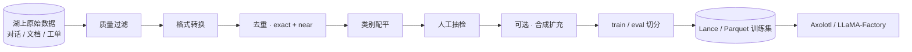

# LLM Fine-tuning · 端到端

!!! tip "一句话定位"
    **把开源 LLM 训成"你的模型"**的完整链路 —— **数据准备 · 方法选择 · 工具栈 · 评估 · 部署**一体。成败 **数据占 60 分 · 方法占 30 分 · 算力占 10 分**（数字凭经验 · 不要精确引用）。

!!! warning "和 RAG / Prompt 的分工"
    - **本页**：训练一个**新模型权重**（全量 / LoRA adapter / merged）· 需要训练算力 + 评估集 + 部署 artifact
    - **[RAG](../ai-workloads/rag.md)**：不训模型 · 检索外部知识注入上下文 · 快速迭代
    - **[Prompt 管理](../ai-workloads/prompt-management.md)**：不训模型 · 纯 prompt engineering · 零算力
    - **决策准则**：先 Prompt → 不够上 RAG → 再不够才 Fine-tune（三者可并存）

!!! abstract "TL;DR"
    - **数据规模感**：SFT **1k-100k**（质量为王）· DPO **10k-100k pair** · Continued Pretraining **1B+ token**
    - **方法三层**：全量 FT（>70B 模型一般不做 · 太贵）→ **PEFT / LoRA / QLoRA**（主流）→ **Prompt Tuning**（小参数）
    - **对齐方法**：SFT + DPO 组合是 2024-2026 主流 · ORPO / KTO / SimPO 是 2024-2025 新算法替代 RLHF-PPO
    - **工具**：Axolotl / LLaMA-Factory / unsloth / Torchtune / TRL / MosaicML Composer —— 2026 生态成熟
    - **评估**：必有独立评估集（time / source 切分 · near-dedup 防泄露）· 和 [rag-evaluation](../ai-workloads/rag-evaluation.md) LLM 评估协同
    - **部署**：LoRA adapter 作为一等 artifact 存 Registry · 参见 [Model Registry](model-registry.md) §LLM-specific artifacts

## 1. 决策 · 微调 vs Prompt vs RAG

先回答"**我真的需要 fine-tune 吗**"：

| 需求 | 首选 | 不选 Fine-tune 的理由 |
|---|---|---|
| 改输出**格式** / 加约束 | Prompt + Structured Output | Prompt 就能做 · 别动模型 |
| 知识**时效性** / 私域知识 | RAG | RAG 更新快 · fine-tune 知识**冻结**训练期 |
| 特定**语气 / 风格 / 品牌声音** | Fine-tune（SFT 小规模） | Prompt 难稳定约束风格 |
| **领域特定能力**（医药法律代码） | Continued Pretraining + SFT | Prompt/RAG 做不了能力改造 |
| **对齐人类偏好**（更有帮助 / 更安全） | DPO / ORPO | 需要偏好对信号 |
| **成本 / 延迟压缩**（小模型复现大模型能力） | Distillation + Fine-tune | 直接用大模型贵 |

**决策铁律**：
- **先 Prompt**（零成本 · 迭代快）→ 不够上 **RAG**（动态知识）→ 再不够才 **Fine-tune**（凝固到权重）
- **三者可并存**：Fine-tune 的小模型 + RAG 外挂知识 + Prompt 约束输出

## 2. 方法矩阵 · 三层 + 对齐

### 层 1 · 全量 Fine-tune（Full-parameter）

- 所有参数更新 · 需训练集显存容纳整个模型
- **70B 模型需 8×H100** 级硬件（bf16）
- 2024+ 中小团队一般**不做**全量 · 性价比差

### 层 2 · 参数高效微调 PEFT（主流）

**只更新少量参数** · 基座权重冻结。

| 方法 | 原理 | 额外参数占比 | 适合 |
|---|---|---|---|
| **LoRA** | 低秩分解 ΔW = A·B · rank 8-64 | 0.1-1% | 通用主力 · 70B 模型也行 |
| **QLoRA** | LoRA + 4-bit NF4 量化基座 | 同 LoRA | 显存紧（单卡跑 70B） |
| **DoRA** | 权重分解 LoRA + magnitude 分离 | 同 LoRA | 精度稍优于 LoRA |
| **Prefix / Prompt Tuning** | 加 soft prompt token · 不改权重 | < 0.1% | 小任务 · 极省参数 |
| **Adapter**（Houlsby） | 每层插小 MLP | ~1% | 早期经典 · 现多被 LoRA 取代 |

**2024-2026 默认**：**LoRA** · 显存紧时 **QLoRA** · 追求精度 **DoRA**。

### 层 3 · 指令对齐 / 偏好对齐

SFT 之后通常加一层**对齐**，让模型更符合人类偏好：

| 方法 | 年份 | 需要数据 | 算力 | 备注 |
|---|---|---|---|---|
| **SFT** | 标配 | `(instruction, output)` | 中 | 第一阶段 |
| **RLHF / PPO** | 2022（InstructGPT） | 偏好对 + reward model | **高** · 需要 RM 训练 | 经典但复杂 |
| **DPO**（Direct Preference Optimization）| 2023 | 偏好对（无需 RM） | 低 | **2024+ 事实替代 PPO** |
| **IPO** | 2023 | 偏好对 | 低 | DPO 变种 · 更稳 |
| **KTO**（Kahneman-Tversky）| 2024 | 单点打分（非 pair） | 低 | 数据收集更简单 |
| **ORPO** | 2024 | 偏好对 | 低 | **合并 SFT+DPO 一阶段**（省一轮训练） |
| **SimPO** | 2024 | 偏好对 | 低 | 更简化 · 无 reference model |

**2025-2026 主流组合**：
- **最简**：SFT + DPO 两阶段
- **更简**：ORPO 一阶段（合 SFT + DPO）
- **数据受限**：KTO（单点打分比 pair 收集容易）

## 3. 工具生态 · 2026 选型

| 工具 | 定位 | 优势 | 适合 |
|---|---|---|---|
| **HuggingFace TRL** | 官方对齐训练库 · SFTTrainer / DPOTrainer / PPOTrainer / ORPOTrainer | 集成 PEFT / accelerate · 社区最广 | 想掌握原生控制 |
| **Axolotl** | YAML 配置式微调框架 | 社区活跃 · 支持大量模型 · DeepSpeed / FSDP 集成好 | 中大型训练 · 可复现 |
| **LLaMA-Factory** | Web UI + CLI 一体 | 中文友好 · 几乎所有开源 LLM 都支持 · 100+ 模型 | 国内团队 · 快速实验 |
| **unsloth** | 速度特化 | **声称 2× 快 + 60% 显存节省**（依场景差异大 `[来源未验证 · 官方宣传]`）· 单 GPU 友好 | 小团队 · 单卡 QLoRA |
| **Torchtune**（PyTorch 官方 · 2024）| 纯 PyTorch 原生 | 无依赖 · recipe 式 · 官方背书 | 想深度定制 |
| **MosaicML Composer**（Databricks）| 分布式大规模 | 企业级 · DBRX/Mosaic LLM 背后 | 70B+ 大规模 |
| **DeepSpeed-Chat** | RLHF 全链路 | 三阶段 RLHF 完整（SFT + RM + PPO）| 需要完整 RLHF 的团队 |
| **TRT-LLM fine-tuning**（受限）| NVIDIA | 和推理 TRT-LLM 衔接好 | NV 深度客户 |

**默认推荐**：
- 中小团队 · LoRA 实验：**LLaMA-Factory** 或 **Axolotl**
- 单卡 QLoRA：**unsloth**
- 70B+ 规模：**Axolotl + DeepSpeed / FSDP2**
- 想掌握原生：**HF TRL + PEFT** 手写

### Axolotl 典型配置

```yaml
# config.yaml
base_model: meta-llama/Meta-Llama-3.1-8B
model_type: LlamaForCausalLM

load_in_4bit: true
adapter: qlora
lora_r: 64
lora_alpha: 32
lora_dropout: 0.05
lora_target_modules:
  - q_proj
  - v_proj
  - k_proj
  - o_proj

datasets:
  - path: s3://lake/finetune/sft_v1.jsonl
    type: sharegpt

sequence_len: 4096
sample_packing: true
gradient_checkpointing: true

optimizer: paged_adamw_32bit
learning_rate: 2e-4
num_epochs: 3
warmup_steps: 100

deepspeed: deepspeed_configs/zero3_bf16.json
```

启动：`accelerate launch -m axolotl.cli.train config.yaml`

## 4. 显存规划 · 实操

**什么能训得起** · 快速对照表（数字经验 · 依 batch / sequence length 差异大 `[来源未验证 · 示意性]`）：

| 模型 | 全量 FT | LoRA bf16 | QLoRA 4bit |
|---|---|---|---|
| 7B | 80GB × 4 (FSDP) | 24GB 单卡 | 12GB 单卡 |
| 13B | 80GB × 8 | 40GB 单卡 | 16GB 单卡 |
| 70B | 80GB × 16+ | 80GB × 2 (FSDP) | 40GB 单卡 |

**省显存三板斧**：
1. **Gradient Checkpointing**：显存 -40% · 时间 +30%
2. **FlashAttention 2/3**：显存 -30% · 时间 -20%
3. **Mixed precision（bf16）**：显存 -50% vs fp32

**长 context 训练**：Sequence Parallel / Context Parallel（详见 [training-orchestration.md](training-orchestration.md)）。

## 5. 数据流水线 · 从湖到训练集



### 5.1 数据源

湖上可作为微调数据的典型表：
- **用户对话日志**（客服 · assistant）→ SFT 首选
- **人工客服高质量回答** → 天然监督信号
- **FAQ / KB** → 种子 QA 对
- **工单 / 投诉** → 领域特定问题
- **历史模型输出 + 人工修正** → DPO 偏好数据
- **合成数据**（见 §5.5）

[Schema Evolution](../lakehouse/schema-evolution.md) + [Time Travel](../lakehouse/time-travel.md) 让冻结某时刻数据 = 训练集的天然版本契约。

### 5.2 质量过滤

- **长度过滤**：过短 / 过长的 instruction / output
- **重复模式**：复读机式 / 重复 token 占比高
- **低质标志**（客服套话 / 道歉模板）→ 二分类器或规则
- **语言纯度**：按场景决定
- **注入 / 越狱样本**：坚决剔除（安全红线）

### 5.3 去重

两级：

- **Exact dedup**：字符串完全相同
- **Near dedup**：MinHash / SimHash / embedding 相似度（典型 cosine > 0.9 视为同类）

**语义相近条目保留多条会过拟合到某问法**。

### 5.4 格式化

#### SFT 标准

```json
{
  "instruction": "如何取消订单？",
  "input": "",
  "output": "您可以通过…"
}
```

或多轮（ShareGPT / ChatML 格式）：

```json
{
  "messages": [
    {"role": "system", "content": "你是客服助手"},
    {"role": "user", "content": "如何取消订单？"},
    {"role": "assistant", "content": "..."}
  ]
}
```

#### DPO / ORPO 偏好对

```json
{
  "prompt": "如何取消订单？",
  "chosen": "清晰步骤化回答",
  "rejected": "含糊不清 / 错误的回答"
}
```

#### KTO 单点打分

```json
{"prompt": "...", "completion": "...", "label": true}
{"prompt": "...", "completion": "...", "label": false}
```

**chosen / rejected 的对齐信号来源**：
- 人工 A/B 标注（最佳但贵）
- 模型多次采样 + 人工选优
- 规则评分（正确性 / 完整性 / 拒答判断）
- 合成（GPT-4 判给小模型的两次采样）

### 5.5 合成数据 · 2024-2026 方法

| 方法 | 原理 | 2024-2026 代表 |
|---|---|---|
| **Self-Instruct** | 少量种子扩增 | Alpaca |
| **Evol-Instruct** | 让模型把简单 instruction 变难 | WizardLM |
| **Persona-based** | 不同人设生成多样化问题 | Personalhub |
| **Magpie**（2024） | LLM 自对话生成 · 无种子 | Magpie-Pro |
| **DataDreamer**（2024） | 管线式合成 + provenance 追踪 | 学术复现友好 |
| **LLM Judge 判优** | 多次采样 · LLM 打分 · 留高分 | 通用扩增 |

**注意**：合成数据**必须人工抽检** · 不然模型学到"GPT-4 味儿" / 同质化严重。

### 5.6 配平

不同类别样本数**不能差太多**（同类 > 50% 模型偏向）· 欠采样大类 / 过采样小类 / 类别 loss 加权。

### 5.7 独立评估集 · 防泄露

**最大坑**：评估集和训练集泄漏。必须：
- **时间切分**（训练 2025 · 评估 2026）
- **来源切分**（某类对话只进评估）
- **Near-dedup 硬 check**（评估集每条不在训练集语义相似范围内）

### 5.8 输出到湖

```sql
CREATE TABLE finetune_v1 (
  id               STRING,
  dataset_version  STRING,     -- 'sft-customer-v1-2026-04'
  task_type        STRING,     -- 'sft' / 'dpo' / 'kto'
  messages         STRING,     -- JSON
  chosen           STRING,     -- DPO/ORPO
  rejected         STRING,
  source           STRING,     -- 'human' / 'synthetic' / 'logs'
  quality_score    FLOAT,
  lang             STRING,
  tags             ARRAY<STRING>
) USING lance                    -- 随机访问友好
PARTITIONED BY (dataset_version);
```

Lance 的 per-row random access 让 shuffle 不是性能杀手（详见 [training-orchestration.md](training-orchestration.md) §数据读取）。

## 6. 评估 · 和 rag-evaluation 协同

微调后评估 ≠ 训练 loss 低就够 · 需多维度：

| 维度 | 指标 | 工具 |
|---|---|---|
| **指令遵循** | MT-Bench / AlpacaEval / IFEval | [rag-evaluation](../ai-workloads/rag-evaluation.md) |
| **领域能力** | 自建 benchmark（如客服业务 golden set） | 自建 |
| **安全 / 拒答** | TruthfulQA / ToxiGen / BBQ | 通用 |
| **幻觉率** | HaluEval 自建 | 通用 |
| **业务 KPI** | 客服解决率 / CTR 等 | 业务系统 |
| **退化检查** | 原 base model 能力是否保留（catastrophic forgetting）| 对比 base |

**必做**：**LLM-as-Judge**（GPT-4 / Claude 4.X 打分）+ **人工抽检**双管齐下。

详细评估方法见 [ai-workloads/rag-evaluation](../ai-workloads/rag-evaluation.md)。

## 7. 部署 · 和 Model Registry 协同

### 7.1 LoRA adapter 作一等 artifact

```python
# 训练完注册 adapter
import mlflow
mlflow.log_artifact("lora_adapter/", "adapter")
mlflow.log_param("base_model", "meta-llama/Meta-Llama-3.1-8B")
mlflow.log_param("adapter_type", "lora")
mlflow.log_param("lora_rank", 64)
mlflow.set_registered_model_alias(
    name="customer_support_lora", alias="champion", version=1
)
```

详细 artifact schema（Model Card · BOM · License）见 [Model Registry](model-registry.md) §LLM-specific artifacts。

### 7.2 Merged vs Adapter 部署

- **Adapter 部署**（vLLM / PEFT）：base + adapter 分开加载 · 灵活切换多个 adapter · 省存储
- **Merged 部署**：合并为完整权重 · 推理 0 开销 · 但失去多 adapter 灵活性
- **Multi-LoRA serving**（vLLM 2024+ 原生支持）：单 GPU 加载多个 adapter 按请求路由

## 8. GDPR / 隐私 / 合规

用户对话进微调集 = **合规雷区**：
- **PII 检测 + 脱敏**（姓名 / 手机 / 身份证 / 地址）
- **用户授权**（使用条款明示）
- **被遗忘权**：用户删除请求时 · 训练集要删 · 已训模型涉及该用户 → **unlearning** 研究课题
- **Model Card** 记录：数据来源 · 预期用途 · 已知偏见 · 许可（base model 许可如 Llama 3 Community License · Gemma 条款）
- **EU AI Act** 高风险系统：技术文档必须包含训练数据描述

详细合规见 [AI 治理](../ops/compliance.md) · [Model Registry](model-registry.md) §合规。

## 9. 陷阱 · 反模式

- **盲目 fine-tune 先上**：Prompt / RAG 都没试过就训 · 常常用不到
- **只有正面样本**：模型不知道什么不该答
- **评估集泄漏**：离线指标乐观 · 线上崩
- **合成数据没过人工**：学到垃圾 / 同质化
- **不记 `dataset_version`**：一年后不知道模型学了啥
- **分词器不一致**：adapter 词表和 base 冲突
- **Catastrophic forgetting**：base 能力退化（小数据 SFT 最容易）
- **DPO pair 噪声大**：chosen/rejected 信号不清晰 → 模型混乱
- **Learning rate 过大**（LoRA 要小 · 1e-4 到 3e-4 典型）
- **SFT 阶段就做严格对齐**：先广后精 · 强对齐放 DPO 阶段
- **把 merged model 当普通模型忘 base license**：Llama 社区许可商用有 7 亿 MAU 限制
- **LoRA adapter 不和 base 版本绑定**：base 升级 adapter 失效

## 10. 规模参考 `[来源未验证 · 经验值]`

- SFT：1k 高质量可开始 · 5k-50k 舒适区
- DPO：10k pair 起
- Continued Pretraining：1B+ token 才有明显效果
- QLoRA 训练：单卡 7B 模型 · 5 epoch · 10k 样本 · 约 2-4 小时（A100 级 `[来源未验证 · 示意性]`）

**高质量小数据 > 低质量大数据**。

## 11. 相关

- [Model Registry](model-registry.md) §LoRA adapter 作 artifact
- [Training Orchestration](training-orchestration.md) §Context Parallel / FSDP2
- [GPU 调度](gpu-scheduling.md) §fine-tuning 负载
- [RAG](../ai-workloads/rag.md) · [Prompt 管理](../ai-workloads/prompt-management.md) —— 决策层姊妹
- [RAG/LLM/Agent 评估](../ai-workloads/rag-evaluation.md) —— 评估 canonical
- [离线训练数据流水线](../scenarios/offline-training-pipeline.md)
- [Lance Format](../foundations/lance-format.md)
- [AI 治理](../ops/compliance.md) —— 合规

## 12. 延伸阅读

- HuggingFace TRL: <https://huggingface.co/docs/trl>
- Axolotl: <https://github.com/axolotl-ai-cloud/axolotl>
- LLaMA-Factory: <https://github.com/hiyouga/LLaMA-Factory>
- unsloth: <https://github.com/unslothai/unsloth>
- Torchtune: <https://pytorch.org/torchtune/>
- *LoRA: Low-Rank Adaptation of Large Language Models*（Hu et al., 2021）
- *QLoRA: Efficient Finetuning of Quantized LLMs*（Dettmers et al., 2023）
- *Direct Preference Optimization*（Rafailov et al., NeurIPS 2023）
- *ORPO: Monolithic Preference Optimization*（Hong et al., 2024）
- *KTO: Model Alignment as Prospect Theoretic Optimization*（Ethayarajh et al., 2024）
- *SimPO: Simple Preference Optimization*（Meng et al., 2024）
