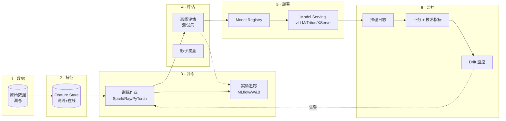

# MLOps 生命周期

!!! tip "一句话理解"
    **把一次性 Jupyter 训练升级为工业级、可重复、可审计、可回滚的闭环**。MLOps ≠ "ML + DevOps"——它是**数据 + 模型 + 特征 + 评估 + 服务 + 监控**六位一体。任何一环缺失都会导致"离线 0.95、线上 0.74"的灾难。

!!! abstract "TL;DR"
    - **六大环节**：数据 → 特征 → 训练 → 评估 → 部署 → 监控
    - **核心范式**：所有资产（data / features / model / config）**版本化**
    - **湖仓一体化的价值**：数据底座统一 → PIT Join 可做 → 训推一致
    - **常见失败分布**：Train-serve skew / Data drift / 模型退化为头部三类（具体比例依团队差异大 · **不要直接套用某"90%"这类精确百分比** · 需自测自评）
    - **工具族**：MLflow / Kubeflow / Ray / DVC / Weights & Biases / Feast
    - **成熟度**：**L0（手工）→ L1（自动化训练）→ L2（CI/CD/CD4ML）→ L3（持续学习）**

## 1. 业务痛点 · 没有 MLOps 的灾难

### 典型失败模式

| 症状 | 根因 | 频率 |
|---|---|---|
| **离线 AUC 0.95、线上崩盘** | 训推特征漂移 | 🔥🔥🔥 极常见 |
| **模型悄悄退化两个月** | 无漂移监控 | 🔥🔥 常见 |
| **重跑训练结果不一致** | 数据未锁 snapshot | 🔥🔥 常见 |
| **发现问题想回滚，回不了** | 模型版本未管理 | 🔥🔥 常见 |
| **A/B 结果看不了** | 没 logging | 🔥 |
| **违规查权责** | 无血缘审计 | 🔥（合规场景致命）|

### 示意场景 `[以下为典型链路示意 · 非具体事故 · 不代表特定公司的真实数字]`

- **推荐系统静默退化**：模型上线后用户行为分布持续迁移（季节 / 促销 / 新用户涌入），AUC 缓慢从上线期下降 · 无监控则业务发现才查 · 根因回归重训节奏。
- **风控 train-serve skew**：线上特征计算用 Java 重写离线 Spark SQL，在 timezone / null 处理 / 边界上漂移 · 导致正常交易被误拒 · 监管要求短时间内复盘时没有血缘可查。
- **CTR 数据格式突变**：上游数据源 schema 变更未被下游感知 · 训练集出现几个百分点漂移 · 预测偏差在高 QPS 场景下放大为明显业务损失。

这些都是 **MLOps 缺失的税** · 具体数字会依团队 / 规模 / 时段差异很大 · 不要把示意链路当基准。

## 2. 六大环节深挖



### 环节 1 · 数据（湖仓）

**关键原则**：
- 所有训练数据都带 **Snapshot ID / commit hash**
- 重跑能锁定到同一份数据
- 数据质量检查（**Great Expectations / Soda**）作为训练前置

```python
# Iceberg Snapshot 锁定
training_data = spark.sql("""
SELECT * FROM iceberg.ml.training_events
VERSION AS OF 1234567890
""")
```

### 环节 2 · 特征（Feature Store）

**关键**：一份定义，离线在线同算。详见 [Feature Store](feature-store.md)。

- 离线训练 → `get_historical_features` + PIT Join
- 在线推理 → `get_online_features` < 10ms
- Drift 监控检测两侧分布漂移

### 环节 3 · 训练

**可选栈**：

| 框架 | 适合 |
|---|---|
| **Ray Train** | 分布式 PyTorch / XGBoost，湖仓友好 |
| **Spark MLlib** | 大规模 GBDT / LR |
| **Kubeflow Pipelines** | 生产级 pipeline，K8s 原生 |
| **PyTorch Lightning** | 单机 / 多机 DL |
| **DeepSpeed / FSDP** | 大模型训练 |

**必做**：
- **Experiment Tracking**（MLflow / W&B）：记录 hyperparameters、loss 曲线、git hash、数据 snapshot
- **Reproducibility**：固定 random seed、环境（Docker / conda）、依赖版本

```python
import mlflow

with mlflow.start_run():
    mlflow.log_params(config)
    mlflow.log_metric("auc", auc)
    mlflow.log_artifact("model.pkl")
    mlflow.log_text(open("data_snapshot.json").read(), "data_provenance.json")
```

### 环节 4 · 评估

**三层**：

| 层 | 目标 |
|---|---|
| **离线指标** | AUC / NDCG / BLEU / ... 基线 |
| **业务模拟** | 回放 + 计算业务 KPI（CTR / GMV） |
| **影子流量**（Shadow Traffic）| 生产流量 parallel 跑新模型，不影响用户 |
| **A/B 测试** | 真实业务验证 |

**离线 AUC 涨 ≠ 业务会涨**。必须：
- 离线 → 业务模拟 → 影子 → A/B → 全量

### 环节 5 · 部署 (Model Serving)

**Model Registry**：版本化 + **alias**（champion / challenger · MLflow 2.9+）替代老式 stage 转换。

```python
# MLflow 2.9+ 推荐 alias API · transition_model_version_stage 已 deprecated
from mlflow import MlflowClient

MlflowClient().set_registered_model_alias(
    name="recall_model", alias="champion", version=3
)
# serving 侧：models:/recall_model@champion
```

**Serving 选型**：

| 需求 | 推荐 |
|---|---|
| LLM | vLLM / TGI / SGLang |
| 通用 DL | Triton / TorchServe / KServe |
| CPU GBDT | FastAPI + pickle / treelite |
| 多模型 Router | Ray Serve / BentoML |

**部署策略**：
- **Canary**：1% → 10% → 50% → 100%
- **Blue/Green**：两版并行、切换瞬时
- **Shadow**：新版跑但不影响决策

### 环节 6 · 监控

**三类监控**：

| 类 | 指标 |
|---|---|
| **技术** | 延迟 p99 · 吞吐 · 错误率 · GPU 利用率 |
| **数据漂移** | PSI / KS · Missing rate · Mean shift |
| **业务** | CTR · GMV · 转化率 · 留存 |
| **模型质量** | Recall@K · 预测分布 · 置信度分布 |

**告警触发重训**的典型规则：
- PSI > 0.25（分布明显漂移）
- Online AUC / 离线 AUC 差 > 10%
- 业务指标下降 > 5% 超过 7 天

## 3. 成熟度模型

L0-L3 成熟度框架参考 **Google Cloud "MLOps: Continuous delivery and automation pipelines in machine learning"**（ml-ops.org 呼应）· 以下为结合工业实践的通俗版：

### L0 · 手工（大多数团队起点）

- Jupyter 训练 → pickle 保存 → FastAPI 挂上去
- 无版本、无 CI/CD、无监控

### L1 · 自动化训练（很多团队停在这一阶段）

- 训练作业调度化（Airflow / Kubeflow）
- Model Registry（MLflow · alias API）
- 离线评估自动化
- **缺**：在线监控 + 漂移 + 持续重训

### L2 · CI/CD for ML（CD4ML）· 工业级标配

- 代码 / 数据 / 特征 / 模型全版本化（Git + Iceberg snapshot + Feast + MLflow）
- 离线评估 + 影子流量 + Canary 自动化
- 模型监控 + 告警（详见 [model-monitoring](model-monitoring.md)）
- Model Card + Model BOM 合规 artifact（详见 [model-registry](model-registry.md)）

### L3 · 持续学习（务实版）

- 漂移检测触发重训 · **但必须过 auto-retrain 守门契约**（见 [model-monitoring](model-monitoring.md) §7）
- **Champion / Challenger 常态化**（背景持续训 · 稳定优于后再 promote）
- A/B 常态化 · 置信 / 显著性正确计算
- **Online Learning**（River / Vowpal Wabbit / FTRL）**适用窄**：高 QPS · label 快回流（CTR / feed 排序）· 工业主流仍是**周期性批重训** · online learning 是加成而非替代

!!! note ""L3 = 闭环自治"是理想 · 不是目标"
    现实里 L2 + champion/challenger + 定期批重训 已经覆盖 80%+ 场景 · 不必追求极端 online learning · 多数业务的 label 回流和 concept drift 节奏支撑不了真"自治"· 别把成熟度模型当跑分目标。

## 3.5 LLMOps 分支 · MLOps 的 LLM 时代对偶

**本页六环节是**经典 ML（推荐 · 风控 · CTR · 分类 · 回归）**闭环** · LLM 应用有自己的对偶形态 —— **LLMOps**。两者共享思想但**工具链 + 迭代节奏 + 评估方式 + 监控指标**都不同。

### 核心分歧

| 维度 | MLOps（本章）| LLMOps（[ai-workloads](../ai-workloads/index.md) §层 3）|
|---|---|---|
| **迭代主体** | 模型权重（每周 / 月重训）| Prompt（每天 / 小时改）+ RAG 语料 + 少量 fine-tune |
| **版本化对象** | 模型 + 特征 + 数据 snapshot | Prompt 模板 + RAG 索引 + 评估集 + adapter |
| **评估** | AUC / NDCG / MAE / calibration | LLM-as-Judge · Groundedness · Faithfulness · MT-Bench · 领域 golden set |
| **监控** | Feature drift · prediction drift · business KPI | Prompt drift · Tool trace · Token cost · Latency · Hallucination rate |
| **错误模式** | 准确率掉 / 分布漂移 | 幻觉 / 越狱 / 工具错误 / 无限循环 |
| **合规** | EU AI Act 高风险 ML | + prompt injection 防御 · + adapter 许可链 |

### LLMOps 闭环对应

```
MLOps 闭环（本章）             LLMOps 闭环（ai-workloads）
─────────────────              ────────────────────────────
1. 数据 (Iceberg)              1. 语料 + 评估集（版本化）
2. 特征 (Feature Store)        2. RAG 索引 + Prompt 模板
3. 训练                         3. Prompt 调优 / DSPy 优化 / 少量 fine-tune
4. 评估                         4. Eval（RAGAS · TruLens · DeepEval）
5. 部署                         5. Deploy（prompt version + model alias）
6. 监控                         6. LLM Observability（Langfuse · Phoenix · Trace）
```

### 对应 canonical 页

| 环节 | MLOps 页 | LLMOps 页 |
|---|---|---|
| 定义 / 版本化 | 本页 + [model-registry](model-registry.md) | [prompt-management](../ai-workloads/prompt-management.md) |
| 评估 | §4 业务模拟 / Shadow / A/B | [rag-evaluation](../ai-workloads/rag-evaluation.md) |
| 监控 | [model-monitoring](model-monitoring.md) | [llm-observability](../ai-workloads/llm-observability.md) |
| 部署运维 | [model-serving](model-serving.md) | [llm-inference](../ai-workloads/llm-inference.md) + [llm-gateway](../ai-workloads/llm-gateway.md) |
| 安全 | [model-registry](model-registry.md) §合规 | [guardrails](../ai-workloads/guardrails.md) + [authorization](../ai-workloads/authorization.md) |
| Fine-tuning | [fine-tuning-data](fine-tuning-data.md) | — |

### 实务建议

- **公司里两套都有**（推荐系统 + LLM 客服 + BI Text-to-SQL · 都要做）· **不要只选一套工具链**
- **共享底座**：湖仓 / Catalog / 权限 / 监控基础设施共用
- **分叉工具**：Prompt 管理 / LLM eval / LLM obs / guardrails 用 LLM 专属工具链 · 不强塞进 MLflow
- **人员协作**：ML 工程师和 LLM 应用工程师需要**互相理解对方工具链** · 避免"LLM 工程师不懂 PSI · ML 工程师不懂 prompt injection"

## 4. 工程细节 · 端到端管线示例

### Kubeflow Pipelines 典型

```python
@dsl.pipeline(name='recommender-pipeline')
def pipeline(date: str):
    # Step 1: 数据准备（从湖仓 + Feature Store）
    data = prepare_data(date=date, snapshot_id=...)

    # Step 2: 训练
    model = train(data=data, config=...)

    # Step 3: 评估
    metrics = evaluate(model=model, test_data=...)

    # Step 4: 审批（条件 gate）
    with dsl.Condition(metrics.auc > 0.85):
        # Step 5: 注册 + 部署到 Staging
        registered = register(model=model, stage="Staging")

        # Step 6: 影子流量 24h
        shadow = shadow_traffic(model_name="recall_model")

        # Step 7: 通过人工审批后切 Production
        promote(model=registered, stage="Production")
```

### 典型技术栈选型

**现代推荐系统 MLOps 栈**：

```
数据：Paimon / Iceberg (湖仓)
特征：Feast + Redis
训练：Ray Train 分布式
追踪：MLflow
Pipeline：Kubeflow / Airflow
Serving：Ray Serve (双塔召回) + Triton (精排)
监控：Prometheus + Grafana + 自建 drift
A/B：内部实验平台
```

### 依赖与打包

```
Dockerfile:
  FROM python:3.11
  COPY requirements.txt .
  RUN pip install -r requirements.txt
  COPY model /app/model
  ENTRYPOINT ["mlflow", "models", "serve", "-m", "/app/model"]
```

**关键**：**模型代码 + 依赖 + 权重**一起封装为不可变 artifact。

## 5. 性能数字 · 现实基线

| 指标 | 典型值 |
|---|---|
| 训练一次耗时（千万样本 DL） | 2-8 小时 |
| 训练一次耗时（亿级 GBDT） | 30-90 分钟 |
| Model Registry 注册延迟 | < 1s |
| 推理 p99（GBDT） | < 10ms |
| 推理 p99（小 DL） | 20-50ms |
| 推理 p99（LLM 首 token） | 100-500ms |
| 漂移监控延迟 | 5-60 分钟 |
| 重训节奏（典型） | 日 / 周 / 月 |

### 工业规模感 `[来源未验证 · 量级参考 · 具体数字年代差异大]`

- Netflix 推荐：每天多次重训 · 数千模型并存（2020+ 博客量级）
- Uber Michelangelo：日训练数千模型（2017 博客基础上迭代 · 具体当前数字未公开）
- TikTok 推荐：实时特征 + 流式 / 增量更新（行业传闻 · 细节未公开披露）

读者提醒：这些**量级**有参考意义 · 精确数字（"3000+"、"5000+"）不应被直接引用作基准。

## 6. 代码示例

### 完整的 MLflow 训练 + 注册 + 部署

```python
import mlflow
import mlflow.sklearn
from sklearn.ensemble import GradientBoostingClassifier
from feast import FeatureStore

store = FeatureStore(repo_path="feature_repo/")

# 1. 从 FS 拉训练数据
entity_df = ... # 从 Iceberg
train_df = store.get_historical_features(
    entity_df=entity_df,
    features=["user_fv:avg_7d_gmv", "user_fv:vip_level"]
).to_df()

# 2. 训练 + 追踪
with mlflow.start_run():
    mlflow.log_params({"n_est": 200, "lr": 0.05})
    mlflow.log_param("iceberg_snapshot", "1234567890")
    mlflow.log_param("feature_view_version", "v3")

    model = GradientBoostingClassifier(n_estimators=200).fit(X, y)

    auc = roc_auc_score(y_test, model.predict_proba(X_test)[:, 1])
    mlflow.log_metric("auc", auc)
    mlflow.sklearn.log_model(model, "model", registered_model_name="churn_v3")

# 3. 注册 + alias（MLflow 2.9+ · stage API 已 deprecated）
client = mlflow.MlflowClient()
client.set_registered_model_alias(
    name="churn_v3", alias="challenger", version=1
)
```

### 漂移监控（PSI）

```python
from scipy import stats
import numpy as np

def psi(expected: np.ndarray, actual: np.ndarray, bins: int = 10) -> float:
    breakpoints = np.quantile(expected, np.linspace(0, 1, bins + 1))
    expected_perc = np.histogram(expected, breakpoints)[0] / len(expected)
    actual_perc   = np.histogram(actual,   breakpoints)[0] / len(actual)
    expected_perc = np.where(expected_perc == 0, 1e-6, expected_perc)
    actual_perc   = np.where(actual_perc == 0,   1e-6, actual_perc)
    return np.sum((actual_perc - expected_perc) * np.log(actual_perc / expected_perc))

psi_value = psi(train_feature, online_feature)
if psi_value > 0.25:
    alert("Feature drift detected!")
```

## 7. 陷阱与反模式

- **训推代码两套**：Train-Serve skew 事故 #1 → 用 Feature Store
- **不锁数据版本**：重跑不可复现 → Iceberg Snapshot ID 锁死
- **评估只看离线指标**：业务崩坏才发现 → 强制业务模拟 + 影子
- **Model Registry 没 stage**：直接 prod 替换 → 无法回滚
- **漂移监控缺失**：模型悄悄退化 → PSI / 业务指标告警
- **Pipeline 没错重跑机制**：失败靠人工 → 幂等 + retry
- **资源预算不清**：训练挤爆集群 → 资源配额 / quota
- **Experiment 不追踪**：换超参靠记忆 → MLflow / W&B 必装
- **A/B 实验污染**：没正确分流 → 专业实验平台
- **没 MLOps 专职**：ML 工程师又开发又运维 → 建平台团队

## 8. 横向对比 · 延伸阅读

- [Feature Store](feature-store.md) —— 核心依赖
- [离线训练数据流水线](../scenarios/offline-training-pipeline.md)
- [Feature Serving](../scenarios/feature-serving.md)
- [Model Registry](../ml-infra/model-registry.md) · [Model Serving](../ml-infra/model-serving.md)
- [推荐系统](../scenarios/recommender-systems.md) · [欺诈检测](../scenarios/fraud-detection.md)

### 权威阅读

- **[*Designing Machine Learning Systems* (Chip Huyen, 2022)](https://www.oreilly.com/library/view/designing-machine-learning/9781098107956/)** —— MLOps 最系统
- **[Google: *Machine Learning Operations*](https://ml-ops.org/)**
- **[Uber Michelangelo 系列博客](https://eng.uber.com/michelangelo-machine-learning-platform/)**
- **[Netflix ML Platform](https://netflixtechblog.com/tagged/machine-learning)**
- **[MLflow 官方](https://mlflow.org/)** · **[Kubeflow](https://www.kubeflow.org/)** · **[Ray](https://www.ray.io/)**
- *Continuous Delivery for Machine Learning* (Martin Fowler's blog)
