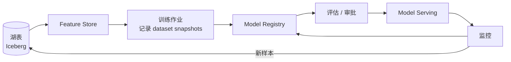

# Model Registry

!!! tip "一句话理解"
    模型的"Catalog"—— 每个模型是一个**带版本、带元数据、带血缘、带审批**的一等资产。没有 Registry = 模型部署全靠 Wiki + 口口相传。

!!! abstract "TL;DR"
    - Registry 管**模型工件 + 版本 + stage（dev/staging/prod）+ 血缘**
    - **MLflow** 是开源事实标准；**Unity Catalog Models** 把模型和数据放一套治理
    - **训练集版本 ↔ 模型版本**必须双向绑定
    - Registry ≠ Serving，但 Registry 是 Serving 的**起点**（"你要 serve 哪个版本"）

## Registry 至少做这 5 件事

1. **模型工件存储** —— `model.pkl` / `ckpt` / `tar.gz` 存对象存储，URI 进元数据
2. **版本管理** —— `v1, v2, v3`；不能覆盖，每次训练出一个新版
3. **Stage 流转** —— `None → Staging → Production → Archived`
4. **元数据** —— 训练指标、训练集版本、模型架构、超参、训练时间
5. **血缘** —— 上游是哪份训练集 / 哪个代码 commit / 哪位工程师

## MLflow Model Registry（开源主流）

```python
import mlflow

# 训练后注册
with mlflow.start_run():
    mlflow.log_params(params)
    mlflow.log_metrics(metrics)
    mlflow.sklearn.log_model(model, "model", registered_model_name="churn_predictor")

# Stage 流转
client = mlflow.MlflowClient()
client.transition_model_version_stage(
    name="churn_predictor",
    version=5,
    stage="Production"
)

# 下游加载
model = mlflow.sklearn.load_model("models:/churn_predictor/Production")
```

**优点**：开源、集成简单、社区大。
**缺点**：权限弱，和 Catalog 治理不打通。

## Unity Catalog Models（治理强）

把模型放 Unity Catalog：

```python
mlflow.set_registry_uri("databricks-uc")
mlflow.register_model(model_uri, "main.ml_models.churn_predictor")
```

此时模型的权限、血缘、审计**和数据表一套**。行列级 policy 对应到"哪个角色能读 / 部署这个模型"。

**适合**：一体化湖仓场景、强治理需求。

## 模型↔训练集的绑定

训练出一个模型时，必须在 metadata 里记：

```yaml
model_name: recsys_v3
model_version: 12
source_code: https://github.com/.../commit/abc123
training_dataset_id: recsys-v3-2026-03
training_dataset_snapshots:
  facts: 12345      # Iceberg snapshot-id
  features: 54321
trained_at: 2026-04-01T10:30:00Z
trained_by: user@corp
trained_with:
  framework: pytorch
  hparams: {...}
metrics:
  recall@10: 0.87
  mrr: 0.74
```

一年后复现该模型时，这条 metadata 就是复现的契约。

## Stage 流转的工程意义

| Stage | 含义 | 典型操作 |
| --- | --- | --- |
| None | 刚训好 | 自动测试 |
| Staging | 上 staging 环境 | AB 小流量 |
| Production | 线上服务的版本 | 审批流通过 |
| Archived | 退役 | 保留元数据供审计 |

多人生产环境**必须有审批**：`None → Staging` 可自动，`Staging → Production` 要人工。

## 和 Feature Store 的协作

```
Feature Store        ← online + offline 特征
        ↓
Model Registry       ← 模型本身 + 版本
        ↓
Model Serving        ← 部署版本 X + 拉特征
```

三者共同保证 train-serve consistency。

## 一个完整 MLOps 闭环



没有 Registry，中间所有虚线都断。

## 陷阱

- **不注册就直接部署**（"这个模型是我本地训的"）—— 复现不了、责任不清
- **Registry 和 Serving 分裂**（开发 MLflow、部署用别的）—— 版本错位
- **元数据缺训练集版本** —— 一年后没人知道当时训的是哪份数据
- **用"最新"而不是"具体版本号"部署** —— 昨晚某人训了个坏模型悄悄上线

## 相关

- [Feature Store](../ml-infra/feature-store.md)
- [Model Serving](model-serving.md)
- [Unity Catalog](../catalog/unity-catalog.md)
- [离线训练数据流水线](../scenarios/offline-training-pipeline.md)

## 延伸阅读

- MLflow docs: <https://mlflow.org/>
- Unity Catalog Models: Databricks 文档
- *Machine Learning Engineering for Production* (Andrew Ng) 课程
