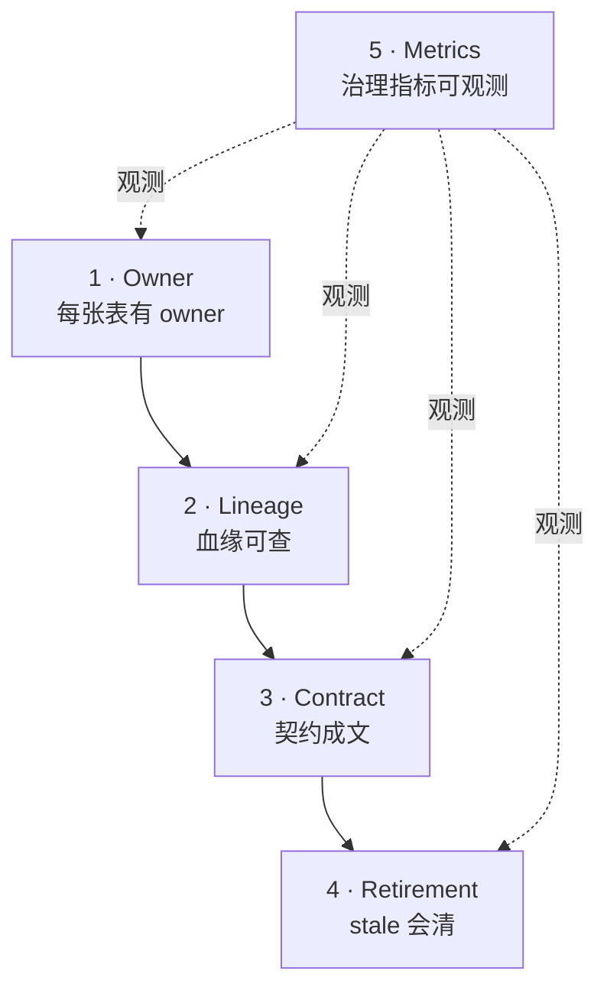

!!! warning "章节分工声明"
    - **本页**：数据治理的**生产 operating model**——owner 生命周期 / 血缘 ops / Data Contract 治理 / Stale review / 数据产品退役 / 治理指标
    - **ML 数据质量机制**（PIT · Label Quality · Quality Gates · GE/Soda 深度）→ [ml-infra/data-quality-for-ml](../ml-infra/data-quality-for-ml.md) canonical
    - **Catalog 平面机制**（UC / Polaris / Gravitino）→ [catalog/strategy](../catalog/strategy.md) canonical
    - **合规法规**（GDPR / EU AI Act 等）→ [compliance](compliance.md)
    - **变更流程**（Schema / Breaking change）→ [change-management](change-management.md) canonical
    - 本页视角：**治理怎么运作** · 不做工具对比 / 不讲 ML 质量机制

# 数据治理 · 生产 Operating Model

!!! tip "一句话理解"
    数据治理在生产里不是"合规部门的事"· 是**工程日常 operating model**：**owner 有 · 血缘可查 · 契约成文 · stale 会清 · 退役有 SOP**。工具只是载体 · **节奏 + 权责 + 指标**才是核心。

!!! abstract "TL;DR"
    - **治理五支柱**：Owner / Lineage / Contract / Retention & Retirement / Metrics
    - **关键节奏**：周（契约变更 review）· 月（stale/orphan 清理）· 季度（全量 owner / tag review）
    - **治理成功判定**：80% 表有 owner · 关键表（top 100）契约化 · 血缘覆盖率 > 70% · Stale > 90 天表 < 5%
    - **常见失败**：工具买了没 owner 用 / 治理平面没和 BI 嵌 / 契约写了不 CI 卡

## 1. 治理的五支柱 Operating Model



没有 owner · lineage 没人维护；没有 lineage · contract 签不了；没有 contract · retirement 没依据；没有 metric · 整套没人监督。**五者按顺序落地**。

## 2. Owner 生命周期

表 / 列 / 数据产品的 **owner** 是治理的一等元数据。没 owner = **无主地**。

### 2.1 创建期 · owner 准入

**规则**：
- 新建表 **必填** owner（team + 责任人）
- CI 阻断：`CREATE TABLE without owner` 不允许进 main（dbt meta / Iceberg table properties / UC owner 强制）
- 紧急例外：允许 7 天 grace · 过期自动降级为 "staging" 表（禁止生产消费）

### 2.2 移交期 · owner transfer

**触发**：人员离职 / 团队重组 / 业务拆分 / 收购合并。

**流程**：
1. 发起 owner transfer ticket（Atlan / DataHub / UC 内置 transfer API）
2. 新 owner 确认 + 旧 owner 签字 + 平台审批
3. Catalog 字段更新 · 通知下游消费方（自动邮件 + Slack）
4. Grace 期 30 天 · 旧 owner 仍可接问题

### 2.3 退役期 · owner 撤销

**触发**：数据产品下线 / 业务退出 / 表归档。

**流程**：见 §5 数据产品退役。

### 2.4 owner 缺失的应对

- Catalog 定期扫 "无 owner 表" · 月度报表列出
- 连续 3 月无 owner 的表 · 归 "平台 orphan 池" · 批量降级为 read-only
- **owner 缺失率**是治理核心指标（见 §7）

## 3. 血缘 Ops

血缘不是"有就行"· 是**可信 + 可用 + 覆盖率可追**。

### 3.1 覆盖率

**目标**：关键数据产品 100% · 全表血缘 > 70%

**事件源清单**（OpenLineage 接入）：
- ✅ Spark 作业（内置集成）
- ✅ dbt（OpenLineage dbt integration）
- ✅ Flink（OpenLineage flink-sql integration）
- ✅ Airflow / Dagster（provider）
- ⚠️ Trino · 社区集成演进中 · 部分查询类型丢失
- ⚠️ 自定义 ETL 脚本（需手动 emit · 常成盲区）

### 3.2 血缘质量

**验证**（覆盖 check 不是一次性）：
- **端到端连通性**：从 BI dashboard 反向追到 ODS 表 · 不能断链
- **列级血缘**：改 ODS 列 · 下游可用 catalog 查影响范围 · 否则列级血缘失效
- **事件 freshness**：血缘事件最多滞后 1 小时 · 否则变更分析不可用

### 3.3 血缘 Ops 节奏

| 周期 | 活动 |
|---|---|
| 日 | 血缘事件摄入监控（丢失告警）|
| 周 | 新增表血缘覆盖率 check |
| 月 | 断链报表 · 关键链路缺口清理 |
| 季度 | 列级血缘 coverage audit |

## 4. Data Contract 治理

**契约 = 提供方和消费方的正式承诺**。详细机制见 [ml-infra/data-quality-for-ml §2](../ml-infra/data-quality-for-ml.md) canonical · 本节讲 **治理流程**。

### 4.1 哪些表需要契约

**不是所有表都需要**。优先级：
1. **外部 API 依赖表**（其他系统 / 客户查）
2. **跨团队共享表**（DWD / DWS / ADS 层）
3. **ML 训练 / 在线推理依赖表**
4. **合规关键表**（PII · 金融 · 医疗）

**不建议**：中间层 staging / 个人探索 / 临时分析表 · 不签契约（过度治理）。

### 4.2 契约生命周期

```
起草 → 评审 → 签字 → CI 集成 → 运行中 → 变更 → 退役
```

**关键治理点**：
- **起草**：owner + 主要消费方共创 · 不是单方面拟订
- **评审**：平台治理组 check 结构（必填字段 / 约定格式）
- **签字**：owner + 每个主要消费方代表 · 留 ticket
- **CI 集成**：schema / 关键 expectation 进 dbt test · 违反阻断 merge
- **变更**：按 [change-management §Schema Evolution](change-management.md) · Breaking change 30 天通知
- **退役**：见 §5

### 4.3 Breaking Change 治理

和 [change-management §2.2](change-management.md) 对齐：
- 提前 **30 天** 通知所有消费方
- 新旧版本并存期（双写）
- 下游逐个切
- 全切完弃用旧版 · 留 stub 90 天

**治理侧责任**：确保通知真到消费方（不只是发 Slack · 要求 ack） · 跟踪迁移进度。

## 5. 数据产品 Retirement · 退役 SOP

**多数团队最弱的一环**：建了不清 · 数据湖变"数据沼泽"。

### 5.1 退役触发信号

Catalog 定期扫描 · 触发候选：
- **90 天无查询**（access log）
- **90 天无上游写入**（无 snapshot commit）
- **Owner 离职 + 无继任 60 天**
- **主要消费方已迁移**（血缘下游为空）
- **替代表已上线**（owner 显式标记 deprecated）

### 5.2 退役流程（4 阶段）

```
候选 → 通知期 → Deprecated → Archived → Deleted
 (系统扫)  (30 天)    (read-only)  (冷归档)  (永久删)
```

| 阶段 | 周期 | 行为 |
|---|---|---|
| **候选** | 触发时 | Catalog 标 `candidate-for-retirement` · 邮件 owner + 最近消费方 |
| **通知** | 30 天 | Owner 确认退役 / 续约；消费方 ack |
| **Deprecated** | 30-90 天 | 表标 read-only · 查询返回 warning · 阻断写入 |
| **Archived** | 90-365 天 | 数据转冷存储（Glacier / 归档 bucket）· metadata 保留 |
| **Deleted** | 365 天后 | 物理删除 · 审计日志留 7 年（合规需要） |

**合规例外**：审计 / 金融 / 医疗等法规要求保留的表 · 不走此流程 · 走合规 retention schedule。

### 5.3 Orphan 清理

**无 owner + 无下游 + 无查询**的表 · 特殊处理：
- 季度扫描 · 批量列表
- 若无人认领 · 直接进 Deprecated 阶段
- 平台 orphan-cleanup runbook 季度执行一次

## 6. Retention / 保留策略

**不是"数据越多越好"**。治理视角：每张表有**明确保留窗口**。

| 数据类型 | 典型保留 | 触发依据 |
|---|---|---|
| 实时事件日志 | 7-30 天 热 + 90 天冷 | 成本 |
| ODS 业务数据 | 1-3 年 | 合规 + 业务 |
| DWS / ADS 聚合 | 3-10 年 | 业务审计 |
| 金融交易 | 7 年+ | 监管 |
| 医疗数据 | HIPAA 6 年+ | 法规 |
| 用户 PII | 业务结束 + GDPR 删除权 | 合规 |
| ML 训练数据 snapshot | 3 年（复现期）| 可追溯 |
| 模型 artifact | 3 年 + 金融 7 年 | 审计 |

**实施**：对象存储 lifecycle policy + 表级 retention metadata · Iceberg `expire_snapshots` 配合。

## 7. 治理指标 · 可观测

**治理好坏**不靠感觉 · 靠指标。

### 7.1 核心指标

| 指标 | 目标 | 测量 |
|---|---|---|
| **Owner 缺失率** | < 5% | 总表数中无 owner 占比 |
| **血缘覆盖率** | > 70% 全表 / 100% 关键表 | OpenLineage 事件覆盖 |
| **契约化率**（关键表）| Top 100 → 80% | 有 contract 的关键表占比 |
| **Stale 表占比** | < 10% | 90 天无查询表占比 |
| **Schema 违规变更** | 0 | CI 阻断未 review 的 schema 变更数 |
| **Breaking change 通知期合规** | 100% | 满足 30 天通知的变更比例 |
| **PII 表 tag 覆盖** | 100% | 含 PII 列的表有 tag 的比例 |

### 7.2 治理 Dashboard

上面指标集中一张 dashboard · 平台治理组周 review。

## 8. 和 catalog / 合规 / 变更的集成

**治理平面 = Catalog 之上的 ops 层**：

```
Catalog（UC / Polaris / Nessie）
  ↓ metadata API
治理平面（DataHub / Atlan / Collibra）
  ↓ 治理 operating model
- Owner 生命周期（本节 §2）
- 血缘 ops（本节 §3）
- Contract 治理（本节 §4）
- Retirement（本节 §5）
- 合规标签（→ compliance §实现 1）
- 变更审批（→ change-management §release governance）
```

**关键**：治理工具**必须和 BI / 变更流程嵌合**· 单独的治理平面没人用 · 就是死工具。

## 9. 实施路径 · 按成熟度

### L0 起步（所有表无 owner / 无血缘）
- Week 1-4：Catalog owner 字段 · Top 100 关键表补 owner（手动）
- Week 4-8：PII 列打 tag · 关键表 Top 20 加 5 条质量规则
- Month 3：OpenLineage 从 Spark / Airflow 打通（主 ETL）

### L1 稳定（有 owner 但乱）
- 治理 dashboard 上线 · 暴露 owner 缺失率
- 关键表 Top 50 契约化（§4）
- 血缘从 dbt + Flink 扩展

### L2 生产级
- Retirement SOP 上线 · 季度 stale 清理
- 治理指标进 SLO（owner 缺失率 < 5% 等）
- Breaking change 流程 CI 卡

### L3 卓越
- 列级血缘全链 · RAG / ML 场景可追
- 契约化率 80%+
- 自动化 retention policy
- 跨 region 治理平面统一

## 10. 陷阱 · 反模式

- **买 DataHub 没 owner 填** · 治理死
- **契约写了不 CI 卡** · 形同虚设
- **治理平面和 BI 不嵌** · BI 用户不查 = 没价值
- **owner 名义挂人不负责** · "挂名 owner"需要定期 review 实际 DRI
- **Retirement 只标不删** · 成本照烧
- **工具链太多** · DataHub + Atlan + Ranger + 自研互相对不上
- **治理指标只给治理组看** · 应该让业务 / owner 都能看到自己的 dashboard

## 11. 和其他章节

- [ml-infra/data-quality-for-ml](../ml-infra/data-quality-for-ml.md) · ML 数据质量 canonical
- [catalog/strategy](../catalog/strategy.md) · Catalog 选型
- [security-permissions](security-permissions.md) · 权限 / Access Review
- [compliance](compliance.md) · 合规法规
- [change-management](change-management.md) · Schema 变更 / release governance
- [observability](observability.md) · 治理 dashboard 集成

## 12. 延伸阅读

- *OpenLineage Specification*: <https://openlineage.io/>
- DataHub docs: <https://datahubproject.io/docs/>
- *Data Contracts* · Andrew Jones（治理权威）
- *Data Mesh* · Zhamak Dehghani
- Netflix / LinkedIn / Uber 治理技术博客
