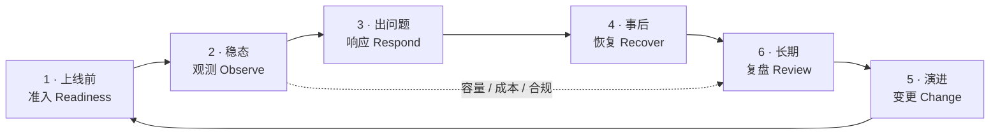
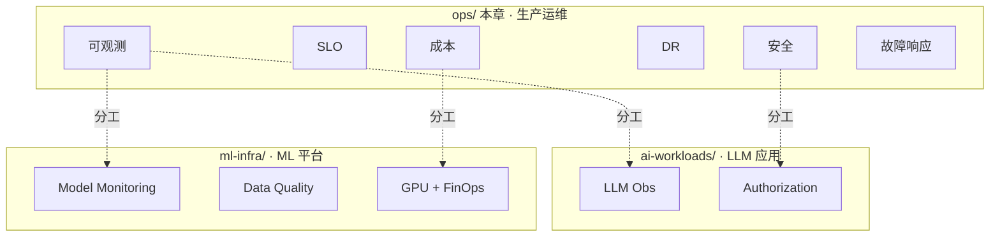

# 运维与生产

!!! info "本章组织"
    本章按 6 个能力组：
    
    - **日常运维 · 效率**：[可观测性](observability.md) / [性能调优](performance-tuning.md) / [故障排查手册](troubleshooting.md)
    - **容量 · 目标**：[SLA · SLO · DRE](sla-slo.md) / [容量规划](capacity-planning.md)
    - **成本 · 效益**：[成本优化 · FinOps](cost-optimization.md) / [TCO 模型](tco-model.md)
    - **安全 · 治理 · 合规**：[安全与权限](security-permissions.md) / [数据治理](data-governance.md) / [多租户隔离](multi-tenancy.md) / [合规](compliance.md)
    - **DR · 变更 · 事故**：[灾难恢复 DR](disaster-recovery.md) / [变更管理](change-management.md) / [事故管理](incident-management.md) / [迁移手册](migration-playbook.md)
    - **反模式 · 清单**：[28 反模式](anti-patterns.md) / [生产上线检查清单](production-checklist.md)
    
    外部权威：[`docs/references/ops/`](../references/ops/index.md)（Google SRE Book · DataOps Manifesto · FinOps Foundation · NIST Privacy / GDPR / EU AI Act）。

!!! tip "一句话定位"
    **把湖仓 + AI 系统稳定地跑在生产上所需要的工程能力**。覆盖**能见度 · 性能成本 · 安全合规 · 变更迁移 · 故障响应 · 生产准入**6 能力组 · 17 页 · 从 L0 起步到 L3 卓越的完整路径。

!!! warning "章节分工 · 避免和 AI / ML / catalog 章节混淆"
    - **本章**：**湖仓 + AI 的生产运维工程**（通用运维能力）
    - **ML 数据质量**（PIT / Label Quality / Data Contract）→ [ml-infra/data-quality-for-ml](../ml-infra/data-quality-for-ml.md) canonical
    - **ML 监控**（Drift / Auto-retrain / Fairness）→ [ml-infra/model-monitoring](../ml-infra/model-monitoring.md) canonical
    - **LLM 可观测**（Trace / Cost / Prompt Version）→ [ai-workloads/llm-observability](../ai-workloads/llm-observability.md) canonical
    - **AI 应用权限**（Tool ACL / Identity 流转）→ [ai-workloads/authorization](../ai-workloads/authorization.md) canonical
    - **GPU 调度 / FinOps for ML** → [ml-infra/gpu-scheduling](../ml-infra/gpu-scheduling.md) canonical
    - **Catalog 治理平面** → [catalog/strategy](../catalog/strategy.md) canonical
    - **AI 治理（EU AI Act · Red Teaming 组织层）** → [ops/compliance §4]((../ops/compliance.md)
    - 本章以上主题**只做工程落地视角** · 不重复战略 / 机制 canonical

!!! abstract "TL;DR"
    - **6 能力组** · 对应生产运维的金字塔能力：**能见 → 性能成本 → 安全治理 → 变更灾难 → 故障 → 准入**
    - **17 页**（含 3 个 S34 新建：incident-management · change-management · production-checklist）
    - **成熟度 L0-L3** · 帮团队判断当前阶段 · 决定优先投入
    - **四维导航**：按能力组 / 按症状反查 / 按角色 / 按成熟度

## 1. 六能力组（生产运维金字塔）

### 组 1 · 能见度与可靠性

**看清系统 + 承诺可用**——没有能见就没有运维。

- [**可观测性**](observability.md) —— 写入 / Catalog / 查询 / 数据质量**四平面** + 2024-2026 生态（OpenLineage · Elementary · Monte Carlo · OTel GenAI）
- [**SLA · SLO · DRE**](sla-slo.md) ⭐ —— 数据可靠性工程 · AI/LLM SLO 新维度
- [**湖仓反模式清单**](anti-patterns.md) —— 28 条反模式 · 上线前自查（含 AI/ML 反模式）

### 组 2 · 性能、容量、成本

**让系统跑得好 · 花得对**——FinOps + 性能工程的工业实践。

- [**性能调优**](performance-tuning.md) —— 数据布局优先 · 执行层次之 · 2024-2026 向量化前沿
- [**容量规划**](capacity-planning.md) —— 集群 / GPU / 向量库 / LLM 容量估算
- [**成本优化**](cost-optimization.md) —— 对象存储 / 计算 / GPU / LLM token / FinOps 五条线
- [**TCO 模型**](tco-model.md) —— 自建 vs 云 vs SaaS · 含 AI 场景（LLM API vs 自托管 GPU）break-even

### 组 3 · 安全、合规、治理

**谁能看 · 该留什么 · 怎么治**——三件事一起做。

- [**安全与权限**](security-permissions.md) —— Zero Trust · OIDC · Credential Vending · Secrets Management · mTLS
- [**多租户隔离**](multi-tenancy.md) —— 5 层隔离 + AI 资源隔离
- [**数据治理**](data-governance.md) —— 血缘 / 契约 / 合规（ML 数据质量看 [ml-infra/data-quality-for-ml](../ml-infra/data-quality-for-ml.md)）
- [**数据合规**](compliance.md) ⭐ —— GDPR · HIPAA · EU AI Act · 中国《生成式 AI 管理办法》· SOC 2

### 组 4 · 变更、迁移、灾难恢复

**系统会演进 · 会迁 · 会挂**——工程化应对。

- [**变更管理**](change-management.md) ⭐（新）—— 数据 pipeline CI/CD · Schema evolution · Breaking change policy · 回滚 · Feature flag
- [**迁移手册**](migration-playbook.md) —— 7 条迁移路径（Hive→Iceberg · Delta↔Iceberg · Hudi→Paimon · SaaS 双向 · AI 应用迁移）
- [**灾难恢复 · DR**](disaster-recovery.md) —— 4 类灾难 + 向量库 DR + 模型 artifact DR + 不可变备份

### 组 5 · 故障管理

**出事了怎么办**——响应流程 + 排查方法。

- [**故障响应**](incident-management.md) ⭐（新）—— SEV 分级 · oncall · postmortem 框架 · 和 SLO 协同
- [**故障排查手册**](troubleshooting.md) —— 20 类问题排查树（湖仓 / ML / AI 应用 / Catalog）

### 组 6 · 生产准入

**上线前最后一道守门**——标准化 checklist。

- [**生产准入清单**](production-checklist.md) ⭐（新）—— 上线前 40 条检查 · 按 6 能力组分类

## 2. 症状反向索引 · 按问题找页

**"我遇到 X 问题 · 先看哪页"**：

| 症状 | 去哪读 |
|---|---|
| **查询突然变慢** | [performance-tuning](performance-tuning.md) §诊断流程 + [troubleshooting](troubleshooting.md) §1 |
| **ETL 又挂了** | [troubleshooting](troubleshooting.md) §2-4 + [sla-slo](sla-slo.md) §Error Budget |
| **数据对不上** | [troubleshooting](troubleshooting.md) §数据 + [data-governance](data-governance.md) 血缘 |
| **账单失控** | [cost-optimization](cost-optimization.md) + [tco-model](tco-model.md) |
| **GPU 利用率低** | [ml-infra/gpu-scheduling](../ml-infra/gpu-scheduling.md) §FinOps + [capacity-planning](capacity-planning.md) §GPU |
| **LLM token 成本高** | [cost-optimization](cost-optimization.md) §LLM Token + [ai-workloads/semantic-cache](../ai-workloads/semantic-cache.md) |
| **用户越权访问** | [security-permissions](security-permissions.md) + [multi-tenancy](multi-tenancy.md) |
| **合规审计过不了** | [compliance](compliance.md) + [data-governance](data-governance.md) |
| **大表误删 / Schema 改坏** | [disaster-recovery](disaster-recovery.md) §误操作 + [change-management](change-management.md) §回滚 |
| **Region / Catalog 挂了** | [disaster-recovery](disaster-recovery.md) §Region + §Catalog |
| **Schema 变更怎么发** | [change-management](change-management.md) §Schema Evolution |
| **要做 CI/CD pipeline** | [change-management](change-management.md) §CI/CD |
| **要上线新数据产品 / 模型** | [production-checklist](production-checklist.md) + [sla-slo](sla-slo.md) |
| **P0 事故爆了怎么响应** | [incident-management](incident-management.md) §SEV + §oncall |
| **要做 postmortem** | [incident-management](incident-management.md) §Postmortem |
| **Hive → Iceberg 迁移** | [migration-playbook](migration-playbook.md) §Hive→Iceberg |
| **Delta → Iceberg / Hudi → Paimon** | [migration-playbook](migration-playbook.md) §表格式迁移 |
| **从 SaaS 搬到自建 / 反向** | [migration-playbook](migration-playbook.md) §SaaS 双向 |
| **什么是 EU AI Act 工程要求** | [compliance](compliance.md) §EU AI Act |
| **LLM 幻觉率 SLO 怎么定** | [sla-slo](sla-slo.md) §AI SLO + [ai-workloads/llm-observability](../ai-workloads/llm-observability.md) |
| **ML 模型 drift 告警** | [ml-infra/model-monitoring](../ml-infra/model-monitoring.md) canonical |
| **训练数据质量 / PIT 问题** | [ml-infra/data-quality-for-ml](../ml-infra/data-quality-for-ml.md) canonical |
| **别踩坑** | [anti-patterns](anti-patterns.md) 28 条 |

## 3. 按角色导读

### SRE · 数据可靠性工程师（DRE）

**核心必读**（按顺序）：
1. [sla-slo](sla-slo.md) · 可靠性体系（SLI/SLO/SLA/Error Budget）
2. [observability](observability.md) · 可观测体系
3. [incident-management](incident-management.md) · 故障响应
4. [troubleshooting](troubleshooting.md) · 排查方法
5. [disaster-recovery](disaster-recovery.md) · 灾难恢复

### 平台工程师 / SRE Lead

**核心必读**：
1. 本页 index 全部
2. [capacity-planning](capacity-planning.md) · 容量规划
3. [multi-tenancy](multi-tenancy.md) · 多租户
4. [security-permissions](security-permissions.md) · 权限体系
5. [production-checklist](production-checklist.md) · 生产准入标准

### 合规 / 治理负责人

**核心必读**：
1. [compliance](compliance.md) · 全球合规法规
2. [data-governance](data-governance.md) · 治理工程
3. [security-permissions](security-permissions.md) §审计 + §数据保护
4. [compliance §4 AI 合规](compliance.md) · 法规层

### 数据 / ML 工程师

**核心必读**：
1. [anti-patterns](anti-patterns.md) · 28 反模式自查
2. [performance-tuning](performance-tuning.md) · 性能调优
3. [change-management](change-management.md) · CI/CD + Schema 变更
4. [troubleshooting](troubleshooting.md) · 排查

### FinOps / 成本负责人

**核心必读**：
1. [cost-optimization](cost-optimization.md) · 成本控制五线
2. [tco-model](tco-model.md) · 战略成本决策
3. [capacity-planning](capacity-planning.md) · 容量预算
4. [ml-infra/gpu-scheduling](../ml-infra/gpu-scheduling.md) §FinOps · GPU 成本

## 4. 生产 Operating Model · 闭环视角

**为什么要这节**：ops/ 不止是"能力清单"（可观测 / SLO / 安全 / DR / 成本 / 事故）· 而是一个**闭环的生产体系**。知道每个能力是起点 · 但**怎么串成日常运转**才是生产。

### 4.1 闭环图 · 从上线前到长期演进

| 阶段 | 核心文档 | 输出 |
|---|---|---|
| **1 · Readiness** | [production-checklist](production-checklist.md) + [sla-slo](sla-slo.md) | 准入打分 · SLO 承诺 |
| **2 · Observe** | [observability](observability.md) + [sla-slo](sla-slo.md) + [capacity-planning](capacity-planning.md) | Dashboard · 告警 · Error Budget · cost dashboard |
| **3 · Respond** | [incident-management](incident-management.md) + [troubleshooting](troubleshooting.md) | SEV 分级 · 响应 · 止血 |
| **4 · Recover** | [disaster-recovery](disaster-recovery.md) + [change-management §回滚](change-management.md) | 数据 / 服务 / 配置恢复 |
| **5 · Change** | [change-management](change-management.md) + [migration-playbook](migration-playbook.md) | CI/CD · Schema · Release governance |
| **6 · Review** | [incident-management §Postmortem](incident-management.md) + [anti-patterns](anti-patterns.md) | 事故复盘 · 反模式自查 · 架构债务 |

### 4.2 Operating Cadence · 节奏表

**生产团队最容易失效的不是"工具"· 是"节奏"**。下表给出建议周期（按团队规模调整）：

| 周期 | 活动 | 文档指引 |
|---|---|---|
| **日** | Oncall 交班 · 关键 dashboard 扫一眼 | [incident-management §Oncall](incident-management.md) |
| **周** | 告警 review · Error Budget 消耗 · 上周事故扫 | [sla-slo §Error Budget](sla-slo.md) |
| **双周** | Backlog triage · 架构债务评估 · 数据质量趋势 | [data-governance](data-governance.md) |
| **月** | 成本 review · 容量预测 · P0/P1 事故复盘合辑 · 合规 checklist 自查 | [cost-optimization](cost-optimization.md) · [compliance](compliance.md) |
| **季度** | SLO 重定 · DR 演练 · Access review · Stale 数据清理 · 对抗评审 | [disaster-recovery §演练](disaster-recovery.md) · [security-permissions](security-permissions.md) |
| **年度** | TCO review · 技术栈演进决策 · 灾备策略 · 合规证书更新 | [tco-model](tco-model.md) |

**不演练 = 不存在**：DR 演练 / postmortem cadence / access review 这三项最容易"设立但不执行"· 必须节奏化。

### 4.3 角色矩阵 · 谁负责什么

| 活动 | SRE / DRE | 平台工程师 | 数据 / ML 工程师 | 合规 / 治理 | 业务 / 产品 |
|---|---|---|---|---|---|
| **定 SLO** | **R** | C | C | I | **A** |
| **Oncall 轮值** | **R** | **R** | C | — | I |
| **Incident 指挥** | **R**（IC 角色） | C | C | I | I |
| **Postmortem** | **R** | C | C | I | I |
| **Release 审批** | C | **R** | C | C | **A**（关键变更） |
| **Access Review** | C | **R** | I | **A** | I |
| **Cost Review** | C | **R** | C | — | **A** |
| **合规审计** | C | C | I | **R** | **A** |
| **DR 演练** | **R** | **R** | C | I | I |

（R=Responsible · A=Accountable · C=Consulted · I=Informed）

**关键判断**：上表如果某一列全是 C/I · 该角色基本没被纳入生产体系 · 需要重新审视。

## 5. 成熟度模型 L0-L3

**对照自己团队的阶段**（借鉴 Google SRE Maturity 和 FinOps Framework）：

### L0 · 起步（多数团队起点）

- 无监控 或 只有基础服务监控
- ETL 失败靠邮件
- 无 oncall 轮值
- 无数据质量检查
- 无成本归因

**优先投入**：
1. [observability](observability.md) · 四平面先铺
2. [anti-patterns](anti-patterns.md) · 自查避坑
3. [security-permissions](security-permissions.md) · 最小可用清单

### L1 · 稳定（多数团队稳定态）

- 基础监控 + 核心告警
- 有 oncall · 但流程模糊
- 有 ETL 质量检查（dbt tests / GE）
- 成本有大致观测

**优先投入**：
1. [sla-slo](sla-slo.md) · 建立 SLO 体系
2. [incident-management](incident-management.md) · 规范化 oncall
3. [cost-optimization](cost-optimization.md) · FinOps 实施
4. [disaster-recovery](disaster-recovery.md) · 演练 DR

### L2 · 生产级（成熟团队）

- SLO 体系运行 · Error Budget 执行
- 规范化 incident + postmortem 文化
- Data Contract + Schema evolution 流程
- Multi-tenant 隔离清晰
- GDPR / 合规审计通过

**优先投入**：
1. [change-management](change-management.md) · CI/CD + Schema 流程化
2. [compliance](compliance.md) · EU AI Act 等新法规
3. [production-checklist](production-checklist.md) · 上线标准化
4. [multi-tenancy](multi-tenancy.md) · 隔离精细化

### L3 · 卓越（头部团队）

- 数据产品 SLA 对外承诺
- 自愈系统（告警自动修复简单场景）
- 零信任架构完整落地
- AI/LLM 生产 SLO 体系（幻觉率 / token budget）
- DRE 专职团队

**对应**：持续改进 · 跟进业界动向（[benchmarks](../benchmarks.md) · [vendor-landscape](../vendor-landscape.md)）+ 工业案例学习（[cases/](../cases/index.md)）

## 6. 和其他章节的关系

**原则**：ops/ **只做工程落地** · 具体的 ML/AI 机制 canonical 在对应专章 · 通过 admonition 指向。

## 7. 新同事 30 天入门路径

**Week 1**：读本页 index + [anti-patterns](anti-patterns.md) 自查团队当前状态

**Week 2**：根据你的角色 · 读"按角色导读"的必读 3-5 页

**Week 3**：挑一个你们团队最痛的症状 · 按 §2 症状反查走 · 实操解决一个 case

**Week 4**：读 [production-checklist](production-checklist.md) · 对照当前上线流程补漏

## 8. 版本复检

!!! info "时效性 · 按 ADR 0007 SOP 复检"
    运维工具链变化快（OpenTelemetry GenAI 2024 / EU AI Act 2024-08 / FinOps Foundation 2025 更新）。**本章 applies_to: 2024-2026 · last_reviewed: 2026-04-21** · 下次计划 2026-Q3 复检。

## 相关章节

- [scenarios/](../scenarios/index.md) · 业务场景端到端（scenarios 含运维相关场景 · 如 real-time-lakehouse）
- [cases/](../cases/index.md) · 工业案例参考（学大厂运维实践）
- [unified/](../unified/index.md) · 架构战略（ops 和架构的关系）
- [ml-infra/](../ml-infra/index.md) · ML 平台（运维的 ML 视角）
- [ai-workloads/](../ai-workloads/index.md) · AI 应用（运维的 LLM 视角）
- [catalog/](../catalog/index.md) · Catalog（治理平面）
- [ops/compliance §4]((../ops/compliance.md) · AI 治理前沿
