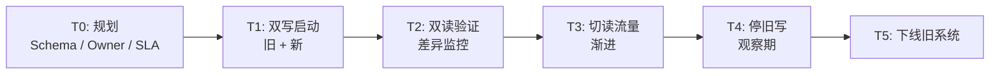
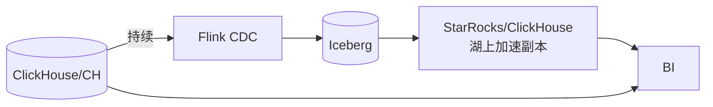

!!! warning "章节分工声明"
    - **本页**：**跨系统迁移**的 7 条常见路径
    - **同系统内变更**（Schema 演化 · 版本升级）→ [change-management](change-management.md)
    - **表格式机制**（Iceberg / Paimon / Hudi / Delta 对比）→ [compare/iceberg-vs-paimon-vs-hudi-vs-delta](../compare/iceberg-vs-paimon-vs-hudi-vs-delta.md)
    - **Catalog 选型**（迁移目标决策）→ [catalog/strategy](../catalog/strategy.md)

# 迁移手册

!!! tip "一句话理解"
    把**存量系统**迁到一体化湖仓。三条常见路径：**Hive → Iceberg**、**独立数仓 → 湖仓**、**独立向量库 → LanceDB**。每条都有"零停机 vs 一次切"的权衡。

!!! abstract "TL;DR"
    - **零停机双写**是默认起点；"一次切"仅适合小表或非核心
    - **双读验证**（影子流量）是防回归的关键
    - 迁移**同时是治理升级机会**（Owner / Tag / 权限补齐）
    - **别急着删旧系统**：至少留一个 Sprint 的"可回退期"
    - 每次迁移留 **ADR**

## 通用迁移模板



每一步都要有**明确退出标准**和**回退开关**。

## 路径 1：Hive → Iceberg

最常见。两种方式：

### 1A · Register-Only（快）

不动数据文件，把 Hive 表文件作为 Iceberg 数据文件注册：

```sql
CALL system.register_table(
  table => 'db.orders_iceberg',
  metadata_file => 's3://warehouse/orders/metadata/00001-....json'
);

-- 或从 Hive 直接 migrate
CALL iceberg.system.migrate('hive_db.orders');
```

**优点**：分钟级，数据零搬动。
**缺点**：不享受 Iceberg native 分区 / 列 ID / Puffin 等能力。

**用于**：短期解锁 Iceberg 生态，长期计划 rewrite。

### 1B · Rewrite（慢但彻底）

用 CTAS 重写：

```sql
CREATE TABLE db.orders
USING iceberg
PARTITIONED BY (days(ts), bucket(16, user_id))
TBLPROPERTIES ('write.parquet.compression-codec' = 'zstd')
AS SELECT * FROM hive_db.orders;
```

**优点**：native 布局，全部能力可用。
**缺点**：TB 级需几小时到几天；写入高峰要调度避让。

**用于**：核心事实表。

### 1C · 双写过渡

写入侧：同时写 Hive 表和 Iceberg 表；读侧逐步切 Iceberg：

```python
def write_both(records):
    hive_writer.append(records)
    iceberg_writer.append(records)
```

**优点**：零停机 + 可回退。
**缺点**：短期运维成本翻倍。

### 迁移验证清单

- [ ] 行数一致（每分区）
- [ ] 关键聚合值一致（sum / count / max）
- [ ] 查询延迟不退化（对比 Top 20 查询）
- [ ] 权限正确迁移
- [ ] 下游 dashboard / 作业都读新表

## 路径 2：独立数仓（ClickHouse / Greenplum / Redshift）→ 湖仓

### 难点

- 格式转换（ClickHouse MergeTree 不是 Parquet）
- 数据量大（TB-PB 级）
- 下游耦合深（BI 工具直连老 DW）

### 推荐模型



**双路供应**：BI 同时能打旧 DW 和湖 + 加速副本。逐步切流量。

### 关键动作

- 定 "加速副本" 的延迟目标（与旧 DW 对齐）
- 维护**差异 Dashboard**（旧 vs 新，按表粒度）
- 给每个 BI Dashboard 迁移 Ticket

## 路径 3：独立向量库 → LanceDB（湖原生）

### 目标

把 Milvus / Qdrant / Pinecone 里的向量迁到 Lance / Iceberg + Puffin，和源数据共生。

### 步骤

1. **导出向量 + 元数据**（Milvus 支持导出 parquet）
2. **导入 LanceDB**（直接写对象存储）
3. **重建索引**（可能要重新 training IVF centroids）
4. **双路查询**：服务层同时查 Milvus + LanceDB，对比结果
5. **切流量**：渐进 10% → 50% → 100%
6. **下线 Milvus 集群**

### 验证

- 对相同 query 两边 Recall@K 对齐（±1%）
- 延迟在预算内
- 结构化过滤语义一致

## 路径 4：Delta ↔ Iceberg 迁移（2024-2026 热点）

Databricks 推 UniForm（Delta 读 Iceberg）· 但客户层面真实迁移也在发生。

### 4A · Delta → Iceberg（去 lock-in 场景）

**场景**：客户想离开 Databricks / 想要 Iceberg 多引擎生态

**方式**：
1. **UniForm 过渡**（2024+ · Delta 数据暴露 Iceberg metadata · 过渡期可读）
2. **重写**（CTAS 从 Delta 读 · 写 Iceberg）
3. **双写**（写入侧同时写两个表 · 切读后停旧写）

**坑**：
- Delta CDF（Change Data Feed）和 Iceberg changelog 概念有差异
- Delta Time Travel 和 Iceberg snapshot 不互通 · 历史 snapshot 丢失

### 4B · Iceberg → Delta（Databricks 采购场景）

**场景**：客户采购了 Databricks · 内部既有 Iceberg 表要集成

**方式**：
1. Iceberg 外部表（Databricks 2023+ 支持读 Iceberg）· **通常不迁** · 直接读
2. 必要时 CTAS 转 Delta（少数深度 Databricks 能力依赖场景）

### 4C · Hudi → Iceberg / Paimon（2024-2026 常见）

**场景**：早期选了 Hudi · 现在评估迁移（生态 · 社区活跃度）

**决策矩阵**：
- **生态广 + 批为主** → Iceberg
- **流式重 + Flink 生态** → Paimon
- **Spark-first + MoR 写密集** → 留 Hudi（Hudi 在 MoR 极致场景仍有优势）

**迁移方式**：CTAS 重写（通常需要 TB 级重写 · 按分区批次）

## 路径 5：HMS → 现代 Catalog（UC / Polaris / Gravitino）

### 5A · HMS → Iceberg REST（过渡）

最常见的第一步：
1. 上 Polaris / UC OSS 作 Iceberg REST Catalog
2. 新表建在新 Catalog
3. 老表仍在 HMS · 逐步迁

### 5B · HMS → Unity Catalog（多模治理一步到位）

**场景**：客户选 Databricks 生态 · 想要 UC 的多模资产全覆盖

**难点**：
- HMS 的 GRANT 表和 UC RBAC 模型**不对等**（详见 [catalog/strategy §7 HMS 迁移](../catalog/strategy.md)）
- 业务团队教育成本高

### 5C · 多 HMS 联邦 → Gravitino

**场景**：多个业务线各有 HMS · 想统一但不搬

**方式**：Gravitino 作上层联邦 · 不动底层 HMS · 渐进迁移。

## 路径 6：商业 SaaS ↔ 自建（2024-2026 双向）

### 6A · 自建 → 商业 SaaS（采购场景）

**场景**：公司采购 Databricks / Snowflake · 客户自建栈要迁入

**要点**：
- 数据 Copy（S3 数据还是 S3 数据 · 主要是 Catalog 元数据搬迁）
- 权限模型映射（自建 RBAC vs UC / Polaris）
- 计算作业重写（Spark → Databricks Runtime / Snowpark）
- **人员培训**是最大成本

### 6B · 商业 SaaS → 自建（去 lock-in 潮流）

**场景**：成本优化 · 数据主权 · 避免供应商绑定

**典型动作**：
- **Snowflake 数据 → Iceberg 外部表**（保计算在 Snowflake 但数据格式开放）
- **Databricks Delta → Iceberg + 自建 Spark**（UniForm 辅助）
- **MosaicML → Apache 栈 + 自建 GPU**

**难点**：
- Photon / Photon 独家优化 · 开源 Spark 性能差距（需评估是否接受）
- UC 多模能力 · 自建 UC OSS 是否够（多数客户够）

## 路径 7：AI 应用迁移（向量库 / Prompt / 模型）

### 7A · 商业向量库 → 开源 / 湖原生

**场景**：Pinecone / Zilliz Cloud → Milvus 自建 / LanceDB

**步骤**：
1. Export 向量（每家都有 API · 但没通用工具）
2. 在目标向量库重建 index
3. 双读验证（Top-K 召回对比）
4. 切流量

**坑**：
- **Embedding 模型必须一致**（不同模型向量空间不可比）
- HNSW / IVF-PQ 参数重调 · 不同实现性能不同
- 业务层 SDK 要换

### 7B · 外部 LLM API → 自托管

**场景**：OpenAI / Anthropic → Llama 3.3 自托管 · 数据主权 + 成本

**步骤**：
1. 评估质量（domain benchmark + 用户 A/B）
2. 部署 vLLM / SGLang + GPU（见 [ai-workloads/llm-inference](../ai-workloads/llm-inference.md)）
3. LLM Gateway 加路由（见 [ai-workloads/llm-gateway](../ai-workloads/llm-gateway.md)）
4. 渐进切流量

**坑**：
- **自托管 Llama 质量可能不如 GPT-4**（domain 取决）· 需要自评
- GPU 运维能力要求
- TCO 计算（见 [tco-model §AI 场景 TCO](tco-model.md)）

### 7C · Prompt 从硬编码 → Registry

**场景**：之前 Prompt 写代码里 · 现在要版本化管理

**步骤**：
1. Prompt 抽离到 YAML / Registry
2. 应用读取方式改为 pull（带 version 标识）
3. 建立评估集
4. 上线 CI（Prompt 改动过评估集才允许合并）

## 版本 Freeze 与回退

每次迁移必须：

- **对旧系统 freeze**（不再接新 schema 变化）迁移窗口内
- **回退脚本** 演练过
- 旧系统**至少保留 1 Sprint**"可查询不可写"

## 治理升级要趁这次做

迁移 = 重来一次的机会：

- 补齐 owner / description / tag
- 应用 row-level policy
- 引入血缘
- 归并历史 schema 的老列

"迁移后治理再补"通常 = 永远补不上。

## 陷阱

- **只迁数据不迁查询**：BI 指向旧系统没改
- **Schema 顺带改** 同时做 —— 风险叠加，要拆
- **验证跑 Top 10 查询算通过** —— 长尾 query 才是坑
- **时区 / 精度差异**（decimal / timestamp）悄悄改了值
- **大表一次性迁**：应该分区分批

## 留 ADR

每次大迁移结束写一条 ADR：

- 背景 / 决策 / 代价 / 结果
- 遇到什么坑（team-specific 价值最大）
- 这次治理动作补了什么

## 相关

- [Bulk Loading](../pipelines/bulk-loading.md)
- [Apache Iceberg](../lakehouse/iceberg.md)
- [LanceDB](../retrieval/lancedb.md)
- [数据治理](data-governance.md)
- ADR 模板：[`docs/_templates/adr.md`](https://github.com/wangyong9999/lakehouse-wiki/blob/main/docs/_templates/adr.md)

## 延伸阅读

- *Migrating to Iceberg at Petabyte Scale* —— Netflix / Tabular / Onehouse 博客
- Iceberg Migration Guide: <https://iceberg.apache.org/docs/latest/api/>
