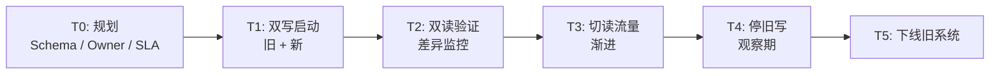
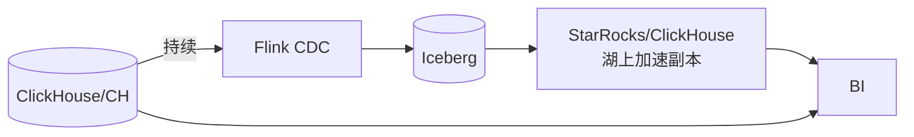

# 迁移手册

!!! tip "一句话理解"
    把**存量系统**迁到一体化湖仓。三条常见路径：**Hive → Iceberg**、**独立数仓 → 湖仓**、**独立向量库 → LanceDB**。每条都有"零停机 vs 一次切"的权衡。

!!! abstract "TL;DR"
    - **零停机双写**是默认起点；"一次切"仅适合小表或非核心
    - **双读验证**（影子流量）是防回归的关键
    - 迁移**同时是治理升级机会**（Owner / Tag / 权限补齐）
    - **别急着删旧系统**：至少留一个 Sprint 的"可回退期"
    - 每次迁移留 **ADR**

## 通用迁移模板



每一步都要有**明确退出标准**和**回退开关**。

## 路径 1：Hive → Iceberg

最常见。两种方式：

### 1A · Register-Only（快）

不动数据文件，把 Hive 表文件作为 Iceberg 数据文件注册：

```sql
CALL system.register_table(
  table => 'db.orders_iceberg',
  metadata_file => 's3://warehouse/orders/metadata/00001-....json'
);

-- 或从 Hive 直接 migrate
CALL iceberg.system.migrate('hive_db.orders');
```

**优点**：分钟级，数据零搬动。
**缺点**：不享受 Iceberg native 分区 / 列 ID / Puffin 等能力。

**用于**：短期解锁 Iceberg 生态，长期计划 rewrite。

### 1B · Rewrite（慢但彻底）

用 CTAS 重写：

```sql
CREATE TABLE db.orders
USING iceberg
PARTITIONED BY (days(ts), bucket(16, user_id))
TBLPROPERTIES ('write.parquet.compression-codec' = 'zstd')
AS SELECT * FROM hive_db.orders;
```

**优点**：native 布局，全部能力可用。
**缺点**：TB 级需几小时到几天；写入高峰要调度避让。

**用于**：核心事实表。

### 1C · 双写过渡

写入侧：同时写 Hive 表和 Iceberg 表；读侧逐步切 Iceberg：

```python
def write_both(records):
    hive_writer.append(records)
    iceberg_writer.append(records)
```

**优点**：零停机 + 可回退。
**缺点**：短期运维成本翻倍。

### 迁移验证清单

- [ ] 行数一致（每分区）
- [ ] 关键聚合值一致（sum / count / max）
- [ ] 查询延迟不退化（对比 Top 20 查询）
- [ ] 权限正确迁移
- [ ] 下游 dashboard / 作业都读新表

## 路径 2：独立数仓（ClickHouse / Greenplum / Redshift）→ 湖仓

### 难点

- 格式转换（ClickHouse MergeTree 不是 Parquet）
- 数据量大（TB-PB 级）
- 下游耦合深（BI 工具直连老 DW）

### 推荐模型



**双路供应**：BI 同时能打旧 DW 和湖 + 加速副本。逐步切流量。

### 关键动作

- 定 "加速副本" 的延迟目标（与旧 DW 对齐）
- 维护**差异 Dashboard**（旧 vs 新，按表粒度）
- 给每个 BI Dashboard 迁移 Ticket

## 路径 3：独立向量库 → LanceDB（湖原生）

### 目标

把 Milvus / Qdrant / Pinecone 里的向量迁到 Lance / Iceberg + Puffin，和源数据共生。

### 步骤

1. **导出向量 + 元数据**（Milvus 支持导出 parquet）
2. **导入 LanceDB**（直接写对象存储）
3. **重建索引**（可能要重新 training IVF centroids）
4. **双路查询**：服务层同时查 Milvus + LanceDB，对比结果
5. **切流量**：渐进 10% → 50% → 100%
6. **下线 Milvus 集群**

### 验证

- 对相同 query 两边 Recall@K 对齐（±1%）
- 延迟在预算内
- 结构化过滤语义一致

## 版本 Freeze 与回退

每次迁移必须：

- **对旧系统 freeze**（不再接新 schema 变化）迁移窗口内
- **回退脚本** 演练过
- 旧系统**至少保留 1 Sprint**"可查询不可写"

## 治理升级要趁这次做

迁移 = 重来一次的机会：

- 补齐 owner / description / tag
- 应用 row-level policy
- 引入血缘
- 归并历史 schema 的老列

"迁移后治理再补"通常 = 永远补不上。

## 陷阱

- **只迁数据不迁查询**：BI 指向旧系统没改
- **Schema 顺带改** 同时做 —— 风险叠加，要拆
- **验证跑 Top 10 查询算通过** —— 长尾 query 才是坑
- **时区 / 精度差异**（decimal / timestamp）悄悄改了值
- **大表一次性迁**：应该分区分批

## 留 ADR

每次大迁移结束写一条 ADR：

- 背景 / 决策 / 代价 / 结果
- 遇到什么坑（team-specific 价值最大）
- 这次治理动作补了什么

## 相关

- [Bulk Loading](../pipelines/bulk-loading.md)
- [Apache Iceberg](../lakehouse/iceberg.md)
- [LanceDB](../retrieval/lancedb.md)
- [数据治理](data-governance.md)
- ADR 模板：[`docs/_templates/adr.md`](https://github.com/wangyong9999/lakehouse-wiki/blob/main/docs/_templates/adr.md)

## 延伸阅读

- *Migrating to Iceberg at Petabyte Scale* —— Netflix / Tabular / Onehouse 博客
- Iceberg Migration Guide: <https://iceberg.apache.org/docs/latest/api/>
