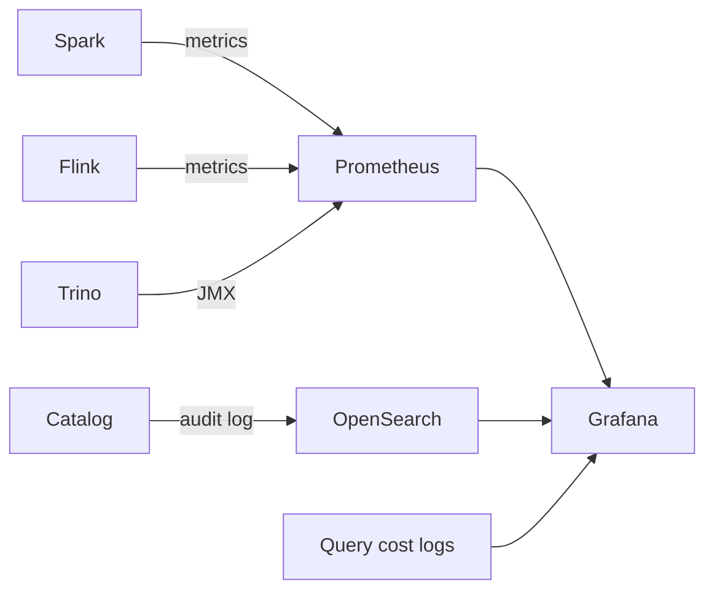

# 可观测性

!!! tip "一句话理解"
    湖仓的"监控"比传统 DB 复杂，因为它跨对象存储、多 Catalog、多引擎、多 writer。至少要看清**四个平面**：写入、Commit、查询、数据质量。

## 四个平面

### 1. 写入平面

- 每个 writer（Spark / Flink / Streaming）的**吞吐、延迟、失败率**
- Commit 间隔与**每次 commit 产生的小文件数**
- 失败的 commit 原因（冲突 / 超时 / Schema 不符）

典型告警：commit 失败率 > 1% / 单小时小文件数 > 10k。

### 2. Catalog / Commit 平面

- Catalog 的 **API 延迟、并发**、commit 失败率
- `metadata.json` 大小增长速度（> MB 级要警惕）
- Snapshot / Manifest 数量趋势
- Catalog 服务自身的可用性、QPS

Catalog 是所有引擎的中心依赖，一旦挂掉整个湖仓停摆。

### 3. 查询平面

- 每条查询的**延迟分布（p50/p95/p99）**、扫描字节数、读取文件数
- 按用户 / 部门 / 表维度聚合成本
- 失败查询的类别（OOM / 超时 / 权限 / 语法）
- **慢查询 Top N** + 关联数据布局（分区 / 排序）状态

### 4. 数据质量 / 新鲜度平面

- 每张表的 **`max(event_time)` vs 当前时间** = 新鲜度
- Row-count 异常（比历史同期低 90%）
- NULL 率 / 枚举值分布漂移
- Schema 变更事件

这个维度对业务信心最关键 —— 指标对不上时，"数据还新鲜吗"要一眼看到。

## 基础设施选型

- **Metrics**：Prometheus + Grafana 是事实标准
- **Audit / Query log**：OpenSearch / ClickHouse 存查询历史
- **Trace**：OpenTelemetry 跨引擎串查询链路
- **Data Quality**：Great Expectations / Soda / 自研 SQL 断言

## 不能漏的关键指标清单

| 类别 | 指标 | 健康阈值 |
| --- | --- | --- |
| 写入 | commit 成功率 | > 99% |
| 写入 | 每表小文件数 | < 10k |
| Catalog | commit p95 | < 500ms |
| Catalog | metadata.json 大小 | < 5MB |
| 查询 | 仪表盘 p95 | < 3s |
| 查询 | 失败率 | < 1% |
| 数据 | 新鲜度（批表） | < 24h |
| 数据 | 新鲜度（流表） | < 10min |
| 成本 | 对象存储 $/TB·月 | 跟踪趋势 |
| 成本 | 引擎 $/查询 Top 10 | 有预算上限 |

## 可观测性反模式

- **只看 Executor 日志不看 Catalog** —— commit 超时时根本没 Executor 到
- **没关联 `query_id` 到查询计划** —— 出问题无法溯源
- **告警太多** —— 没人看，关键告警被淹没
- **没有业务层面的"新鲜度"监控** —— 等业务投诉才发现数据停了 6 小时

## 相关

- [性能调优](performance-tuning.md) —— 诊断靠观测
- [成本优化](cost-optimization.md) —— 同样依赖观测
- [Compaction](../lakehouse/compaction.md)

## 延伸阅读

- *Iceberg Metrics Reporter* —— 原生 metrics 钩子
- *The OpenLineage Standard* —— 跨引擎血缘 / 事件
- Grafana Lakehouse Dashboard 模板（社区）
