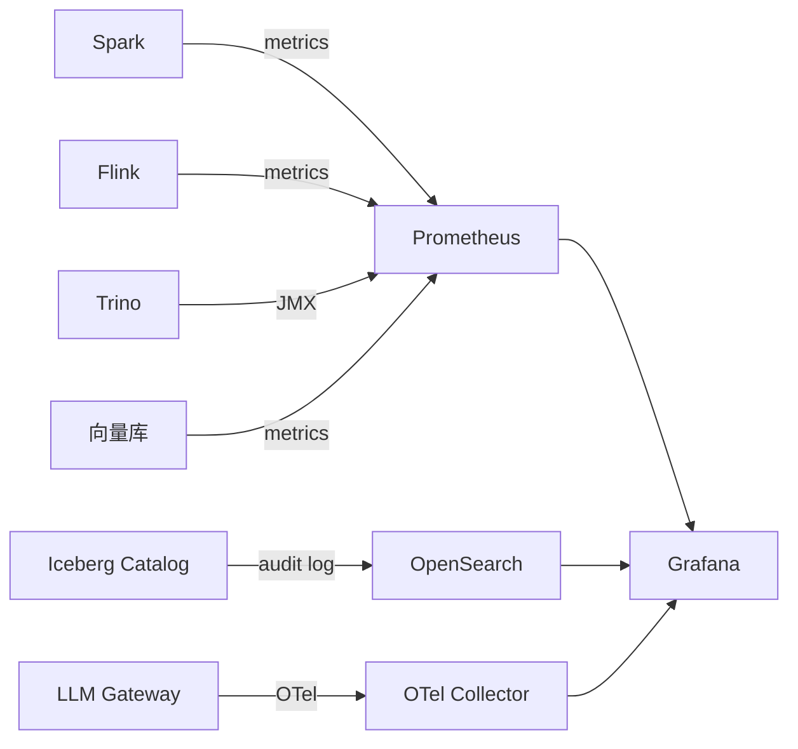

# 可观测性

!!! tip "一句话理解"
    湖仓 + AI 生产的观测比传统 DB 复杂 · 跨**对象存储 · Catalog · 多引擎 · 多 writer · 向量库 · ML 模型 · LLM 应用**。至少要看清**四个平面**（写入 · Catalog · 查询 · 数据质量）+ **三个专用观测面**（ML Monitoring · LLM Observability · Cost）。

!!! warning "章节分工声明"
    - **本页**：**湖仓通用可观测**（写入 / Catalog / 查询 / 数据质量四平面）+ **观测体系设计**（工具链 · 指标 · 告警）
    - **ML 模型监控**（Drift / PSI / Fairness / Auto-retrain）→ [ml-infra/model-monitoring](../ml-infra/model-monitoring.md) canonical
    - **LLM 可观测**（Trace / Cost / Prompt Version / Tool Call）→ [ai-workloads/llm-observability](../ai-workloads/llm-observability.md) canonical
    - **ML 数据质量**（PIT / Label Quality）→ [ml-infra/data-quality-for-ml](../ml-infra/data-quality-for-ml.md) canonical
    - 本页讲**怎么看清湖仓通用平面** + **各专用观测的集成点**

## 1. 四个观测平面（湖仓通用）

### 平面 1 · 写入平面

- 每个 writer（Spark / Flink / Streaming）的**吞吐 · 延迟 · 失败率**
- Commit 间隔与**每次 commit 产生的小文件数**
- 失败的 commit 原因（冲突 / 超时 / Schema 不符）

**典型告警阈值** `[来源未验证 · 示意性 · 依场景调]`：
- commit 失败率 > 1%
- 单小时小文件数 > 10k
- 写入延迟 p99 超预算 × 2

### 平面 2 · Catalog / Commit 平面

- Catalog 的 **API 延迟 · 并发 · commit 失败率**
- `metadata.json` 大小增长速度（> MB 级要警惕）
- Snapshot / Manifest 数量趋势
- Catalog 服务自身的可用性 · QPS

**Catalog 是所有引擎的中心依赖 · 一旦挂掉整个湖仓停摆**。

### 平面 3 · 查询平面

- 每条查询的**延迟分布（p50 / p95 / p99）**· 扫描字节数 · 读取文件数
- 按用户 / 部门 / 表维度聚合成本
- 失败查询的类别（OOM / 超时 / 权限 / 语法）
- **慢查询 Top N** + 关联数据布局状态

### 平面 4 · 数据质量 / 新鲜度平面

- 每张表的 **`max(event_time)` vs 当前时间** = 新鲜度
- Row-count 异常（比历史同期低 90%）
- NULL 率 / 枚举值分布漂移
- Schema 变更事件

**对业务信心最关键** —— 指标对不上时"数据还新鲜吗"要一眼看到。

## 2. 三个专用观测面（非湖仓通用 · 但生产必备）

### 专用面 A · ML 模型监控

**canonical 在 [ml-infra/model-monitoring](../ml-infra/model-monitoring.md)**。本页只列和通用观测的集成点：

- Model drift 告警和**查询平面**的业务 KPI 关联（发现模型退化）
- Auto-retrain 触发 → 进入**写入平面**（新训练数据集产生）
- 详细机制 / 工具 / Auto-retrain 契约 → `ml-infra/model-monitoring`

### 专用面 B · LLM Observability

**canonical 在 [ai-workloads/llm-observability](../ai-workloads/llm-observability.md)**。本页只列集成点：

- LLM trace 走 **OpenTelemetry GenAI 语义规范**（2026-Q1 仍 experimental）· 可以进主 OTel collector
- LLM token 成本进**成本平面**
- Prompt 版本进 Catalog / Registry（见 [ai-workloads/prompt-management](../ai-workloads/prompt-management.md)）
- 工具：Langfuse / LangSmith / Phoenix / Helicone · 详细见 llm-observability canonical

### 专用面 C · Cost Observability

**canonical 在 [cost-optimization](cost-optimization.md)**。本页只列观测视角：

- per-user / per-team / per-table 成本归因
- Top 10 最贵查询 / 最贵表
- GPU-hour · LLM-token 两大 AI 成本
- 工具：Kubecost · CloudHealth · AWS Cost Explorer + 自建 tag 归因

## 3. 基础设施选型 · 2024-2026 生态

### 3.1 Metrics 层

- **Prometheus + Grafana**：事实标准
- **OTel Collector**：2024-2026 跨引擎 trace 统一入口

### 3.2 Data Observability 专门工具（2024-2026 成熟）

| 工具 | 定位 | 优势 |
|---|---|---|
| **Elementary**（OSS · 2024 活跃）| dbt-native · 数据质量监控 | 开源 · 和 dbt 深集成 |
| **Monte Carlo**（商业）| 端到端 Data Observability | 企业客户最广 · 自动异常检测 |
| **Bigeye**（商业）| 数据质量 + 血缘 | metric-based · SLA 友好 |
| **Datafold**（商业）| Data Diff 为核心 | CI/CD 集成强 |
| **Datadog Data Observability** | 数据观测进 Datadog | APM + 数据一体 |
| **Acceldata** / **Anomalo** | 企业级自动异常检测 | 2024+ 头部 |
| **Great Expectations**（OSS） | Expectation suite · 偏测试 | 成熟 · 定制强 |
| **Soda**（OSS + 云）| SodaCL DSL | 简洁 · dbt-like |

**默认推荐**：
- 开源栈 → Elementary + Great Expectations / Soda Core
- 企业级 → Monte Carlo / Bigeye
- dbt 重用户 → Elementary + dbt tests
- 有 Datadog → Datadog Data Observability（减工具数）

### 3.3 Lineage · OpenLineage 标准

**OpenLineage**（2024-2026 事实标准）：
- 跨引擎血缘事件协议（Spark / Flink / Trino / dbt / Airflow 都出事件）
- **Marquez** 作 OpenLineage 参考实现
- **DataHub** 消费 OpenLineage 事件 · 可视化

### 3.4 Trace · OpenTelemetry + OTel GenAI

- **OTel**：通用分布式 trace（跨引擎串查询链路）
- **OTel GenAI 语义规范**（2024-2025 起草 · 2026-Q1 仍 experimental）：LLM 调用的标准化 trace
- 统一 collector：OTel Collector

## 4. 必看的指标清单

| 类别 | 指标 | 健康阈值 `[来源未验证 · 经验值]` |
|---|---|---|
| **写入** | commit 成功率 | > 99% |
| **写入** | 每表小文件数 | < 10k |
| **Catalog** | commit p95 | < 500ms |
| **Catalog** | metadata.json 大小 | < 5MB |
| **查询** | 仪表盘 p95 | < 3s |
| **查询** | 失败率 | < 1% |
| **数据** | 新鲜度（批表）| < 24h |
| **数据** | 新鲜度（流表）| < 10min |
| **成本** | 对象存储 $/TB·月 | 跟踪趋势 |
| **成本** | 引擎 $/查询 Top 10 | 有预算上限 |
| **ML**（详见 model-monitoring）| PSI | < 0.25 |
| **LLM**（详见 llm-observability）| Token 成本 / 小时 | 有预算 |

## 5. 告警设计原则

### 5.1 三级告警

- **关注（Info）**：不紧急 · 定期 review
- **警告（Warning）**：有趋势 · 小时级关注
- **紧急（Critical）**：立即响应 · oncall 页进入 → [incident-management](incident-management.md)

### 5.2 告警疲劳反模式

- **告警太多** · 真实告警被淹没
- **每条告警都 P0** · oncall 崩溃
- **告警没关联 runbook** · oncall 不知道怎么办

**好告警的 4 要素**：
1. **可执行**（告警说明应该做什么）
2. **有主人**（指定 oncall）
3. **关联 runbook**（链接到排查手册）
4. **有聚合**（同类告警合并 · 不重复轰炸）

## 6. 数据观测进 BI

**观测不应是 ops 专属** —— 业务用户应在 BI 侧看到：

- 表的 **质量评分** / **新鲜度**显示（DataHub / UC 集成 BI）
- 血缘在 BI 里可视化（"这个指标从哪来"）
- 数据异常告警通知业务方

**工具**：DataHub / OpenMetadata / Unity Catalog 都在做这层。

## 7. 可观测性反模式

- **只看 Executor 日志不看 Catalog**：commit 超时时根本没 Executor 触发
- **没关联 `query_id` 到查询计划**：出问题无法溯源
- **告警太多**：没人看 · 关键告警被淹没
- **没有业务层面的"新鲜度"监控**：等业务投诉才发现数据停了 6 小时
- **ML/LLM 观测另起一套**：应该统一 OTel 入口 · 否则多平台割裂
- **Cost observability 单独系统**：应该和 query 观测一套（成本 = 查询的代价）
- **Data quality 只在 pipeline 末端**：应分层（schema 入湖 / 业务规则 ETL 中 / 分布监控在查询前）

## 8. 落地顺序建议

**L0 → L1**（从无到有）：
1. Prometheus + Grafana 基础 metrics
2. Iceberg / Catalog 基础告警
3. 关键表新鲜度监控

**L1 → L2**（规范化）：
4. OpenLineage + Marquez / DataHub · 血缘
5. Elementary + Great Expectations / Soda · 数据质量
6. 告警分级 + runbook
7. 进 incident-management 流程

**L2 → L3**（卓越）：
8. OTel GenAI trace（LLM / Agent 应用）
9. 自动异常检测（Monte Carlo / Anomalo）
10. 自愈（简单告警自动修复）
11. 数据观测进 BI · 业务自助

## 9. 相关

- [性能调优](performance-tuning.md) —— 诊断靠观测
- [成本优化](cost-optimization.md) —— 同样依赖观测
- [SLA · SLO · DRE](sla-slo.md) —— 可靠性承诺靠观测做判断
- [故障响应](incident-management.md) —— 告警进入 incident 流程
- [故障排查](troubleshooting.md) —— 排查靠观测数据
- [ml-infra/model-monitoring](../ml-infra/model-monitoring.md) —— ML 监控 canonical
- [ai-workloads/llm-observability](../ai-workloads/llm-observability.md) —— LLM 观测 canonical
- [Compaction](../lakehouse/compaction.md) —— 小文件治理

## 10. 延伸阅读

- *Iceberg Metrics Reporter* —— 原生 metrics 钩子
- *The OpenLineage Standard* · <https://openlineage.io/>
- *OpenTelemetry GenAI Semantic Conventions*（2024-2026 草案）
- Grafana Lakehouse Dashboard 模板（社区）
- Monte Carlo · *Data Observability* 白皮书系列
- Elementary: <https://docs.elementary-data.com/>
- *Data Reliability Engineering* · Monte Carlo blog 系列
