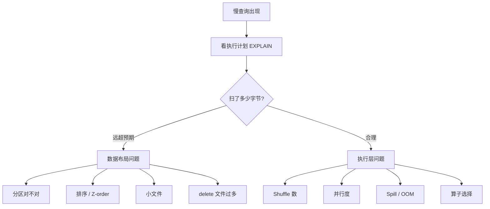

# 性能调优

!!! tip "一句话理解"
    湖仓性能问题 80% 源于**数据布局不对**（分区错、小文件、没排序）；剩下 20% 是**执行层**（引擎参数、资源配置、并发）。先治数据布局，再调执行器。

## 诊断流程

**不要闷头调参数**。照这个顺序走：

"扫了多少字节"是最关键的第一问。如果一条查询扫了 100GB 却期望只扫 1GB，调参数没用，**去改数据布局**。

## 数据布局优化清单

### 1. 分区

- 查询最常用的 `WHERE` 列作为分区键
- 粒度：单分区 500MB – 5GB 为宜，太细（< 100MB）会小文件爆
- Iceberg 用 **Hidden Partitioning**（`PARTITIONED BY days(ts)`）免手工分区过滤

### 2. 文件大小

- **目标文件大小 128MB – 1GB**（Parquet 的甜区）
- 流写后定期 [Compaction](../lakehouse/compaction.md) 合并
- 小文件问题 **> 10k 文件/分区**时查询会明显变慢

### 3. 排序 / Z-order

- 按 Top 查询的 `WHERE` 列 sort
- 多列查询用 Z-order / Liquid Clustering

### 4. Delete 文件

- MoR 表 `delta / base > 30%` 就要合并
- 每表 delete 文件数保持在 < 数十

### 5. Schema / 类型

- 小基数列用 `STRING`（字典压缩）；大字符串考虑哈希化
- 不要把 JSON blob 整列存——解析成本爆
- **维度预 join 进宽表**（参考 [OLAP 建模](../bi-workloads/olap-modeling.md)）

## 执行层优化

### Spark

- `spark.sql.adaptive.enabled = true`（AQE 动态调分区）
- `spark.sql.files.maxPartitionBytes` 调至 128–256MB
- Shuffle 分区数匹配数据规模（默认 200 常常太小）
- Broadcast join 阈值按集群内存调

### Trino

- `task.concurrency`、`query.max-memory` 按集群规模配
- Resource Group 硬隔离 BI / 探索 / ETL
- JDBC 连接池 + 长查询的 coordinator 侧 timeout

### Flink

- State Backend：RocksDB + 周期 checkpoint
- Slot 数 = TaskManager CPU × 业务并行度
- Watermark 策略与乱序容忍

## 几个常见"百试百灵"

- **查询扫 TB 但应该只扫 GB** → 分区或 sort 没命中
- **查询 CPU 没满但很慢** → IO 瓶颈，增加并行度或加速副本
- **大 shuffle + OOM** → 调 shuffle 分区数、开 AQE
- **Flink 作业越跑越慢** → 状态膨胀，检查 TTL / checkpoint 大小
- **Trino 高峰崩** → coordinator 单点，Resource Group 没上

## 和可观测性的关系

没有 [可观测性](observability.md) 就没有调优。每次调优要能回答：

1. 改之前 p50/p95 是多少？
2. 改了什么？
3. 改之后 p50/p95 是多少？
4. 有没有造成其他查询退化？

## 相关

- [查询加速](../bi-workloads/query-acceleration.md)
- [Compaction](../lakehouse/compaction.md)
- [可观测性](observability.md)
- [成本优化](cost-optimization.md)

## 延伸阅读

- *Efficient Query Processing in Data Lakehouses* —— 学术综述
- Iceberg / Spark / Trino 各自官方 Tuning Guide
