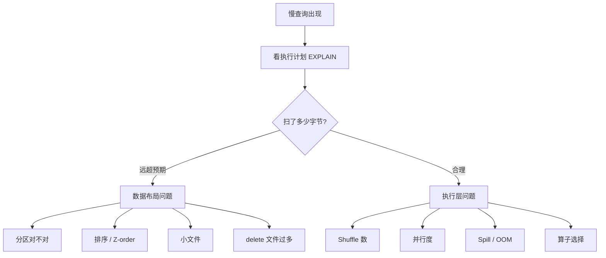

!!! warning "章节分工声明"
    - **本页**：湖仓 + 向量检索的通用性能调优方法
    - **机制深入**：[Compaction](../lakehouse/compaction.md) · [谓词下推](../query-engines/predicate-pushdown.md) · [向量化执行](../query-engines/vectorized-execution.md)
    - **AI 应用延迟预算**（TTFT / Token · RAG 端到端分解）→ [ai-workloads/llm-inference](../ai-workloads/llm-inference.md) · [scenarios/multimodal-search-pipeline](../scenarios/multimodal-search-pipeline.md)
    - **诊断手段**：靠 [可观测性](observability.md) · 无观测不调优

# 性能调优

!!! tip "一句话理解"
    湖仓性能问题 80% 源于**数据布局不对**（分区错、小文件、没排序）；剩下 20% 是**执行层**（引擎参数、资源配置、并发）。先治数据布局，再调执行器。

## 诊断流程

**不要闷头调参数**。照这个顺序走：



"扫了多少字节"是最关键的第一问。如果一条查询扫了 100GB 却期望只扫 1GB，调参数没用，**去改数据布局**。

## 数据布局优化清单

### 1. 分区

- 查询最常用的 `WHERE` 列作为分区键
- 粒度：单分区 500MB – 5GB 为宜，太细（< 100MB）会小文件爆
- Iceberg 用 **Hidden Partitioning**（`PARTITIONED BY days(ts)`）免手工分区过滤

### 2. 文件大小

- **目标文件大小 128MB – 1GB**（Parquet 的甜区）
- 流写后定期 [Compaction](../lakehouse/compaction.md) 合并
- 小文件问题 **> 10k 文件/分区**时查询会明显变慢

### 3. 排序 / Z-order

- 按 Top 查询的 `WHERE` 列 sort
- 多列查询用 Z-order / Liquid Clustering

### 4. Delete 文件

- MoR 表 `delta / base > 30%` 就要合并
- 每表 delete 文件数保持在 < 数十

### 5. Schema / 类型

- 小基数列用 `STRING`（字典压缩）；大字符串考虑哈希化
- 不要把 JSON blob 整列存——解析成本爆
- **维度预 join 进宽表**（参考 [OLAP 建模](../bi-workloads/olap-modeling.md)）

## 执行层优化

### Spark

- `spark.sql.adaptive.enabled = true`（AQE 动态调分区）
- `spark.sql.files.maxPartitionBytes` 调至 128–256MB
- Shuffle 分区数匹配数据规模（默认 200 常常太小）
- Broadcast join 阈值按集群内存调

### Trino

- `task.concurrency`、`query.max-memory` 按集群规模配
- Resource Group 硬隔离 BI / 探索 / ETL
- JDBC 连接池 + 长查询的 coordinator 侧 timeout

### Flink

- State Backend：RocksDB + 周期 checkpoint
- Slot 数 = TaskManager CPU × 业务并行度
- Watermark 策略与乱序容忍

## 几个常见"百试百灵"

- **查询扫 TB 但应该只扫 GB** → 分区或 sort 没命中
- **查询 CPU 没满但很慢** → IO 瓶颈，增加并行度或加速副本
- **大 shuffle + OOM** → 调 shuffle 分区数、开 AQE
- **Flink 作业越跑越慢** → 状态膨胀，检查 TTL / checkpoint 大小
- **Trino 高峰崩** → coordinator 单点，Resource Group 没上

## 2024-2026 性能前沿

### 向量化执行引擎的代际

**2024-2026 年性能竞赛的主战场是向量化执行引擎**：

| 引擎 | 代表 | 特点 |
|---|---|---|
| **Photon**（Databricks）| C++ 重写 Spark · SIMD 列批 · 编译 | 商业闭源 · Databricks 商业护城河 |
| **Velox**（Meta · OSS）| Presto / Spark 共享的 C++ 执行库 | 跨引擎 OSS 库 · 2024+ 生态活跃 |
| **DataFusion**（Apache OSS · Rust）| Rust 向量化 · Arrow 原生 | OSS 新主力 · 数仓引擎底座 |
| **Vortex / LiquidCache**（2024-2025 新）| 存储 + 执行融合 | 前沿 |

**调优启示**：如果你在 OSS Spark / Trino · 可以评估接入 Velox / DataFusion（性能提升一档级别 · `[来源未验证 · 需自测]`）。

### Iceberg v3 的性能影响

Iceberg v3（2025-2026 演进）对性能的影响：

- **Row lineage**：细粒度追踪 · **查询多一层 metadata 读取** · 规划时间略增
- **Deletion Vector** · 替代 position delete · **MoR 读性能显著改善**（对比 Iceberg v2 delete files）
- **Multi-table transaction**：跨表 commit 原子性 · 但 **commit 延迟略增**（Catalog CAS 次数）
- **Variant 类型**：半结构化数据查询性能接近原生列

**调优建议**：
- 新项目默认 v3（享受 deletion vector）
- 历史 MoR 表评估 v2→v3 迁移（重度写入场景收益大）

## 向量检索性能调优（本章新增）

### HNSW 调优

```
核心参数:
- M: 邻居数 · 默认 16 · 增大提升 recall · 增大内存
- ef_construction: 建索引时的搜索深度 · 默认 128
- ef: 查询时深度 · 默认 64 · 增大提升 recall / 增大延迟
```

**调优矩阵** `[来源未验证 · 示意性 · 依数据集差异大]`：

| 场景 | M | ef | 备注 |
|---|---|---|---|
| 通用 | 16 | 64 | 默认 · 平衡 recall 和延迟 |
| 高 recall 要求 | 32 | 128 | 内存 × 2 · 延迟 × 1.5 |
| 低延迟要求 | 8 | 32 | Recall 降低 · 延迟减半 |

### IVF-PQ 调优（大规模场景）

- **nlist**（聚类数）：典型 `sqrt(N)` · N 是向量数
- **nprobe**（查询几个聚类）：10-50 · 影响 recall vs 延迟
- **PQ**（量化）：降维比 4-16× · 精度损失可接受

### 过滤感知 ANN（2024-2026 新）

Qdrant / Milvus 2.4+ / LanceDB 的 **filter-aware ANN**：
- 索引构建时记录元数据
- 查询时边搜索边过滤
- 避免 post-filter 召回失效

**详见 [retrieval/filter-aware-search](../retrieval/filter-aware-search.md)**。

## AI 应用延迟预算（引用 ai-workloads）

RAG 端到端 p95 < 1.5s 示例：

| 阶段 | 预算 |
|---|---|
| 检索（向量 + Hybrid）| 100-300ms |
| Rerank | 50-150ms |
| LLM TTFT | 200-500ms |
| LLM 剩余 tokens | 500-1000ms |

**TTFT 是 LLM UX 关键**。详细见 [ai-workloads/llm-inference](../ai-workloads/llm-inference.md) · [scenarios/multimodal-search-pipeline](../scenarios/multimodal-search-pipeline.md) §SLO 预算。

## 和可观测性的关系

没有 [可观测性](observability.md) 就没有调优。每次调优要能回答：

1. 改之前 p50/p95 是多少？
2. 改了什么？
3. 改之后 p50/p95 是多少？
4. 有没有造成其他查询退化？

## 相关

- [查询加速](../bi-workloads/query-acceleration.md)
- [Compaction](../lakehouse/compaction.md)
- [可观测性](observability.md)
- [成本优化](cost-optimization.md)

## 延伸阅读

- *Efficient Query Processing in Data Lakehouses* —— 学术综述
- Iceberg / Spark / Trino 各自官方 Tuning Guide
