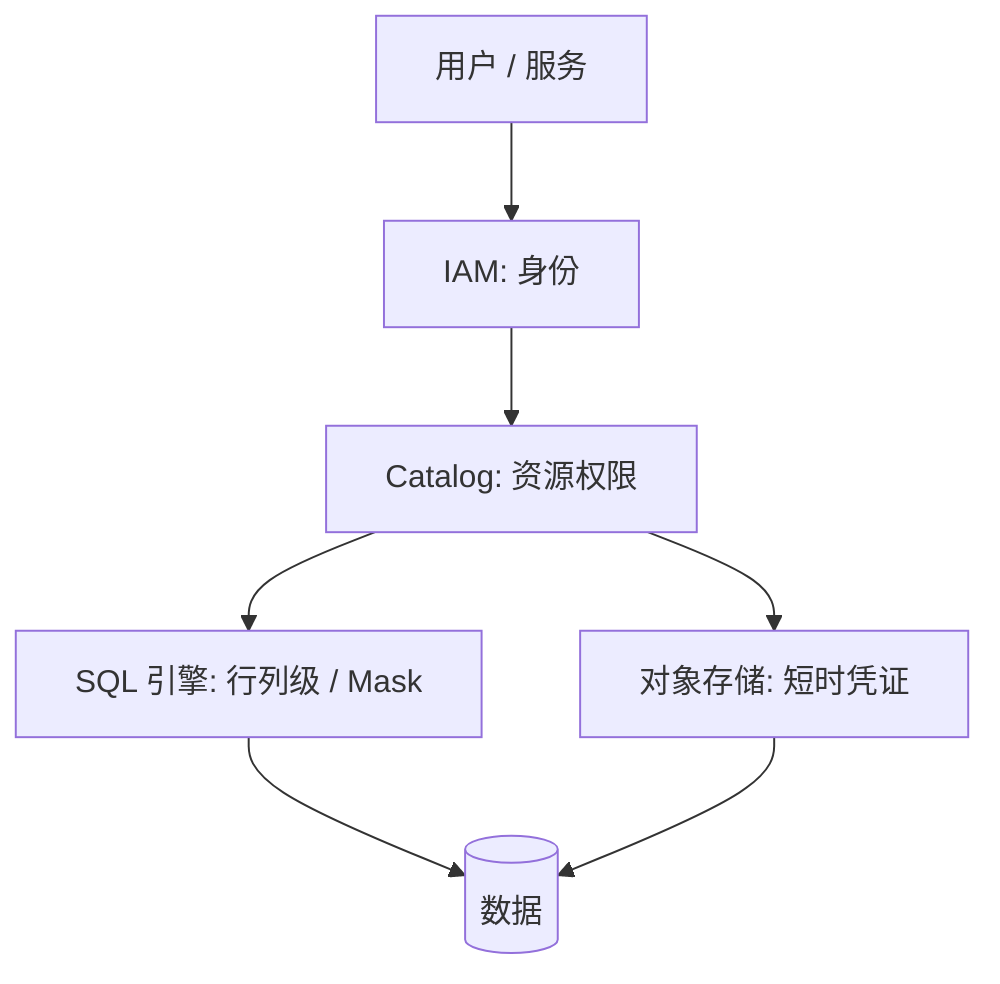

!!! warning "章节分工声明"
    - **本页**：**湖仓通用权限 + 安全基础设施**（身份 · Catalog 权限 · SQL 细粒度 · 凭证 · Zero Trust）
    - **AI 应用权限**（Tool ACL · Data ACL · Cache 隔离 · Identity 流转 · Multi-tenant）→ [ai-workloads/authorization](../ai-workloads/authorization.md) canonical
    - **Catalog 治理细节** → [catalog/strategy](../catalog/strategy.md)
    - **多租户隔离** → [multi-tenancy](multi-tenancy.md)
    - **合规法规**（GDPR · EU AI Act）→ [compliance](compliance.md)
    - 本页专注**湖仓数据层的安全基础设施** · AI 应用层的权限去 authorization canonical

# 安全与权限

!!! tip "一句话理解"
    湖仓的权限**不能只在 SQL 层做**。数据就在对象存储里，任何拿到 key 的人都能直连绕过 SQL。**Catalog 必须颁发短时凭证**，权限必须跨 SQL / API / 存储三个平面统一。

## 四层防线



1. **身份（IAM）** —— 用户 / 服务是谁（SSO / OAuth / IAM Role）
2. **资源（Catalog）** —— 能看哪些 Catalog / Schema / 表 / 向量 / 模型
3. **SQL 内细粒度** —— 行级 / 列级 / Mask / Dynamic View
4. **存储凭证** —— Catalog 给引擎/客户端**短时凭证**（STS token），不长期 key

## 为什么 SQL 层权限不够

传统数仓的权限在 SQL 层（GRANT/REVOKE）就行了——因为数据藏在 DB 进程后面。湖仓**数据摊在对象存储里**：

- 一个 data scientist 拿到 S3 bucket 的 key → 可以直接 `aws s3 cp` 拉全表
- 引擎外的工具（Python notebook 直连 S3）完全绕过 SQL

**解决方案 = Credential Vending**：Catalog 是唯一有长期凭证的地方；引擎每次访问都向 Catalog 要一把**短时（15 min）、最小权限**的 token。

Unity Catalog、Polaris、Gravitino、Databricks 都走这条路。

## 细粒度权限

现代 Catalog 支持：

### 行级过滤（Row Filter）

```sql
ALTER TABLE customers SET ROW FILTER
  rule_tenant_isolation(CURRENT_USER(), tenant_id);
```

用户查表时 **自动加 WHERE**，不看到其他租户的行。

### 列级 Mask

```sql
ALTER TABLE customers ALTER COLUMN phone
  SET MASK mask_phone_for(CURRENT_USER());
```

查询返回时**替换成 `***`**，但表结构对用户可见。

### Tag 策略

给列 / 表打标签（`pii`、`public`、`financial`），权限规则按 tag 下发而非逐表。

### Dynamic View

视图里嵌入 `CURRENT_USER()` / `IS_MEMBER()`：

```sql
CREATE VIEW orders_view AS
  SELECT *
  FROM orders
  WHERE region = get_user_region(CURRENT_USER());
```

## 在 AI / 多模场景的放大

以上都是"表列权限"。**多模资产**引入新维度：

- **向量里可能藏 PII** —— 文本 embedding 可被反演出原文
- **模型本身是资产** —— 模型权限比数据权限更敏感
- **Volume（文件）** —— 图片 / 文档权限

Unity Catalog / Gravitino 都把"向量列""模型""Volume"当资源纳入 RBAC 模型。自研方案必须照做。

## 合规与数据保护

- **GDPR 删除权** —— 用户要求删除 → 跨所有表 + 向量 + embedding + 缓存要求删除
- **审计日志** —— 谁在什么时候查了什么；Catalog 层开**必须开**
- **加密**：
    - **Static**：对象存储侧 SSE-KMS
    - **In-transit**：TLS
    - **Column-level encryption**：部分 Catalog 支持字段级加密

## 典型反模式

- **长期 AWS Access Key 直接发给开发者** —— 最大的安全漏洞
- **权限只在 BI 工具层** —— 从 notebook / Spark 直连湖就破掉了
- **所有人都是 admin 角色** —— 早期常见，事故后才拆
- **审计关了省钱** —— 出事后无法溯源
- **多模资产（向量/模型）没权限模型** —— 一致性被打破

## 现代身份协议（2024-2026 更新）

### OIDC vs SAML vs OAuth 2.1

| 协议 | 场景 | 2024-2026 趋势 |
|---|---|---|
| **OIDC**（OpenID Connect）| Web + API 身份 | **主流**（OAuth 2.1 的身份扩展）|
| **SAML 2.0** | 企业 SSO 传统 | 大企业存量 · 新集成少 |
| **OAuth 2.1** | API 授权 | RFC 2024+ 整合 OAuth 2.0 的最佳实践 |
| **Passkeys / WebAuthn** | 无密码登录 | **2024-2026 新主流**（Apple / Google / Microsoft 推） |

**数据平台主要用 OIDC + OAuth 2.1**（用户 → Catalog → 引擎链路）。

### Zero Trust 架构

**核心原则**："**Never Trust · Always Verify**" —— 不信任网络 · 每次访问都验证身份。

数据平台的 Zero Trust 落地：
- **没有网络边界豁免**（VPN 内也要验证 · 不是"内网就信任"）
- **最小权限** · Credential Vending（见 §为什么 SQL 层权限不够）
- **持续验证**（session 每 15min 刷 token）
- **所有访问审计**
- **mTLS 跨服务通信**（Service Mesh / Istio / Linkerd）

**工具**：BeyondCorp（Google 原型）· Zscaler · Cloudflare Access · Tailscale。

## Secrets Management

**专用 Secrets 管理是生产必备**：

| 工具 | 定位 |
|---|---|
| **HashiCorp Vault** | 开源 · 事实标准 · Dynamic Secrets · PKI |
| **AWS Secrets Manager** | AWS 原生 · KMS 集成 |
| **GCP Secret Manager** · **Azure Key Vault** | 各云原生 |
| **Sealed Secrets**（K8s）| K8s 内 secret 加密 · GitOps 友好 |
| **SOPS + Age/GPG** | 文件级加密 · GitOps 基础 |

**典型实践**：
- 数据库密码 / API Key / Catalog token 全部走 Vault
- 应用启动时拉 secret · 不写入镜像 / 环境变量硬编码
- **Dynamic Secrets**：Vault 动态生成短时 DB 账号（比静态账号更安全）

**反模式**：
- AWS Access Key 写配置文件
- Slack 里发密码
- Git 仓库提交 secret（用 **git-secrets** / **trufflehog** 扫描）

## mTLS 和 Service Mesh

跨服务通信加密 + 身份验证：

- **mTLS**（mutual TLS）：双向证书验证 · 防中间人 · 证明对方身份
- **Service Mesh**（Istio / Linkerd / Consul Connect）：
  - 自动 mTLS 所有服务间通信
  - 零配置策略（身份即证书）
  - 统一审计 / observability

**数据平台场景**：Spark → Trino → Iceberg Catalog → 对象存储 · 每段都 mTLS 保护。

## 审计日志 · 详细模式

### 保留期限

| 用途 | 建议保留 |
|---|---|
| 合规审计（GDPR / SOC 2） | ≥ 3 年 |
| 安全事件追溯 | ≥ 1 年 |
| 日常排查 | ≥ 90 天 |

### SIEM 集成

审计日志送 **SIEM**（Security Information and Event Management）系统：
- **Splunk**（商业 · 最广）
- **Elastic Security**（ELK 生态）
- **Datadog Cloud SIEM**
- **AWS CloudTrail** + **GuardDuty**

### 异常检测

审计日志上做异常检测：
- 异常访问模式（半夜扫大表）
- 权限提升尝试（短时间多次查高敏感表）
- 数据外泄信号（大批 SELECT + 导出）

## AI 应用权限的边界（指向 canonical）

AI 应用（LLM · Agent · RAG）有**专属权限维度**：
- **Tool ACL**（Agent 能调哪些 Tool）
- **Data ACL**（RAG 检索能看哪些文档）
- **Cache 隔离**（语义缓存不跨租户）
- **Log 隔离**（Prompt 日志不跨租户）
- **Identity 流转**（Agent 以谁的身份执行）

**canonical 在 [ai-workloads/authorization](../ai-workloads/authorization.md)** · 本页不重复。

## 执行治理 · 日常运维面

**很多团队权限架构设计得好 · 但翻车在日常执行上**——access review 不做 · 服务账号滥用 · break-glass 事后没回收 · 离职账号留半年。本节讲**节奏化的执行**。

### Access Review · 季度节奏

**目标**：每个权限"有人 own · 有明确依据 · 定期 recertify"。

```
季度触发 → 导出权限快照 → Owner review → 差异确认 → 吊销无依据的 → 更新 baseline
```

**季度 access review 清单**：
- [ ] **人员权限**：每个用户当前权限 vs 上季度 · 差异给对应 owner 确认
- [ ] **团队权限**：团队角色（role）成员对比 · 离职 / 换岗自动剔除
- [ ] **服务账号**：见 §服务账号生命周期
- [ ] **外部访问**：合作伙伴 / 外包 / 第三方 token · 有效期 + review
- [ ] **管理员权限**：admin / root · 最严格 · 至少双人 review

**工具**：AWS Access Analyzer / SailPoint / Okta Access Review / Databricks Account Console / Snowflake ACCOUNT_USAGE.GRANTS。

**常见问题**：
- **Review 形同虚设**：owner 全部 "approve" 不细看 → 要求**列出有变化**的条目单独确认 · 而不是全量 rubber-stamp
- **粒度太粗**：只 review `role_membership` · 不看具体权限 → 列级 / 行级策略也要 review
- **滞后**：季度太长 · 大公司可做月度 · 敏感权限（prod write）更短

### Break-glass · 紧急提权 SOP

**场景**：P0 生产事故 · 需要临时超权限（如 prod 写权限紧急修复）。

**原则**：
1. **永远有通道**（不能卡死 · 否则事故扩大）
2. **永远留痕**（谁在何时用什么理由提了什么权）
3. **永远回收**（有 TTL · 自动撤销）

**典型 SOP**：

```
1. 事故触发 → IC 判断需要 break-glass
2. oncall 通过 break-glass 工具申请（PIM / 自建）· 填事故 ID + 理由
3. 自动 / 人工 approve（P0 事故 · 单人批 · 双人背书）
4. 临时 role 生效（TTL 4 小时 · 最长 24 小时）
5. 所有操作 audit（SIEM 告警 · 实时通知 Security Team）
6. TTL 到期自动撤销 · 人工二次确认不再需要
7. 事故 postmortem 附 break-glass 使用记录 · review 是否必要
```

**工具参考**：Azure PIM · AWS IAM Access Analyzer + Temporary Credentials · Teleport · HashiCorp Boundary · 自建（基于 Vault short-TTL tokens）。

**反模式**：
- **常驻 admin 不用 break-glass** → admin 账号就是 break-glass 的滥用版
- **Break-glass TTL 几天** → 实际成了常驻 · 应 < 24 小时
- **Break-glass 不告警** → Security 不知情
- **事故结束不清理** → 下次事故就常驻了

### Recertification · 年度重认证

**区别于 Access Review**：
- Access Review = 季度 · 看**差异** · owner 确认增量
- Recertification = 年度 · **重零**整个权限 · owner 重新证明"为什么此人需要此权限"

**Recertification 触发**：
- 年度固定节奏（多数团队）
- 合规要求（SOC 2 / HIPAA / PCI DSS · 通常年度 attest）
- 重大事件（被审计 / 入侵 / 大规模组织变动）

**流程**：
1. 导出当前全量权限快照
2. 按 owner 分解 · 每人收到一份"你 own 的权限列表"
3. Owner 对每条标 `keep / revoke / transfer`
4. 未在 deadline 响应的默认 `revoke`（grace 2 周）
5. 生成重认证报告 · 合规 attest 可用

### 服务账号生命周期

**服务账号**（service account / technical user）是生产最大权限泄漏源——常年不过期 · 权限过大 · 密钥不轮换。

**5 阶段生命周期**：

```
创建 → 日常 → 轮换 → 监控 → 退役
```

| 阶段 | 要求 |
|---|---|
| **创建** | Owner 填清楚 · 用途明确 · 最小权限 · 有效期（建议 1 年）· 密钥存 Vault |
| **日常** | 监控使用 · 未使用 30 天告警 · 每季度 review owner |
| **轮换** | Vault 自动轮换（DB 账号 30 天 · 云 IAM 90 天）· 不轮换的降级 |
| **监控** | 所有服务账号操作进 SIEM · 异常用量告警（见 §异常检测）|
| **退役** | Owner 离职 / 业务下线 → 30 天 grace → 自动 disable → 90 天后删除 |

**关键**：
- **一人一号 · 一服务一号**：不共享 service account · 审计追责才可能
- **永远不手写长期 key**：短 TTL token · 或机器身份（IRSA / Workload Identity）
- **Legacy account 特殊对待**：存量的常驻 key 必须定期审 · 迁移到短 token

### Off-boarding · 离职 / 换岗回收

**最常翻车环节**——HR 流程和技术权限回收脱节。

**SOP**：
1. HR 触发 leaver event（自动同步到 IdP：Okta / Azure AD / Workday）
2. IdP 禁用账号 → 自动 propagate 到下游（SSO → 所有系统）
3. **强制撤销**短期 token / session · 避免"禁用后 token 还有效"
4. Owner 权限 transfer（上游表 / 服务账号）· 见 [data-governance §2.2](data-governance.md)
5. 特殊资源手动清理：本地密钥 / 代码库 secret scan / 第三方 SaaS

**换岗**（同公司不同团队）：
- 先 grant 新权限 · 后 revoke 旧权限（过渡 30 天）
- 避免"换岗当日直接切"引起业务中断

**定期核对**：
- IdP 用户列表 vs HR 系统 · 月度 diff
- 每季度全量 leaver audit · 遗漏账号立即处理

### 执行治理 Operating Cadence

| 周期 | 活动 |
|---|---|
| 日 | Break-glass 使用 + 异常权限操作告警 review |
| 周 | 新增用户 / 服务账号审视 · 高权限变更 review |
| 月 | 服务账号使用率 + 未用账号清理 · Leaver 审计 |
| 季度 | **Access Review** · 全量权限 diff + owner 确认 |
| 年度 | **Recertification** · 合规 attest · 长周期 key 轮换 check |

## 最小可用清单

团队上线湖仓权限至少要做到：

- [ ] Catalog 对所有表 / 向量 / Volume 有 owner
- [ ] 对象存储 long-lived key **不下发给人**
- [ ] Catalog 颁发短时 STS token
- [ ] Audit log 开启并保存 ≥ 90 天
- [ ] 每季度权限 review（Access Review · 差异确认）
- [ ] 年度 recertification · 合规 attest
- [ ] Break-glass SOP 文档化 + 工具化（TTL + 告警 + 回收）
- [ ] 服务账号有 owner · 有 TTL · 自动轮换
- [ ] Off-boarding HR → IdP → 下游 propagate 链路打通
- [ ] PII 列有 Mask 或 Tag 策略
- [ ] GDPR 删除流程打通（Iceberg `DELETE` + 向量库 + 缓存）

## 相关

- [统一 Catalog 策略](../catalog/strategy.md)
- [Unity Catalog](../catalog/unity-catalog.md)
- [Apache Polaris](../catalog/polaris.md)
- [可观测性](observability.md)
- [数据治理](data-governance.md)

## 延伸阅读

- *Data Security in Lakehouse*（Databricks / Immuta 博客系列）
- Apache Ranger docs（传统 Hive 生态）
- NIST SP 800-92 日志管理指南
