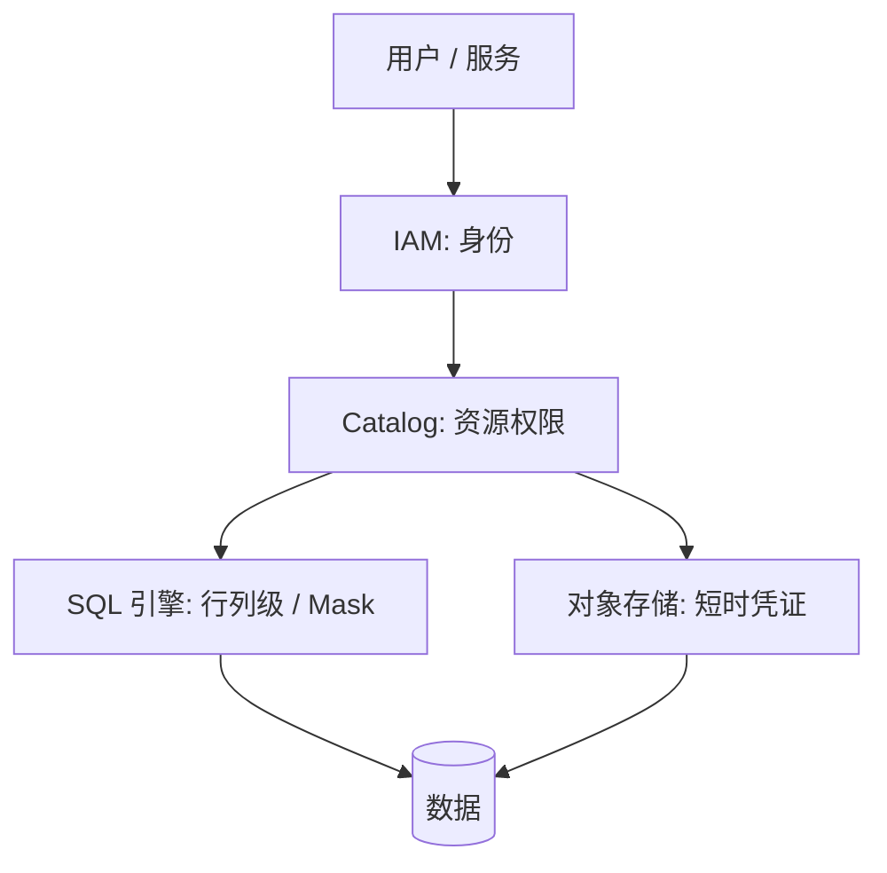

# 安全与权限

!!! tip "一句话理解"
    湖仓的权限**不能只在 SQL 层做**。数据就在对象存储里，任何拿到 key 的人都能直连绕过 SQL。**Catalog 必须颁发短时凭证**，权限必须跨 SQL / API / 存储三个平面统一。

## 四层防线



1. **身份（IAM）** —— 用户 / 服务是谁（SSO / OAuth / IAM Role）
2. **资源（Catalog）** —— 能看哪些 Catalog / Schema / 表 / 向量 / 模型
3. **SQL 内细粒度** —— 行级 / 列级 / Mask / Dynamic View
4. **存储凭证** —— Catalog 给引擎/客户端**短时凭证**（STS token），不长期 key

## 为什么 SQL 层权限不够

传统数仓的权限在 SQL 层（GRANT/REVOKE）就行了——因为数据藏在 DB 进程后面。湖仓**数据摊在对象存储里**：

- 一个 data scientist 拿到 S3 bucket 的 key → 可以直接 `aws s3 cp` 拉全表
- 引擎外的工具（Python notebook 直连 S3）完全绕过 SQL

**解决方案 = Credential Vending**：Catalog 是唯一有长期凭证的地方；引擎每次访问都向 Catalog 要一把**短时（15 min）、最小权限**的 token。

Unity Catalog、Polaris、Gravitino、Databricks 都走这条路。

## 细粒度权限

现代 Catalog 支持：

### 行级过滤（Row Filter）

```sql
ALTER TABLE customers SET ROW FILTER
  rule_tenant_isolation(CURRENT_USER(), tenant_id);
```

用户查表时 **自动加 WHERE**，不看到其他租户的行。

### 列级 Mask

```sql
ALTER TABLE customers ALTER COLUMN phone
  SET MASK mask_phone_for(CURRENT_USER());
```

查询返回时**替换成 `***`**，但表结构对用户可见。

### Tag 策略

给列 / 表打标签（`pii`、`public`、`financial`），权限规则按 tag 下发而非逐表。

### Dynamic View

视图里嵌入 `CURRENT_USER()` / `IS_MEMBER()`：

```sql
CREATE VIEW orders_view AS
  SELECT *
  FROM orders
  WHERE region = get_user_region(CURRENT_USER());
```

## 在 AI / 多模场景的放大

以上都是"表列权限"。**多模资产**引入新维度：

- **向量里可能藏 PII** —— 文本 embedding 可被反演出原文
- **模型本身是资产** —— 模型权限比数据权限更敏感
- **Volume（文件）** —— 图片 / 文档权限

Unity Catalog / Gravitino 都把"向量列""模型""Volume"当资源纳入 RBAC 模型。自研方案必须照做。

## 合规与数据保护

- **GDPR 删除权** —— 用户要求删除 → 跨所有表 + 向量 + embedding + 缓存要求删除
- **审计日志** —— 谁在什么时候查了什么；Catalog 层开**必须开**
- **加密**：
    - **Static**：对象存储侧 SSE-KMS
    - **In-transit**：TLS
    - **Column-level encryption**：部分 Catalog 支持字段级加密

## 典型反模式

- **长期 AWS Access Key 直接发给开发者** —— 最大的安全漏洞
- **权限只在 BI 工具层** —— 从 notebook / Spark 直连湖就破掉了
- **所有人都是 admin 角色** —— 早期常见，事故后才拆
- **审计关了省钱** —— 出事后无法溯源
- **多模资产（向量/模型）没权限模型** —— 一致性被打破

## 最小可用清单

团队上线湖仓权限至少要做到：

- [ ] Catalog 对所有表 / 向量 / Volume 有 owner
- [ ] 对象存储 long-lived key **不下发给人**
- [ ] Catalog 颁发短时 STS token
- [ ] Audit log 开启并保存 ≥ 90 天
- [ ] 每季度权限 review
- [ ] PII 列有 Mask 或 Tag 策略
- [ ] GDPR 删除流程打通（Iceberg `DELETE` + 向量库 + 缓存）

## 相关

- [统一 Catalog 策略](../unified/unified-catalog-strategy.md)
- [Unity Catalog](../catalog/unity-catalog.md)
- [Apache Polaris](../catalog/polaris.md)
- [可观测性](observability.md)
- [数据治理](data-governance.md)

## 延伸阅读

- *Data Security in Lakehouse*（Databricks / Immuta 博客系列）
- Apache Ranger docs（传统 Hive 生态）
- NIST SP 800-92 日志管理指南
