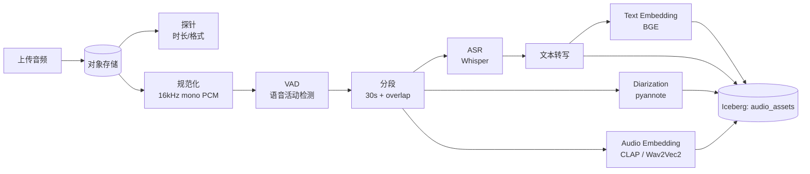

# 音频管线

!!! tip "一句话理解"
    音频 = **ASR（识别成文字）+ Audio Embedding（直接向量化）+ Diarization（谁在说话）**。检索通常走文字侧（精准）+ audio embedding（语义 / 音色）组合。

!!! abstract "TL;DR"
    - **Whisper / Whisper-v3 / SenseVoice** 是 ASR 主流选择
    - **CLAP** 做文-音跨模态 embedding；**Wav2Vec2 / HuBERT** 做纯音频 embedding
    - 长音频**分段 + overlap**（典型 30s 段、5s overlap）避免 ASR 边界掉字
    - Diarization 给每段打说话人标签（会议 / 访谈场景必备）
    - transcript 和 audio embedding 两条路**都入表**，查询时 Hybrid

## 完整流水线



## 一、规范化

统一采样率和通道：

```bash
ffmpeg -i input.mp3 -ac 1 -ar 16000 -sample_fmt s16 output.wav
```

- 单声道（mono）
- 16kHz（Whisper / 多数 ASR 的要求）
- PCM s16（最常用）

## 二、VAD（Voice Activity Detection）

长录音里有大段静音 / 纯噪音，ASR 跑这些浪费算力。先用 VAD 切出"有人说话"的片段：

- **Silero VAD** —— 开源、快
- **pyannote VAD**
- **WebRTC VAD** —— 老牌

## 三、分段策略

Whisper 的 "context window" 约 30 秒。长音频必须分段：

- **固定长度 + overlap**：30s 段、2-5s overlap
- **VAD 分段**：按静音自然切分
- **句子分段**：VAD + 韵律特征

**Overlap 的必要性**：防止切点正好在词中间。下游合并时去重（按 confidence 或最长匹配）。

## 四、ASR 选型

| 模型 | 优点 | 缺点 |
| --- | --- | --- |
| **Whisper v2/v3** | 多语言、开源、主流 | 中文不如专用中文模型 |
| **Whisper-large-v3-turbo** | 比 v3 快 8x，精度接近 | 2024 新，生态跟进 |
| **SenseVoice**（阿里开源） | 中文强、情感识别 | 英文弱一些 |
| **Conformer / Conformer-CTC** | 低延迟 | 质量略差 |
| **Azure / Google Speech-to-Text** | 托管 API | 数据出口、成本 |

**推荐**：中英混合场景 Whisper v3 / turbo；纯中文 SenseVoice。

### Whisper 常用调用

```python
import whisper
model = whisper.load_model("large-v3")
result = model.transcribe(
    "audio.wav",
    language="zh",
    task="transcribe",        # 或 "translate"
    word_timestamps=True      # 获取每个词的时间戳
)
```

输出：

```json
{
  "text": "完整转写...",
  "segments": [{"start": 0.0, "end": 3.2, "text": "第一段"}, ...],
  "language": "zh"
}
```

## 五、Diarization（说话人分离）

**场景**：会议、访谈、多人对话。需要知道"谁说了什么"。

- **pyannote/speaker-diarization** —— 开源主流
- **AssemblyAI** / **Deepgram** —— API 服务

输出：每段加 `speaker_id`。组合 ASR + Diarization：

```
[00:00-00:03] Speaker_0: 大家好
[00:03-00:07] Speaker_1: 今天我们讨论……
```

## 六、Audio Embedding

**跨模态 CLAP（Contrastive Language-Audio Pretraining）**：文-音一个空间。适合"用文字找音频"或"用音频找音频"。

```python
from transformers import ClapModel, ClapProcessor
model = ClapModel.from_pretrained("laion/clap-htsat-unfused")
processor = ClapProcessor.from_pretrained("laion/clap-htsat-unfused")
inputs = processor(audios=audio_array, return_tensors="pt", sampling_rate=48000)
audio_vec = model.get_audio_features(**inputs)  # 512 维
```

**纯音频 embedding**（Wav2Vec2 / HuBERT）：

- 做**音色 / 情感**识别
- 不跨模态
- 适合"根据说话人声纹找相似音频"

## 七、表结构

```sql
CREATE TABLE audio_assets (
  audio_id         BIGINT,
  raw_uri          STRING,
  duration_sec     FLOAT,
  sample_rate      INT,
  transcript       STRING,
  transcript_segments STRING,     -- JSON array of {start, end, text, speaker}
  language         STRING,
  speakers_count   INT,
  clap_vec         VECTOR<FLOAT, 512>,     -- 跨模态
  audio_vec        VECTOR<FLOAT, 768>,     -- 纯音色
  text_vec         VECTOR<FLOAT, 1024>,    -- transcript 文本 embedding
  embedding_version_clap STRING,
  owner            STRING,
  visibility       STRING,
  tags             ARRAY<STRING>,
  ts               TIMESTAMP
) USING iceberg
PARTITIONED BY (days(ts), bucket(16, audio_id));
```

## 八、检索模式

常见查询：

1. **按关键词找** → text_vec + 全文搜索（`transcript` 字段）
2. **按语义找** → text_vec（BGE embedding）或 clap_vec（跨模态）
3. **按音色找** → audio_vec
4. **按说话人找** → 按 speaker_id 过滤

Hybrid Search 让这四种组合自然。

## 生产级 Pipeline 设计要点

音频管线的特点：**ASR 推理慢 + speaker diarization 敏感 + 模型可换性强**——生产级关注：

| 问题 | 做法 |
|---|---|
| **同音频幂等** | audio_id（或文件 SHA256）作主键 · ASR + diarization + embedding 结果可重新产出 |
| **ASR / 音频 embedding 异步 worker** | Whisper GPU 推理慢 · 独立队列 · batch size 根据 GPU 内存调（1-8）|
| **分段失败隔离** | 长音频按 10-30 分钟切段处理 · 某段失败不重跑全文 · 段级 checkpoint |
| **坏音频隔离** | 采样率异常 / 编码坏 / 静音文件 → DLQ 表 + 原因 · 不阻塞主流 |
| **语言检测先行** | 优先**自动检测语言** · 错选 ASR 模型浪费算力 · 不确定的路由到多模型 |
| **中间产物** | 切段后的 WAV / 转录文本 · 对象存储 · 湖表存 URL |
| **模型版本化** | `asr_model_version` + `embedding_version_clap` + `diarization_model` 字段分离 · 换代可共存 |

**和 [管线韧性](pipeline-resilience.md) 横切主题呼应**。

## 陷阱

- **采样率不匹配**：模型要 16kHz，你喂 44.1kHz 输出乱码
- **双声道合成单声道用 `mono` 时**：简单平均可能丢相位信息（对 ASR 影响小，对 audio embedding 影响可能有）
- **分段 overlap 没去重** → transcript 重复词
- **语言自动检测错** → 整段输出全错；建议业务场景明确指定语言
- **长音频没分段直接喂 Whisper** → OOM 或极慢

## 监控

- 处理成功率 / 失败原因
- 平均 ASR 耗时 / 音频时长比（RTF，real-time factor）
- 语言检测分布
- Diarization 说话人数分布
- Embedding 向量健康度

## 相关

- [多模 Embedding](../retrieval/multimodal-embedding.md)
- [视频管线](video-pipeline.md)（音频常来自视频）
- [多模数据建模](../unified/multimodal-data-modeling.md)

## 延伸阅读

- Whisper: <https://github.com/openai/whisper>
- CLAP: <https://github.com/LAION-AI/CLAP>
- pyannote.audio: <https://github.com/pyannote/pyannote-audio>
- *Whisper: Robust Speech Recognition via Large-Scale Weak Supervision*（OpenAI 2022）
