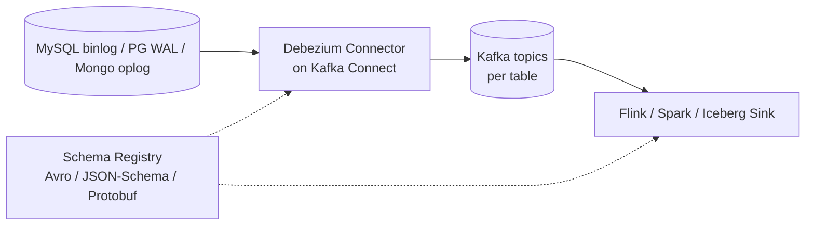

# Change Data Capture · 湖仓的数据进场协议

!!! tip "一句话定位"
    Change Data Capture (CDC) 是"让源头 OLTP 每一行变化（insert/update/delete）精确流到湖仓"的技术总称。它是 2024-2026 湖仓事实上的**主入场协议**——没有 CDC 湖仓就只能"每天批同步一次"。

!!! info "和其他页的边界"
    本页讲 **"CDC 作为一种技术 · 原理 + 产品生态"**。区别于：

    - [lakehouse/Streaming Upsert · CDC](../lakehouse/streaming-upsert-cdc.md) · 讲**湖表侧**如何接 CDC · MoR / changelog producer
    - [Kafka 到湖](kafka-ingestion.md) · 讲 **Kafka 作为中转** 的工程细节
    - [托管数据入湖](managed-ingestion.md) · 讲 **托管 EL(T)** 替代自建 CDC 的路径
    - [管线韧性](pipeline-resilience.md) · 讲 **Exactly-once / Schema 传播 / DLQ** 横切主题

!!! abstract "TL;DR"
    - **三种实现范式**：log-based（主流）/ query-based（polling · 不推荐）/ trigger-based（生产罕见）
    - **log-based 主流产品**：Debezium（Kafka Connect 栈）· Flink CDC（原生集成）· Paimon CDC（专用）
    - **Flink CDC 3.x 是 2024-2025 最大进展**：YAML declarative Pipeline · 3.1（2024-05）起进入 Apache Flink 子项目
    - **Iceberg Sink 跨三家**（Flink / Spark Streaming / Kafka Connect）· 语义不完全一致
    - **选型主轴**：栈绑定 × 吞吐 × 延迟 × 运维预算

## 1. 什么是 CDC · 三种实现范式

### Log-based · 事实标准（主流）

基于**数据库事务日志**（MySQL binlog / PostgreSQL WAL / MongoDB oplog / Oracle LogMiner）读取变更：

- **原理** · 日志本身就是变更流——顺序 + 完整 + 低侵入
- **优点** · 对源库负担最小 · 保留 before/after image · 保证顺序
- **缺点** · 需要 DB 侧启用日志 + 权限 · 初始 snapshot + 增量切换有复杂度
- **代表产品** · Debezium · Flink CDC · Paimon CDC · AWS DMS

### Query-based · 轮询（不推荐）

`SELECT WHERE updated_at > last_checkpoint` 式 polling：

- 优点 · 几乎不需 DB 改动
- 缺点 · **删除事件捕获不到** · 依赖单调时间列 · 周期性拉源库 · 延迟高
- 代表 · Kafka Connect JDBC Source · 老旧 ETL 工具

**生产建议**：**基本不选**——除非源库完全不能开 binlog。

### Trigger-based · 内部触发器

源库建 TRIGGER 捕获变更写影子表：

- **原因** · 老系统无 binlog 的最后选项
- **代价** · 侵入源库 + 性能影响 + 维护灾难
- **生产现状** · 罕见

## 2. Log-based CDC 深挖 · Debezium 家族

### 内核架构



### Snapshot + Incremental 切换

从"第 0 条数据"开始 · 需要先做一次**全量 snapshot**：

1. 取**一致性快照**（DB-specific：MySQL 全局读锁 / PG `pg_export_snapshot`）· 在此时刻**记下 binlog offset 作为起点**
2. 全表扫 → 写 Kafka topic
3. snapshot 完成后从步骤 1 记的 offset 开始消费 binlog（**不是当前最新 offset**——否则会丢 snapshot 期间的变更）
4. **重叠区去重**：snapshot 和 binlog 会有覆盖区（snapshot 读到的行可能 binlog 里又有 update）· Flink CDC / Debezium 在此段做 watermark 对齐去重

**陷阱**：大表 snapshot 时间长——期间 binlog 积压——详见 [streaming-upsert-cdc.md · 全量+增量切换 · watermark 桥接](../lakehouse/streaming-upsert-cdc.md) 段。

### Schema Change Event

DB 侧 `ALTER TABLE` 在 binlog 产生 schema change event · Debezium 翻译为：

- 特殊 event 到 Kafka（含新 schema 定义）
- Schema Registry 注册新版本
- 下游 sink **尝试**演化表（演化成功 / fail / skip · 取决于配置）

**关键**：**不是每种 ALTER 都能自动传播**（如类型收窄 · NOT NULL 约束变化 · 嵌套 STRUCT 变更）——见 [pipeline-resilience.md §2 Schema Evolution 传播](pipeline-resilience.md) 的"能/不能自动"分类表。

## 3. Flink CDC 3.x · 2024-2025 最大进展

Flink CDC 从独立项目到 Apache Flink 子项目是质变：

| 版本 | 时间 | 关键变化 |
|---|---|---|
| **3.1.0** | 2024-05 | 作为 Apache Flink 子项目**首版** · 加 transform + route（分表合并）|
| **3.2.0** | 2024-09 | 强化 schema evolution · 改进稳定性 |
| **3.3.0** | 2025-01 | 新增 2 个 pipeline connector |
| **3.4.0** | 2025-05 | 新增 **Iceberg pipeline sink** · 支持 batch 执行模式 |
| **3.5.0** | 2025-09 | 新增 Fluss + PostgreSQL pipeline connector |

### YAML Declarative Pipeline · 杀手级改变

3.x 允许用 YAML 声明整条 pipeline · 经 `flink-cdc.sh` 提交：

```yaml
source:
  type: mysql
  hostname: mysql.internal
  tables: app\..*             # 正则匹配全库所有表

transform:
  - source-table: app.users
    projection: id, UPPER(name) AS name, age

route:
  - source-table: app.t_\d+    # 分表合并
    sink-table: app.users_all

sink:
  type: paimon                 # 也可 iceberg / fluss / starrocks
  warehouse: s3://lake/warehouse

pipeline:
  parallelism: 4
  schema.change.behavior: try_evolve
```

**价值**：零代码 + schema evolution 自动传播 + 分表合并 / transform 声明式。

### 和 Debezium + Kafka 路径的对比

| 维度 | Flink CDC 3.x Pipeline | Debezium + Kafka + Flink |
|---|---|---|
| 组件数 | 1（Flink）| 3+（Kafka / Kafka Connect / Flink）|
| 中间件 | 不需 Kafka | 需 Kafka |
| 延迟 | 低（省 Kafka 跳）| 中 |
| 可靠性 | Flink state + 2PC | Kafka retain · 可重放 |
| 多消费者 | ❌（sink 一对一）| ✅（Kafka 广播）|
| 生态 | Flink-only sink | Kafka 生态所有 connector |
| **适合** | **新建 · 栈统一 Flink · 单 sink** | **已有 Kafka 栈 · 或多消费者** |

## 4. Paimon CDC · 专用管线

Paimon 提供**专用 CDC action**，不走通用 Flink CDC pipeline：

```bash
# MySQL 全库同步到 Paimon · 注意参数用下划线(Paimon 官方语法)
$FLINK_HOME/bin/flink run \
  /path/to/paimon-flink-action-<version>.jar \
  mysql_sync_database \
  --warehouse s3://lake/warehouse \
  --database app \
  --mysql_conf hostname=mysql.internal \
  --mysql_conf username=app \
  --mysql_conf password=xxx \
  --mysql_conf database-name=source_db \
  --table_conf bucket=16 \
  --table_conf changelog-producer=input \
  --including_tables "orders|users|payments"
```

**和 Flink CDC Pipeline 的共生关系**（不互斥）：

- **Paimon CDC action** · 面向 **Paimon 表专属优化**（自动 bucket / 分区 / 类型映射 / changelog producer 选择）
- **Flink CDC Pipeline** · 面向**多 sink**（Paimon / Iceberg / Fluss / StarRocks 等），跨目标统一抽象

**生产选择**：目标就是 Paimon → **Paimon CDC action**（深度集成 · 最短路径）；多 sink 或未来可能切换 → **Flink CDC Pipeline**。

## 5. Iceberg Sink · 跨引擎不统一

Iceberg 作为 sink 有**三条路径**，语义不完全一致：

| 路径 | 工具 | 延迟 | 提交方式 | 典型 |
|---|---|---|---|---|
| **Flink Iceberg Sink** | `flink-connector-iceberg` | 分钟级 | Flink checkpoint → commit（2PC 协同）| 流式入湖 · Flink 栈 |
| **Spark Structured Streaming** | `spark.writeStream.format("iceberg")` | 分钟级 | micro-batch 完成即 commit | Spark / Databricks 栈 |
| **Kafka Connect Iceberg Sink** | `databricks/iceberg-kafka-connect`（2023+）| 分钟级 | 定期 flush + commit | 已有 Kafka 栈 · 不想引入 Flink |

**语义差异**：

- **Upsert vs Append** · Flink Sink 支持 MoR upsert；Spark 早期只 append（近版支持 merge）；Kafka Connect 分 upsert/append 模式
- **Exactly-once 实现** · 三家都支持但路径不同——Flink 2PC · Spark checkpointLocation + 幂等写 · Kafka Connect 靠 connector 事务支持（详见 [pipeline-resilience.md](pipeline-resilience.md)）
- **Commit 频率** · 决定新鲜度 vs 小文件权衡——配合 [Compaction](../lakehouse/compaction.md) 必修

**三选一的快速判断**：**栈里已有 Flink** → Flink Iceberg Sink（最成熟 · upsert 完整）；**Spark/Databricks 栈** → Spark Structured Streaming；**已有 Kafka 生态 · 不想引 Flink** → Kafka Connect Iceberg Sink。

## 6. 选型决策 · 4 步

**Step 1 · 栈已经有什么？**

- 已有 Flink → **Flink CDC Pipeline (3.x)** 或 **Paimon CDC action**
- 已有 Kafka → **Debezium + Flink / Kafka Connect Iceberg Sink**
- 已有 Spark 栈 → **Spark Structured Streaming + Iceberg**
- **已在 Databricks** → **Auto Loader**（文件级增量 · **注意：不是 DB log-based CDC** · 源库删除事件不捕获 · 详见 [managed-ingestion.md](managed-ingestion.md)）或用 Flink CDC 走 Delta Sink
- 已在 AWS · 不想引 Flink → **AWS DMS**（见 [managed-ingestion.md](managed-ingestion.md)）

**Step 2 · 目标是 Paimon 还是 Iceberg？**

- Paimon → **Paimon CDC action**（最短路径）
- Iceberg → **Flink CDC 3.4+ Pipeline** 或 **Kafka Connect Iceberg Sink**

**Step 3 · 多源 / 复杂 schema 演化？**

- 多源 + 复杂 schema → **Flink CDC 3.x Pipeline**（YAML declarative）
- 单源简单 → 最短路径（Paimon CDC / AWS DMS）

**Step 4 · 运维预算？**

- 团队无 Flink 经验 → **Airbyte / Fivetran**（见 [managed-ingestion.md](managed-ingestion.md)）
- 有运维能力 → 自建 Flink CDC / Debezium

## 7. 陷阱

- **忽视 snapshot 期间的延迟** · 大表全量期间 binlog 积压 · 切换时延迟飙
- **Schema change 没做 registry** · 下游 sink 手动维护表结构 · 演化一次人工一次
- **Kafka retain 太短** · 消费者重启后 offset 过期丢数据
- **Iceberg 提交太频繁** · manifest 爆炸 · 必须配 [rewrite_manifests](../lakehouse/compaction.md)
- **混用 Paimon CDC + Iceberg 同 sink** · 两条路径并存 · 运维负担倍增 · 选一种
- **Query-based "假 CDC" 用到生产** · 删除事件永远丢

## 相关

- [Kafka 到湖](kafka-ingestion.md) · Kafka 中转的工程细节
- [托管数据入湖](managed-ingestion.md) · EL(T) 托管路径
- [管线韧性](pipeline-resilience.md) · Exactly-once · Schema 传播
- [Streaming Upsert / CDC](../lakehouse/streaming-upsert-cdc.md) · 湖表侧
- [Apache Paimon](../lakehouse/paimon.md) · [Apache Iceberg](../lakehouse/iceberg.md)

## 延伸阅读

- **[Flink CDC 3.x Docs](https://nightlies.apache.org/flink/flink-cdc-docs-stable/)**
- **[Flink CDC 3.4 Release Blog](https://flink.apache.org/2025/05/16/apache-flink-cdc-3.4.0-release-announcement/)**（Iceberg pipeline sink）
- **[Debezium Docs](https://debezium.io/documentation/)**
- **[Paimon CDC Ingestion](https://paimon.apache.org/docs/master/cdc-ingestion/overview/)**
- **[Databricks Iceberg Kafka Connect](https://github.com/databricks/iceberg-kafka-connect)**
