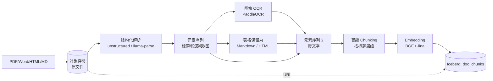

# 文档管线（PDF / Word / Markdown / HTML）

!!! tip "一句话理解"
    文档 = **结构 + 文本 + 图像**的混合。核心动作是**解析为层次化段落 + OCR 嵌入图 + 智能 chunking**。RAG 质量最常见的瓶颈不在 embedding，而在这一步。

!!! abstract "TL;DR"
    - **别用简单文本抽取**，用结构感知解析器（unstructured / llama-parse / GROBID）
    - **PDF 里的图**要 OCR；表格要**结构化**（markdown table）
    - **Chunking 是关键艺术**：按标题层级 > 定长；保留 overlap
    - 每个 chunk 存**原文档指针 + 页码 + 坐标**，RAG 引用才精确
    - 模型升级不要重写 chunks，只重 embed

## 完整流水线



## 一、解析：不要简单 PDF2TXT

```python
# 错误方式
text = open("doc.pdf").read()   # 完全错
text = pdfminer.extract_text(f)  # 丢了版式、表格、图
```

**推荐**：结构感知解析器，保留"标题 / 段落 / 列表 / 表 / 图 / 页眉页脚"元素类型。

### 主流选项

| 解析器 | 优点 | 缺点 |
| --- | --- | --- |
| **unstructured** | 开源、元素类型丰富 | 对复杂版式中等 |
| **llama-parse** (LlamaIndex) | 使用 LLM 解析，质量高 | API 收费 |
| **PyMuPDF / pdfplumber** | 开源、版式精准 | 需自己拼逻辑 |
| **GROBID** | 学术文献 | 领域专注 |
| **Azure Document Intelligence** | 表格结构化极好 | API 收费 |

### 输出格式示例

```json
[
  {"type": "Title",       "text": "第一章 引言"},
  {"type": "NarrativeText","text": "本章介绍……"},
  {"type": "Heading",     "text": "1.1 背景"},
  {"type": "NarrativeText","text": "自 2020 年以来……"},
  {"type": "Table",       "text": "| 年份 | 营收 |\n| 2020 | 100 |"},
  {"type": "Image",       "uri": "extracted/img_001.png"},
  {"type": "Footer",      "text": "Page 1 of 42"}
]
```

**Footer / 页眉要过滤**，不要进 chunk。

## 二、图像 OCR 嵌入

PDF 里的**扫描版页面、图表、截图**需要 OCR：

```python
from paddleocr import PaddleOCR
ocr = PaddleOCR(use_angle_cls=True, lang='ch')
result = ocr.ocr("extracted/img_001.png", cls=True)
# 返回每行 [bbox, text, confidence]
```

OCR 结果作为 `Image` 元素的补充文字写回原位置。

## 三、表格处理

表格**一定要结构化**，别扁平化：

```markdown
| 产品 | 销量 | 增长率 |
|---|---|---|
| A | 1000 | +20% |
| B | 500  | -5%  |
```

**Markdown 表格**对 LLM 最友好。复杂表（合并单元格）可以用 HTML。

## 四、智能 Chunking

**固定长度切分**的坑：

- 切在句子中间 → 语义断层
- 不考虑标题结构 → chunk 看起来"孤立"
- 把表格 / 代码块硬切 → 格式崩

### 推荐策略：层级感知 + 固定长度兜底

```python
def smart_chunk(blocks, max_tokens=512, overlap_tokens=50):
    chunks = []
    current = []
    current_tokens = 0
    current_headings = []    # 最近的标题层级栈

    for block in blocks:
        if block.type in ("Title", "Heading"):
            # 标题：保留到栈，也作为 chunk 边界候选
            current_headings.append(block.text)
            if current_tokens > max_tokens * 0.5:
                chunks.append(make_chunk(current, current_headings))
                current = []
                current_tokens = 0
        else:
            tokens = count_tokens(block.text)
            if current_tokens + tokens > max_tokens:
                chunks.append(make_chunk(current, current_headings))
                # overlap
                current = tail_tokens(current, overlap_tokens)
                current_tokens = overlap_tokens
            current.append(block)
            current_tokens += tokens

    if current:
        chunks.append(make_chunk(current, current_headings))
    return chunks
```

每个 chunk 带：

- `content` — 内容
- `section_path` — "第一章 / 1.1 背景"
- `page_range` — "3-4"
- `chunk_idx` — 同文档内序号
- `doc_id` — 原文档

## 五、Embedding

用文本 embedding 模型（BGE / Jina），**不用** CLIP 这类多模——文档本身主要是文字。

**多模态配合**：如果 chunk 包含图 OCR 文字，也可额外存一列 CLIP 向量用于跨模态查询（以图搜文档）。

## 六、表结构

```sql
CREATE TABLE doc_chunks (
  chunk_id         STRING,
  doc_id           STRING,
  doc_uri          STRING,
  chunk_idx        INT,
  content          STRING,
  section_path     STRING,
  page_range       STRING,
  token_count      INT,
  lang             STRING,
  text_vec         VECTOR<FLOAT, 1024>,
  embedding_version STRING,
  owner            STRING,
  visibility       STRING,
  tags             ARRAY<STRING>,
  ts               TIMESTAMP,
  doc_version      INT
) USING iceberg
PARTITIONED BY (bucket(16, doc_id));
```

## 七、引用回写（RAG 必须）

RAG 回答时要指明"这条答案来自 `doc_uri` 的 `page_range` 的 `section_path`"。这靠表结构里的元数据字段，而不是查询后拼。

## 八、增量与版本

文档会改：

- 新版本的 doc 给新 `doc_version`
- **不删老版本** chunks（某些在审计 / RAG 回放需要）
- 只标 `doc_version_current = true` 给最新版
- Iceberg Time Travel 让过去版本可查

## 陷阱

- **扫描版 PDF 当原生 PDF 处理** → 文本全空；要有 "是扫描版"检测
- **没保留 section 层级** → RAG 回答时无法"这段出自哪个章节"
- **Chunk 太大**（> 1K token） → Prompt 贵、rerank 慢
- **Chunk 太小**（< 100 token） → 语义残缺
- **多语言混排**（中英夹杂）tokenizer 不对 → chunk 大小估算错
- **表格被按行切** → 表头丢失

## 常见 Chunk 参数

- `max_tokens`: 256 – 768（OpenAI Ada 场景常 512；中文 BGE 场景可到 768）
- `overlap_tokens`: 10%–20% of max
- **按段落优先 > 按句子 > 按 token**

## 相关

- [RAG](../ai-workloads/rag.md)
- [RAG 评估](../ai-workloads/rag-evaluation.md)
- [图像管线](image-pipeline.md) —— OCR 复用
- [多模数据建模](../unified/multimodal-data-modeling.md)

## 延伸阅读

- unstructured: <https://github.com/Unstructured-IO/unstructured>
- llama-parse: <https://github.com/run-llama/llama_parse>
- *RAG with Hierarchical Chunking*（Pinecone / LlamaIndex 博客）
- PaddleOCR: <https://github.com/PaddlePaddle/PaddleOCR>
