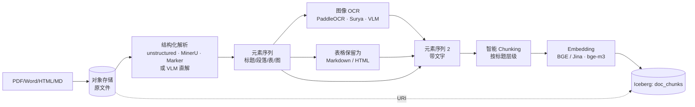

# 文档管线（PDF / Word / Markdown / HTML）

!!! tip "一句话理解"
    文档 = **结构 + 文本 + 图像**的混合。核心动作是**解析为层次化段落 + OCR 嵌入图 + 智能 chunking**。RAG 质量最常见的瓶颈不在 embedding，而在这一步。

!!! abstract "TL;DR"
    - **别用简单文本抽取**，用结构感知解析器（unstructured · llama-parse · **MinerU · Marker · Nougat**）
    - **2024 新路线：VLM-based parsing**（GPT-4V / Claude / Qwen-VL 直接读文档）—— 复杂版式 / 公式 / 表格更鲁棒，但成本高
    - **PDF 里的图**要 OCR；表格要**结构化**（Markdown / HTML table）
    - **Chunking 是关键艺术**：按标题层级 > 定长；保留 overlap
    - 每个 chunk 存**原文档指针 + 页码 + 坐标**，RAG 引用才精确
    - 模型升级不要重写 chunks，只重 embed

## 完整流水线



## 一、解析：不要简单 PDF2TXT

```python
# 错误方式
text = open("doc.pdf").read()   # 完全错
text = pdfminer.extract_text(f)  # 丢了版式、表格、图
```

**推荐**：结构感知解析器，保留"标题 / 段落 / 列表 / 表 / 图 / 页眉页脚"元素类型。

### 主流选项（2024-2026）

| 解析器 | 形态 | 优点 | 缺点 |
| --- | --- | --- | --- |
| **unstructured** | 传统 pipeline | 开源、元素类型丰富、生态成熟 | 复杂版式表现中等 |
| **llama-parse** (LlamaIndex) | 云 API（LLM 底层） | 质量高、支持表格 / 公式 | 按页计费 |
| **PyMuPDF / pdfplumber** | 库 | 开源、版式精准、快 | 需自己拼结构逻辑 |
| **GROBID** | 专用模型 | 学术文献引用 / 结构抽取最佳 | 仅学术论文 |
| **Azure Document Intelligence** | 云 API | 表格结构化最强 | API 收费、境外 |
| **Nougat** (Meta 2023) | 端到端 VLM（开源） | 学术 PDF → Markdown + LaTeX 公式，一次性 | GPU 推理、对非学术版式一般 |
| **MinerU** (上海 AI Lab 2024) | 开源 pipeline + 模型 | 中文友好、表格 / 公式 / 图混合处理好 | 依赖模型权重，部署略重 |
| **Marker** (VikParuchuri 2024) | 开源端到端 | 快、PDF → Markdown 质量优；支持 LaTeX | 对扫描版弱于商业方案 |
| **Docling** (IBM 2024) | 开源 pipeline | 企业级、结构保留好、可商用 | 相对年轻 |
| **VLM 直接读**（GPT-4V / Claude / Qwen-VL） | 通用 VLM | 复杂版式最鲁棒、公式图表理解好 | 成本高、结构化输出需额外约束 |

> 选型建议：
>
> - **学术论文** → Nougat 或 GROBID
> - **中文企业文档（年报、合同）** → MinerU · Docling · llama-parse
> - **扫描件 / 老旧文档** → Azure DI · PaddleOCR + 结构重建
> - **已有 OSS 基建、通用场景** → Marker · unstructured
> - **预算充足 / 质量优先 / 复杂版式** → VLM 直接读（抽样 + 缓存降成本）

### 输出格式示例

```json
[
  {"type": "Title",       "text": "第一章 引言"},
  {"type": "NarrativeText","text": "本章介绍……"},
  {"type": "Heading",     "text": "1.1 背景"},
  {"type": "NarrativeText","text": "自 2020 年以来……"},
  {"type": "Table",       "text": "| 年份 | 营收 |\n| 2020 | 100 |"},
  {"type": "Image",       "uri": "extracted/img_001.png"},
  {"type": "Footer",      "text": "Page 1 of 42"}
]
```

**Footer / 页眉要过滤**，不要进 chunk。

## 二、图像 OCR 嵌入

PDF 里的**扫描版页面、图表、截图**需要 OCR。2024 可选项：

| 选项 | 形态 | 适合 |
| --- | --- | --- |
| **PaddleOCR** | 开源 | 中英文通用，成熟 |
| **RapidOCR** | 开源（PaddleOCR ONNX 版） | 更轻量、CPU 部署 |
| **Surya**（2024） | 开源端到端 | 多语言 + 表格检测强 |
| **Tesseract 5** | 开源 | 英文 / 欧洲语系、老场景 |
| **Donut / LayoutLMv3** | VLM 端到端 | 免 OCR：图像 → 结构化输出 |
| **VLM（Qwen2-VL / Claude）** | 通用 VLM | 复杂表 / 手写体最鲁棒 |

```python
from paddleocr import PaddleOCR
ocr = PaddleOCR(use_angle_cls=True, lang='ch')
result = ocr.ocr("extracted/img_001.png", cls=True)
# 返回每行 [bbox, text, confidence]
```

OCR 结果作为 `Image` 元素的补充文字写回原位置。

!!! note "端到端 vs pipeline"
    **传统 pipeline**（检测 → 识别 → 后处理）在大规模稳定场景仍是性价比之选。**VLM 端到端**适合"少量 · 复杂版式 · 结果要结构化"的场景（合同条款、金融报表）。混合路线：先 pipeline 跑大头，低置信度页面回退 VLM。

## 三、表格处理

表格**一定要结构化**，别扁平化：

```markdown
| 产品 | 销量 | 增长率 |
|---|---|---|
| A | 1000 | +20% |
| B | 500  | -5%  |
```

**Markdown 表格**对 LLM 最友好。复杂表（合并单元格）可以用 HTML。

## 三·b、VLM 直接解析（2024 新路线）

传统 pipeline：`布局检测 → OCR → 结构重建 → 段落归并 → chunking` 步骤多、误差累积。2024 起 VLM（Qwen2-VL · GPT-4V · Claude）能**一次把整页图像变成结构化 Markdown**。

```python
# 伪代码：VLM 直解一页 PDF
page_img = render_page_as_image(pdf, page=3, dpi=200)
prompt = """把这页文档解析为 Markdown。要求：
1. 保留标题层级（#, ##）
2. 表格用 Markdown table
3. 公式用 $...$ / $$...$$
4. 忽略页眉页脚
5. 输出纯 Markdown，不要前后解释"""
md = vlm.call(prompt=prompt, image=page_img)
```

**何时用 VLM 直解**：

- 公式 / 化学式 / 电路图多的文档
- 复杂嵌套表（合并单元格、跨页表）
- 多栏排版 + 图文混排（期刊、年报）
- 手写体 / 老扫描件

**成本控制**：

- 批量文档先用传统 pipeline 扫一遍；**置信度低 / 结构混乱的页面**再回退到 VLM
- VLM 输出做缓存（同一份文档只跑一次）
- 小模型（Qwen2-VL-7B 自部署）替代闭源 API，单页成本可降到 1-2 分

## 四、智能 Chunking

**固定长度切分**的坑：

- 切在句子中间 → 语义断层
- 不考虑标题结构 → chunk 看起来"孤立"
- 把表格 / 代码块硬切 → 格式崩

### 推荐策略：层级感知 + 固定长度兜底

```python
def smart_chunk(blocks, max_tokens=512, overlap_tokens=50):
    chunks = []
    current = []
    current_tokens = 0
    current_headings = []    # 最近的标题层级栈

    for block in blocks:
        if block.type in ("Title", "Heading"):
            # 标题：保留到栈，也作为 chunk 边界候选
            current_headings.append(block.text)
            if current_tokens > max_tokens * 0.5:
                chunks.append(make_chunk(current, current_headings))
                current = []
                current_tokens = 0
        else:
            tokens = count_tokens(block.text)
            if current_tokens + tokens > max_tokens:
                chunks.append(make_chunk(current, current_headings))
                # overlap
                current = tail_tokens(current, overlap_tokens)
                current_tokens = overlap_tokens
            current.append(block)
            current_tokens += tokens

    if current:
        chunks.append(make_chunk(current, current_headings))
    return chunks
```

每个 chunk 带：

- `content` — 内容
- `section_path` — "第一章 / 1.1 背景"
- `page_range` — "3-4"
- `chunk_idx` — 同文档内序号
- `doc_id` — 原文档

## 五、Embedding

用文本 embedding 模型（BGE · Jina · bge-m3 · gte-Qwen2），**不用** CLIP 这类多模——文档本身主要是文字。

- **中文 / 混合语言** → **bge-m3**（2024，多语言 + 多粒度，稠密+稀疏+ColBERT 三合一）或 **gte-Qwen2**
- **英文** → bge-large-en-v1.5 · jina-embeddings-v3 · voyage-3
- **长文本** → 选 max_tokens ≥ 8K 的模型（bge-m3 为 8192、jina-v3 为 8192）

**多模态配合**：如果 chunk 包含图 OCR 文字，也可额外存一列 CLIP 向量用于跨模态查询（以图搜文档）。

## 六、表结构

```sql
CREATE TABLE doc_chunks (
  chunk_id         STRING,
  doc_id           STRING,
  doc_uri          STRING,
  chunk_idx        INT,
  content          STRING,
  section_path     STRING,
  page_range       STRING,
  token_count      INT,
  lang             STRING,
  text_vec         VECTOR<FLOAT, 1024>,
  embedding_version STRING,
  owner            STRING,
  visibility       STRING,
  tags             ARRAY<STRING>,
  ts               TIMESTAMP,
  doc_version      INT
) USING iceberg
PARTITIONED BY (bucket(16, doc_id));
```

## 七、引用回写（RAG 必须）

RAG 回答时要指明"这条答案来自 `doc_uri` 的 `page_range` 的 `section_path`"。这靠表结构里的元数据字段，而不是查询后拼。

## 八、增量与版本

文档会改：

- 新版本的 doc 给新 `doc_version`
- **不删老版本** chunks（某些在审计 / RAG 回放需要）
- 只标 `doc_version_current = true` 给最新版
- Iceberg Time Travel 让过去版本可查

## 陷阱

- **扫描版 PDF 当原生 PDF 处理** → 文本全空；要有"是扫描版"检测（`PyMuPDF` 判空 + 采样分辨率）
- **没保留 section 层级** → RAG 回答时无法"这段出自哪个章节"
- **Chunk 太大**（> 1K token） → Prompt 贵、rerank 慢
- **Chunk 太小**（< 100 token） → 语义残缺
- **多语言混排**（中英夹杂）tokenizer 不对 → chunk 大小估算错
- **表格被按行切** → 表头丢失
- **VLM 一把梭不做 fallback** → 一次抖动一整页丢失，必须有传统 pipeline 兜底
- **端到端解析输出无结构约束** → Markdown 飘忽；**Prompt 里限定 schema + 用 JSON mode / function call**

## 常见 Chunk 参数

- `max_tokens`: 256 – 768（OpenAI Ada 场景常 512；中文 BGE 场景可到 768）
- `overlap_tokens`: 10%–20% of max
- **按段落优先 > 按句子 > 按 token**

## 相关

- [RAG](../ai-workloads/rag.md)
- [RAG 评估](../ai-workloads/rag-evaluation.md)
- [图像管线](image-pipeline.md) —— OCR 复用
- [多模数据建模](../unified/multimodal-data-modeling.md)

## 延伸阅读

**传统 pipeline**

- **unstructured**：<https://github.com/Unstructured-IO/unstructured>
- **llama-parse**：<https://github.com/run-llama/llama_parse>
- **Docling** (IBM 2024)：<https://github.com/DS4SD/docling>
- **PaddleOCR**：<https://github.com/PaddlePaddle/PaddleOCR>
- **Surya** (多语言 OCR + 布局)：<https://github.com/VikParuchuri/surya>

**2024 端到端 / VLM 路线**

- **Nougat** (Meta · 学术 PDF → Markdown)：<https://github.com/facebookresearch/nougat> · [论文 arXiv:2308.13418](https://arxiv.org/abs/2308.13418)
- **MinerU** (上海 AI 实验室)：<https://github.com/opendatalab/MinerU>
- **Marker** (PDF → Markdown)：<https://github.com/VikParuchuri/marker>
- **Qwen2-VL** (开源 VLM)：<https://github.com/QwenLM/Qwen2-VL>
- **LayoutLMv3** (微软 · 布局模型)：<https://github.com/microsoft/unilm/tree/master/layoutlmv3>

**Chunking / RAG 工程**

- *Mastering RAG · Chunking strategies*（LlamaIndex 博客）
- *Contextual Retrieval*（Anthropic 2024）：<https://www.anthropic.com/news/contextual-retrieval>
- *Pinecone · Chunking Strategies for LLM Applications*：<https://www.pinecone.io/learn/chunking-strategies/>
