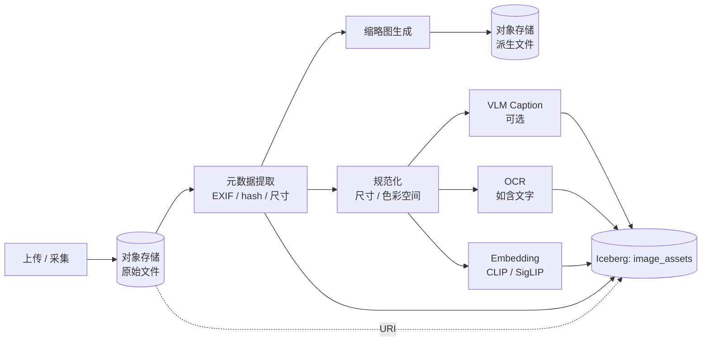

# 图像管线

!!! tip "一句话理解"
    原始图片 → 规范化 → 元数据提取 → caption / OCR（如需）→ embedding → 入湖。这条链路的质量决定你所有下游"图检索 / 图推荐 / 图 + 文 RAG"的天花板。

!!! abstract "TL;DR"
    - **不要把原图存进表**，只存对象存储 URI
    - 预处理四件事：**规范化分辨率、色彩空间、EXIF 处理、缩略图**
    - Caption / OCR 看业务需要选做
    - Embedding 用 **CLIP / SigLIP** 做跨模态 + **BGE** 做纯文本辅助
    - 每个阶段结果**回写同一张 Iceberg / Lance 表**，字段分列

## 完整流水线



## 一、入湖与元数据

### 不要把二进制进表

原因：

- Parquet 列剪裁对大二进制几乎无增益
- Row group 扫描爆内存
- BI 工具看不见大字段

**推荐**：对象存储放原图 + 表里记 `raw_uri, raw_sha256, raw_size_bytes`。

### 元数据四件事

```python
from PIL import Image
from PIL.ExifTags import TAGS
import hashlib

def extract_image_meta(path):
    img = Image.open(path)
    return {
        "width": img.width,
        "height": img.height,
        "format": img.format,
        "mode": img.mode,              # RGB / RGBA / CMYK / L
        "sha256": hashlib.sha256(open(path, 'rb').read()).hexdigest(),
        "exif": {TAGS.get(k, k): v for k, v in (img._getexif() or {}).items()},
    }
```

常见陷阱：

- **EXIF 里的方向** —— 手机拍的图 EXIF 标注 90/180 旋转，显示与模型处理不一致
- **色彩空间** —— RGB / RGBA / CMYK 混进来，CLIP 等模型只吃 RGB
- **PNG 透明通道** —— 有些预处理直接报错

## 二、规范化

统一尺寸与色彩空间：

```python
def normalize_for_embedding(img):
    # 1. 旋转修正（EXIF orientation）
    img = ImageOps.exif_transpose(img)
    # 2. 色彩空间统一
    if img.mode != "RGB":
        img = img.convert("RGB")
    # 3. 尺寸：CLIP 一般 224×224，SigLIP 384×384
    img = img.resize((224, 224), Image.Resampling.LANCZOS)
    return img
```

**缩略图**（用于列表展示、前端）单独另存，不影响 embedding 路径：

- 256×256 JPEG quality=85 是一个好默认
- URI 记作 `thumb_uri`

## 三、Caption / OCR（按需）

### VLM Caption

给图片生成自然语言描述，用于：

- BM25 / 全文检索补位（纯向量召回不稳时的备胎）
- 标注合规 / 调试 "这张图到底画了什么"
- 盲文 / 低视力无障碍

**模型选项**：

- BLIP-2 / BLIP-3 —— 开源
- CogVLM / Qwen-VL —— 中文强
- GPT-4V / Claude —— API 质量高但贵

### OCR

带文字的图（广告、海报、证件、文档照片）。选项：

- **PaddleOCR** —— 中文强，开源
- **Tesseract** —— 老牌，简单
- **Azure / AWS Textract** —— API，对版面和表格友好

OCR 输出结构化文本（段落 + 位置），存 `ocr_text` 列。

## 四、Embedding

### 主路：跨模态 CLIP / SigLIP

用**文图共享空间**的 embedding，实现"文本查图 / 图查文 / 图查图"：

```python
from transformers import CLIPProcessor, CLIPModel
model = CLIPModel.from_pretrained("openai/clip-vit-base-patch32")
processor = CLIPProcessor.from_pretrained("openai/clip-vit-base-patch32")

inputs = processor(images=img, return_tensors="pt")
image_vec = model.get_image_features(**inputs)  # 512 维
image_vec = F.normalize(image_vec, p=2, dim=-1)
```

### 辅路：纯文本 embedding

如果有 caption / OCR 文本，**额外**用 BGE / Jina 做纯文本 embedding，存另一列。纯文本 embedding 在 caption 语义丰富时召回更精细。

**两种 embedding 共存**：

```
clip_vec  VECTOR<FLOAT, 512>   -- 跨模态
text_vec  VECTOR<FLOAT, 1024>  -- 纯文本精细（caption + OCR 拼接后）
```

## 五、入湖表结构

参考 [多模数据建模](../unified/multimodal-data-modeling.md)：

```sql
CREATE TABLE image_assets (
  asset_id        BIGINT,
  raw_uri         STRING,
  raw_sha256      STRING,
  width           INT,
  height          INT,
  color_mode      STRING,
  thumb_uri       STRING,
  caption         STRING,
  ocr_text        STRING,
  clip_vec        VECTOR<FLOAT, 512>,
  text_vec        VECTOR<FLOAT, 1024>,
  embedding_version_clip STRING,
  embedding_version_text STRING,
  owner           STRING,
  visibility      STRING,
  tags            ARRAY<STRING>,
  ts              TIMESTAMP,
  partition_date  DATE
) USING iceberg
PARTITIONED BY (partition_date, bucket(16, asset_id));
```

## 六、增量与回填

- 新图：上传 → 触发 pipeline → 一行 insert
- 模型升级：加新 embedding 列 + 批回填
- OCR 模型升级同理
- 每次阶段成功都**立即 commit**，失败不影响已完成的行

## 七、生产级 Pipeline 设计要点

以上是**处理 recipe**——生产跑这套需要额外解决这些横切问题：

| 问题 | 做法 |
|---|---|
| **同资产幂等重跑** | 以**内容 hash（SHA256）或 asset_id** 作为主键 · Iceberg `MERGE INTO` / Paimon PK 表保证重跑幂等 |
| **坏资产隔离（quarantine）** | 损坏 / 不支持格式 / 元数据缺失的图片 · 写入 DLQ 表（独立 Iceberg append 表 · 含错误原因）· **不阻塞主流** |
| **异步 GPU worker 批处理** | embedding 推理走**独立 batch 队列**（GPU 资源池）· batch size 8-32 · 失败重试单图不重 batch |
| **局部失败** | 多阶段 pipeline 每阶段独立 commit · 失败只回滚该阶段 · 不需要整张图重跑 |
| **中间产物存储** | 归一化后图 / OCR 文本 · 写**对象存储**（不进湖表）· 湖表只存 URL 引用 · 避免湖表膨胀 |
| **模型版本化** | `embedding_version_clip` + `caption_model` 字段 · 换代时数据可共存追溯 |

**和 [管线韧性](pipeline-resilience.md) 的横切主题呼应** · 多模管线的 Exactly-once / Schema Evolution / DLQ 同样适用。

## 陷阱

- **不处理 EXIF 旋转** —— 模型看到的图和人看的图不同
- **统一尺寸时直接 stretch** —— 正方形裁 / padding 更合适
- **动图（GIF）只取第一帧** —— 要不要的场景决定
- **CMYK 图直接过 CLIP** —— 模型输出垃圾向量
- **没有 `embedding_version`** —— 模型换代无法追溯

## 监控

- 每天处理图片数 / 失败率
- 平均预处理耗时
- Embedding 向量 L2 norm 分布（漂移告警）
- 对象存储图片 / 缩略图总大小
- Caption / OCR 的长度分布

## 相关

- [多模 Embedding](../retrieval/multimodal-embedding.md)
- [多模数据建模](../unified/multimodal-data-modeling.md)
- [Embedding 流水线](../ml-infra/embedding-pipelines.md)
- 姊妹管线：[视频](video-pipeline.md) · [音频](audio-pipeline.md) · [文档](document-pipeline.md)

## 延伸阅读

- Pillow / OpenCV 图像处理文档
- CLIP / SigLIP 原始论文
- PaddleOCR / Tesseract 实用教程
