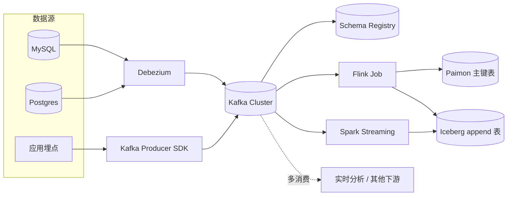

# Kafka 到湖

!!! tip "一句话理解"
    业务日志 / 事件流 / CDC 变更通过 Kafka 解耦，再经 Flink / Spark Streaming 写入 Paimon / Iceberg。Kafka 在这条链路里是**缓冲层 + 重放层**，不是最终存储。

!!! abstract "TL;DR"
    - Kafka 解耦**上游突发吞吐**与**下游入湖节奏**
    - **Flink CDC 2.x 可以直接对接 MySQL / PG / Mongo**，不一定非走 Kafka；但生产环境通常仍留 Kafka 做缓冲和多消费者
    - Paimon 直接消费 Kafka topic 时是一条非常短的链路
    - **Schema Registry 必须配套**，否则 schema 变化会让整条流崩

## 架构拓扑



## 为什么不直接 CDC → 湖

Flink CDC 3.x 确实可以直连数据库 binlog → 湖表，不经 Kafka。什么时候用：

- 简单场景、单消费者
- 吞吐可控
- 不需要"回看"历史

**仍加 Kafka 的理由**：

- **多个下游共享同一份变更流**（湖 + 实时大屏 + 其他业务消费）
- **重放**：Kafka 可保留 N 天，作业出 bug 时重放修复
- **突发削峰**：业务高峰的瞬时吞吐由 Kafka 承接
- **解耦升级**：Kafka 稳在那，上下游独立变更

## 关键工程决策

### 1. Topic 设计

常见 3 种：

- **一张表一 topic**（`cdc.orders` / `cdc.users`）—— 最清晰，下游筛选方便
- **按业务域一 topic**（`cdc.commerce`）—— topic 数少但消费者要自筛
- **`topic-per-table-with-version`**（`cdc.orders.v2`）—— schema 大变更时隔离

推荐**第 1 种**为默认。

### 2. Schema 演化

用 **Confluent Schema Registry** 或 **Apicurio**：

- 发送者用 Avro / Protobuf 注册 schema
- 消费者按 schema id 反序列化
- Schema 变化**向后兼容**（加字段 OK，删字段要通知）

无 schema registry = 一次字段改就全炸。

### 3. Exactly-Once vs At-Least-Once

- **Flink 2PC Sink + Kafka 事务**可以逼近 exactly-once
- **At-least-once + 幂等 sink**（按主键 upsert）更简单
- **湖仓场景 at-least-once + 幂等**更常见

### 4. Commit 粒度

- Flink checkpoint 间隔决定湖表 commit 频率（通常 1-5 分钟）
- 太频繁 → 小文件爆炸（配合 [Compaction](../lakehouse/compaction.md)）
- 太稀疏 → 延迟拉长

### 5. Kafka 保留窗

- 至少 `最长下游作业可能落后时间 × 3`
- 典型 3-7 天
- 审计场景 30 天起

## CDC Debezium 要点

Debezium 的关键行为：

- **Snapshot + Incremental**：首次全量快照 + 后续 binlog 增量
- **Before/After 值**：update 事件既带旧值也带新值，方便下游按 key upsert
- **Schema change 事件**：`ALTER TABLE` 会出特殊事件
- **Source connector 状态**：存储在 Kafka topic（`__debezium-offsets__`）

**Flink CDC** 可以看成 Debezium 的"内嵌 + Flink 调度"版本：

- 不用额外 Kafka Connect 集群
- 直接到 Flink job
- 适合简单链路

生产链路一般 **Debezium → Kafka → Flink → 湖**，理由见上。

## 典型配置片段

```sql
-- Flink SQL：消费 Kafka 写入 Paimon
CREATE TABLE kafka_orders (
  order_id BIGINT,
  user_id  BIGINT,
  amount   DECIMAL(18,2),
  ts       TIMESTAMP(3),
  PRIMARY KEY (order_id) NOT ENFORCED
) WITH (
  'connector' = 'kafka',
  'topic'     = 'cdc.orders',
  'properties.bootstrap.servers' = '...',
  'scan.startup.mode' = 'latest-offset',
  'format' = 'debezium-avro-confluent',
  'debezium-avro-confluent.schema-registry.url' = 'http://...'
);

CREATE TABLE paimon_orders (
  order_id BIGINT,
  user_id  BIGINT,
  amount   DECIMAL(18,2),
  ts       TIMESTAMP(3),
  PRIMARY KEY (order_id) NOT ENFORCED
) WITH (
  'connector' = 'paimon',
  'path' = 's3://warehouse/ods/orders',
  'bucket' = '16'
);

INSERT INTO paimon_orders SELECT * FROM kafka_orders;
```

## 监控关键指标

- **Consumer Lag**（每个 sink 作业）
- **Kafka broker 磁盘 / 网络**
- **Schema Registry 可用性**
- **湖表 commit 延迟 + 每 commit 小文件数**
- **Debezium source connector 健康**

## 陷阱

- **Kafka 单 partition 内顺序**，跨 partition 无序 —— 主键要映射到固定 partition（用 key hash）
- **Schema 不兼容变更**悄悄上线 —— CI 要卡 Avro/Proto 的 Breaking Change
- **CDC 初始快照期间业务延迟**：大表首次快照可能小时级锁
- **Flink savepoint 丢失**：必须固化保留策略

## 相关

- [Streaming Upsert / CDC](../lakehouse/streaming-upsert-cdc.md)
- [Apache Paimon](../lakehouse/paimon.md)
- [Apache Flink](../query-engines/flink.md)
- [流式入湖场景](../scenarios/streaming-ingestion.md)

## 延伸阅读

- Debezium docs: <https://debezium.io/documentation/>
- Flink CDC 3.x: <https://nightlies.apache.org/flink/flink-cdc-docs-stable/>
- Confluent Schema Registry: <https://docs.confluent.io/platform/current/schema-registry/>
