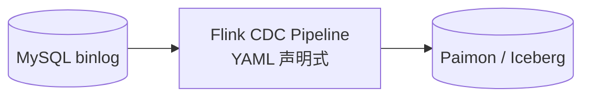
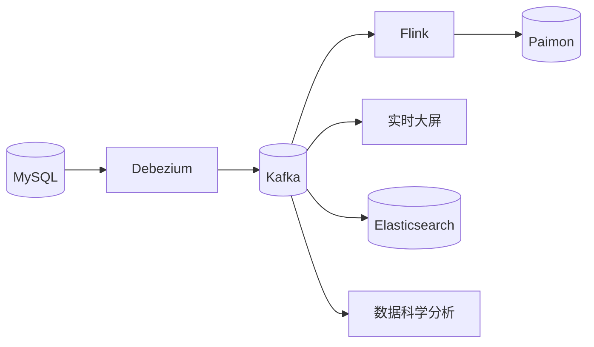
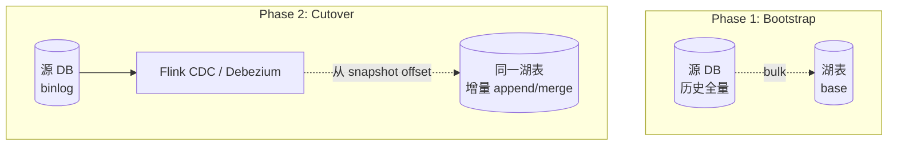
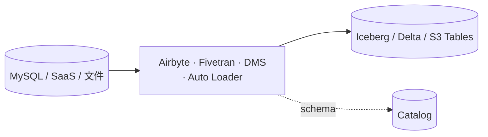
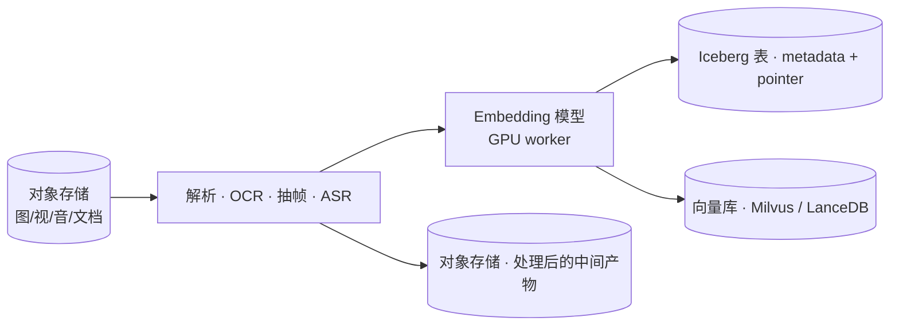
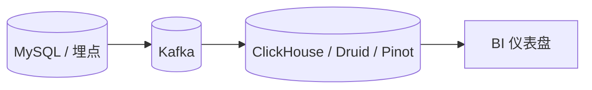

# 数据管线架构模式 · 端到端决策指南

!!! tip "一句话定位"
    前面的页讲 **"某一种管线能力"** · 本页讲 **"6 种端到端架构怎么拼 · 怎么选"**——读者有了具体产品知识后，这里把它们组装成**可落地的完整管线架构**。

!!! info "和其他页的边界"
    - 本页 · **端到端模式** · 怎么拼出完整管线（source → 中转 → engine → sink + 治理）
    - [CDC 内核](cdc-internals.md) · CDC **作为一种技术** 的原理 + 产品
    - [Kafka 到湖](kafka-ingestion.md) · Kafka 作为**中转**的工程细节
    - [托管数据入湖](managed-ingestion.md) · 托管 **EL(T) 工具**
    - [管线韧性](pipeline-resilience.md) · **Cutover / SLI / Exactly-once** 横切主题

!!! abstract "TL;DR"
    **6 种主流端到端模式**，按"源头 + 中转 + sink + 复杂度"区分：

    | 模式 | 核心特征 | 延迟 | 复杂度 |
    |---|---|---|---|
    | **A · CDC 直入湖** | Flink CDC Pipeline → 湖表 · 无 Kafka | 分钟 | ★ |
    | **B · CDC + Kafka 多下游** | Debezium → Kafka → 湖 + 多消费者 | 分钟 | ★★ |
    | **C · Bulk Bootstrap + CDC Cutover** | 批全量 + 流增量合流 | 分钟 | ★★★（切换最难）|
    | **D · 托管增量入湖** | Airbyte / Fivetran / DMS / Auto Loader | 小时-分钟 | ★ |
    | **E · 多模预处理 + Embedding + 检索** | 文件 → 解析 → embedding → 湖 / 向量库 | 小时-天 | ★★★（多阶段）|
    | **F · Kafka → OLAP DB**（非湖路径 · 对照）| Kafka → ClickHouse / Druid / Pinot | 秒 | ★★（湖外）|

## 模式 A · CDC 直入湖（最短路径）

**组件**：1 个（Flink CDC · 自带 source + sink）

**适用**：
- 单源（一个 DB）或多源但**无需多下游消费**
- 栈统一 Flink · 目标 Paimon 或 Iceberg
- **追求最少组件 · 最小运维表面**

**优势**：
- 组件少 · 运维简单 · 故障排查链短
- Flink CDC 3.4+ 支持 Iceberg pipeline sink · 3.5+ 加 Paimon / Fluss / PG
- 端到端 exactly-once 天然（Flink 2PC + Iceberg/Paimon 原生支持）

**劣势**：
- **没有 replay 缓冲**——作业挂后要从 checkpoint / savepoint 恢复 · 没有 Kafka 那样的"长期保存期"
- **不能多下游共享 CDC 流**——一个 CDC pipeline 一个 sink
- 运维极限依赖 Flink 稳定性

**陷阱**：
- binlog 保留期太短（默认几天）· Flink 作业长时间 crash 后恢复失败
- snapshot 大表期间的延迟积压

## 模式 B · CDC + Kafka 多下游分发（最常见的企业级）

**组件**：3（Debezium + Kafka + Flink / Spark）

**适用**：
- **多个下游** 共享同一份 CDC 流（湖 + 实时 + ES + 其他）
- 需要 **replay**（作业出 bug · 重放修复）
- **突发削峰**（业务高峰 Kafka 承接）

**优势**：
- **解耦** · 上下游独立变更
- Kafka retain N 天 · replay 不依赖 source DB
- 多消费者 · 生态成熟

**劣势**：
- **运维成本高** · Kafka 集群 + Debezium + Flink 三套栈要维护
- 延迟比模式 A 多一跳
- 需要 Schema Registry（Avro / Protobuf / JSON Schema）

**陷阱**：
- Kafka retain 比 checkpoint 周期短 → 恢复失败
- Schema change 未走 Registry → 下游反序列化崩

## 模式 C · Bulk Bootstrap + CDC Cutover（历史 + 实时合流）

**适用**：
- **初次上线** · 历史数据几 TB-PB · 需要先装载再切实时
- **迁库 / 迁湖** · 老 Hive → 新 Iceberg 的切换

**关键**：**Cutover（切换点）是这模式最难的环节**：

- 全量装载期间 · 源 DB binlog 要保留足够长
- 切换时要**重叠区去重**（snapshot 已有 / binlog 再收到的 update）
- Flink CDC 3.x 内置 snapshot+incremental 切换逻辑 · 通过 watermark 对齐

**陷阱**：
- 全量装载失败重试 · 中间状态不一致
- binlog 已被源 DB 回收 · 切换失败
- 切换期间业务写入 · 新老系统双写不一致

详见 [管线韧性 · Cutover / Handoff](pipeline-resilience.md) + [Bulk Loading](bulk-loading.md) + [CDC 内核 · snapshot+increment](cdc-internals.md)。

## 模式 D · 托管增量入湖（最低运维）

**适用**：
- 小团队 · 不想自建 Kafka + Flink 栈
- 延迟分钟-小时可接受
- SaaS 源 · 或 S3 文件增量

**优势**：
- **零栈维护** · 托管方保证 SLA
- 连接器多 · 常见源开箱即用
- Schema evolution 自动（厂商实现）

**劣势**：
- 延迟通常分钟起 · 秒级做不到
- **供应商锁定**（Fivetran 商业）· 或 **OSS 自部署运维成本被低估**（Airbyte）
- 复杂 transform 有限

**4 类别不要混**（见 [托管数据入湖](managed-ingestion.md) 的分类）：
- SaaS EL(T) · Fivetran / Airbyte Cloud
- OSS 集成框架 · Airbyte OSS / SeaTunnel
- 文件增量发现 · Databricks Auto Loader
- DB CDC 迁移工具 · AWS DMS

## 模式 E · 多模预处理 + Embedding + 检索落地

**组件**：多阶段 pipeline · 异步 GPU worker + 对象存储中间层

**适用**：RAG / 推荐 / 图搜 / 视频理解等 AI 场景

**关键**：

- **阶段分离** · 解析 → embedding → 落湖 / 向量库 · 每阶段独立重试
- **GPU worker 异步批处理** · batch size 优化
- **幂等** · 同一资产（图片 / 视频）重跑产出一致
- **坏资产处置** · 损坏文件 / 不支持格式 quarantine 到 DLQ · 不阻塞主流

详见 [multimodal 设计要点](image-pipeline.md)（4 个多模页都有生产设计段）。

## 模式 F · Kafka → OLAP DB（**非湖仓路径 · 对照**）

**适用**：
- **毫秒-秒级** 仪表盘 · 湖表的 commit 频率达不到
- 数据仅用于 OLAP · 不需要湖上的多引擎消费
- 写吞吐极高 · 湖表 commit 小文件压力大

**和湖仓路径的对照**：

| 维度 | Kafka → OLAP DB | Kafka → Paimon + Trino |
|---|---|---|
| 延迟 | 秒 | 分钟 |
| 存储 | 独立 OLAP DB 存储 | 湖表一份 |
| 多引擎 | 只 OLAP DB | Spark / Trino / StarRocks 等都可读 |
| 长期保留 | 冷数据要归档 | 本来就在湖 |
| 运维 | ClickHouse 集群 | Paimon + Trino |

**不是二选一**——大型架构里常**并行**：热数据走 Kafka→OLAP DB · 冷/全量走 Kafka→湖。

## 选型决策树

**Step 1 · 你有多少个下游消费者？**

- 1 个 sink · 简单 → **模式 A**（CDC 直入湖 · 最短）
- 多下游（湖 + 实时 + ES ...）· 需 replay → **模式 B**（Kafka 中转）
- 跳过湖 · 只要 OLAP → **模式 F**

**Step 2 · 是否初次装载 / 迁库？**

- 是 + 有历史 → **模式 C**（Bootstrap + Cutover · 最难）
- 否 · 从空开始持续同步 → 回 Step 1

**Step 3 · 团队运维能力？**

- 小团队 · 不想自建栈 → **模式 D**（托管）
- 中大团队 · 自建能力强 → 按 Step 1-2 结果

**Step 4 · 是 AI / 多模场景？**

- 文件 / 图像 / 视频 → **模式 E**（多模预处理管线）
- 结构化 DB → 按 Step 1-3

## 常见反模式

- **把 Kafka 当湖表用** · Kafka 是中转不是存储 · 长期数据应落湖
- **用 Airflow 回填流作业** · 产生双写 · 走 Flink savepoint 才对（见 [pipeline-resilience · Backfill](pipeline-resilience.md)）
- **一个管线管所有场景** · 模式 A-F 各有适用 · 强行统一会牺牲每个场景的合理性
- **多模管线没 quarantine** · 坏文件堵主流 · 必须 DLQ 隔离
- **托管 EL(T) 当秒级实时** · Auto Loader / Airbyte 分钟起 · 秒级需自建 Flink

## 相关

- [CDC 内核](cdc-internals.md) · 模式 A/B/C 的技术底层
- [Kafka 到湖](kafka-ingestion.md) · 模式 B 的中转细节
- [托管数据入湖](managed-ingestion.md) · 模式 D 的产品类别
- [Bulk Loading](bulk-loading.md) · 模式 C 的全量侧
- [管线韧性](pipeline-resilience.md) · Cutover · SLI · Exactly-once 横切
- [图像 / 视频 / 音频 / 文档 管线](image-pipeline.md) · 模式 E 的模态细节
- [scenarios/Real-time Lakehouse](../scenarios/real-time-lakehouse.md) · 模式 B 的场景应用
