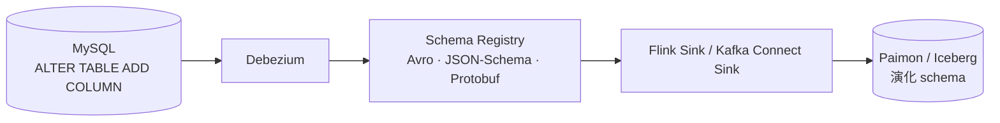

# 管线韧性 · 生产必修

!!! tip "一句话定位"
    数据管线上生产后 · **90% 的运维都在处理**"数据不干净 / schema 变了 / sink 挂了 / 要回填"。这页集中讲这些横切主题——与具体 source / sink 无关 · 所有管线都会踩。

!!! info "和其他页的边界"
    本页讲 **"管线运行时的生产韧性"**。区别于：

    - [lakehouse/Schema Evolution](../lakehouse/schema-evolution.md) · 讲湖表**协议层**如何演化（列用 ID）
    - [ops/灾难恢复](../ops/disaster-recovery.md) · 讲**湖表层**灾备（表级 rollback / 跨区复制）
    - [CDC 内核](cdc-internals.md) · 讲 CDC 技术原理
    - [事件时间 · Watermark](event-time-watermark.md) · 讲流式时间语义

!!! abstract "TL;DR"
    - **端到端 Exactly-once** · Source 幂等 + Engine 2PC + Sink 事务**三方握手**缺一不可
    - **Schema Evolution 传播** · Debezium → Schema Registry → Paimon / Iceberg 自动演化**有边界**
    - **DLQ · 脏数据对策** · Poison pill 隔离 · 幂等重试 · 失败事件归档
    - **Backfill 正确做法** · Flink savepoint 回退 + offset 重置 · **不是** Airflow 重跑流作业
    - **Backpressure** · 识别瓶颈段 + 针对性扩容

## 1. 端到端 Exactly-once · 三方握手

### 三方职责

```
Source (Kafka)    Engine (Flink)           Sink (Iceberg / Paimon)
─────────────     ─────────────            ──────────────────────
offset 可重放   → checkpoint barrier   →   pre-commit (写数据文件 · 但不切指针)
offset commit     ↓                        ↓
                  2PC coordinator         commit (CAS 切 current snapshot)
                  ↓
                  若 commit 失败:
                    Flink 从上一个 checkpoint 恢复重试
                    pre-commit 已写的数据文件成"孤儿"(对象存储里确实还在)
                    reader 看不到(未被 metadata 指针引用)
                    后续由 `remove_orphan_files` 清理
```

**注**：这里的"孤儿文件对象存储上仍存在 · reader 看不到"靠的是**湖表的 metadata 指针语义**（见 [lakehouse/Snapshot](../lakehouse/snapshot.md)）· 不是对象存储级别的隐藏。对象存储本身一旦 PUT 成功文件就是可见的。

三方都要**满足条件**才是真 exactly-once：

- **Source** · 支持 offset 重放（Kafka 默认 · PG WAL 默认 · MySQL binlog 位点默认）
- **Engine** · 实现两阶段提交（Flink 的 `TwoPhaseCommitSinkFunction` 家族）
- **Sink** · 支持事务 commit · 或**天然幂等**（Iceberg 用 CAS 指针 · Paimon 用 snapshot id）

### 典型组合的 Exactly-once

| 组合 | Exactly-once | 说明 |
|---|---|---|
| Kafka + Flink + **Iceberg** | ✅ | Flink IcebergSink + checkpoint + Kafka offset 协同 |
| Kafka + Flink + **Paimon** | ✅ | Paimon 原生支持 2PC |
| Kafka + **Spark Streaming** + Iceberg | ⚠️ 是但要**正确配置** | checkpointLocation + 幂等写 |
| Kafka + **Kafka Connect Iceberg Sink** | ⚠️ | 取决于 connector 版本 · 至少 at-least-once |

### "湖仓 Exactly-once" 的实际边界

你**实际得到的**：

- Source 侧消息不重不漏（Kafka / binlog）
- Sink 侧 commit 成功 = 数据已落盘
- **commit 失败回滚后**：对象存储里会有临时写入的孤儿文件 + metadata 未指向——读者看不到（正常 OCC 语义）· GC 周期清

**超出边界的事**：

- **业务去重**（同一主键多条合并）· 需要 Paimon primary-key merge 或 Iceberg `MERGE INTO`
- **跨表原子提交** · 单 commit 影响多表 · 需要 Nessie 或 Iceberg multi-table commit（详见 [lake-table.md Multi-table Atomic Commit](../lakehouse/lake-table.md)）

## 2. Schema Evolution 在管线传播

湖表协议层（Iceberg / Paimon）支持 schema 演化 · **但要让"DB `ALTER TABLE`"正确传到湖表**需要一条完整链路：



### 能自动传播的

| 变更类型 | 自动? | 备注 |
|---|---|---|
| **Add column (nullable)** | ✅ | 湖表协议原生支持 |
| **Add column (NOT NULL with default)** | ✅ | Iceberg v3（2025-06 ratified）+ / Paimon 1.0（2025-01 GA）+ |
| **Drop column** | ✅ | 协议层支持 · 但下游读侧要处理 null |
| **Rename column** | ⚠️ | Iceberg 用 field_id 自动；Delta 需启用 column mapping |
| **类型升级**（`int → long`）| ✅ 部分 | Iceberg 允许兼容扩位 |

### **不**自动传播的（需人工）

| 变更类型 | 手动原因 |
|---|---|
| **类型收窄**（`long → int`）| 需要数据兼容性验证 |
| **NOT NULL 约束变化** | 通常 fail · 先改 null 兼容再改约束 |
| **STRUCT 嵌套字段变化** | 部分 engine 不支持自动演化嵌套 |
| Delta 未启用 column mapping 的 rename | 下游看成 drop + add |

### Flink CDC 3.x 的 Schema Evolution Behavior

3.0+ Pipeline 声明式控制（放在 pipeline 块里）：

```yaml
source:
  type: mysql
  # ...

sink:
  type: paimon
  # ...

pipeline:
  name: app-to-paimon
  parallelism: 4
  schema.change.behavior: try_evolve    # 取值: evolve / try_evolve / lenient / ignore / exception
```

**各取值含义**：

- `evolve` · 遇到所有变更都尝试演化 · 不支持就 fail
- `try_evolve` · 尝试演化 · 不支持**告警 + 降级**（日志上报 · 作业不崩）— **生产推荐**
- `lenient` · 宽松兼容模式 · 尽量演化 · 不 fail
- `ignore` · 忽略 schema change · 继续跑（新字段会被丢弃）
- `exception` · 遇到 schema change 直接 fail · 早期开发 / 严苛场景

## 3. DLQ · 脏数据对策

### Poison Pill 问题

**Poison pill** · 某条消息格式异常导致下游反序列化 / 转换失败：

- 若 **fail-fast** → 整个 job 挂 · 后续积压
- 若 **silent skip** → 漏数据 · 问题被掩盖
- 正确 → **DLQ（Dead-Letter Queue）+ 告警**

### 三种策略

| 策略 | 何时用 |
|---|---|
| **Fail-fast** | 早期开发 · 不能容忍脏数据 |
| **Skip + 告警** | 日志类场景 · 可接受少量漏数据 |
| **DLQ（死信队列）** | **生产正确做法** · 脏消息写独立 topic / 对象存储目录 · 人工或下游修复 |

### DLQ 实现 · Flink SideOutput

```java
final OutputTag<String> dlqTag = new OutputTag<>("dlq"){};

SingleOutputStreamOperator<Order> mainStream = input
    .process(new ProcessFunction<String, Order>() {
        @Override
        public void processElement(String raw, Context ctx, Collector<Order> out) {
            try {
                out.collect(parse(raw));
            } catch (Exception e) {
                ctx.output(dlqTag, raw);  // 脏消息分流
            }
        }
    });

mainStream.getSideOutput(dlqTag)
    .addSink(dlqKafkaSink);  // 独立 topic · 供离线修复
```

**关键**：**DLQ 建了要配审查机制**——定期人工 / 自动报警脚本扫 DLQ topic 行数告警——否则脏消息积累到百万级没人看，等同没建。

## 4. Backfill · 回填与重放

### 什么场景要 Backfill

- **初次上线** · 历史数据补齐
- **修复** · 某段时间 pipeline 产出有 bug · 需要重跑
- **Schema 重大变化** · 全量重写修正

### 正确做法 · Flink Savepoint

```bash
# Step 1 · 停当前作业 · 保存 savepoint
bin/flink stop <jobid> \
    --savepointPath s3://savepoints/

# Step 2 · 修改逻辑后 · 从 savepoint 启动 · 重置 Kafka offset 到目标位置
bin/flink run -s s3://savepoints/savepoint-xxx \
    --allowNonRestoredState \
    -- \
    source.kafka.startup.mode=specific-offsets \
    source.kafka.startup.specific-offsets=topic:0:1234567,topic:1:2345678
```

### 错误做法

- **用 Airflow 回填流作业** · Airflow 是批调度器 · 回填产生**并行 job** → **双写**（原流作业 + 回填作业）· 数据重复
- **直接改 Sink 表数据** · 绕过管线 · 破坏 lineage + exactly-once 语义
- **snapshot 过期了才回填** · 历史 snapshot 被 `expire_snapshots` 清了 · 不能 time travel 回放——**回填要提前规划保留期**

### 全量 + 增量合流

历史段（批处理）+ 增量段（流）合流要保证：

- **不重不漏** · 边界靠 timestamp / offset 明确
- **去重** · Iceberg `MERGE INTO` 或 Paimon partial-update
- **推荐** · Flink 流批一体模式（1.17+）· 一套代码双跑

## 5. Backpressure · 流控

### 识别信号

Flink UI `Backpressure` tab 显示每个 operator 的压力等级（OK / LOW / HIGH）：

```
Source → Parse → Transform → Sink
  HIGH    HIGH     HIGH       [瓶颈点]
  ← ← ← ← ← ← ← ← ← ←
```

**背压通常从 sink 端传导回来**——找"第一个变 OK"的 operator · 它上游就是瓶颈。

### 生产应对

| 症状 | 应对 |
|---|---|
| **Sink 慢**（Iceberg commit 慢）| 增 sink parallelism · 检查 commit 频率（太高 → 小文件 → 更慢）· 配合 [Compaction](../lakehouse/compaction.md) |
| **Transform 慢** | 拆子任务 · 加并行度 · 异步 IO |
| **Source 快 Sink 慢** | 中间加 Kafka 缓冲 · 或降 source 速率 |
| **State 太大** | 换 RocksDB backend · 加 TTL · 检查 key 分布（防热点）|
| **Shuffle 数据倾斜** | 加盐打散 key · 两阶段聚合 |

## 6. 陷阱

- **以为 Exactly-once 自动得到** · 三方都要配置 · 漏一环就降级 at-least-once
- **`schema.change.behavior` 设成 `exception`** · 一改字段 pipeline 就崩 · 生产用 `try_evolve`
- **DLQ 建了不看** · 百万脏消息积累 · 等同没建
- **用 Airflow 跑流作业回填** · 双写事故常见来源
- **Backpressure 持续 HIGH 不管** · 延迟积压 / state 膨胀 / 磁盘告警连锁爆炸
- **回填没提前规划 snapshot 保留期** · 要回填时发现历史 snapshot 已 expire
- **Kafka retain 比 checkpoint 周期短** · checkpoint 还没成功 offset 已失效 · 恢复失败

## 相关

- [CDC 内核](cdc-internals.md) · 技术原理
- [Kafka 到湖](kafka-ingestion.md) · 事务细节
- [事件时间 · Watermark](event-time-watermark.md) · 流式时间语义
- [lakehouse/Streaming Upsert · CDC](../lakehouse/streaming-upsert-cdc.md) · 湖表侧语义
- [lakehouse/Schema Evolution](../lakehouse/schema-evolution.md) · 协议层
- [ops/灾难恢复 DR](../ops/disaster-recovery.md)

## 延伸阅读

- **[Flink Fault Tolerance](https://nightlies.apache.org/flink/flink-docs-stable/docs/concepts/stateful-stream-processing/)**
- **[Flink TwoPhaseCommitSinkFunction](https://nightlies.apache.org/flink/flink-docs-stable/docs/dev/datastream/fault-tolerance/checkpointing/)**
- **[Debezium Schema Changes](https://debezium.io/documentation/reference/stable/connectors/mysql.html#mysql-schema-change-topic)**
- **[Iceberg MERGE INTO](https://iceberg.apache.org/docs/latest/spark-writes/#merge-into)**
