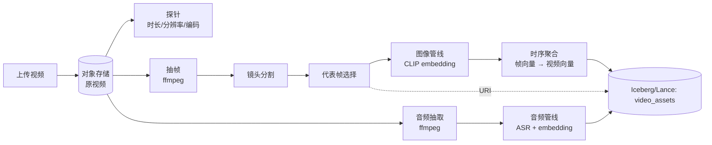

# 视频管线

!!! tip "一句话理解"
    视频 = **图像流 + 音频流 + 时间**。最核心的工程动作是**抽帧**（把连续视频转成有限帧集合），之后对关键帧跑图像管线 + 对音频跑音频管线，最后再做"时序聚合"形成视频级向量。

!!! abstract "TL;DR"
    - **抽帧策略**决定后续所有质量：固定时间间隔、关键帧、镜头变化检测
    - 帧级 embedding → **时序聚合**（mean / attention）得视频级
    - 音频流独立处理：ASR + audio embedding
    - 长视频**分段**处理，避免单段过长
    - 存储分层：原视频 / 代表帧 / 音频文件分别放对象存储

## 完整流水线



## 一、探针（Probing）

先 `ffprobe` 拿元数据：

```bash
ffprobe -v quiet -print_format json -show_format -show_streams video.mp4
```

关键字段：

- `duration`（秒）
- `width` / `height` / `fps`
- `codec`（H.264 / H.265 / VP9 / AV1）
- `bit_rate`
- 是否包含音频流

**长视频判断**：> 10 分钟 → 分段处理；> 1 小时 → 必须分段。

## 二、抽帧策略

三种主流：

### 方案 A：固定时间间隔

最简单。每 N 秒抽一帧。

```bash
ffmpeg -i video.mp4 -vf "fps=1/2" frame_%04d.jpg   # 每 2 秒一帧
```

适合：短视频、均匀内容。

### 方案 B：镜头变化检测（Shot Detection）

检测画面剧变点切分。每个镜头取**代表帧**（通常中间帧）。

```bash
ffmpeg -i video.mp4 -vf "select='gt(scene,0.3)',showinfo" -vsync vfr frame_%04d.jpg
```

或用 Python `PySceneDetect`。

适合：电影、剪辑视频、新闻。

### 方案 C：固定数量

限定总帧数（比如 32 帧），等间隔取。

适合：训练数据预处理、固定预算场景。

**选型规则**：

- 检索目的 → 方案 B（每镜头一帧质量最好）
- 快速标注 → 方案 A
- 训练 → 方案 C

## 三、镜头 + 代表帧

一个镜头可能有几十上百帧，需要代表帧：

- **中间帧** —— 最简单
- **亮度 / 颜色方差最高帧** —— 信息丰富的一帧
- **blur 检测后最清晰的帧** —— 规避运动模糊

代表帧存到对象存储（`keyframe_uri`），供前端展示 + embedding。

## 四、音频流单独处理

```bash
ffmpeg -i video.mp4 -vn -acodec pcm_s16le -ar 16000 audio.wav
```

- 降采样到 16kHz（ASR 标准）
- 单声道（mono）
- 走 [音频管线](audio-pipeline.md) 跑 ASR + audio embedding

## 五、Embedding 与时序聚合

帧级 embedding 完事后，需要聚合成**视频级向量**供检索：

### 简单平均（mean pooling）

```python
video_vec = np.mean(frame_vecs, axis=0)
video_vec = video_vec / np.linalg.norm(video_vec)
```

快、稳、够用。

### Attention Pooling

用 transformer 聚合，更精细。成本高，通常离线训练一个 pooling model。

### 保留多向量（ColBERT-style）

视频级不聚合，检索时做"视频级 Top-K = Σ 帧级相似度"。

**默认推荐**：平均池化起步，必要时再升级。

## 六、视频检索的特殊性

视频查询有两种模式：

- **"找相似片段"**（模糊匹配）—— 视频级向量足够
- **"定位到具体秒数"**（精确）—— 保留帧级 + offset

对于精确定位，表结构应包含：

```sql
CREATE TABLE video_frame_vectors (
  video_id  BIGINT,
  frame_idx INT,
  ts_sec    FLOAT,
  clip_vec  VECTOR<FLOAT, 512>,
  keyframe_uri STRING
) USING lance
PARTITIONED BY (bucket(32, video_id));
```

前端展示结果时能定位 `video_id + ts_sec`。

## 七、表结构

```sql
CREATE TABLE video_assets (
  video_id            BIGINT,
  raw_uri             STRING,
  duration_sec        FLOAT,
  width               INT,
  height              INT,
  fps                 FLOAT,
  keyframe_uris       ARRAY<STRING>,
  caption_aggregate   STRING,
  transcript_full     STRING,
  video_vec           VECTOR<FLOAT, 512>,
  audio_vec           VECTOR<FLOAT, 512>,
  text_vec            VECTOR<FLOAT, 1024>,
  embedding_version   STRING,
  owner               STRING,
  visibility          STRING,
  tags                ARRAY<STRING>,
  ts                  TIMESTAMP
) USING iceberg
PARTITIONED BY (days(ts), bucket(16, video_id));
```

## 陷阱

- **抽帧过密** —— 1 小时视频抽 1 帧/秒 = 3600 帧，存储和 embedding 成本爆
- **忽略镜头变化** —— 节奏慢的视频大量重复帧
- **不处理旋转** —— 手机拍的竖屏视频被当横屏处理
- **Long-tail 编码格式** —— HEVC / ProRes 需要特定 ffmpeg build
- **音画不同步** —— 音频独立 embed 但不对齐时间轴时的 debug 噩梦

## 相关

- [图像管线](image-pipeline.md)
- [音频管线](audio-pipeline.md)
- [多模数据建模](../unified/multimodal-data-modeling.md)
- [多模 Embedding](../retrieval/multimodal-embedding.md)

## 延伸阅读

- ffmpeg 官方文档
- PySceneDetect: <https://www.scenedetect.com/>
- *VideoCLIP* / *X-CLIP* 系列论文
