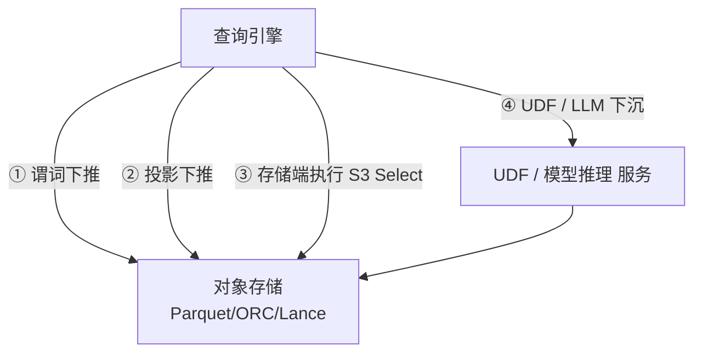

# Compute Pushdown · 计算 / UDF / 模型推理下沉

!!! tip "一句话定位"
    把**过滤 / 投影 / 函数调用 / 模型推理**等计算下沉到**靠近数据的地方**——数据文件格式层（谓词下推）· 存储节点（S3 Select 类）· 或湖上 UDF / 模型。**目的是搬数据少、搬计算多**。

!!! warning "和 predicate-pushdown 的分工"
    - **[predicate-pushdown](predicate-pushdown.md)**：**谓词 / 投影下推**的**机制深挖**（Parquet footer / min-max / bloom / 表达式转换）· 是 Compute Pushdown 层 1 的 canonical
    - **本页**：**广义 Compute Pushdown 的三层架构**（谓词 + 存储端 + UDF / 模型）· 特别深挖**层 3 · 模型推理下沉**（SQL LLM UDF · Snowflake Cortex · Databricks AI Functions · 2024-2026 新范式）

!!! abstract "TL;DR"
    - **三层下沉**：① 谓词 / 投影到文件格式 ② 存储端 SQL 执行 ③ UDF / 模型推理到引擎或远程服务
    - **层 1** 是免费加速 · 现代引擎都做（详见 predicate-pushdown canonical）
    - **层 2** 是云存储和缓存层的话题（S3 Select / S3 Object Lambda / Alluxio Policy / Puffin stats）
    - **层 3 是 2024-2026 新前沿**：SQL 里直接 `LLM(x)` / `EMBED(x)` / `DESCRIBE_IMAGE(uri)` · Snowflake Cortex / Databricks AI Functions / Spark Python UDF + Ray 是代表
    - **工程难点**：模型版本绑定 · 批推理 GPU 池 · 幂等性 · 回填成本

## 1. 三层下沉 · 架构图



## 2. 层 1 · 谓词 / 投影下推到文件格式

**canonical 在 [predicate-pushdown](predicate-pushdown.md)** · 本页只做顶层概述。

现代湖上引擎**都会做**（免费加速）：

- **谓词下推**（predicate pushdown）：`WHERE ts > '2026-04-01'` 推到 Parquet footer 的 min/max 检查
- **投影下推**（projection pushdown）：`SELECT a, b` 只读 a、b 列的 chunk
- **Bloom filter 下推**：`WHERE uuid = '...'` 推到 Parquet bloom 先试探
- **Dynamic filter 下推**（Trino / Spark 4）：Join 建端 side 计算后下推 probe 端

详见 [predicate-pushdown](predicate-pushdown.md)。

## 3. 层 2 · 存储端执行

让**存储节点**执行部分 SQL · 只把结果回传：

| 技术 | 机制 |
|---|---|
| **S3 Select** | AWS 原生 · 对 Parquet / CSV / JSON 做行级 SQL `SELECT ... WHERE ...` · 返回结果集 |
| **S3 Object Lambda** | 在对象返回给客户端前走 Lambda 转换 · 灵活但延迟不确定 |
| **Alluxio Policy** | 缓存层做谓词执行 · 节约回源 |
| **Puffin Stats** | Iceberg Puffin 侧车 · Catalog 层直接回答 `SELECT count(*)` / `SELECT min(x)` 等元数据级查询（不扫数据）|
| **Databricks Photon** | 向量化执行 + 存储端优化 · 商业 |

### 3.1 实际价值

- **S3 Select**：典型场景节省 80%+ 网络流量（大文件只要几行）· 但延迟不如下载到计算节点再扫快（小规模反而慢）
- **Puffin Stats**：`count(*)` / `min / max / approx_distinct` 级查询**无需扫数据** · 毫秒级响应

### 3.2 坑

- S3 Select 有单对象大小和 SQL 复杂度限制 · 不适合复杂 Join
- Puffin Stats 需要维护成本（compaction 后要更新）
- 存储端执行**不便于 debug**（问题在 AWS 内部）

## 4. 层 3 · UDF / 模型推理下沉到湖（2024-2026 新前沿）

**这是本页的重点**。也是一体化湖仓时代最有生产力的能力之一。

### 4.1 为什么要下沉模型推理

传统做法：**把湖上数据导出 → 调模型服务 → 写回结果**。痛点：

- 数据搬运成本高（TB 级表跨区更贵）
- ETL 和推理割裂 · 难以和 SQL 组合查询
- 无法"一条 SQL 里调 LLM / Embedding"
- Feature Store 的流式特征 · Embedding 流水线都要自己造管线

### 4.2 新范式 · SQL 里直接调模型

把模型当 **UDF** 部署在湖的计算侧 · SQL 里直接调：

```sql
SELECT asset_id,
       describe_image(raw_uri) AS caption,
       embed(describe_image(raw_uri)) AS text_vec
FROM multimodal_assets
WHERE caption IS NULL;
```

- `describe_image`：调 VLM（Vision-Language Model · 如 GPT-4V / Claude Vision / Qwen-VL）的 UDF
- `embed`：调 embedding 模型的 UDF
- 引擎负责：批处理 · 并行 · 故障恢复 · 重试

**一条 SQL · 跨模态生成 · 无手工 pipeline**。

### 4.3 2026 主流实现对照

| 方案 | 机制 | 定位 |
|---|---|---|
| **Snowflake Cortex**（2024）| 内置 `CORTEX.COMPLETE()` / `CORTEX.EMBED_TEXT()` / `CORTEX.SENTIMENT()` 等一等 SQL 函数 | 云数仓极致形态 |
| **Databricks AI Functions**（`ai_generate_text` / `ai_embed` / `ai_classify`）| UC 注册的 SQL 函数 · 后端调 Model Serving | Databricks 对等 |
| **BigQuery ML + `ML.GENERATE_TEXT`** | SQL 调 Vertex AI 模型 | GCP 对等 |
| **Spark Python UDF + Ray** | Spark 调用 · Ray 做模型服务 · GPU 池 | 批推理 · 开源可控 |
| **Spark Pandas UDF** | 向量化 Python UDF | 纯 Python 推理场景 |
| **Trino Python UDF**（2024+）| Trino 集成 Python runtime | 交互查询内的轻推理 |
| **DuckDB 扩展 / UDF** | 进程内推理 | 小批 / 本地开发 |
| **ClickHouse catboost / llm UDF**（2024+）| 内置 ML 函数 | OLAP 内 ML |
| **自建 SQL 层 + 模型 gateway** | SQL AST 识别 UDF 自动路由 | 企业级方案 |

### 4.4 Snowflake Cortex 典型代码

```sql
-- 情感分析
SELECT review_id,
       SNOWFLAKE.CORTEX.SENTIMENT(review_text) AS sentiment
FROM reviews
WHERE created_at > '2026-01-01';

-- LLM 生成
SELECT customer_id,
       SNOWFLAKE.CORTEX.COMPLETE(
         'mistral-large',
         CONCAT('Summarize: ', support_log)
       ) AS summary
FROM support_tickets;

-- Embedding
SELECT doc_id,
       SNOWFLAKE.CORTEX.EMBED_TEXT_768(
         'e5-base-v2',
         content
       ) AS embedding
FROM documents;
```

**价值**：无需单独 pipeline · 无需 Python · 数据不出 Snowflake。

### 4.5 Databricks AI Functions 典型代码

```sql
-- UC 注册的 AI 函数
SELECT doc_id,
       ai_generate_text(content, 'databricks-dbrx-instruct',
                        'Summarize in one sentence') AS summary,
       ai_embed(content) AS embedding
FROM catalog.docs.documents;
```

后端：Databricks Model Serving · 支持自托管和 Foundation Model API。

### 4.6 Spark + Ray · OSS 路径

```python
# Spark 端
from pyspark.sql.functions import udf
from pyspark.sql.types import FloatType

# Ray Serve 端（独立）· 见 model-serving.md
@udf(returnType=ArrayType(FloatType()))
def embed_udf(text):
    # 远程调 Ray Serve embedding service
    return ray_serve_handle.remote(text).result()

df.withColumn("embedding", embed_udf("content"))
```

- Spark 负责并行 / checkpoint / 重试
- Ray 做 GPU 池 · 横向扩
- 详见 [embedding-pipelines](../ml-infra/embedding-pipelines.md)

## 5. 批 vs 流 · 两种下沉形态

### 5.1 批推理下沉

- 一次扫一批大文件 · GPU 吃满
- 典型场景：embedding 全量回填 · 离线评分 · 数据清洗
- 工具：Spark + Ray · Databricks MapInPandas · Snowflake Cortex 批模式

### 5.2 流式下沉

- CDC 到一条更新一条
- 典型场景：近实时 embedding 刷新 · 在线评分 · feature store 更新
- 工具：Paimon + Flink + UDF · Snowflake Cortex stream · Databricks Streaming

**批 + 流混合**：冷启动用批一次性跑 · 之后用流维持新鲜度。

## 6. 四条值得追的下沉线

1. **Iceberg Puffin 里放索引** → 让"近邻查询"成为引擎的一等算子（详见 [lakehouse/puffin](../lakehouse/puffin.md)）
2. **标准化 Vector UDF**（SQL 层）→ 让 `vec_distance` · `embed` · `rerank` 跨引擎可移植 · 当前各家方言严重
3. **LLM as UDF** → `GPT(x)` 成为 SQL 表达式 · Cortex / AI Functions 已实现 · 开源栈跟进中
4. **多模 UDF**（`describe(img)` / `transcribe(audio)`）→ 批量异构算子 · 跨引擎标准化是 2026-2027 目标

## 7. 工程陷阱 · 反模式

### 7.1 模型版本与幂等

- **模型版本漂移**：UDF 依赖的模型版本在湖上必须**可追溯** · 建议表里记 `model_version` 列（见 [multimodal-data-modeling](../unified/multimodal-data-modeling.md)）
- **幂等性**：同一行同一模型重跑要得到**同样结果** · LLM 默认非确定 · 需要固定 seed / temperature=0
- **回填成本**：一次模型升级 = 对所有行重跑 UDF · TB 级表小心

### 7.2 资源池

- **GPU 资源**：SQL 级并行度**不等于** GPU 可扩 · 需要 Ray / 托管模型服务做资源池
- **Rate Limit**：商业 LLM API（Cortex / OpenAI）有 TPM/RPM 限制 · 批推理容易撞
- **Cost 归因**：per-query / per-row 成本归因 · 和 [gpu-scheduling §FinOps](../ml-infra/gpu-scheduling.md) 协同

### 7.3 正确性

- **跨行依赖**：`rank() over (...)` 这类无法简单下沉 · 需要 shuffle
- **副作用 UDF**：不要在 UDF 里写外部系统 · 引擎可能重试 · 产生副作用
- **空值 / 异常**：LLM UDF 返回 null / 错误时的兜底策略

## 8. 和其他章节的关系

### 8.1 上游机制

- [predicate-pushdown](predicate-pushdown.md) —— 层 1 canonical
- [vectorized-execution](vectorized-execution.md) —— 引擎内向量化（SIMD）· 和模型推理 UDF 配合

### 8.2 下游应用

- [embedding-pipelines](../ml-infra/embedding-pipelines.md) —— UDF 下沉的典型应用
- [feature-store](../ml-infra/feature-store.md) —— On-demand feature 场景
- [agents-on-lakehouse](../ai-workloads/agents-on-lakehouse.md) —— Agent tool 本质是"把 SQL + UDF 作 tool"
- [llm-inference](../ai-workloads/llm-inference.md) —— UDF 背后的推理引擎

### 8.3 架构视角

- [lake-plus-vector](../unified/lake-plus-vector.md) —— 一体化架构里的"计算下沉"角色
- [semantic-cache](../ai-workloads/semantic-cache.md) —— UDF 调用前的语义缓存优化

## 9. 延伸阅读

- Snowflake Cortex docs: <https://docs.snowflake.com/en/guides-overview-ai-features>
- Databricks AI Functions: <https://docs.databricks.com/en/large-language-models/ai-functions.html>
- BigQuery ML.GENERATE_TEXT: GCP 官方文档
- *Ray + Spark for Scalable AI on Lakehouse*（Databricks / Anyscale 博客）
- *Functions in Data Platforms: From UDF to Remote Inference*（SIGMOD 2024 综述方向）
- DuckDB + Python UDF docs
- Trino Python UDF RFC / 发布说明
