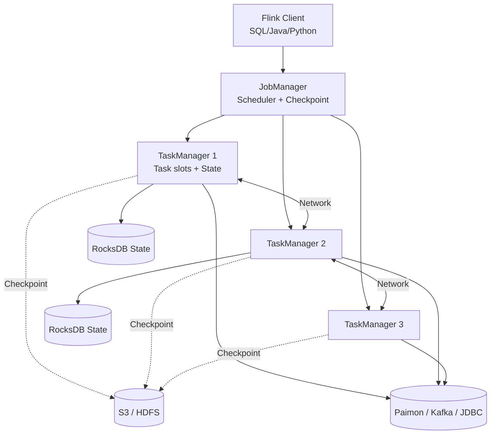

# Apache Flink · 流处理 + CDC + 流批一体

!!! tip "一句话定位 · 流处理引擎（SQL 是 API 之一，不是主业）"
    **有状态流处理的事实标准**——首要定位是**流处理引擎**，DataStream API 是主流 API；Flink SQL 只是面向分析场景的 API 之一。**被放在"查询引擎"章节**是因为湖仓场景常用 Flink SQL；但 Flink 的核心价值在于**有状态流计算**，不是交互式查询。Lakehouse 里的核心角色：**CDC 入湖 + 流式聚合 + 实时特征 + 窗口告警**。Paimon 的亲兄弟——Flink + Paimon 是**准实时湖仓**的黄金组合。

!!! abstract "TL;DR"
    - **原生流处理**（不像 Spark 的 micro-batch）：**毫秒级延迟**
    - **有状态计算**：窗口 / Join / 聚合都有 Exactly-Once 状态语义
    - **Checkpoint 机制**：分布式快照 → 故障恢复不丢数
    - **Event Time + Watermark**：正确处理迟到数据
    - **Flink SQL + Table API**：SQL 下也能跑复杂流作业
    - **Flink CDC**：捕获 MySQL / Postgres / MongoDB 变更 → 湖
    - **流批一体**（1.17+）：同一套 API 跑流与批
    - **未来重点**：Flink + Paimon / Fluss 的深度湖仓一体化

## 1. 它解决什么 · 没有 Flink 的世界

### 早期流处理的痛

2010-2015 年流处理靠：
- **Storm**：At-most-once，丢数据很正常；无状态
- **Spark Streaming**：Micro-batch，最低秒级延迟；状态管理弱
- **Kafka Streams**：库而非引擎，分布式调度自己搞

**"有状态 + Exactly-Once + 事件时间"三位一体都缺一样**——工业级实时业务几乎做不好。

### Flink 的三个核心创新（2015+）

1. **真正的流处理**（not micro-batch）：逐条处理，毫秒级延迟
2. **Checkpoint 机制**（Chandy-Lamport 算法）：异步分布式快照 → Exactly-Once
3. **事件时间 + Watermark**：正确处理乱序数据

这三件结合，让**实时风控 / 实时推荐 / 实时指标**从学术走向工业。

### 典型业务案例

| 场景 | 延迟 SLO | Flink 作用 |
|---|---|---|
| CDC 入湖 | 分钟级 | MySQL → Flink CDC → Paimon |
| 实时指标大屏 | 秒级 | Kafka → Flink 聚合 → StarRocks |
| 实时风控 | < 100ms | 支付流 → Flink 规则 + 特征 → 决策 |
| 实时推荐特征 | < 1 min | 行为流 → 滚动聚合 → Feature Store |
| 告警 | 秒级 | Flink CEP 模式匹配 |
| 流批一体 ETL | 批 + 流同一套 | Iceberg 历史 + Kafka 实时 |

**规模案例**：阿里双 11 的实时指标计算核心引擎。PB/h 数据量。

## 2. 架构深挖



### 节点角色

| 角色 | 职责 |
|---|---|
| **JobManager** | 调度 Task、管理 Checkpoint、故障恢复 |
| **TaskManager** | 执行 Task、维护本地 State |
| **Client** | 提交作业、不参与运行时 |
| **State Backend** | State 存储：HashMap（内存）/ RocksDB（磁盘）|

### DataStream 核心抽象

```
source → transform → ... → sink
         (map/filter/keyBy/window/join/connect/process)
```

**核心原语**：
- `keyBy()` —— Partition by key（类似 Spark groupByKey，但持续）
- `window()` —— 时间 / 计数窗口
- `process()` —— 最底层 API（可自定义 state / timer）
- `connect()` —— 双流 Join

### State 与 Checkpoint

**State**：Operator 内部的累积数据（比如滚动聚合的中间值）。

**Checkpoint**：
- 定期**分布式快照** State + Source offset
- 基于 **Chandy-Lamport 算法**：barrier 流过算子触发快照
- 失败恢复 = 重放最近 checkpoint 之后的 source events
- **Exactly-once 的本质保证**

```
Source  ---barrier-t1-->  map  -->  window  -->  sink
                               ↓
                        snapshot state
                               ↓
                            S3/HDFS
```

**Savepoint**：Checkpoint 的**手动触发 + 长期保留**版本，用于版本升级、作业迁移。

### 事件时间 vs 处理时间

| | Event Time | Processing Time |
|---|---|---|
| 语义 | 事件真实发生时刻 | 进 Flink 的时刻 |
| 正确性 | 可重放、结果确定 | 重跑结果可能不同 |
| 延迟处理 | 支持迟到事件 | 不考虑 |
| 工业默认 | **首选** | 仅调试用 |

详见 [Watermark / 事件时间](../foundations/event-time-watermark.md)。

## 3. 关键机制

### 机制 1 · Watermark

```
事件时间流：事件 ts=10:00、事件 ts=10:05、事件 ts=10:03 (迟到)
           ↓
Watermark: W(9:58), W(10:03), W(10:05)
           = "我承诺不会再有 ts <= W 的事件"
```

Window 在 Watermark 超过 window end 时触发。

- **Bounded Out-of-orderness**：允许乱序 X 秒
- **Late data**：超过 watermark 的事件可旁路（side output）处理

### 机制 2 · Windows

| 类型 | 语义 | 用例 |
|---|---|---|
| **Tumbling** | 固定不重叠 | 每分钟 GMV |
| **Sliding** | 固定大小 + 步长 | 近 5 分钟滑动平均 |
| **Session** | 活动 gap 触发关闭 | 用户 session 分析 |
| **Global** | 单个大窗口 | 配 custom trigger |

### 机制 3 · 双流 Join（Stateful）

```python
# 订单流 × 支付流 · 1 小时内配对
orders.connect(payments) \
      .keyBy("order_id", "order_id") \
      .flatMap(JoinFunction(ttl_ms=3600000))
```

或 SQL：

```sql
SELECT o.*, p.paid_ts
FROM orders o
JOIN payments p
  ON o.order_id = p.order_id
  AND p.ts BETWEEN o.ts AND o.ts + INTERVAL '1' HOUR;
```

### 机制 4 · Flink CDC

```
MySQL binlog → Debezium → Flink CDC → Paimon
```

**Flink CDC 3.0** 提供 Pipeline 语法：

```yaml
source:
  type: mysql
  hostname: mysql.internal
  username: flink
  password: xxx
  tables: app.orders, app.users

sink:
  type: paimon
  warehouse: s3://lake/warehouse

pipeline:
  name: mysql-to-paimon
```

一条配置搞定全库同步 + Schema Evolution 传播。

### 机制 5 · 流批一体（1.17+）

同一段 SQL / DataStream 代码**可跑流可跑批**：
- 批模式：读完 Source 结束
- 流模式：持续运行

```java
// runtime mode 切换
env.setRuntimeMode(RuntimeExecutionMode.BATCH);
// or STREAMING
```

湖上场景：历史数据用批跑一次，新增数据开流继续——同一作业逻辑。

## 4. 工程细节

### 部署拓扑

| 部署 | 适合 | 备注 |
|---|---|---|
| **Session Cluster** | 共享资源 / 小作业多 | JobManager 共用 |
| **Per-Job Cluster** | 每作业独立 | 资源隔离 |
| **Application Mode** | 现代主流 | Driver 在 JobManager 侧 |
| **Flink on K8s** | 云原生主流 | Flink K8s Operator GA |

### 关键配置

| 配置 | 默认 | 建议 |
|---|---|---|
| `state.backend` | hashmap | **rocksdb**（大 state） |
| `state.backend.incremental` | false | **true** |
| `execution.checkpointing.interval` | 无 | 30s-5min |
| `execution.checkpointing.mode` | EXACTLY_ONCE | EXACTLY_ONCE |
| `execution.checkpointing.timeout` | 10min | 30min（大 state） |
| `parallelism.default` | 1 | 按数据量调 |
| `taskmanager.memory.process.size` | 1.7GB | 4-16GB |
| `taskmanager.numberOfTaskSlots` | 1 | 2-4 |

### State 后端选择

- **HashMapStateBackend**：内存，state < 10GB 友好
- **EmbeddedRocksDBStateBackend**：RocksDB on local disk，大 state 必选
- **Changelog State Backend**（1.16+）：双写 → Checkpoint 快

### 调优心法

1. **Checkpoint 慢**：
   - 看 "sync/async duration"；async 慢 = RocksDB compact
   - 加 incremental checkpoint
   - Changelog state backend
2. **背压（backpressure）**：
   - Flink UI 直接看
   - 加并行度 / 换 sink
3. **倾斜**：
   - keyBy 分布不均 → 加盐 / 分层聚合
4. **迟到事件**：
   - 调 watermark 的 max-out-of-orderness
   - side output 处理

### 调度：Flink Kubernetes Operator（现代主流）

```yaml
apiVersion: flink.apache.org/v1beta1
kind: FlinkDeployment
metadata:
  name: mysql-to-paimon
spec:
  image: flink:1.18
  jobManager:
    resource: {memory: 2048m, cpu: 1}
  taskManager:
    resource: {memory: 4096m, cpu: 2}
  job:
    jarURI: local:///app/job.jar
    parallelism: 10
```

## 5. 性能数字

| 场景 | 规模 | 基线 |
|---|---|---|
| Map-only 流 | 单 TM 4 core | 100k+ events/s |
| Stateful KeyBy | 1M keys state | 10-50k events/s / slot |
| Window 聚合 | | 50k-200k events/s / slot |
| Checkpoint | 10GB state | 30s-2min |
| 端到端延迟（Kafka → Paimon） | 分钟 commit | 1-5 分钟 |
| 端到端延迟（实时大屏） | 秒级 commit | 1-5 秒 |

**阿里生产数据**（公开）：
- 双 11 峰值（2024 公开数据点）：10 亿+ events/s
- 单作业 state：TB 级 RocksDB
- 端到端延迟：秒级

## 6. 代码示例

### Flink SQL CDC 入湖（Paimon）

```sql
-- MySQL CDC Source
CREATE TABLE mysql_orders (
  order_id BIGINT,
  status   STRING,
  amount   DECIMAL(18,2),
  update_ts TIMESTAMP,
  PRIMARY KEY (order_id) NOT ENFORCED
) WITH (
  'connector' = 'mysql-cdc',
  'hostname' = 'mysql',
  'database-name' = 'app',
  'table-name' = 'orders'
);

-- Paimon Sink
CREATE TABLE paimon_orders (
  order_id BIGINT,
  status   STRING,
  amount   DECIMAL(18,2),
  update_ts TIMESTAMP,
  PRIMARY KEY (order_id) NOT ENFORCED
) WITH (
  'connector' = 'paimon',
  'path' = 's3://lake/orders',
  'bucket' = '16',
  'changelog-producer' = 'input'
);

INSERT INTO paimon_orders SELECT * FROM mysql_orders;
```

### 实时特征聚合

```sql
-- 每分钟滚动：用户近 5 分钟的行为次数
CREATE TABLE user_behavior (
  user_id BIGINT,
  action  STRING,
  ts      TIMESTAMP(3),
  WATERMARK FOR ts AS ts - INTERVAL '10' SECOND
) WITH ('connector' = 'kafka', ...);

CREATE TABLE feature_store_sink (...) WITH ('connector' = 'redis', ...);

INSERT INTO feature_store_sink
SELECT
  user_id,
  COUNT(*)           AS action_count_5m,
  TUMBLE_END(ts, INTERVAL '1' MINUTE) AS window_end
FROM TABLE(TUMBLE(TABLE user_behavior, DESCRIPTOR(ts), INTERVAL '5' MINUTE))
GROUP BY user_id, window_start, window_end;
```

### DataStream API 复杂流 Join

```java
DataStream<Order>   orders = env.fromSource(...);
DataStream<Payment> payments = env.fromSource(...);

DataStream<OrderWithPayment> joined = orders
  .keyBy(Order::getOrderId)
  .connect(payments.keyBy(Payment::getOrderId))
  .process(new IntervalJoinFunction(/* within 1h */));
```

### Flink CEP 风控

```java
Pattern<Transaction, ?> pattern = Pattern
  .<Transaction>begin("first").where(tx -> tx.amount > 10000)
  .next("second").where(tx -> tx.amount > 10000)
  .within(Time.minutes(5));

PatternStream<Transaction> ps = CEP.pattern(txStream, pattern);
ps.select(alert -> new FraudAlert(...));
```

## 7. 陷阱与反模式

- **State 无 TTL 膨胀**：keyBy 后 state 永远存 → state GB → TB → 作业崩；**一定配 state TTL**
- **Checkpoint 间隔太短**：小于 state flush 时间 → 永远 in-progress
- **Watermark 没设好**：延迟事件丢、窗口早触发
- **用 Processing Time 做关键业务**：重放结果不一致、审计过不了
- **Task Slot 配置**：slot 太小浪费资源、slot 太大抢 state
- **sink 无幂等**：Checkpoint 重放产生重复数据；要**Exactly-Once sink**（Kafka transactional / Paimon）
- **大 key skew**：百万级 key 其中 1 个占 80% 流量 → 加盐 + 两阶段聚合
- **混用 Flink + Spark Streaming**：两套流程 → 运维成本爆
- **不用 RocksDB backend 存大 state**：HashMap 几 GB 就 OOM
- **Flink 做纯批 ETL**：批调度优化没 Spark 好；**除非要流批一体**

## 8. 横向对比 · 延伸阅读

- [计算引擎对比](../compare/compute-engines.md) —— Trino / Spark / Flink / DuckDB
- [Paimon](../lakehouse/paimon.md) —— 湖上亲兄弟
- [Real-time Lakehouse](../scenarios/real-time-lakehouse.md) —— Flink 的主场景

### 权威阅读

- **[Flink 官方文档](https://flink.apache.org/docs/stable/)** · **[Flink Forward 会议](https://www.flink-forward.org/)**
- **[*Stream Processing with Apache Flink*](https://www.oreilly.com/library/view/stream-processing-with/9781491974285/)** (O'Reilly, Hueske & Kalavri)
- **[Chandy-Lamport paper](https://dl.acm.org/doi/10.1145/214451.214456)** —— Checkpoint 算法本源
- **[Flink CDC 官方](https://github.com/ververica/flink-cdc-connectors)**
- **[阿里 / 美团 / 字节 Flink 博客](https://flink-learning.org.cn/)** —— 中文社区

## 相关

- [Paimon](../lakehouse/paimon.md) · [Iceberg](../lakehouse/iceberg.md)
- [Trino](trino.md) · [Spark](spark.md) · [DuckDB](duckdb.md)
- [Watermark](../foundations/event-time-watermark.md) · [Real-time Lakehouse](../scenarios/real-time-lakehouse.md) · [流式入湖](../scenarios/streaming-ingestion.md)
