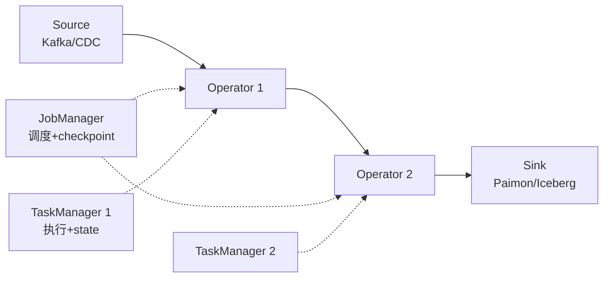

# Apache Flink

!!! tip "一句话定位"
    **流优先**的分布式计算引擎。在湖仓场景里主要承担两件事：**CDC 入湖**和**基于 Changelog 的流计算**。Paimon 把它当作首选写入/读取端。

## 它解决什么

湖仓要做"准实时"，流是躲不掉的环节。Flink 擅长：

- **低延迟流处理**（事件时间 + watermark，真正的流语义）
- **状态计算**（Keyed state、RocksDB 后端、checkpoint）
- **CDC 入湖**（Flink CDC 连接器从 MySQL / PG / MongoDB binlog 实时抽取）
- **流批一体 SQL**（同一 SQL 既能跑流也能跑批）

Spark 的 Structured Streaming 是"微批"；Flink 是"真正的流，可以被当成批来跑"——定位互补。

## 架构（简）

## 对湖仓的关键能力

- **Paimon** 原生 writer + streaming reader（Changelog 消费）
- **Iceberg** sink 支持（批 + 流）
- **Hudi / Delta** 支持
- **Flink CDC**：一站式 MySQL / PG / MongoDB / Oracle 实时抽取
- **Lookup Join**：流查维度表
- **Temporal Join**：按事件时间对齐

## 什么时候选它

- 上游是 CDC / Kafka，需要端到端 < 分钟级延迟
- 需要严格事件时间语义（乱序、watermark、延迟数据处理）
- 有复杂有状态计算（窗口、会话、CEP）
- Paimon 作为事实表（Flink 是 Paimon 的主场）

## 什么时候不选

- 纯批 + 大 shuffle → Spark
- 秒级交互式查询 → Trino
- 单机 SQL → DuckDB

## 陷阱与坑

- **状态大** → 必须 RocksDB + 周期 checkpoint，否则 OOM
- **Schema 演化**：Flink 作业升级要和 Paimon / Iceberg 的 schema change 协调
- **Savepoint / 恢复**：升级 Flink 版本时 savepoint 兼容性要验证
- **Watermark 生成策略**：乱序容忍度配不对会丢数据

## 相关

- [Apache Paimon](../lakehouse/paimon.md) —— Flink 的主战场
- [Streaming Upsert / CDC](../lakehouse/streaming-upsert-cdc.md)
- 场景：[流式入湖](../scenarios/streaming-ingestion.md)

## 延伸阅读

- Flink docs: <https://flink.apache.org/>
- Flink CDC: <https://github.com/apache/flink-cdc>
- *Streaming Systems* (Akidau et al., O'Reilly)
