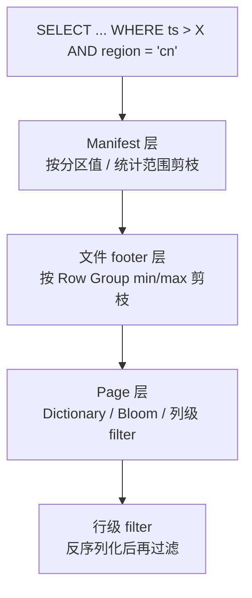

# 谓词下推（Predicate Pushdown）

!!! tip "一句话理解"
    把 `WHERE` 条件**尽可能早地、尽可能靠近数据地**执行。越早过滤，后面搬运、反序列化、计算的量就越小。湖仓里一条扫 TB 但只读 GB 的查询，靠的都是它。

## 三级下推

每一级都是"漏斗的一个环"——上一级能过滤多少就省下一级多少。

### 级 1：Manifest / Catalog 层

- 查询条件触达列（例如 `ts`、`region`）对应分区或 Iceberg manifest 统计范围
- **整个 manifest 条目直接跳过**，连文件都不用打开

### 级 2：文件 footer / Row Group 层

- 打开 Parquet/ORC 文件读 footer
- footer 里每个 Row Group 每列的 min/max/null_count
- 不符合条件的 Row Group **直接跳过整块**

### 级 3：Page / Column 层

- **[Parquet Page Index](../foundations/parquet.md)**（v2，参见该页 "Page Index" 段）：在命中的 Row Group 内按 Page 过滤，把粒度从 128MB 细到 1MB。**点查 / 小范围扫描 10-100× 加速**
- **Dictionary 层过滤**：Dict 编码的列，先查字典确认"值在不在"，再决定是否要读 Data Page
- **Bloom Filter**（可选）：高基数等值查询直接跳过 column chunk（粒度在 column chunk，不是 page；见 [Parquet](../foundations/parquet.md) 的 Bloom Filter 段）

### 级 4：行级 filter

- 最后兜底，按行判断谓词

## 为什么不总是生效

下推要工作，三件事同时要满足：

1. **谓词是"可下推的"** —— `WHERE a > 5` 能下推；`WHERE udf(a) > 5` 通常不能
2. **数据是"聚集的"** —— 如果同值的行散布在 1000 个 Row Group，min/max 没用
3. **引擎认识这个列的统计** —— 字符串列的 min/max 在有些组合下会被跳过

如果查询慢但数据量看起来不大，第一个怀疑对象就是**下推没生效**。看执行计划的 `files scanned`、`bytes scanned`、`partitions pruned`。

## 怎么让下推更有效

- **分区选合适的列**（高频 WHERE 列）
- **排序 / Z-order** —— 让同值行聚集（见 [查询加速](../bi-workloads/query-acceleration.md)）
- **Bloom Filter** —— 对高基数点查列手工开启
- **避免 UDF 包住过滤列** —— `WHERE CAST(ts AS DATE) = ...` 可能阻断下推，优先 `WHERE ts >= ... AND ts < ...`
- **类型一致** —— `WHERE id = '123'` 如果 `id` 是 INT，会触发 CAST 阻断下推

## 和 Projection Pushdown 一起

"只读需要的列"叫**投影下推**。
`SELECT a, b FROM t WHERE c > 5`：

- 投影下推：只读 a、b、c 列
- 谓词下推：Row Group 级跳过 c < 5 的块

两者配合 = **真正的列式加速**。

## 在湖仓里的实际效果

典型负载对比（基于 100GB 事实表，查询 `WHERE dt = '2026-04-01' AND region = 'cn'` 扫描 2 列）：

| 组合 | 扫描字节 |
| --- | --- |
| 无分区 + 无排序 | 100 GB |
| 分区 on `dt` | 1 GB |
| 分区 on `dt` + 排序 on `region` | ~50 MB |
| 上述 + 投影下推（只 2 列） | ~10 MB |

**4 个数量级的差距**，来自同一份数据，只是物理组织方式与引擎下推能力不同。

## 相关

- [Parquet](../foundations/parquet.md)
- [Manifest](../lakehouse/manifest.md)
- [查询加速](../bi-workloads/query-acceleration.md)
- [性能调优](../ops/performance-tuning.md)
- [Compute Pushdown](../query-engines/compute-pushdown.md) —— 更广义的下沉

## 延伸阅读

- **[Parquet Page Index](https://github.com/apache/parquet-format/blob/master/PageIndex.md)** —— 规范一手
- **[Iceberg Scan Planning](https://iceberg.apache.org/spec/#scan-planning)** —— Manifest 级过滤的语义
- **[ClickHouse · Data Skipping Indexes](https://clickhouse.com/docs/en/engines/table-engines/mergetree-family/mergetree#table_engine-mergetree-data_skipping-indexes)**
- [本手册 · Parquet](../foundations/parquet.md) · [压缩与编码](../foundations/compression-encoding.md)
