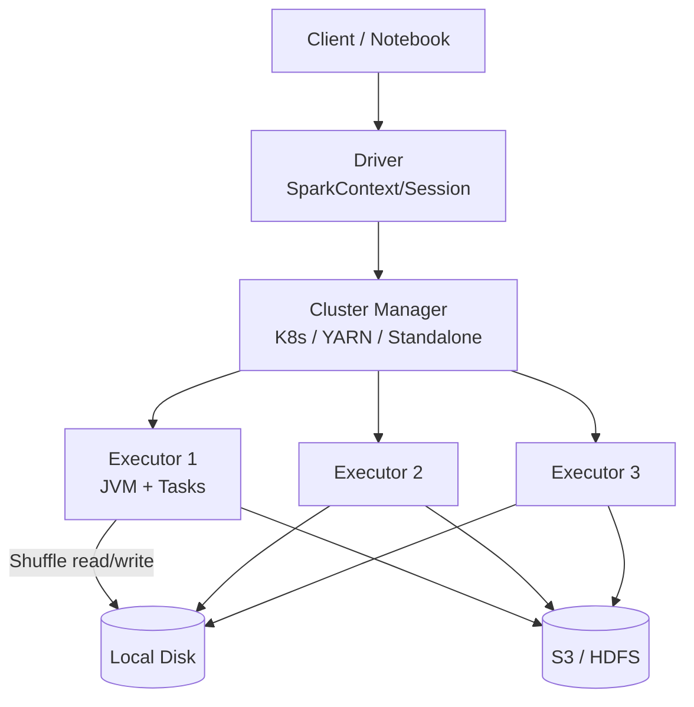

# Apache Spark

!!! tip "一句话定位 · 通用数据处理框架（不只是查询引擎）"
    **大数据时代最主流的分布式计算引擎**——本质是**通用处理框架**，SQL 只是诸多 API 之一。批 ETL / SQL 分析 / 流处理 / ML 训练"一套 API 四处用"。**被放在"查询引擎"章节**是因为湖仓场景常用它跑 SQL 和 DataFrame；但它的**首要职责是"处理"不是"查询"**。在 Lakehouse 里的主要角色：**批 ETL + 集市层构建 + ML 训练数据准备**。

!!! abstract "TL;DR"
    - **统一 API**：RDD / DataFrame / SQL / Structured Streaming / MLlib 同宗
    - **DAG + Stage 模型**：shuffle 落盘（和 Trino 的 pipeline 执行本质不同）
    - **Catalyst + AQE**：优秀的 CBO + 运行时自适应
    - **Lakehouse 角色**：**批 ETL 之王**；流场景被 Flink 和 Paimon 替代
    - **Spark on K8s**：现代部署主流（Spark 3.1+ 生产 ready）
    - **Spark Connect**（3.5+）：解耦 Driver，远程协议化
    - **Iceberg / Delta / Paimon 三表格式都有 Spark connector**

## 1. 它解决什么 · 没有 Spark 的世界

Hadoop / MapReduce（2006-2015）是 Spark 前时代的主力：
- **每个 Stage 落盘**（map → reduce 全经磁盘）
- 复杂 ETL 几十个 Stage 串起来 → **几小时**很常见
- 只有 Java API（Pig / Hive 算 SQL 层 wrapper）
- 迭代算法（ML）在 MR 上**非常痛苦**（每次迭代要读写 HDFS）

2013 年 Spark 出现的三个核心创新：

1. **RDD 抽象** —— 弹性分布式数据集，**内存计算**
2. **DAG 执行** —— 多 Stage 优化组合（谓词下推、combined map）
3. **统一 API** —— 批 / 流 / SQL / ML 一套 API

**量化对比**（典型 ETL 工作负载）：
- MR：3 小时
- Spark：30 分钟（**10× 提速**）

这把 ETL 的**迭代节奏**从"晚上跑等明天看"变成"下午改改晚上看"。

现在 Spark 已是**事实上的工业标准批处理引擎**，几乎所有湖仓表格式（Iceberg / Paimon / Delta / Hudi）都优先做 Spark Connector。

## 2. 架构深挖



### Driver / Executor

| 角色 | 职责 |
|---|---|
| **Driver** | 解析用户代码 / 规划 DAG / 调度 Task |
| **Executor** | 运行 Task / 缓存数据 / 返回结果 |
| **Cluster Manager** | 资源分配（K8s / YARN / Standalone / Mesos）|

### DAG → Stage → Task

```
User Code (DataFrame / SQL)
      ↓
Logical Plan (Catalyst)
      ↓
Optimized Logical Plan
      ↓
Physical Plan (多种可选)
      ↓
DAG of Stages（宽依赖切分）
      ↓
Tasks（每 Partition 一个）
```

**Stage 分界**：shuffle 前后（wide dependency）。Stage 内 pipelining，Stage 之间 shuffle。

### Catalyst 优化器

**核心的 CBO / RBO 混合优化器**：
- 规则重写（Predicate Pushdown / Column Pruning / Constant Folding）
- Cost-Based Join Order（基于表 stats）
- 自定义扩展（用户可注入 rule）

### AQE（Adaptive Query Execution）

Spark 3.0+ 的关键创新——**运行时重优化**：

| 优化 | 做什么 |
|---|---|
| **动态合并 Shuffle Partition** | 数据倾斜自动合并小分区 |
| **动态切 Join 策略** | 小表改 Broadcast Join |
| **动态优化倾斜 Join** | 把大 partition 拆开 |

AQE 几乎零配置，**几乎所有场景开**：

```python
spark.conf.set("spark.sql.adaptive.enabled", "true")
spark.conf.set("spark.sql.adaptive.coalescePartitions.enabled", "true")
spark.conf.set("spark.sql.adaptive.skewJoin.enabled", "true")
```

### Structured Streaming

Spark 的流处理 API（建在 DataFrame 上）：
- **Micro-batch** 默认（毫秒-秒级）
- **Continuous Mode**（实验性，更低延迟）
- 比起 Flink：**简单 SQL 友好**但**延迟与 stateful 弱**

流场景现在**更多选 Flink + Paimon**，Spark Streaming 在湖上定位让位。

## 3. 关键机制

### 机制 1 · Shuffle（慢查询的根源）

- **Sort-Based Shuffle**（默认）：map 端排序，reduce 端取
- **Bypass Shuffle**：分区少时跳过排序
- **Push-Based Shuffle**（3.2+）：magnet 远程 shuffle service 缓解倾斜

**shuffle 是 Spark 最大性能瓶颈**。调优心法：
- 提高并行度（`spark.sql.shuffle.partitions` 默认 200，小作业调小）
- 用 Broadcast Join 代替 Shuffle Join
- AQE 自动合并小 partition

### 机制 2 · Broadcast Join

```python
# 小表（< 10MB 默认）自动广播到所有 Executor，避免 shuffle
spark.conf.set("spark.sql.autoBroadcastJoinThreshold", 10485760)

# 或手动 hint
df_large.join(df_small.hint("broadcast"), "key")
```

### 机制 3 · Bucketing

按列预分桶 → 后续 Join 免 shuffle：

```sql
CREATE TABLE orders (...) USING iceberg
PARTITIONED BY (bucket(32, user_id));
-- JOIN 另一个按 user_id bucket 的表时免 shuffle
```

### 机制 4 · Iceberg / Delta / Paimon 集成

```python
# Iceberg
spark.sql("CREATE TABLE db.tbl (...) USING iceberg")

# Delta
spark.sql("CREATE TABLE db.tbl (...) USING delta")

# Paimon
spark.sql("CREATE TABLE db.tbl (...) USING paimon")

# 湖表特性：MERGE / UPDATE / DELETE / TIME TRAVEL 都有 SQL
MERGE INTO users t USING updates s
  ON t.id = s.id
  WHEN MATCHED THEN UPDATE SET ...
  WHEN NOT MATCHED THEN INSERT ...
```

### 机制 5 · Dynamic Partition Pruning

```sql
-- 大表 × 小表 JOIN，大表的分区被小表的 filter 自动 prune
SELECT * FROM sales s
JOIN date_dim d ON s.dt = d.date_key
WHERE d.year = 2024;
```

和 Trino 的 Dynamic Filtering 思想相同。

### 机制 6 · Spark Connect（3.5+）

**解耦 Driver**：客户端只发 Protobuf 描述到远程 Spark 集群，Driver 不在客户端运行。

- **瘦客户端**（Python / JVM / Go）
- 多语言 SDK
- 便于**Spark-as-a-Service**

## 4. 工程细节

### 部署拓扑

| 部署 | 适合 | 备注 |
|---|---|---|
| **Spark on K8s** | 现代主流、弹性好 | 3.1+ GA；Kubeflow / Airflow 适配 |
| **Spark on YARN** | Hadoop 遗留 | 大规模集群很多仍在用 |
| **Standalone** | 小规模 / 测试 | 不推荐生产 |
| **Databricks Runtime** | 商业 | Photon 引擎（闭源）加速 |
| **EMR / Dataproc** | AWS / GCP 托管 | 省运维 |

### 关键配置

| 配置 | 默认 | 建议 |
|---|---|---|
| `spark.sql.shuffle.partitions` | 200 | 数据量 × 2 / 128MB |
| `spark.sql.adaptive.enabled` | true（3.2+） | 开 |
| `spark.executor.memory` | 1GB | 4-16GB（视数据规模） |
| `spark.executor.cores` | 1 | 2-5 |
| `spark.sql.autoBroadcastJoinThreshold` | 10MB | 按小表大小调 |
| `spark.sql.files.maxPartitionBytes` | 128MB | 保持 |
| `spark.sql.legacy.parquet.datetimeRebaseModeInRead` | EXCEPTION | 看版本情况调 |

### 资源隔离

- **Fair Scheduler**：多用户公平调度
- **Dynamic Allocation**：按需扩缩 Executor（`spark.dynamicAllocation.enabled`）
- **K8s QoS**：Pod resource request / limit

### 调优流程

1. **看 Spark UI** 的 Stage / Task 耗时
2. 找到 **慢 Stage** → 多半是 Shuffle 或倾斜
3. **倾斜** → AQE 或手工加盐（`salt key`）
4. **shuffle 慢** → 调 partition 数 / 换 Broadcast
5. **GC 过多** → 调堆大小 / G1GC

## 5. 性能数字

### TPC-DS 100 (typical · 社区公开基准引用 · 非严格对齐)

| 引擎 | 总时间 | 硬件 |
|---|---|---|
| Spark 3.5 + AQE | 30-40 分钟 | 10 × 32 core worker |
| Databricks Photon | 10-15 分钟 | 同规格 worker（闭源 C++ 引擎）|
| Trino 450 | 15-20 分钟 | 同规格 coordinator + worker |

**注**：TPC-DS 100 = 100GB scale · 上述是典型社区数据点；不同存储格式（Parquet / Iceberg）/ 网络 / JVM 调优 / 并行度差异都会显著影响结果——**不是绝对真理，选型对比前建议在自己环境复现**。

### 典型 ETL 吞吐

- **Parquet 扫描**：200-500 MB/s/executor
- **Shuffle 写**：100-200 MB/s/executor
- **Iceberg 写入**：50-150 MB/s/executor

### Databricks 规模数据点

- 公开演示：1 PB TPC-DS 20 分钟（Photon）
- Uber / Netflix / Airbnb 都有 PB 级 Spark 生产集群

## 6. 代码示例

### 基本 DataFrame（Python）

```python
from pyspark.sql import SparkSession
spark = SparkSession.builder.appName("etl").getOrCreate()

df = spark.read.parquet("s3://bucket/raw/")
result = (df.filter(df.status == "completed")
            .groupBy("region", "product")
            .agg({"amount": "sum"})
            .orderBy("sum(amount)", ascending=False))

result.write.mode("overwrite").saveAsTable("iceberg.db.sales_by_region")
```

### Iceberg MERGE

```python
spark.sql("""
MERGE INTO iceberg.db.users t USING updates_df s
  ON t.user_id = s.user_id
  WHEN MATCHED AND s.op = 'DELETE' THEN DELETE
  WHEN MATCHED THEN UPDATE SET t.vip_level = s.vip_level
  WHEN NOT MATCHED THEN INSERT (user_id, vip_level) VALUES (s.user_id, s.vip_level)
""")
```

### AQE + Broadcast + Bucketing

```python
# 启用全部优化
spark.conf.set("spark.sql.adaptive.enabled", "true")
spark.conf.set("spark.sql.autoBroadcastJoinThreshold", 50 * 1024 * 1024)

# 大表 × 小表
large.join(broadcast(small), "key").select(...)
```

### Structured Streaming（CDC 入湖）

```python
cdc = (spark.readStream
       .format("kafka")
       .option("subscribe", "orders-cdc")
       .load())

parsed = parse_cdc(cdc)

(parsed.writeStream
   .format("iceberg")
   .option("checkpointLocation", "s3://ckpt/")
   .outputMode("append")
   .trigger(processingTime="1 minute")
   .toTable("iceberg.db.orders"))
```

### Spark on K8s 提交

```bash
spark-submit \
  --master k8s://https://k8s-api:443 \
  --deploy-mode cluster \
  --name etl-job \
  --conf spark.executor.instances=20 \
  --conf spark.kubernetes.container.image=mycorp/spark:3.5 \
  --conf spark.executor.memory=8g \
  --conf spark.executor.cores=4 \
  local:///app/etl.py
```

## 7. 陷阱与反模式

- **Shuffle Partitions 用默认 200**：小作业慢得莫名其妙；调成 10-50
- **不开 AQE**：倾斜自己不发现就吃 10× 时间
- **UDF 写 Python**：Python UDF 序列化开销大 → 尽量 SQL 内置函数或 Pandas UDF
- **大 broadcast**：把 1GB 表广播 → OOM；看 `autoBroadcastJoinThreshold`
- **`collect()` 大数据**：Driver 爆
- **DataFrame 中间结果不 cache / persist**：重复使用多次 → 每次重算
- **小文件**：overwrite 时不 coalesce → 万个 3MB 文件 → 下游崩
- **不用 Iceberg / Delta 写湖**：用原生 Parquet 写 = Hive 时代的回退
- **Spark Streaming 做低延迟流**：批处理思维不够；上 Flink
- **资源分配错**：Executor 8GB + 8 core 比 Executor 32GB + 32 core 通常更优（小粒度好调度）

## 8. 横向对比 · 延伸阅读

- [计算引擎对比](../compare/compute-engines.md) —— Trino / Spark / Flink / DuckDB
- [Iceberg](../lakehouse/iceberg.md) · [Paimon](../lakehouse/paimon.md) —— 主要搭档

### 权威阅读

- **[Spark 官方文档](https://spark.apache.org/docs/latest/)** · **[Databricks Academy](https://www.databricks.com/learn)**
- **[*Spark: The Definitive Guide*](https://www.oreilly.com/library/view/spark-the-definitive/9781491912201/)** (O'Reilly)
- **[*High Performance Spark*](https://www.oreilly.com/library/view/high-performance-spark/9781491943199/)** (O'Reilly) —— 调优圣经
- **[Photon 论文 (SIGMOD 2022)](https://dl.acm.org/doi/10.1145/3514221.3526054)** —— Databricks C++ 引擎
- **[Apache Spark Summit 视频](https://www.databricks.com/dataaisummit/)**
- **[Netflix / Uber / Airbnb Spark 博客](https://netflixtechblog.com/)**

## 相关

- [Trino](trino.md) · [Flink](flink.md) · [DuckDB](duckdb.md)
- [Iceberg](../lakehouse/iceberg.md) · [Paimon](../lakehouse/paimon.md) · [Delta](../lakehouse/delta-lake.md)
- [BI on Lake](../scenarios/bi-on-lake.md) · [离线训练数据流水线](../scenarios/offline-training-pipeline.md)
