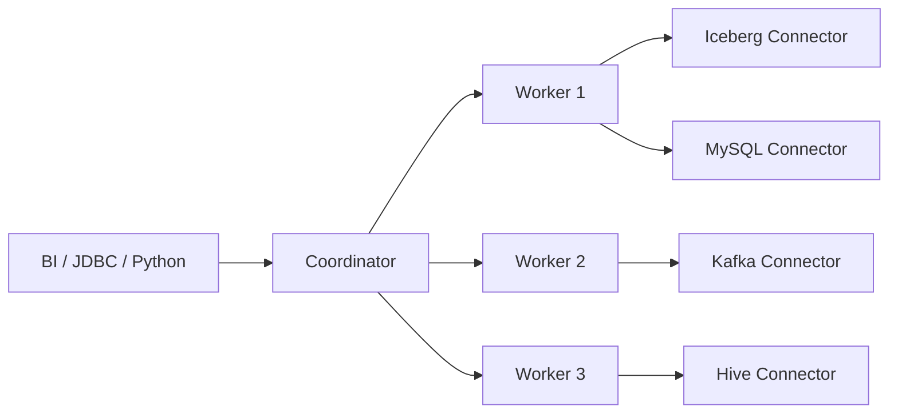

# Trino

!!! tip "一句话定位"
    面向**交互式分析**的分布式 SQL 引擎；前身 Presto。擅长"一条 SQL 跨多个数据源"（湖 + DB + Kafka），在湖仓上扮演"轻快 OLAP 查询器"。

## 它解决什么

湖仓上你常有三种 SQL 负载：

1. **高频交互式查询**（秒级响应，BI 仪表盘）
2. **批量 ETL**（分钟到小时）
3. **流式**（事件驱动）

Trino 专攻 **第 1 类**：内存 pipeline、无 shuffle 落盘、coordinator + 多 worker 架构，典型查询在数秒内返回。Spark 的优势在 2，Flink 专攻 3，Trino 专攻 1。

## 架构一览

Coordinator 解析 SQL、生成分布式计划、调度；Worker 拉数据、内存计算、往上返结果。

## 对湖仓来说的关键能力

- **Iceberg Connector** —— 一等公民，支持 time travel、分支、谓词下推、物化视图
- **Hive Connector** —— 老 HMS 生态兼容
- **Delta / Hudi / Paimon** —— 都有 Connector
- **REST Catalog** —— 原生支持
- **Materialized View** —— Iceberg MV 跨引擎可见
- **Row Filter / Column Mask** —— 权限下推

## 什么时候选它

- 需要"轻查询大表"的 BI 仪表盘
- 需要"跨多个数据源联邦查询"
- 不需要批量 shuffle 重分布的重型 ETL

## 什么时候不选

- 超大 shuffle（TB 级 join）—— 选 Spark
- 流式 —— 选 Flink
- 嵌入式 / 本地开发 —— 选 DuckDB

## 陷阱与坑

- **Coordinator 单点** —— 大集群下 coordinator 成为瓶颈，要关注 HA 与 resource group
- **内存压力** —— 单查询吃内存，需要 query cap 与 resource group 控制
- **版本迭代快**：Trino 社区发版频繁，升级策略很重要

## 延伸阅读

- Trino docs: <https://trino.io/docs/current/>
- *Presto: SQL on Everything* (ICDE 2019)
