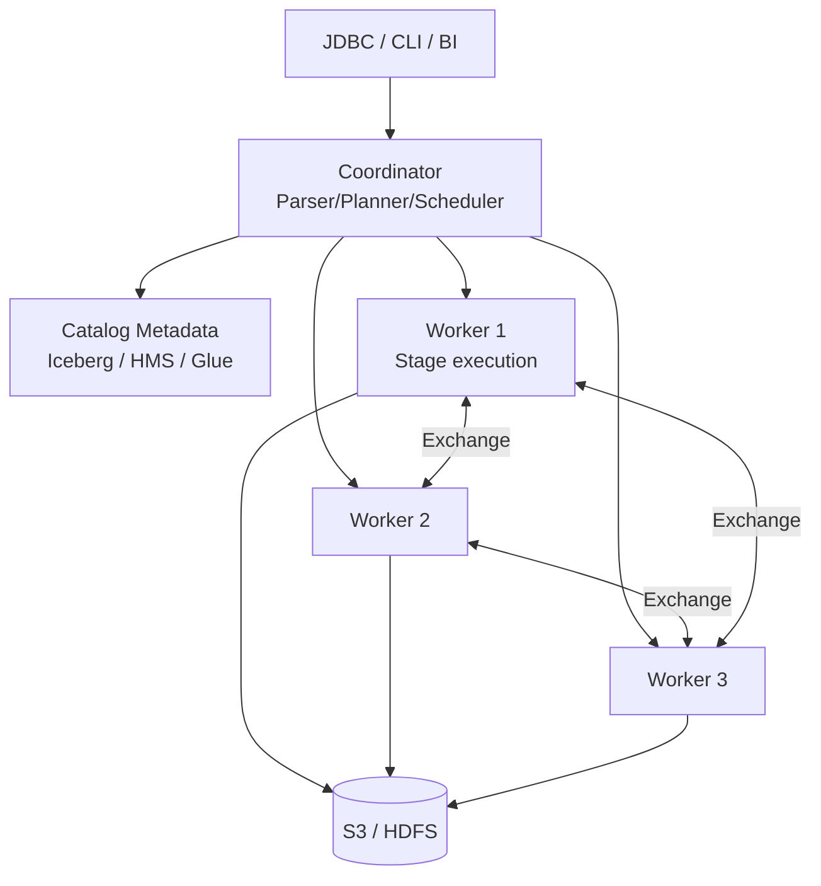

# Trino · 交互式 SQL 联邦引擎

!!! tip "一句话定位 · 纯查询引擎（无自己存储）"
    **面向交互式分析的 MPP SQL 引擎 · 纯查询引擎类别**——**无自己的存储**，所有数据都通过 Catalog connector 从外部数据源读。擅长**跨数据源联邦查询**（Iceberg / Hive / Kafka / MySQL / 甚至 Elasticsearch），在 Lakehouse 世界是**BI 仪表盘 / 分析师自助**的事实标准引擎。

!!! abstract "TL;DR"
    - **Coordinator + Worker** 的 MPP 架构；每查询独立执行树
    - 最大强项：**跨湖 / 跨 DB 联邦 SQL**，真正"一条 SQL 查多源"
    - 为**秒级交互**优化；不适合长跑 ETL（那是 Spark 的事）
    - **Pipeline 执行 + 向量化**（新版 Trino）：吞吐接近 StarRocks
    - **资源组（Resource Groups）**是多租户生产必备
    - 常见生产配置：**Trino + Iceberg + Hive Metastore / REST Catalog + Superset / Tableau**

## 1. 它解决什么 · 没有 Trino 的世界

2013 年 Facebook 把所有分析跑在 Hive 上——每个查询都要起 MapReduce。一个"简单聚合"要**几十分钟**。数据工程师只能给分析师说："查询丢过来，明天给你结果"。

**Presto（Trino 前身）的革命**：
- 内存计算替代 MR 磁盘 shuffle
- **交互式延迟**从分钟级降到秒级
- 分析师可以"边想边查"——**Ad-hoc 工作流**从此成立

### 没有 Trino 的典型痛点

| 问题 | Hive 时代 | Trino |
|---|---|---|
| 简单聚合 | 分钟级 | 秒级 |
| 多源 JOIN | 导出 CSV 手动 JOIN | 一条 SQL 联邦 |
| 动态 Schema | 手改元数据 | Catalog 热更新 |
| 探索式分析 | 不可行 | 成为日常 |
| 仪表盘刷新 | T+1 | 近实时 |

**现在**：Trino 是 Airbnb / Lyft / Shopify / Netflix / Pinterest / LinkedIn 都在大规模生产跑的主力引擎。Iceberg 的第一引擎公民。

## 2. 架构深挖



### 节点角色

| 节点 | 职责 |
|---|---|
| **Coordinator** | 解析 SQL / 生成执行计划 / 调度到 Worker / 收集结果 |
| **Worker** | 执行 Stage / 做 Exchange / 读数据源 |
| **Discovery** | Worker 注册、心跳 |

### 执行模型：Stage / Task / Driver / Operator

```
SQL → Logical Plan → Distributed Plan (Stage DAG)
                              ↓
                   Stage (一组 Task，跨 Worker 并行)
                              ↓
                   Task (Worker 内一个执行单元)
                              ↓
                   Driver (每 Task 可多个)
                              ↓
                   Operator (Scan / Filter / Join / Aggregate / Exchange)
```

**核心概念**：
- **Stage** 之间用 **Exchange**（网络 shuffle）连
- **Pipeline 执行**：数据流式地从 Scan → Filter → ... → Exchange，**不落盘**（与 Spark 不同）
- **无 Fault Tolerance**（默认）：任一 Worker 挂 → 查询失败；**FTE 模式**（Trino 398+）可选

### Connector 架构（联邦查询的核心）

每个 Connector 实现一套 SPI：
- `listTables()` / `getTableMetadata()`
- `getSplits()` —— 数据切片供 Worker 并行读
- `getPageSource()` —— 读数据
- （可选）`beginInsert()` / `finishInsert()` —— 写回

**跨源 JOIN** 就是：两边 Connector 各自读 → Shuffle Exchange → Hash Join Operator。

## 3. 关键机制

### 机制 1 · Cost-Based Optimizer (CBO)

- 基于表统计信息（行数、列 NDV、min/max、null 比）
- 选择 Join Order、Broadcast vs Partitioned Join、聚合下推
- **需要 ANALYZE** 收集 stats（Iceberg 建表时自动有，手写 SQL 最好跑）

### 机制 2 · Dynamic Filtering

```sql
-- 维度小 + 事实大 经典场景
SELECT * FROM sales s
JOIN date_dim d ON s.dt = d.date_key
WHERE d.year = 2024;
```

Coordinator 先扫小表 `date_dim`，得到 `year = 2024` 对应的 `date_key` 集合，**runtime 把过滤 push 到 sales 的扫描**——从 5 亿行扫到 1500 万行，30× 提升。

### 机制 3 · Push-down

- **Predicate push-down**：`WHERE` 下推到 Connector（让 Iceberg 跳过不匹配的 data file）
- **Aggregate push-down**（部分 Connector）：`COUNT / SUM` 可以下推到 PostgreSQL / Iceberg
- **Projection push-down**：只读需要的列

### 机制 4 · Reuse Exchange

两个相同 subquery **并发**时，只跑一次、共享结果：

```sql
-- 仪表盘常见：几个图都 WHERE dt = '2024-12-01'
SELECT metric1, ... WHERE dt = '2024-12-01';  -- 查询 A
SELECT metric2, ... WHERE dt = '2024-12-01';  -- 查询 B（并发）
-- Trino 共享 dt 分区扫描
```

### 机制 5 · FTE (Fault-Tolerant Execution)

Trino 398+ 可选模式：
- Exchange 数据**持久化到外存**（S3 或本地盘）
- 单 Worker 挂 → 重试相关 Task，查询不失败
- **代价**：延迟 +20-50%（spill 到 S3）
- 适合**长查询 / ETL**；交互式仍用默认模式

### 机制 6 · Resource Groups（多租户关键）

```json
{
  "rootGroups": [{
    "name": "global",
    "softMemoryLimit": "80%",
    "hardConcurrencyLimit": 100,
    "subGroups": [
      {"name": "dashboard",     "hardConcurrencyLimit": 30},
      {"name": "exploration",   "hardConcurrencyLimit": 20},
      {"name": "etl",           "hardConcurrencyLimit": 5, "queuedTimeLimit": "10m"}
    ]
  }],
  "selectors": [
    {"user": ".*dash.*",     "group": "global.dashboard"},
    {"user": ".*analyst.*",  "group": "global.exploration"},
    {"source": "airflow",    "group": "global.etl"}
  ]
}
```

保证仪表盘不被长 ETL 饿死。**生产必配**。

## 4. 工程细节

### 部署拓扑

| 规模 | Worker 数 | 每 Worker 规格 |
|---|---|---|
| 小（< 100 TB 数据，10 用户） | 3-5 | 16 core · 64GB RAM |
| 中（TB-PB 级，50 用户） | 10-30 | 32 core · 128GB RAM |
| 大（PB+，数百用户） | 50-200 | 64 core · 256GB RAM |

### 关键配置

| 参数 | 典型 | 说明 |
|---|---|---|
| `query.max-memory-per-node` | 50% 节点内存 | 单查询单节点上限 |
| `query.max-memory` | N × 50% | 单查询集群上限 |
| `query.max-execution-time` | 6h 默认 / BI 30min | 超时杀查 |
| `task.concurrency` | 16 | Worker 内并行度 |
| `exchange.max-buffer-size` | 32MB | Shuffle buffer |
| `optimizer.join-reordering-strategy` | AUTOMATIC | CBO join order |

### Iceberg 最佳实践配置

```properties
# catalog/iceberg.properties
connector.name=iceberg
iceberg.catalog.type=rest
iceberg.rest-catalog.uri=http://catalog:8181
iceberg.file-format=PARQUET
iceberg.compression-codec=ZSTD
iceberg.max-partitions-per-writer=100
iceberg.unique-table-location=true
```

### 典型调优

1. **慢查询**：先看 Query UI 的 "Most time consumed stage"
2. **OOM**：`query.max-memory-per-node` 是 Worker 内存 50-70%
3. **Shuffle 慢**：检查 Exchange buffer / 网络带宽
4. **CBO 选错 join order**：`ANALYZE TABLE ...` 更新 stats

## 5. 性能数字

### TPC-DS 100 参考

| 引擎 | 总时间（100 queries） |
|---|---|
| Trino 450 (10 worker × 64 core) | 15-20 分钟 |
| Spark 3.5 on same hardware | 30-40 分钟 |
| StarRocks 3.3 (同集群) | 8-12 分钟（存储本地化后） |

### 典型交互式查询

| 场景 | p50 | p95 |
|---|---|---|
| 仪表盘（聚合 + GROUP BY，走 MV） | 200ms | 1s |
| 即席查询（中等 join） | 1-5s | 15s |
| 大规模扫描（TB 级） | 10-60s | 3-5 min |
| 跨源 JOIN（Iceberg + PG） | 3-10s | 30s |

### 生产用户案例

- **Pinterest**：Trino 服务 5000+ 分析师，日查询 3M+
- **Airbnb**：Trino 在 Iceberg 上 PB 级数据，p95 < 10s
- **Shopify**：Trino + dbt 替代 Snowflake 关键分析

## 6. 代码 · 配置示例

### 典型 BI 查询（Iceberg）

```sql
SELECT
  region,
  DATE_TRUNC('week', ts) AS week,
  SUM(amount) AS gmv,
  COUNT(DISTINCT user_id) AS dau
FROM iceberg.sales.orders
WHERE ts >= DATE '2024-10-01' AND status = 'completed'
GROUP BY 1, 2
ORDER BY 2 DESC, 3 DESC
LIMIT 100;
```

### 跨源联邦查询

```sql
SELECT
  k.order_id, k.amount,
  i.product_name,
  p.customer_tier
FROM kafka.events.orders k
JOIN iceberg.catalog.products i ON k.product_id = i.id
JOIN postgresql.crm.customers p ON k.customer_id = p.id
WHERE k._timestamp > current_timestamp - INTERVAL '1' HOUR;
```

### 动态 Filtering 效果

```sql
SET SESSION enable_dynamic_filtering = true;
EXPLAIN ANALYZE
SELECT * FROM sales s
JOIN date_dim d ON s.dt = d.date_key
WHERE d.year = 2024;
```

## 7. 陷阱与反模式

- **把 Trino 当 ETL**：长跑作业挂了全部重跑；**ETL 用 Spark**
- **Resource Groups 不配**：一个大查询搞崩所有仪表盘
- **不 ANALYZE**：CBO 选烂 plan、十倍慢查询
- **Iceberg 外表太多小文件**：Trino planning 阶段就几秒
- **跨源 JOIN 走 broadcast**：大表 broadcast OOM
- **Worker 数 < 3**：Coordinator 单点但 Worker 也单点；至少 3 副本
- **Connector 版本和 Catalog 版本不匹配**：Iceberg Connector 要对齐 spec v2
- **Query Cache 误用**：Trino 没有查询级 cache；想缓存用 MV 或加速副本
- **用 Trino 替代 Postgres 做 OLTP**：单行 INSERT / UPDATE = 湖仓反模式
- **Prepared Statement 不用**：大量相同 SQL 不用 prepared 浪费 parse 时间

## 8. 横向对比 · 延伸阅读

- [计算引擎对比](../compare/compute-engines.md) —— Trino vs Spark vs Flink vs DuckDB
- [OLAP 加速副本对比](../compare/olap-accelerator-comparison.md) —— Trino + StarRocks 组合最常见

### 权威阅读

- **[Trino 官方文档](https://trino.io/docs/current/)** · **[Trino Summit 视频](https://trino.io/trino-summit/)**
- **[*Presto: SQL on Everything* (ICDE 2019)](https://research.facebook.com/publications/presto-sql-on-everything/)** —— 原论文
- **[Starburst Blog](https://www.starburst.io/blog/)** —— 商业化主导团队
- **[*Trino: The Definitive Guide*](https://www.starburst.io/info/oreilly-trino-guide/)**（O'Reilly 免费）
- **[Airbnb / Pinterest / LinkedIn Trino 博客](https://medium.com/airbnb-engineering)**

## 相关

- [湖表](../lakehouse/lake-table.md) · [Iceberg](../lakehouse/iceberg.md) · [Catalog](../catalog/index.md)
- [Spark](spark.md) · [DuckDB](duckdb.md) · [Flink](flink.md)
- [BI on Lake](../scenarios/bi-on-lake.md)
