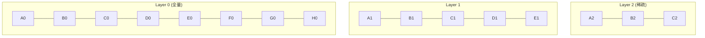

# HNSW（Hierarchical Navigable Small World）

!!! tip "一句话理解"
    **分层跳表的向量版** —— 把向量放到一个分层图里，高层稀疏、低层稠密；从高层入口开始**贪心走下楼**，每层都只去最近的邻居，logN 步就能到查询点附近。

## 它是什么

HNSW 是一种**基于图的近似最近邻（ANN）索引**，由 Malkov & Yashunin 在 2016 年提出。核心思想两句话：

1. 构建一个**多层图**：底层包含所有点，向上每层采样保留的点越来越少
2. 查询时从最高层入口点出发，**贪心**走向查询点方向；在该层找不到更近的邻居就下一层；到最底层为止

构建开销是 $O(N \log N)$，查询是 $O(\log N)$。

## 关键参数

| 参数 | 含义 | 典型值 | 影响 |
| --- | --- | --- | --- |
| `M` | 每个点在图上的邻居数 | 16–64 | 越大越准，越大越占内存 |
| `efConstruction` | 建图时搜索队列大小 | 100–500 | 越大建图越慢，但图质量越高 |
| `ef` / `efSearch` | 查询时搜索队列大小 | 16–512 | 越大召回越高，越大查询越慢 |

**调优直觉**：`M` 决定图质量上限（离线决定），`ef` 决定你**查询时**拿 recall 换延迟。

## 优点 & 缺点

| 优点 | 缺点 |
| --- | --- |
| Recall 高（很容易做到 99%+） | **内存占用大**：需要把全量向量和图都放内存才最快 |
| 查询延迟稳定（毫秒级） | 不支持高效**删除**，需要标记 + 周期重建 |
| 建图可并行、增量可加点 | 磁盘化的 HNSW 性能下降明显（→ 看 DiskANN） |

## 和邻居对比

| 索引 | 结构 | 内存 | Recall | 写入性质 |
| --- | --- | --- | --- | --- |
| **HNSW** | 图 | 高 | 高 | 增量加点友好 |
| **IVF-PQ** | 倒排 + 量化 | 低 | 中–高（参数可调） | 批建，增量受限 |
| **DiskANN** | 磁盘友好图 | 低 | 高 | 针对 SSD 优化 |
| **Flat（brute force）** | 无索引 | 高 | 100% | 任意 |

## 在典型 OSS 里

- **Milvus** —— 支持 HNSW；大规模下更常用 IVF-PQ 节省内存
- **LanceDB** —— IVF-PQ 是主推（面向湖上海量数据），HNSW 可选
- **Qdrant** —— HNSW 是默认，带 filter-aware 扩展（边上带元数据过滤）
- **pgvector** —— HNSW 自 0.5 起支持
- **Faiss** —— HNSW 是最老牌实现之一（`IndexHNSWFlat`）

## 相关概念

- [向量数据库](vector-database.md)
- [Hybrid Search](hybrid-search.md) —— 结合稀疏检索

## 延伸阅读

- *Efficient and robust approximate nearest neighbor search using Hierarchical Navigable Small World graphs* (Malkov & Yashunin, 2016): <https://arxiv.org/abs/1603.09320>
- ANN-Benchmarks: <https://ann-benchmarks.com/>
