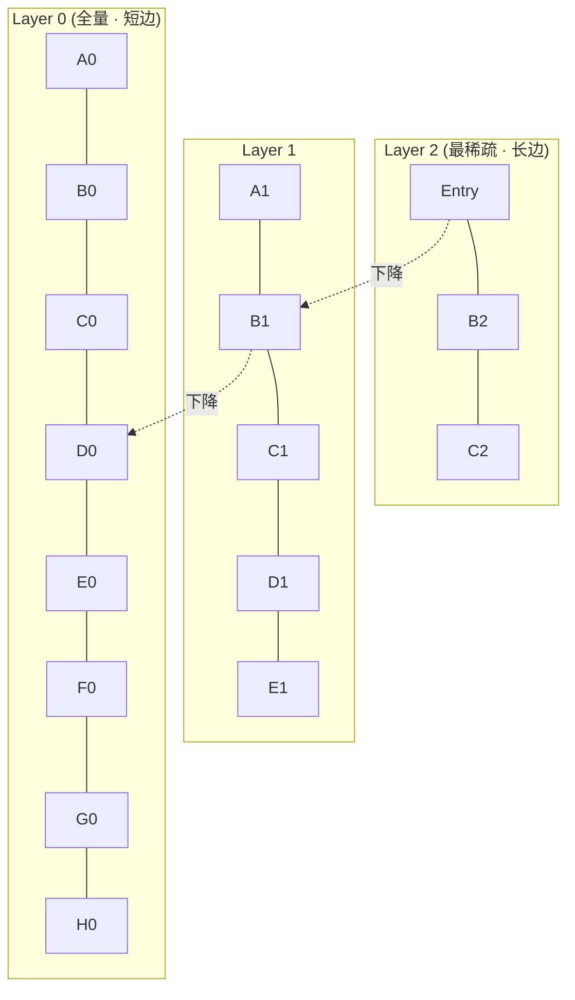

# HNSW · Hierarchical Navigable Small World

!!! tip "一句话理解"
    **向量版分层跳表**。把向量组成**多层图**，上层稀疏下层稠密，查询从顶层入口出发**贪心走下楼**，每层只去最近邻——**log(N) 步**就能走到查询点邻域。工业界**高召回 + 低延迟**的黄金组合，是当前 ANN 领域事实标准。

!!! abstract "TL;DR"
    - **建图** O(N·log N)，**查询** O(log N) 步
    - **典型延迟**：1M 向量 < 1ms、100M 向量 ~ 5-20ms、1B 向量需要磁盘化（→ DiskANN）
    - **内存是关键约束**：全图 + 全向量都要在内存最快
    - 三个核心参数：`M`（图连通度）· `efConstruction`（建图质量）· `efSearch`（查询精度）
    - **删除是死穴**：只能 tombstone + 周期重建
    - **filter-aware**（带 metadata 过滤）有**三种流派**：pre / in / post-filter

## 1. 业务痛点 · 没有 HNSW 世界会怎样

假设你做一个 1 亿商品的电商以图搜图：

| 方案 | 单次查询延迟 | 可上线？ |
|---|---|---|
| **Brute Force（无索引）** | 1 亿 × 768 维余弦相似度 ≈ **8 秒** | ❌ |
| **传统树索引（kd-tree / ball-tree）** | 高维失效（"维度诅咒"），退化到近 brute force | ❌ |
| **LSH** | 召回率 50-70% | ⚠️ 召回太低 |
| **IVF-PQ** | 毫秒级 ✓ | ✅ 但召回 < HNSW |
| **HNSW** | **3-10ms ✓ + 召回 99%+** | ✅ **理想** |

2016 年 Malkov & Yashunin 提出 HNSW 前，工业界做大规模向量检索基本只有两条路：Facebook 的 FAISS 用 IVF + PQ（召回一般）或者上硬件加速。HNSW 的贡献：**在 CPU 上把 "百毫秒 brute force" 压到 "毫秒级高召回"**，让向量检索真正走进了业务实时链路。

### 没有 HNSW 的现实事故

- **Facebook 推荐 2017 前**：亿级召回靠硬件加速器 + IVF-PQ 精度不足 → 召回率勉强 85%
- **某电商 2018**：图搜图上线用 brute force，10 核 CPU 扛不住 100 QPS → 回退到"标签检索"
- **学术界的共识**：高维（> 100 维）传统空间索引都**退化成 O(N)**

HNSW 的突破：**用图而不是空间分割**绕开维度诅咒——"近邻的近邻也是近邻"的小世界性质在任意维度都成立。

## 2. 原理深度

### 核心思想：小世界 + 分层

**小世界网络**（Small World）：Watts-Strogatz 1998 证明，只要在"规则图 + 少量长边"之间，任意两点都能在 log(N) 步内互达（六度分隔）。

**分层**（Hierarchical）：把"长边"放到高层图上（稀疏），"短边"放到低层（稠密）。



每个点被概率性分配到多层：点以概率 `p^(L)` 出现在第 `L` 层，其中 `p ≈ 1/e`。期望每层点数按 e 倍递减。

### 查询过程

```
1. 从最高层 Entry Point 出发
2. 在当前层做"贪心邻居搜索"：
   - 维护 candidate heap（大小 ef）
   - 遍历当前最接近点的邻居，比较距离
   - 找不到更近点 → 进入下一层
3. 到 Layer 0 时，ef 控制最终召回质量
4. 取堆里 top K 返回
```

代码伪码：

```python
def search(query, ef, K):
    ep = entry_point
    for layer in reversed(range(max_layer)):
        ep = greedy_search_layer(query, ep, ef=1, layer)  # 上层只需 1
    W = greedy_search_layer(query, ep, ef, layer=0)       # 底层用 ef
    return top_K(W, K)
```

### 建图过程

插入新点 M 时：
1. 抽样确定它属于哪些层（指数衰减）
2. 对每个层做 greedy search 找到 M 最近的 `ef_construction` 个点
3. 用**启发式选择**（heuristic neighbor selection）从中选 `M` 个最终邻居——**避免近邻全挤在一个方向**
4. 双向连接（A → B 则 B → A，保持图对称性）

### 为什么"高维不失效"

传统空间索引在高维退化的根源：**体积集中在边界**（维度诅咒）——每个 cell 里点都差不多远。

HNSW 不做空间分割——它做**邻居关系**。邻居关系的"小世界性质"在任何维度都保持。代价是：建图是 O(N log N) 的（比 kd-tree 的 O(N log N) 常数大）。

## 3. 工程细节 · 关键参数

| 参数 | 含义 | 典型值 | 影响 |
|---|---|---|---|
| **M** | 每点在图上的邻居数（双向） | **16 – 64** | 内存 · 召回 · 建图速度 |
| **efConstruction** | 建图时搜索队列大小 | **100 – 500** | 建图时间 · 图质量 |
| **efSearch (ef)** | 查询时搜索队列大小 | **16 – 512** | 查询延迟 · 召回 |
| **maxLevel** | 最高层数 | 由概率决定，通常 4-8 层 | 一般不调 |

**调优直觉**：
- **M 决定图质量上限**（离线决定）——M=16 已经很好；M=64 只在召回有硬指标时用
- **ef 是"召回 vs 延迟"的旋钮**（在线可调）——ef=40 够用，ef=200 追求 99%+ 召回

### 参数 vs 召回-延迟曲线（典型经验值）

| 数据规模 | M | efConstruction | efSearch (recall@10) |
|---|---|---|---|
| 10k - 1M | 16 | 100 | 40 (99%) / 20 (95%) |
| 1M - 10M | 16 | 200 | 100 (99%) / 40 (95%) |
| 10M - 100M | 32 | 400 | 200 (99%) / 100 (95%) |
| 100M+ | 48+ 或考虑 IVF-PQ / DiskANN | 500 | 400+ |

### 内存估算

```
总内存 ≈ N × (d × 4 bytes + M × 8 bytes × 2)
       = N × (向量 + 图)

例：1 亿 × 768 维 float32 + M=32
   = 1e8 × (3072 + 512)
   = 358 GB

→ 必须考虑 IVF-PQ 量化 或 DiskANN
```

### 删除的难题

HNSW 是**图结构**，删点会断开连接。两种做法：

| 做法 | 代价 |
|---|---|
| **Tombstone 标记** | 查询时跳过；图结构仍在，慢慢劣化 |
| **定期全量重建** | 成本高但干净 |

**生产实务**：tombstone + 周期（如每周）重建 L0。这也是 HNSW 在"频繁 CRUD"场景不如 IVF-PQ 灵活的原因。

## 4. Filter-Aware 的三种流派

现实查询几乎都带 metadata 过滤（"只看近 7 天、vis=public 的文档"）。三种实现：

### Pre-filter（先过滤再搜）

```sql
-- 先 SELECT 符合条件的 chunk_id，再在子集做 ANN
SELECT chunk_id, embedding <-> query AS dist
FROM chunks
WHERE visibility = 'public' AND created_ts > '2024-12-01'
ORDER BY dist LIMIT 10;
```

- **优**：结果正确
- **劣**：过滤后子集小 → brute force；子集大 → ANN 从头走但限制在子集，实现复杂
- **典型**：pgvector、Qdrant payload filter

### In-filter（搜索中带过滤）

- 在 HNSW 图遍历时，邻居不满足条件就跳过
- **优**：最优延迟/召回平衡
- **劣**：实现复杂、过滤极严时召回率可能漂移
- **典型**：**Qdrant**（HNSW + payload filter 原生）、Weaviate

### Post-filter（先搜再过滤）

```sql
-- 先取 TopN，再应用过滤，可能不够 K
SELECT * FROM (
  SELECT chunk_id, embedding <-> query AS dist
  FROM chunks
  ORDER BY dist LIMIT 1000
) WHERE visibility = 'public'
LIMIT 10;
```

- **优**：实现最简单
- **劣**：过滤率高时结果不足 10，要放大 TopN 到几千
- **典型**：早期 FAISS、简单实现

**选型经验**：过滤选择性高（> 90% 被过滤掉）→ pre-filter；选择性低 → in-filter；简单场景 → post-filter + 大 TopN。

## 5. 性能数字 · 量级基线

基于 [ANN-Benchmarks](https://ann-benchmarks.com/) 与典型工业测试（SIFT / GloVe / DEEP 数据集）：

| 数据集 | 规模 | M=16, ef=40 查询延迟 | Recall@10 |
|---|---|---|---|
| SIFT-1M（128 维）| 1M | 0.2 ms | 99% |
| GloVe-1M（200 维）| 1.2M | 0.3 ms | 98% |
| DEEP-10M（96 维）| 10M | 0.8 ms | 99% |
| DEEP-100M | 100M | **3 - 8 ms** | 98-99% |
| BIGANN-1B | 1B | ⚠️ 内存不够 → **DiskANN** | — |

### 真实业务量级

- **1M 向量在线 QPS**：> 5000（单 core）
- **100M 向量在线 QPS**：500-2000（取决于 ef 和维度）
- **建图时间（100M）**：单机几小时；可并行建图
- **内存占用**：见上节估算

## 6. 代码示例

### 最小 Python（hnswlib）

```python
import hnswlib
import numpy as np

dim = 768
num_elements = 100_000

# 建图
p = hnswlib.Index(space='cosine', dim=dim)
p.init_index(max_elements=num_elements, ef_construction=200, M=16)

data = np.random.random((num_elements, dim)).astype(np.float32)
p.add_items(data, ids=np.arange(num_elements))

# 查询
p.set_ef(40)  # efSearch
labels, distances = p.knn_query(query_vec, k=10)
```

### LanceDB（湖原生）

```python
import lancedb

db = lancedb.connect("s3://bucket/my-lance-db")
table = db.create_table("docs", data=df)
table.create_index(metric="cosine", num_partitions=256, num_sub_vectors=96)

results = table.search(query_vec) \
    .where("visibility = 'public'") \
    .limit(10) \
    .to_pandas()
```

### pgvector（HNSW 0.5+）

```sql
-- 建 HNSW 索引
CREATE INDEX ON docs USING hnsw (embedding vector_cosine_ops)
WITH (m = 16, ef_construction = 64);

-- 查询时调 ef
SET hnsw.ef_search = 40;

SELECT id, 1 - (embedding <=> query) AS score
FROM docs
WHERE visibility = 'public'
ORDER BY embedding <=> query
LIMIT 10;
```

### Milvus

```python
from pymilvus import Collection

col.create_index(
  field_name="vec",
  index_params={
    "index_type": "HNSW",
    "metric_type": "IP",
    "params": {"M": 32, "efConstruction": 400}
  }
)

col.search(
  data=[query_vec],
  anns_field="vec",
  param={"ef": 100},
  limit=10,
  expr="visibility == 'public'"
)
```

## 7. 陷阱与反模式

- **M 太大**（> 64）→ 内存爆炸 + 建图慢 + **召回不一定更高**（边际收益低）
- **ef 没调**（用默认 10-16）→ 召回只有 80-90%，业务觉得"向量检索不准"
- **频繁 UPSERT / DELETE** 不重建 → 图质量劣化 → 召回慢慢掉
- **纯 brute force 替代**："数据小用不上" → 50 万向量时已经 500ms 了
- **Post-filter 但 TopN 不够大** → 过滤后返回不足 K 个
- **把 HNSW 当 KV**：向量检索是"近似"而非"精确查找"，误以为检索结果 = ground truth
- **多副本建图不协调**：每副本独立建图 → 结果漂移 → 用统一建图服务或 rebuild
- **忽视 metric 一致性**：L2 / cosine / IP 别混用；embedding 模型和索引 metric 要对齐

## 8. 横向对比 · 延伸阅读

### 对 IVF-PQ / DiskANN / Flat

| 维度 | HNSW | IVF-PQ | DiskANN | Flat |
|---|---|---|---|---|
| Recall | 极高 | 中-高 | 高 | 100% |
| 内存 | 高 | 低 | 中 | 最高 |
| 查询延迟 | 低 | 中 | 低（SSD）| 高 |
| 写入 | 增量友好 | 批建 | 批建 | — |
| 规模甜点 | 1M - 100M | 10M - 1B | 100M - 10B | < 100k |

详见 [ANN 索引对比](../compare/ann-index-comparison.md)。

### 权威阅读

- **[Malkov & Yashunin 原论文（2016）](https://arxiv.org/abs/1603.09320)** —— 《Efficient and robust approximate nearest neighbor search using Hierarchical Navigable Small World graphs》
- [ANN-Benchmarks](https://ann-benchmarks.com/) —— 持续更新的权威对比
- [Faiss wiki: HNSW](https://github.com/facebookresearch/faiss/wiki/Indexes-that-do-not-fit-in-RAM)
- [Qdrant HNSW 工程博客](https://qdrant.tech/articles/filtrable-hnsw/) —— filter-aware 讲得最清楚
- [Pinecone / Weaviate / Milvus 调优博客](https://www.pinecone.io/learn/series/faiss/hnsw/)

## 相关

- [向量数据库](vector-database.md) · [IVF-PQ](ivf-pq.md) · [DiskANN](diskann.md) · [Hybrid Search](hybrid-search.md)
- [多模 Embedding](multimodal-embedding.md) · [ANN 索引对比](../compare/ann-index-comparison.md)
- [推荐系统场景](../scenarios/recommender-systems.md) · [RAG on Lake](../scenarios/rag-on-lake.md)
