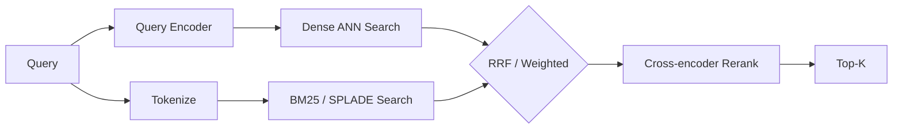

# Hybrid Search（混合检索）

!!! tip "一句话理解"
    **"关键词命中"和"语义相近"一起上**——用稀疏检索（BM25 / SPLADE）找字面精确匹配，用稠密向量检索找语义近邻，然后把两个结果集融合。

## 为什么需要它

纯稠密向量检索在**专有名词、拼写、代码、缩写**上经常翻车——模型没见过的词 embedding 噪声大。纯稀疏检索（BM25）又抓不住"问的是 A 但答案写的是 B 的近义词"。

举例：

- 查询 `"HNSW M 参数的调优建议"`
- 稠密检索：可能召回一堆讲 ANN 索引概论的文章
- 稀疏检索（BM25）：直接命中写了"HNSW M"字样的技术文档
- Hybrid：两者都拿回来，让 rerank 或 RRF 决定最终顺序

## 主流融合方法

### RRF（Reciprocal Rank Fusion）

最简单最稳的方法，不需要调权重：

$$\text{score}(d) = \sum_{s \in \text{sources}} \frac{1}{k + \text{rank}_s(d)}$$

$k$ 通常取 60。谁在各路召回里排名靠前，谁最终分高。

### 加权线性融合

对 `dense_score` 和 `sparse_score` 分别归一化后线性加权：

```
final = α * norm(dense) + (1-α) * norm(sparse)
```

需要调 `α`（常见 0.5–0.7），对分数归一化敏感。

### Rerank 模型

召回阶段 Hybrid 出候选，最后塞给一个 cross-encoder / LLM rerank 打分。质量最高，延迟成本也最高，适合 Top-50 → Top-10 的精排。

## 工程实现范式



## 在典型 OSS 里

- **Milvus** —— 2.4+ 原生支持 Sparse Vector + Hybrid Search；内置 RRF 与加权融合
- **LanceDB** —— 原生支持，API 一行切换
- **Qdrant** —— 支持 sparse vector 字段，Query API 可表达 hybrid
- **Weaviate** —— 自带 BM25 + 向量 + rerank module
- **Elasticsearch / OpenSearch** —— 传统全文 + `knn_vector` 字段

## 相关概念

- [向量数据库](vector-database.md) —— 承载 dense 检索
- [HNSW](hnsw.md) —— dense 侧的典型索引
- [RAG](../ai-workloads/rag.md) —— hybrid 的头号消费者

## 延伸阅读

- *Reciprocal Rank Fusion outperforms Condorcet and individual Rank Learning Methods* (Cormack et al., 2009)
- *SPLADE: Sparse Lexical and Expansion Model for First Stage Ranking* (Formal et al., SIGIR 2021)
- Milvus Hybrid Search: <https://milvus.io/docs/multi-vector-search.md>
