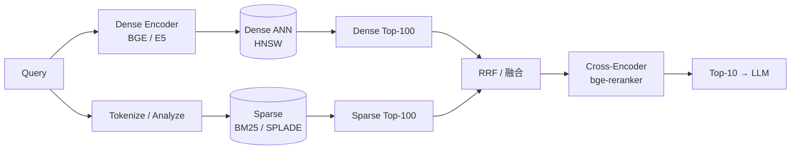

# Hybrid Search · 混合检索

!!! tip "一句话理解"
    **"关键词命中 + 语义相近"双路并行**。BM25 / SPLADE 抓字面精确命中，Dense Vector 抓语义相近，然后**融合**成最终结果。**在 BEIR 等公开数据集及多家工业案例上，Hybrid 比单路 Dense / 稀疏相对提升 NDCG@10 约 5-10 点**；纯向量检索在专有名词 / 错误码 / 代码片段等场景命中率明显受限。

!!! note "SSOT · 主定义页"
    Hybrid Search · RRF 融合 · Dense + Sparse 组合 等概念以本页为主定义。RAG / 推荐 / 多模等场景页引用时链回这里。

!!! abstract "TL;DR"
    - **问题核心**：纯稠密向量 **漏精确关键词**；纯 BM25 **漏语义**——两者互补
    - **三大融合方法**：**RRF**（无参数首选）· **加权线性**（上限高需调参）· **Learned Fusion**（学融合权重）
    - **稀疏侧进化**：BM25（经典）→ **SPLADE**（学习型稀疏）→ ColBERT（late interaction）
    - **工业标准管线**：**Hybrid 召回 → Cross-Encoder Rerank → TopK**
    - **性能加**：Hybrid 比纯向量通常 Recall@10 提升 **5-15%**

## 1. 业务痛点 · 纯向量检索为什么不够

### 典型翻车场景

**场景 1**：用户查询 `"HNSW M 参数的调优建议"`
- 纯向量：召回一堆泛泛讲 ANN 的文章（语义相近但不精确）
- 纯 BM25：直接命中讲 "HNSW M 参数" 的技术文档
- Hybrid：两者都拿，最终 "M 参数调优" 的精准文章在 TopK

**场景 2**：用户查询产品错误码 `"ERR_42389"`
- 纯向量：错误码没 embedding 训练 → 召回乱七八糟
- BM25：精确字符匹配 → 立刻命中
- **结论**：专有名词、代码、缩写、错误码这类**字面命中**场景，BM25 仍是王者

**场景 3**：用户查询 `"怎么让查询跑得更快"`
- BM25：命中表面写"查询"和"快"的文档，错过"性能调优"主题
- 纯向量：语义召回好
- Hybrid：双路互补

### 数据支持

[BEIR benchmark（EMNLP 2021）](https://github.com/beir-cellar/beir) 在 18 个检索数据集上的结论：
- **纯稠密** 平均 NDCG@10 = 0.47
- **纯 BM25** 平均 NDCG@10 = 0.43
- **Hybrid** 平均 NDCG@10 = **0.52-0.55**（+5-8 个点）
- 加 **Rerank** → 0.58-0.62（再 +5-7）

**结论**：工业级检索**永远**是 Hybrid + Rerank，不是单路。

## 2. 原理深度

### 稀疏 vs 稠密 的本质差异

| | 稠密（Dense） | 稀疏（Sparse） |
|---|---|---|
| 向量维度 | 几百-几千（如 768） | 词表大小（几万-几十万）|
| 非零比例 | ~100% | **< 0.1%** |
| 表达 | 分布式语义 | 词级匹配 |
| 相似度 | 余弦 / 内积 | BM25 / 点积 |
| 索引 | HNSW / IVF-PQ | **倒排索引** |
| 典型 | BGE / E5 | BM25 / SPLADE |
| 可解释 | 弱（黑盒）| 强（能看到哪些词匹配）|

**关键洞察**：稠密和稀疏在**不同维度**捕捉信息，天然互补。

### 稀疏侧的进化

```
BM25 (1994)              SPLADE (2021)          ColBERT (2020)
──────────────────       ──────────────────     ────────────────────
词袋 + TF-IDF          BERT 编码后稀疏化       token 级 late interaction
可解释 · 快             学习型稀疏             每 query token 与每 doc token 匹配
不理解同义词           自动扩展同义词           最慢但最准
```

- **BM25**：经典，所有搜索引擎都有
- **SPLADE**：BERT 把词映射到"学习型稀疏词表"——能扩展同义词，比 BM25 准
- **ColBERT / ColBERTv2**：每个 token 保留向量，检索时 late interaction，精度高但成本高

稀疏检索进化详见 [向量检索前沿](../frontier/vector-trends.md)。

## 3. 关键机制 · 三大融合方法

### 方法 1 · RRF (Reciprocal Rank Fusion)

最简单最稳定，**无参数**：

$$\text{score}(d) = \sum_{s \in \text{sources}} \frac{1}{k + \text{rank}_s(d)}$$

- $k$ 通常取 60
- 谁在多路召回里排名都靠前，总分就高
- **不需要归一化分数**（只用排名）

```python
def rrf(rankings: list[list[str]], k: int = 60) -> list[tuple[str, float]]:
    scores = defaultdict(float)
    for ranking in rankings:
        for rank, doc_id in enumerate(ranking):
            scores[doc_id] += 1 / (k + rank + 1)
    return sorted(scores.items(), key=lambda x: -x[1])
```

**优**：鲁棒、零调参、跨异构系统都能用
**劣**：信号强度丢失（rank=1 和 rank=2 分差只有 1/61 vs 1/62）

### 方法 2 · 加权线性融合

```
final_score = α · norm(dense_score) + (1 - α) · norm(sparse_score)
```

- $\alpha \in [0, 1]$，常取 0.5-0.7
- **必须归一化**（min-max 或 softmax）
- 对分数分布敏感

**优**：上限高于 RRF（如果调得好）
**劣**：需要调 α；分数分布漂移时要重调

### 方法 3 · Learned Fusion（LTR）

把融合当作**学习到排序**问题：输入每路的分数 + metadata 特征，学一个 LightGBM / XGBoost。

```
features = [dense_score, sparse_score, doc_length, freshness, clicks_ctr, ...]
model → final_rank
```

**优**：能吸纳多种特征、效果上限最高
**劣**：需要标注数据 + 持续迭代

### 方法 4 · Rerank（"融合"的高级形式）

严格说 rerank 不是融合、是精排阶段。但工业上常**作为 Hybrid 的最后一步**：

```
Hybrid 召回 Top 50 → Cross-Encoder Rerank → Top 10
```

详见 [Rerank](rerank.md)。

## 4. 工程管线

### 经典 Hybrid RAG 管线



### 典型延迟分解

```
Dense encode:      20-50ms
Dense ANN:          5-20ms   ↘
                              ↓
Sparse search:     10-30ms   → 合并: 1ms
                              ↓
Rerank (10 docs):  50-100ms ↙
------
Total: 100-200ms
```

### 调优心法

- **召回阶段要足够宽**：每路 Top 100，融合后 Top 50-100 给 rerank
- **别只对比 Top 5**：在业务 ground truth 上对比 Recall@50 更有信号
- **稀疏侧别省**：BM25 几乎零成本但能救急多场景
- **SPLADE 替代 BM25**：资源够就上 SPLADE，效果 +3-5 点

## 5. 性能数字

| 管线 | Recall@10 | p99 延迟 |
|---|---|---|
| 纯 BM25 | 0.43 | 10-20ms |
| 纯 Dense | 0.47 | 10-30ms |
| Hybrid (RRF) | 0.53 | 20-50ms |
| Hybrid + Rerank | 0.60+ | 100-200ms |

（BEIR 平均值，不同数据集差异大。）

## 6. 代码示例

### Milvus 2.4+ 原生 Hybrid

```python
from pymilvus import AnnSearchRequest, RRFRanker, Collection

dense_req = AnnSearchRequest(
    data=[query_dense_vec],
    anns_field="dense",
    param={"ef": 100},
    limit=100
)

sparse_req = AnnSearchRequest(
    data=[query_sparse_vec],  # dict of word → weight
    anns_field="sparse",
    param={"drop_ratio_search": 0.2},
    limit=100
)

results = coll.hybrid_search(
    [dense_req, sparse_req],
    RRFRanker(k=60),
    limit=10,
)
```

### LanceDB

```python
import lancedb

table = db.open_table("docs")
# 假设表已同时有 vector 列和全文索引
results = (table.search(query_type="hybrid")
                .vector(query_vec)
                .text(query_text)
                .limit(10)
                .to_pandas())
```

### Qdrant

```python
from qdrant_client.models import SparseVector, Prefetch, FusionQuery, Fusion

client.query_points(
    collection_name="docs",
    prefetch=[
        Prefetch(query=dense_vec, using="dense", limit=100),
        Prefetch(query=SparseVector(indices=..., values=...), using="sparse", limit=100),
    ],
    query=FusionQuery(fusion=Fusion.RRF),
    limit=10,
)
```

### Elasticsearch

```json
GET /docs/_search
{
  "retriever": {
    "rrf": {
      "retrievers": [
        { "standard": { "query": { "match": { "content": "HNSW M parameter" }}}},
        { "knn": { "field": "embedding", "query_vector": [...], "k": 100 }}
      ],
      "rank_window_size": 100,
      "rank_constant": 60
    }
  }
}
```

## 7. 陷阱与反模式

- **用了 Hybrid 但没加 Rerank**：浪费召回质量，**rerank 是差异化关键**
- **分数直接加和**（不归一化）：dense 和 sparse 分数分布完全不同，结果胡来
- **α 只调一次就不动**：不同 query 分布 α 最优值不同；至少季度校准
- **稀疏侧用中文分词不走专业 tokenizer**：jieba / pkuseg 必备，默认 Elasticsearch ik 插件要装
- **忽视 query 语种**：多语言 query 路由到对应的稀疏 + 稠密索引
- **稀疏向量存传统 DB 行表**：太慢，要倒排索引
- **测 Recall@5**：召回层的评估应该看 Recall@50 或 @100
- **只在公开数据跑 BEIR**：自家业务数据分布不同，一定要自评

## 8. 横向对比 · 延伸阅读

- [向量数据库](vector-database.md) · [HNSW](hnsw.md) · [Rerank](rerank.md)
- [RAG on Lake](../scenarios/rag-on-lake.md) —— Hybrid 的典型消费者

### 权威阅读

- **[RRF 原论文 (Cormack et al., 2009)](https://plg.uwaterloo.ca/~gvcormac/cormacksigir09-rrf.pdf)** —— 最简单融合最稳
- **[SPLADE 原论文 (Formal et al., SIGIR 2021)](https://arxiv.org/abs/2107.05720)** —— 学习型稀疏
- **[ColBERTv2 (Santhanam et al., NAACL 2022)](https://arxiv.org/abs/2112.01488)** —— Late interaction
- **[BEIR benchmark (Thakur et al., NeurIPS 2021)](https://arxiv.org/abs/2104.08663)** —— 18 个数据集
- **[Anthropic Contextual Retrieval](https://www.anthropic.com/news/contextual-retrieval)** —— 2024 新范式，BM25 + Dense + Context
- [Milvus Hybrid Search 文档](https://milvus.io/docs/multi-vector-search.md)

## 相关

- [向量数据库](vector-database.md) · [HNSW](hnsw.md) · [Rerank](rerank.md) · [Embedding](embedding.md)
- [RAG on Lake](../scenarios/rag-on-lake.md) · [推荐系统](../scenarios/recommender-systems.md)
