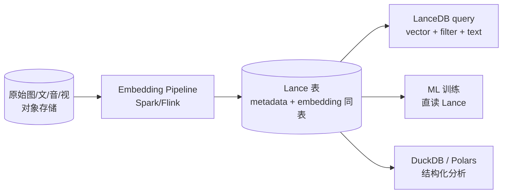

# LanceDB · 湖上原生向量数据库

!!! tip "一句话定位"
    **湖上原生的向量数据库**——数据和索引都以 Lance 格式存在对象存储里 · 嵌入式库形态运行。**没有中心服务端** · 没有独立数据平面——这让它在"**多模数据湖**"场景下比传统向量库更顺理成章。**"一个 Python 进程 + 一条 S3 URL" = 完整向量检索能力**。

!!! abstract "TL;DR"
    - **甜区**：多模湖仓 · 嵌入式 · 对象存储就地检索 · 中大规模（千万到亿级单进程可 handle）
    - **核心差异化**：数据（Parquet + vectors + manifest）一份在对象存储 · 索引内嵌 · 无外部向量服务
    - **版本线**：OSS（Apache-2.0）+ LanceDB Cloud（商业托管）· 2024-2026 持续演进
    - **和 DuckDB / Iceberg 关系**：Lance 文件可被 DuckDB / Polars / PyArrow 直读 · 和 Iceberg 有互操作方向
    - **规模上限**：单进程亿级可行 · 十亿级 + 高并发走分布式前考虑 Milvus

## 1. 它解决什么

传统向量库（Milvus · Qdrant）是**独立系统**：数据从湖里 ETL 过去 · 查询也走它自己的 RPC。痛点：

- **双写**：原始数据在湖 · embedding 又在向量库 · 一致性维护成本高
- **存储分裂**：两套存储预算
- **元数据分裂**：湖里用 Catalog 管 · 向量库里另外一套 collection / schema

LanceDB 反过来 · **直接把湖当底座**：
- 数据以 [Lance Format](../foundations/lance-format.md) 落对象存储
- 向量索引作为 Lance 文件的一部分
- LanceDB 本身是一个嵌入式库——像 DuckDB 一样打开一个 URI 即开用

## 2. 架构与使用形态

```python
import lancedb

# 直连对象存储 · 无服务端
db = lancedb.connect("s3://bucket/warehouse/")

# 创建表 · 自动推导 schema · 向量列识别
tbl = db.create_table("docs", data=df, mode="overwrite")

# 建索引（IVF-PQ / HNSW / Flat / ScaNN）
tbl.create_index("vector", metric="cosine", index_type="IVF_PQ")

# 查询 · filter-aware
result = tbl.search([0.1, 0.2, ...]).where("kind = 'image'").limit(10).to_pandas()
```

**关键性质**：
- **无服务端**（OSS 版）· 任何能读对象存储的进程都能查
- **云版 LanceDB Cloud** 提供托管（索引服务 + 优化）
- **多 SDK**：Python / JS/TS / Rust / Java
- **索引**：IVF-Flat / IVF-PQ / HNSW / 全文 / 稀疏
- **原生 Hybrid Search**（向量 + BM25）

## 3. 2026 关键能力

### Lance v2 格式

- **列式布局 + vectors** 混合存储
- 对**随机访问**优化（与 Parquet 不同）· 适合 ML 训练迭代
- **版本化 + 事务**：每次写产出新 snapshot · 支持 time-travel
- **结构化字段 + 向量字段**同表共存 · 原生 SQL 查

### 索引能力

- **IVF-PQ** · 默认推荐 · 亿级向量 · 内存友好
- **HNSW** · 千万级 · 高精度低延迟
- **Scalar Filtering** · filter-aware · 不是 post-filter
- **Full-Text Search** · tantivy 集成 · BM25 内置

### 和 DuckDB / Iceberg 互操作

- **DuckDB 直读 Lance**：通过 `lance` 扩展 · `SELECT * FROM lance_scan('s3://.../docs.lance')`
- **Polars / PyArrow**：原生 Lance reader
- **Iceberg 互操作**（2024-2025 演进中）：方向是"一张 Iceberg 表能被 LanceDB 以向量表视角读"——详见 [Lance Format 的双重身份](../foundations/lance-format.md)

## 4. 在 "多模数据湖" 场景的价值

**这是 LanceDB 最强差异化**。完整闭环：



**好处**：
- **原始数据 + embedding + 元数据** 同表 · **无双写**
- **同一份存储支持多引擎**（LanceDB 查 · DuckDB 分析 · ML 框架训练）
- **零拷贝 + 零同步漂移**

这是 [lakehouse/多模湖仓](../lakehouse/multi-modal-lake.md) 里"Lance 双重身份（文件格式 + 向量检索底座）"的工程体现。

## 5. 什么时候选 / 不选

**选 LanceDB**：

- **多模湖仓** · 原始文件 + embedding 要在湖上共存
- **嵌入式场景** · notebook · 边缘 · edge · 无服务端约束下
- **中规模单进程**（千万-亿级）· 不想管 Milvus 集群
- **ML 训练也要读** · 同一份 Lance 表既支持检索又支持训练
- **追求"湖原住民"** · 不想引入独立向量服务栈

**不选 LanceDB**：

- **十亿级 + 高并发** · Lance 单进程扛不住分布式查询 · 走 Milvus
- **多租户 SaaS**（强隔离）· Milvus / Qdrant 的多租户更成熟
- **团队对 Lance 生态陌生** · 选更主流的 Milvus / pgvector 学习曲线短
- **需要企业级治理功能** · Catalog RBAC / 审计 / 合规——Lance OSS 相对薄

## 6. 生产就绪性 · 2026-Q2 状态

- **OSS 稳定**：核心 CRUD · IVF-PQ / HNSW 索引成熟
- **LanceDB Cloud**：托管版本 · 商业 SLA · 企业集成
- **生态跟进**：
  - DuckDB 直读 Lance · 日渐成熟
  - PyTorch DataLoader 集成 · ML 训练友好
  - Iceberg 互操作 · 2025 年持续演进
- **社区**：相对年轻（vs Milvus / pgvector）· 但增长快

## 7. 和 Milvus / Qdrant / pgvector 对比

| 维度 | LanceDB | Milvus | Qdrant | pgvector |
|---|---|---|---|---|
| **形态** | 嵌入式 + Cloud | 分布式集群 | 独立服务（单/集）| PG 扩展 |
| **规模甜区** | 千万-亿级 | 亿-百亿级 | 千万-亿级 | 百万-千万级 |
| **湖原生** | ✅ 最强 | ❌ 独立栈 | ❌ 独立栈 | ⚠️ 需搭配 |
| **多模** | ✅ 原生 | ⚠️ 需自拼 | ⚠️ 需自拼 | ❌ 局限 |
| **运维** | 轻（OSS 无服务）| 重 | 中 | 零（在 PG 栈内）|
| **过滤语义** | filter-aware | Filtered Search | filter-aware HNSW 较早商业化 | 谓词推索引 |
| **ML 训练直读** | ✅ 原生 Lance | ❌ | ❌ | ⚠️ 通过 PG 读 |

横向详见 [向量数据库对比](../compare/vector-db-comparison.md)。

## 8. 陷阱与坑

- **大并发写入** · 嵌入式形态下的并发写依赖上层协调 · 高并发走 LanceDB Cloud
- **索引大小估算** · 亿级向量用 HNSW 会占大量内存 · 考虑 IVF-PQ + rerank
- **生态较新** · 工具 / Connector 成熟度不如 Parquet / Iceberg 老牌 · 某些数据集成场景可能缺连接器
- **S3 API 调用数** · 高频小读 → S3 GET 账单 · 配合 Lance 的索引 manifest 一起读优化
- **忘记 Lance 版本化语义** · 每次写产出新 snapshot · 长期不清理会积累 · 定期 `vacuum`
- **混用 Iceberg + Lance 认知** · Lance 作为"湖表底座"和"文件格式"身份要分清（见 [Lance Format](../foundations/lance-format.md)）

## 9. 相关

- [Lance Format](../foundations/lance-format.md) · 底层列式格式
- [lakehouse/多模湖仓](../lakehouse/multi-modal-lake.md) · Lance 作为多模湖仓底座的定位
- [unified/Lake + Vector 融合架构](../unified/lake-plus-vector.md) · 湖上向量的架构模式
- [Milvus](milvus.md) · 超大规模的对比路径
- [Qdrant](qdrant.md) · [pgvector](pgvector.md) · 其他选项

## 10. 延伸阅读

- **[LanceDB docs](https://lancedb.github.io/lancedb/)**
- **[Lance arxiv 2504.15247](https://arxiv.org/abs/2504.15247)** · Lance v2 论文
- **[Lance Format GitHub](https://github.com/lancedb/lance)**
- **[LanceDB Cloud](https://lancedb.com/)** · 商业托管
