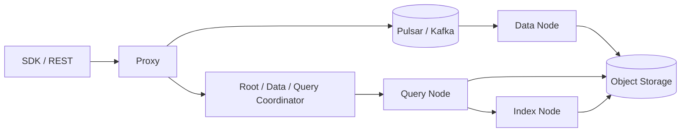

# Milvus

!!! tip "一句话定位"
    分布式、云原生的向量数据库，**大规模检索**场景的主力之一。segment + 异步索引构建 + Pulsar/Kafka 做 WAL 的架构适合亿级到百亿级向量。

## 它解决什么

当你的向量规模到亿级，单机向量库（Faiss / pgvector / LanceDB）单点瓶颈会出现：内存、磁盘、QPS、故障恢复。Milvus 从一开始就按分布式设计：

- 数据按 segment 切，segment 可以迁移、复制
- 索引构建是**异步**的，不阻塞写入
- 读写分离：write node 吞吐写，query node 负责检索
- 消息队列（Pulsar / Kafka）解耦写入路径

## 架构一览

- **Proxy** —— 接客户端请求、路由、鉴权
- **Coordinator** 家族 —— 管元数据、segment 调度、索引构建
- **Data / Query / Index Node** —— 分工明确，各自可独立水平扩展
- **Object Storage** —— 长期数据与索引都落对象存储

## 关键能力

- 多种索引：HNSW / IVF-FLAT / IVF-PQ / DiskANN / GPU_IVF_FLAT
- Hybrid Search：dense + sparse + 结构化过滤的原生融合
- 多租户：Database → Collection → Partition
- 动态 schema（字段可选）
- **流式读写**：写入立即可查（最终一致延迟可配）
- Replica / Resource Group：按业务隔离

## 什么时候选它

- 向量规模亿级及以上
- QPS / 并发高，需要分布式水平扩展
- 需要多租户隔离
- 运维团队有能力管理一套分布式系统

## 什么时候不选

- 规模 < 千万，纯嵌入式够用 → LanceDB / Faiss
- 希望"一条 PG 解决" → pgvector
- 对象存储原生"湖上就地检索" → LanceDB / Iceberg + Puffin

## 陷阱与坑

- **组件多运维复杂**：要监控 Coordinator、Message Queue、Object Storage 多个依赖
- **小规模下集群开销 > 收益**，不要"因为流行而选"
- **索引切换**要考虑 segment 级迁移时间

## 延伸阅读

- Milvus docs: <https://milvus.io/docs>
- *Milvus: A Purpose-Built Vector Data Management System* (SIGMOD 2021)
