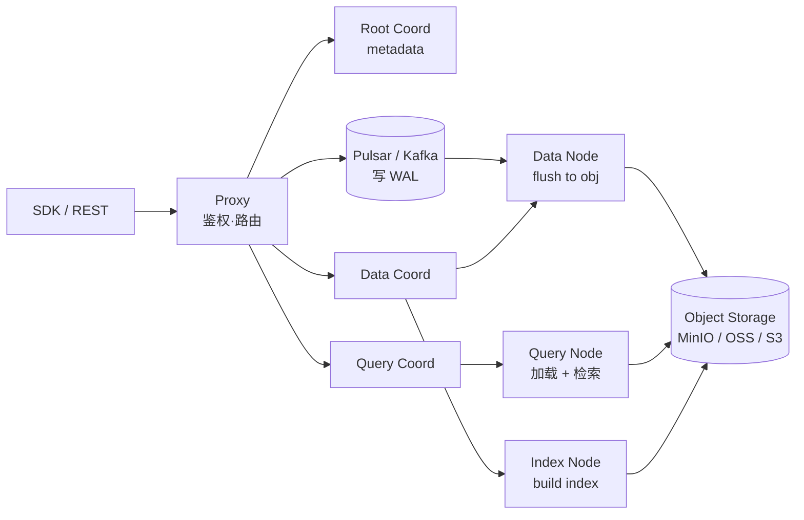

# Milvus · 分布式向量数据库

!!! tip "一句话定位"
    分布式、云原生的向量数据库 · **亿级到百亿级向量检索**场景的主力之一。segment + 异步索引构建 + Pulsar/Kafka 做 WAL 的架构支撑超大规模 · 多节点类型分离读写 · 但**组件复杂度高**（Coordinator / DataNode / QueryNode / IndexNode 多种角色）——小规模不值得上。

!!! abstract "TL;DR"
    - **甜区**：亿级 - 百亿级向量 · 高并发 · 多租户 SaaS · 需要独立向量基础设施
    - **架构**：Proxy + Coordinator(Root/Data/Query) + DataNode / QueryNode / IndexNode + Pulsar/Kafka + Object Storage
    - **2.4+ 新**：GPU 索引（CAGRA）· Scalar Filtering 强化 · 2.5 加 Full-Text Search (BM25)
    - **规模不足的反面**：< 千万向量上 Milvus 运维成本 > 收益 · 选 pgvector / LanceDB
    - **生产关键**：index 策略 × segment 大小 × consistency level 三者组合决定 p99

## 1. 它解决什么

当你的向量规模到**亿级** · 单机向量库（Faiss / pgvector / LanceDB）的瓶颈会显现：内存 · 磁盘 · QPS · 故障恢复。Milvus 从一开始就按分布式设计：

- 数据按 **segment** 切 · segment 可迁移可复制
- 索引构建**异步** · 不阻塞写入
- **读写分离**：DataNode 吞吐写 · QueryNode 负责检索 · IndexNode 做索引
- **消息队列（Pulsar / Kafka）** 解耦写入路径
- **对象存储** 作为长期数据与索引存储层 · 节点无状态可弹性伸缩

## 2. 架构深挖

### 节点角色与职责

| 角色 | 职责 | 扩展性 |
|---|---|---|
| **Proxy** | 客户端入口 · 鉴权 · 路由 · 结果合并 | 无状态 · 水平扩展 |
| **Root Coordinator** | 管 collection / schema 元数据 | 单点 · 高可用通过多副本 |
| **Data Coordinator** | segment 管理 · flush 调度 | 单点 · 多副本 |
| **Query Coordinator** | QueryNode 负载均衡 · 查询路由 | 单点 · 多副本 |
| **Data Node** | 消费 Pulsar → flush 到对象存储 | 水平扩展 |
| **Query Node** | 加载 segment 到内存 · 执行检索 | 水平扩展 · 是主要扩展点 |
| **Index Node** | 异步构建索引（HNSW / IVF-PQ / DiskANN）| 水平扩展 · 可弹性 |
| **Pulsar/Kafka** | 写 WAL · 解耦写入路径 | 依赖外部系统 |
| **Object Storage** | 数据 + 索引持久化 | 云原生 |

**运维复杂度**：8 个组件 + 外部依赖（Pulsar + Object Storage）· **至少 1-2 个 FTE 专职运维**。

## 3. 2024-2026 关键能力

### 2.4+ 新特性

- **GPU 索引**：CAGRA（NVIDIA RAPIDS cuVS）· GPU_IVF_FLAT · GPU_IVF_PQ · 极致吞吐场景
- **Scalar Filtering 强化**：Filtered Search 支持更复杂 expression
- **Hybrid Search 原生**：dense + sparse 融合 · 支持 RRF / Weighted Sum

### 2.5+ 新特性

- **Full-Text Search (BM25)** 原生：不用外挂 Elasticsearch
- **Cluster Key** 进一步优化大表查询性能

### 索引类型矩阵

| 索引 | 适合 | 内存 | 精度 | 备注 |
|---|---|---|---|---|
| **HNSW** | 千万级 · 高精度 · 低延迟 | 高（~2× 原始）| 高 | 通用默认 |
| **IVF-FLAT** | 中规模 · 精度优先 | 中 | 高 | 需 nlist 训练 |
| **IVF-PQ** | 亿级 · 内存紧 | 低（~0.05× 原始）| 中 | 必配 rerank |
| **IVF-SQ8** | 中规模 · 轻量压缩 | 中 | 较高 | 4× 压缩 |
| **DiskANN** | 十亿级 · SSD 友好 | 低内存 · 吃 SSD IOPS | 中高 | 盘上索引 |
| **GPU_CAGRA** | 极致吞吐 | GPU 内存 | 高 | NVIDIA 生态 |

**选型**（详见 [HNSW](hnsw.md) / [IVF-PQ](ivf-pq.md) / [DiskANN](diskann.md)）：
- 向量 < 千万 · 内存充足 → HNSW
- 亿级 + 内存预算紧 → IVF-PQ + rerank
- 十亿级 · 单机想省成本 → DiskANN
- 需要 GPU 极致吞吐 → CAGRA

## 4. 关键生产实践

### Segment 大小调参

**影响**：segment 大 = 索引构建成本大 · QueryNode 加载慢；segment 小 = 元数据开销大 · 合并频繁。

**生产经验**：
- `dataCoord.segment.maxSize` · 默认 512MB · 亿级向量推荐 **1024MB-2048MB**
- `dataCoord.segment.sealProportion` · 密封比例 · 控制何时转只读

### Consistency Level · 一致性 vs 延迟权衡

| 级别 | 描述 | 延迟 | 适用 |
|---|---|---|---|
| **Strong** | 等最新写入可见 | 最慢 | 强一致读 |
| **Bounded** | 容忍有限延迟（默认）| 中 | 大多数场景 |
| **Eventually** | 最终一致 | 最快 | 高 QPS · 可接受秒级延迟 |
| **Session** | 本会话的写可见 | 中 | SaaS 多租户 |

**选 Bounded 作为生产默认**——延迟和一致性都能接受。

### 部署规格经验

| 规模 | QueryNode 配置 | DataNode 配置 | IndexNode 配置 |
|---|---|---|---|
| **千万向量** | 2-4 × 16C/32G | 1-2 × 8C/16G | 1 × 16C/32G |
| **亿级向量** | 8-16 × 32C/64G | 4 × 16C/32G | 2-4 × 32C/64G |
| **十亿级（DiskANN）** | 16+ × 16C/64G + NVMe SSD | 8 × 16C/32G | 4+ × 64C/128G |

**网络**：节点间带宽 ≥ 10Gbps · 对象存储延迟 < 10ms。

## 5. 什么时候选 / 不选

**选 Milvus**：

- 向量规模 **亿级及以上**
- QPS / 并发高 · 需分布式水平扩展
- 多租户隔离（Database → Collection → Partition → Resource Group 4 层）
- 运维团队能 hold 住分布式栈
- 需 GPU 索引

**不选 Milvus**：

- 规模 < 千万 · 嵌入式够用 → [LanceDB](lancedb.md)
- "一条 PG 解决" → [pgvector](pgvector.md)
- 对象存储**湖上就地检索** → [LanceDB](lancedb.md) / Iceberg + Puffin
- 小团队 · 运维预算紧 · 用托管服务（Zilliz Cloud · Milvus 商业版）

## 6. 故障排查 · 常见生产问题

| 症状 | 可能原因 | 诊断 |
|---|---|---|
| **写入延迟飙** | Pulsar 消费堆积 / DataNode 瓶颈 | 查 Pulsar lag · DataNode CPU/IO |
| **查询 p99 抖动** | segment 未加载 / coordinator 切主 | 查 QueryNode 加载日志 · coord 健康 |
| **索引构建不推进** | IndexNode 资源不足 / 某 segment 卡住 | 查 IndexNode 任务队列 · segment 状态 |
| **OOM** | 加载 segment 超内存 | 降 segment 大小 · 加 QueryNode · 换 IVF-PQ 索引 |
| **Coordinator 切主频繁** | ETCD 延迟 · 网络抖 | 查 ETCD 延迟 · 节点健康 |

## 7. 陷阱与坑

- **组件多运维复杂** · 监控 Coord / Pulsar / Object Storage 多依赖 · 告警不齐生产事故常见
- **小规模下集群开销 > 收益** · 不要"因为流行而选"
- **索引切换的 segment 迁移成本** · 大表切 HNSW → DiskANN 可能数小时
- **Pulsar retain 太短** · 消费者重启 offset 过期 · 和 [Kafka 到湖](../pipelines/kafka-ingestion.md) 一样的问题
- **Consistency Level 设 Strong 但 QPS 极高** · 延迟急剧上升
- **不做 Index warm-up** · QueryNode 重启后查询 p99 spike
- **Segment 过小** · 百亿级下元数据爆炸

## 8. 相关

- [向量数据库](vector-database.md) · 通用定位
- [LanceDB](lancedb.md) · [Qdrant](qdrant.md) · [Weaviate](weaviate.md) · [pgvector](pgvector.md) · 对照
- [向量数据库对比](../compare/vector-db-comparison.md) · 详细横比
- [HNSW](hnsw.md) · [IVF-PQ](ivf-pq.md) · [DiskANN](diskann.md) · [Quantization](quantization.md) · 索引选型
- [Filter-aware ANN](filter-aware-search.md) · Milvus Filtered Search

## 9. 延伸阅读

- **[Milvus docs](https://milvus.io/docs)**
- **[*Milvus: A Purpose-Built Vector Data Management System*](https://www.cs.purdue.edu/homes/csjgwang/pubs/SIGMOD21_Milvus.pdf)** · SIGMOD 2021
- **[Milvus 2.5 Release Blog](https://milvus.io/blog)**
- **[Zilliz Cloud](https://zilliz.com/)** · 商业托管
